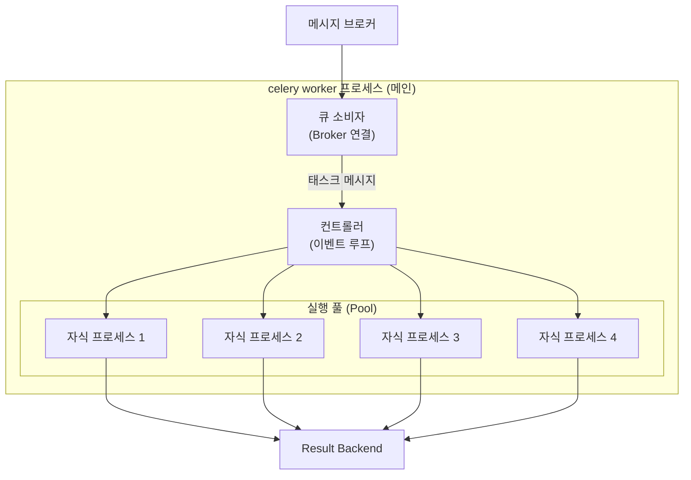
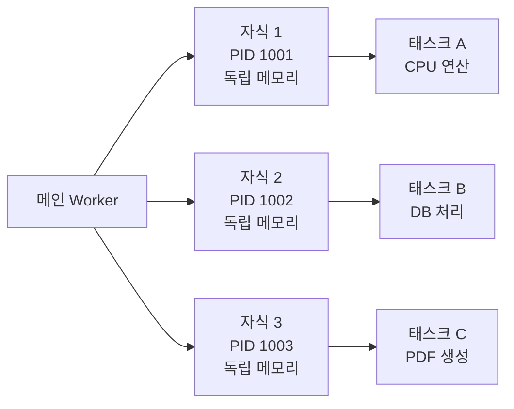
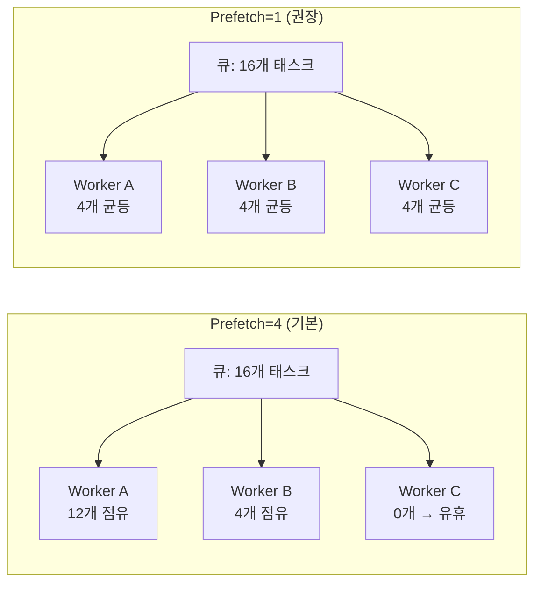
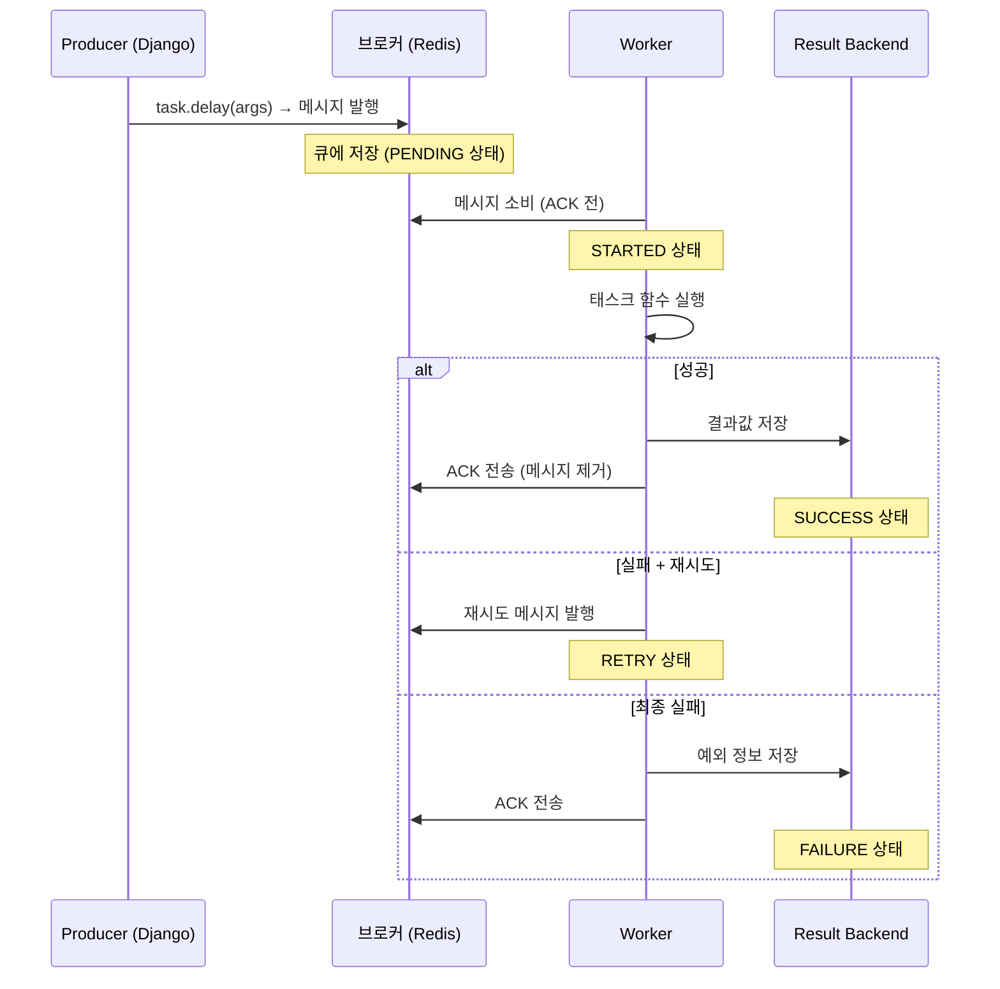

## Worker란 무엇인가

Celery Worker는 **브로커에서 메시지를 가져와 태스크를 실행하는 프로세스**다.[^worker-docs]

[Django + Celery 개요](/post/celery-django)에서 설명한 전체 구조에서, Worker는 실제 일을 하는 주체다.
브로커(Redis/RabbitMQ)를 지속적으로 폴링(또는 PUSH 수신)해 새 태스크가 오면 꺼내 실행한다.



## 동시성 모델

`--concurrency` 옵션으로 동시에 실행할 태스크 수를 지정한다.
기본값은 **CPU 코어 수**다.

Celery는 여러 동시성 모델을 지원한다.[^concurrency-docs]

### 1. Prefork (기본값)

```bash
celery -A myproject worker --pool=prefork --concurrency=4
```

- Python `multiprocessing` 기반의 **프로세스 포크** 모델
- 각 자식 프로세스가 독립된 메모리 공간에서 태스크를 실행
- GIL(Global Interpreter Lock) 우회 → CPU 집약적 태스크에 적합
- 단점: 프로세스 생성 비용이 크고, 메모리 사용량이 많음



### 2. Eventlet / Gevent

```bash
pip install eventlet
celery -A myproject worker --pool=eventlet --concurrency=100
```

- **그린스레드(Green Thread)** 기반의 협력적 멀티태스킹
- I/O 대기 중에 다른 태스크를 처리 → I/O 집약적 작업에 적합
- 단일 프로세스, 낮은 메모리 사용
- CPU 집약적 작업에는 부적합 (GIL에 막힘)

### 3. Threads

```bash
celery -A myproject worker --pool=threads --concurrency=8
```

- Python `threading` 기반
- Eventlet/Gevent보다 overhead가 크지만 기본 Python만 사용
- I/O 집약적 태스크에 사용

### 동시성 모델 선택 기준

| 모델 | 적합한 태스크 | 동시성 수준 | 메모리 |
|------|-------------|------------|--------|
| Prefork | CPU 집약적 (이미지 처리, ML) | CPU 코어 수 | 높음 |
| Eventlet | I/O 집약적 (API 호출, 이메일) | 수백 | 낮음 |
| Gevent | I/O 집약적 | 수백 | 낮음 |
| Threads | I/O 집약적 | 수십 | 중간 |

## Prefetch — 미리 가져오기

Worker는 브로커에서 태스크를 하나씩 가져오지 않고, **미리 여러 개를 가져온다**.
이를 **Prefetch**라 한다.

```python
# settings.py
CELERY_WORKER_PREFETCH_MULTIPLIER = 1   # 기본값: 4
```

기본 설정(`prefetch_multiplier=4`, concurrency=4)이면:
- Worker는 큐에서 **16개**(4×4)를 미리 가져온다.
- 브로커의 메시지가 하나의 Worker에 몰릴 수 있다.

**문제**: 태스크 실행 시간이 불균일할 때, 빠른 Worker가 놀고 느린 Worker가 16개를 독점할 수 있다.

**권장 설정** — 긴 태스크가 있는 경우:

```python
CELERY_WORKER_PREFETCH_MULTIPLIER = 1
CELERY_TASK_ACKS_LATE = True         # 실행 완료 후 ACK
```



## 태스크 생명주기



## 태스크 재시도 전략

### 자동 재시도 (autoretry_for)

```python
@shared_task(
    bind=True,
    autoretry_for=(requests.exceptions.RequestException,),
    retry_kwargs={"max_retries": 5},
    retry_backoff=True,          # 지수 백오프
    retry_backoff_max=300,       # 최대 5분 대기
    retry_jitter=True,           # 랜덤 지터 추가 (동시 재시도 분산)
)
def fetch_external_data(self, url: str):
    response = requests.get(url, timeout=30)
    response.raise_for_status()
    return response.json()
```

재시도 대기 시간 (지수 백오프 + jitter):
- 1회: ~1초
- 2회: ~2초
- 3회: ~4초
- 4회: ~8초
- 5회: ~16초

### 수동 재시도 (self.retry)

```python
@shared_task(bind=True)
def send_sms(self, phone: str, message: str):
    try:
        sms_client.send(phone, message)
    except SmsQuotaExceeded:
        # 1시간 후 재시도
        raise self.retry(exc=SmsQuotaExceeded(), countdown=3600)
    except SmsInvalidNumber:
        # 재시도 불필요한 오류 → 그냥 실패
        raise
```

## 태스크 라우팅 — 큐 분리

태스크 종류별로 다른 큐, 다른 Worker를 사용할 수 있다.

```python
# settings.py
CELERY_TASK_ROUTES = {
    "myapp.tasks.send_email": {"queue": "email"},
    "myapp.tasks.generate_report": {"queue": "reports"},
    "myapp.tasks.*": {"queue": "default"},
}
```

```bash
# 이메일 전용 Worker (Eventlet, 고동시성)
celery -A myproject worker -Q email --pool=eventlet --concurrency=100

# 리포트 전용 Worker (Prefork, CPU 집약)
celery -A myproject worker -Q reports --pool=prefork --concurrency=2

# 기본 Worker
celery -A myproject worker -Q default --concurrency=4
```

## Worker 모니터링 — Flower

```bash
pip install flower
celery -A myproject flower --port=5555
```

Flower는 Web UI로 Worker 상태, 태스크 히스토리, 실시간 처리율을 볼 수 있다.[^flower-docs]

## 관련 글

- [Django + Celery 개요 →](/post/celery-django) — Celery 전체 구조와 설정
- [Celery Beat — 주기적 태스크 스케줄링 →](/post/celery-beat) — Beat 스케줄러와 crontab 설정
- [Celery Broker — Redis vs RabbitMQ →](/post/celery-broker) — 브로커 선택과 메시지 보장

---

[^worker-docs]: Celery Workers Guide, <a href="https://docs.celeryq.dev/en/stable/userguide/workers.html" target="_blank">Celery Docs</a>
[^concurrency-docs]: Celery Concurrency, <a href="https://docs.celeryq.dev/en/stable/userguide/concurrency/index.html" target="_blank">Celery Docs</a>
[^prefetch-docs]: Celery Prefetch Multiplier, <a href="https://docs.celeryq.dev/en/stable/userguide/optimizing.html#prefetch-limits" target="_blank">Celery Docs</a>
[^routing-docs]: Celery Routing Tasks, <a href="https://docs.celeryq.dev/en/stable/userguide/routing.html" target="_blank">Celery Docs</a>
[^flower-docs]: Flower — Celery monitoring tool, <a href="https://flower.readthedocs.io/en/latest/" target="_blank">Flower Docs</a>
