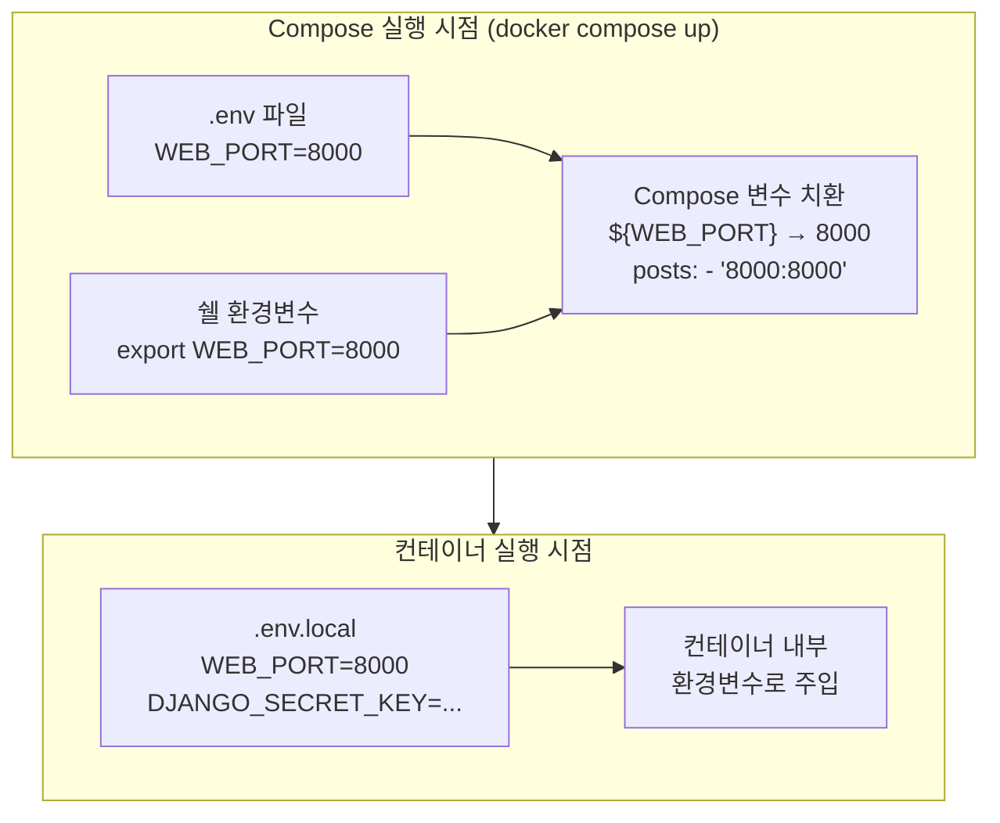
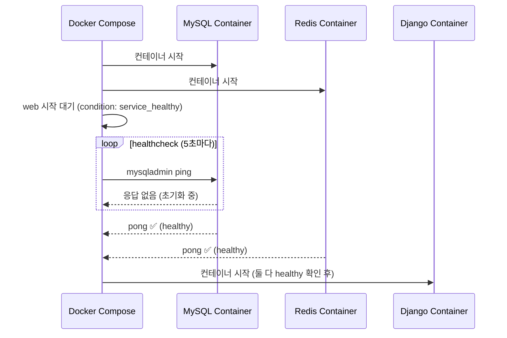

## 가장 흔한 Compose 에러

```
invalid interpolated value: ports: ${WEB_PORT}: mandatory variable 'WEB_PORT' is not set
```

이 에러를 처음 보면 당황스럽다.
`.env.local`에 `WEB_PORT=8000`이 분명히 있는데 왜 못 읽을까?

원인은 `env_file`과 **변수 치환(interpolation)**의 차이를 몰랐기 때문이다.

## Docker Compose 기본 구조

```yaml
# docker-compose.yml
version: "3.9"

services:        # 실행할 서비스(컨테이너) 정의
  web:
    build: .     # Dockerfile로 이미지 빌드
    ports:
      - "${WEB_PORT}:${WEB_PORT}"
    env_file:
      - .env.local
    depends_on:
      db:
        condition: service_healthy

  db:
    image: mysql:8.0
    healthcheck:
      test: ["CMD", "mysqladmin", "ping", "-h", "localhost"]
      interval: 5s
      timeout: 3s
      retries: 5

volumes:
  mysql_data:
```

## env_file vs 변수 치환 — 핵심 차이



| | `env_file:` | 변수 치환 (`${VAR}`) |
|--|------------|---------------------|
| **읽는 시점** | 컨테이너 시작 시 | `docker compose up` 명령 실행 시 |
| **적용 범위** | 컨테이너 내부 환경변수 | `docker-compose.yml` 파일의 `${VAR}` |
| **읽는 파일** | `env_file:`에 명시한 파일 | 프로젝트 루트의 `.env` 또는 쉘 환경변수 |
| **사용 예** | `DJANGO_SECRET_KEY`, `DATABASE_URL` | `ports`, `image` 태그, `container_name` |

### 해결책

```bash
# 프로젝트 루트에 Compose 치환 전용 .env 파일 생성
# (컨테이너 내부 값이 아닌, Compose 파일 렌더링용)
cat > .env << EOF
WEB_PORT=8000
COMPOSE_PROJECT_NAME=myproject
EOF
```

`.env`는 `docker compose` 명령 실행 시 **자동으로** 읽힌다.[^compose-env-file]
별도 설정 없이 `${WEB_PORT}`가 `8000`으로 치환된다.

```
.
├── .env              ← Compose 변수 치환용 (WEB_PORT 등)
├── .env.local        ← 컨테이너 내부 환경변수용 (env_file:)
└── docker-compose.yml
```

> `.env`는 보통 `.gitignore`에 포함되지 않는다(값이 단순한 포트 번호 등이므로).
> 반면 `.env.local`은 시크릿 키, DB 비밀번호를 포함하므로 반드시 `.gitignore`에 추가.

## depends_on + healthcheck — 시작 순서 제어

서비스 간 의존성이 있을 때 사용한다.
예: Django는 MySQL이 준비된 후 시작해야 한다.

### depends_on만 쓰면 부족하다

```yaml
# 이것만으로는 부족하다
depends_on:
  - db
```

`depends_on`만 사용하면 **컨테이너가 시작된 시점**을 기다릴 뿐,
MySQL이 실제로 연결을 받을 준비가 됐는지는 보장하지 않는다.

### healthcheck + condition 조합

```yaml
services:
  web:
    depends_on:
      db:
        condition: service_healthy   # DB가 healthy 상태일 때만 web 시작
      redis:
        condition: service_healthy

  db:
    image: mysql:8.0
    healthcheck:
      test: ["CMD", "mysqladmin", "ping", "-h", "localhost", "-u", "root", "-p${MYSQL_ROOT_PASSWORD}"]
      interval: 5s      # 5초마다 체크
      timeout: 3s       # 3초 내 응답 없으면 실패
      retries: 5        # 5번 실패하면 unhealthy
      start_period: 10s # 처음 10초는 실패해도 카운트 안 함

  redis:
    image: redis:7-alpine
    healthcheck:
      test: ["CMD", "redis-cli", "ping"]
      interval: 5s
      timeout: 3s
      retries: 5
```



## 자주 쓰는 Compose 키워드

```yaml
services:
  web:
    # 이미지 빌드
    build:
      context: .
      dockerfile: Dockerfile

    # 또는 기존 이미지 사용
    image: python:3.12-slim

    # 컨테이너 이름 명시
    container_name: pms_v3-web

    # 항상 재시작
    restart: unless-stopped

    # 볼륨 마운트
    volumes:
      - .:/app                        # Bind Mount (코드 동기화)
      - static_files:/app/staticfiles  # Named Volume

    # 환경변수 직접 정의
    environment:
      - DEBUG=true
      - PYTHONUNBUFFERED=1

    # 환경변수 파일 지정 (컨테이너 내부용)
    env_file:
      - .env.local

    # 포트 매핑 (호스트:컨테이너)
    ports:
      - "${WEB_PORT}:8000"

    # 실행 명령 오버라이드
    command: python manage.py runserver 0.0.0.0:8000

    # 네트워크 명시 (기본은 자동 생성)
    networks:
      - backend_network
```

## 유용한 Compose 명령어

```bash
# 서비스 시작 (백그라운드)
docker compose up -d

# 특정 서비스만 시작
docker compose up -d web

# 이미지 강제 재빌드
docker compose up -d --build

# 로그 확인
docker compose logs -f web

# 컨테이너 내 명령 실행
docker compose exec web python manage.py migrate

# 서비스 상태 확인
docker compose ps

# 중지 (컨테이너, 네트워크 삭제 / 볼륨은 유지)
docker compose down

# 중지 + 볼륨까지 삭제 (DB 초기화)
docker compose down -v
```

## 관련 글

- [Docker 기초 — Image, Container, Volume, Network](/post/docker-basics): Compose 이전에 알아야 할 Docker 핵심 개념
- [Docker Compose로 Django 5개 서비스 띄우기](/post/docker-compose-django): env_file과 healthcheck를 실전 프로젝트에 적용

---

[^compose-env-file]: Docker Inc., <a href="https://docs.docker.com/compose/how-tos/environment-variables/set-environment-variables/" target="_blank">Set environment variables in Compose — Docker Docs</a>
[^compose-interpolation]: Docker Inc., <a href="https://docs.docker.com/compose/how-tos/environment-variables/variable-interpolation/" target="_blank">Interpolation — Docker Compose Docs</a>
[^compose-depends-on]: Docker Inc., <a href="https://docs.docker.com/reference/compose-file/services/#depends_on" target="_blank">depends_on — Compose file reference</a>
[^compose-healthcheck]: Docker Inc., <a href="https://docs.docker.com/reference/compose-file/services/#healthcheck" target="_blank">healthcheck — Compose file reference</a>
