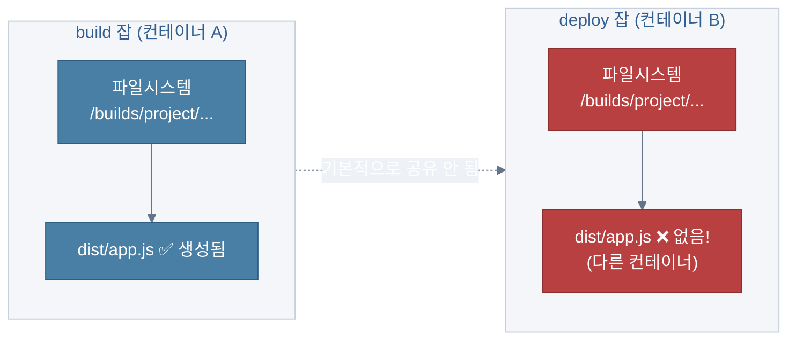
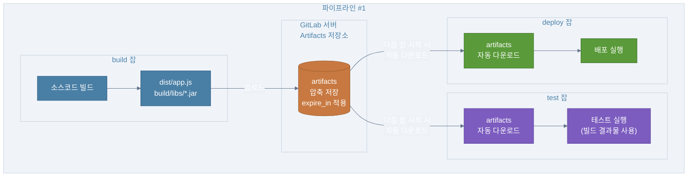
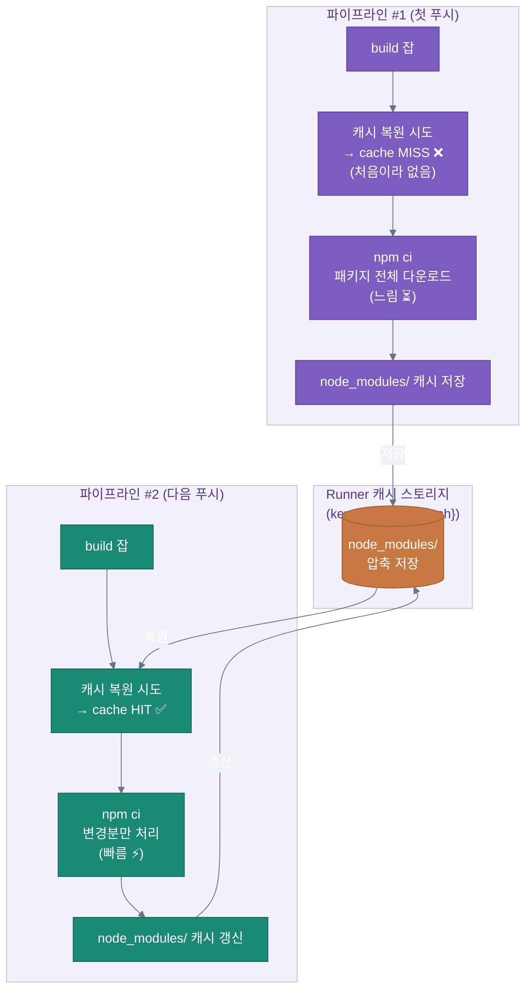
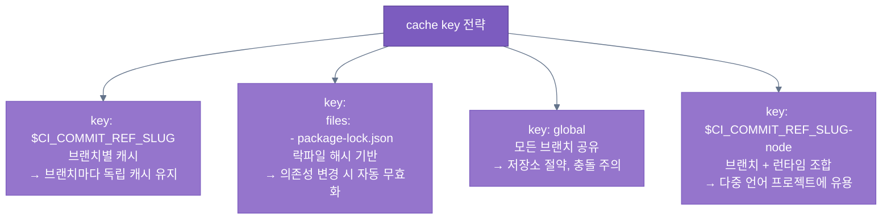
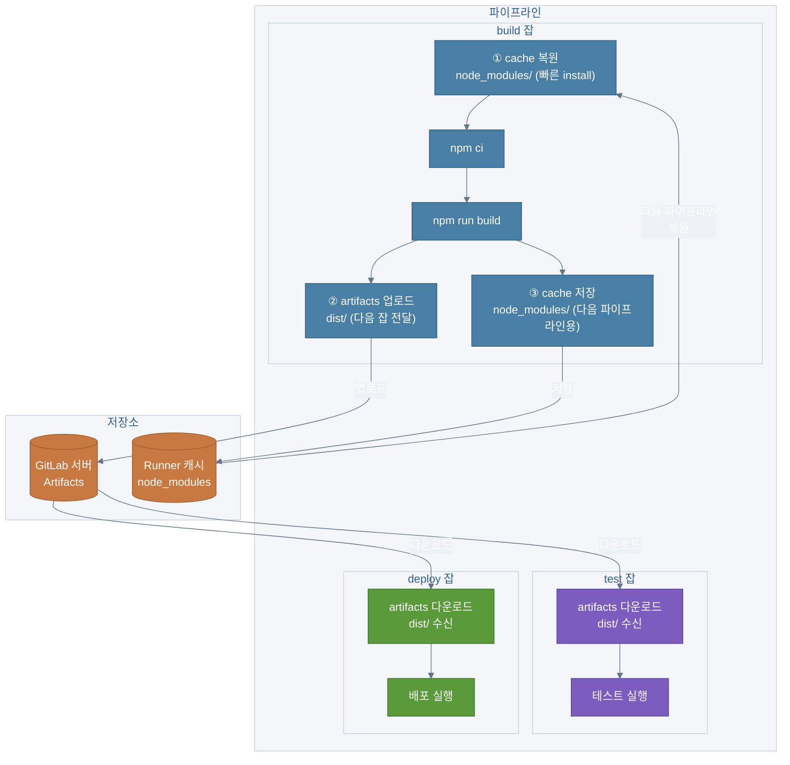
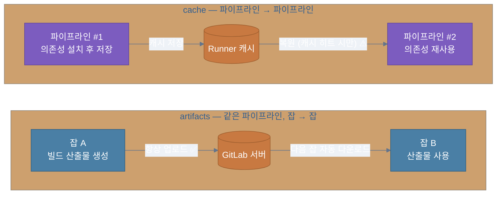
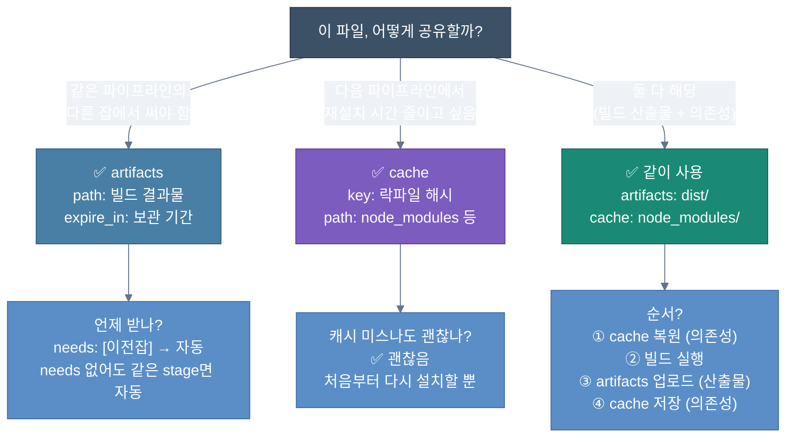
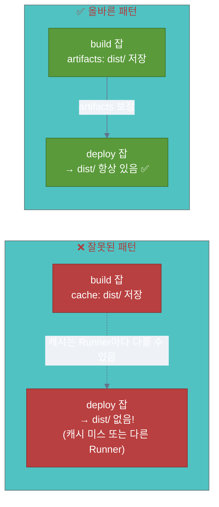

# GitLab CI/CD — `artifacts` vs `cache` 완전 정복

> GitLab CI에서 가장 자주 혼동되는 두 개념.
> **잘못 쓰면 빌드가 느려지거나, 파일이 다음 잡에 전달되지 않는 문제**가 생깁니다.
> 개념부터 실전 설정까지 한 번에 정리합니다.

---

## 1. 왜 헷갈리나 — 근본 원인부터

GitLab CI의 각 잡은 **독립된 컨테이너**에서 실행됩니다.
잡 A에서 만든 파일은 잡 B에서 자동으로 보이지 않습니다.



이 문제를 해결하는 두 가지 방법이 `artifacts`와 `cache`입니다.
하지만 **용도가 다릅니다.**

---

## 2. 핵심 차이 한눈에 보기

| | `artifacts` | `cache` |
|---|---|---|
| **목적** | 잡 간 파일 전달 | 의존성 재다운로드 방지 |
| **방향** | 같은 파이프라인 내 잡 → 잡 | 파이프라인 → 파이프라인 |
| **저장 위치** | GitLab 서버 | Runner 캐시 스토리지 (로컬/S3) |
| **보장** | ✅ 항상 다음 잡에 전달 | ⚠️ 캐시 미스 가능 (있으면 쓰는 것) |
| **만료** | `expire_in` 으로 설정 | 수동 삭제 또는 `cache:key` 갱신 |
| **대표 사용처** | 빌드 산출물, 테스트 리포트, 커버리지 | `node_modules`, `.gradle`, `~/.pip` |

---

## 3. `artifacts` — 잡 간 파일 전달

### 개념

같은 파이프라인 안에서 **앞 잡의 결과물을 뒷 잡이 받아야 할 때** 씁니다.
build 잡에서 만든 `.jar`, `.js`, 테스트 리포트 등을 deploy/test 잡에서 써야 하는 상황이 대표적입니다.

### 흐름



### yml 설정

```yaml
stages:
  - build
  - test
  - deploy

build:
  stage: build
  script:
    - npm run build
  artifacts:
    paths:
      - dist/           # 이 경로를 다음 잡에 전달
    expire_in: 1 hour   # GitLab 서버에서 1시간 후 삭제

test:
  stage: test
  needs: [build]        # build artifacts 자동 수신
  script:
    - npm test          # dist/ 파일 사용 가능

deploy:
  stage: deploy
  needs: [build]        # build artifacts 자동 수신
  script:
    - ./deploy.sh dist/
```

### 알아두면 좋은 것들

```mermaid
%%{init: {'theme': 'base', 'themeVariables': {'primaryColor': '#4a7fa5', 'primaryTextColor': '#fff', 'primaryBorderColor': '#2d5e82', 'lineColor': '#64748b', 'edgeLabelBackground': '#eef2f7'}}}%%
flowchart TD
    ROOT["artifacts 심화"]

    ROOT --> EXP["`expire_in`\n1 hour / 1 day / 1 week\n설정 안 하면 기본값 (30일)"]
    ROOT --> WHEN["`when: always`\n실패한 잡의 산출물도 보존\n→ 실패 로그, 스크린샷 수집에 유용"]
    ROOT --> REPORT["`artifacts: reports:`\njunit, coverage, dotenv 등\nGitLab UI에서 바로 확인 가능"]
    ROOT --> NEEDS["`needs: []`\n빈 배열이면 artifacts 안 내려옴\n주의 필요"]

    classDef root fill:#4a7fa5,stroke:#2d5e82,color:#fff
    classDef detail fill:#5b8ec7,stroke:#3d6fa5,color:#fff

    class ROOT root
    class EXP,WHEN,REPORT,NEEDS detail
```

**`artifacts: reports:`** 는 특히 강력합니다.

```yaml
test:
  script:
    - pytest --junitxml=report.xml --cov-report=xml
  artifacts:
    reports:
      junit: report.xml        # MR에서 테스트 결과 표시
      coverage_report:
        coverage_format: cobertura
        path: coverage.xml     # MR에서 커버리지 표시
```

---

## 4. `cache` — 파이프라인 간 의존성 재사용

### 개념

**매번 `npm install` / `pip install` / `./gradlew dependencies` 를 처음부터 하는 시간을 줄이기 위해** 씁니다.
파이프라인이 달라도 같은 브랜치라면 이전 캐시를 재사용합니다.

> **중요:** cache는 "있으면 쓰고, 없으면 새로 시작"입니다.
> 캐시 미스가 나도 파이프라인은 실패하지 않습니다.

### 흐름



### yml 설정

```yaml
build:
  cache:
    key:
      files:
        - package-lock.json    # 락파일이 바뀌면 캐시 키도 바뀜 → 자동 무효화
    paths:
      - node_modules/
  script:
    - npm ci
    - npm run build
```

### cache key 전략

캐시 키를 어떻게 잡느냐에 따라 캐시 효율이 크게 달라집니다.



**락파일 기반 키** 가 가장 실전적입니다.

```yaml
cache:
  key:
    files:
      - package-lock.json   # 이 파일의 해시가 키
    prefix: "$CI_COMMIT_REF_SLUG"  # + 브랜치명 조합
  paths:
    - node_modules/
```

---

## 5. 같이 쓰는 실전 패턴

`artifacts`와 `cache`는 **같이 쓰는 게 정석**입니다.



### 실전 yml 예시

```yaml
stages:
  - build
  - test
  - deploy

build:
  stage: build
  cache:
    key:
      files:
        - package-lock.json
    paths:
      - node_modules/         # ← cache: 파이프라인 간 재사용
  script:
    - npm ci
    - npm run build
  artifacts:
    paths:
      - dist/                 # ← artifacts: 다음 잡에 전달
    expire_in: 1 hour

test:
  stage: test
  needs: [build]              # dist/ 자동 수신
  script:
    - npm test
  artifacts:
    when: always              # 실패해도 리포트 보존
    reports:
      junit: test-results.xml

deploy:
  stage: deploy
  needs: [build]              # dist/ 자동 수신
  script:
    - ./deploy.sh dist/
```

---

## 6. 흐름 비교 — 한 장으로 끝내기



---

## 7. 실전 판단 플로차트



---

## 8. 자주 하는 실수 모음

### artifacts인데 cache 씀 (또는 반대)



### `needs: []` 로 artifacts 차단

```yaml
# ❌ 이렇게 하면 build artifacts 안 내려옴
deploy:
  needs: []     # 빈 배열 = "아무 잡도 기다리지 않겠다" = artifacts도 없음

# ✅ 올바른 방법
deploy:
  needs: [build]  # build 잡의 artifacts 자동 수신
```

### 캐시 키 너무 넓게 잡기

```yaml
# ❌ 모든 브랜치가 같은 캐시 → 충돌/오염 위험
cache:
  key: "global"
  paths:
    - node_modules/

# ✅ 브랜치 + 락파일 조합
cache:
  key:
    files:
      - package-lock.json
    prefix: "$CI_COMMIT_REF_SLUG"
  paths:
    - node_modules/
```

---

## 9. 한 줄 요약

| | 한 줄 요약 |
|---|---|
| `artifacts` | **"이 파일, 다음 잡에 줘"** — 같은 파이프라인 내 잡 간 전달, 보장됨 |
| `cache` | **"이 폴더, 다음 파이프라인에서 재사용"** — 설치 시간 단축, 미스 가능 |
