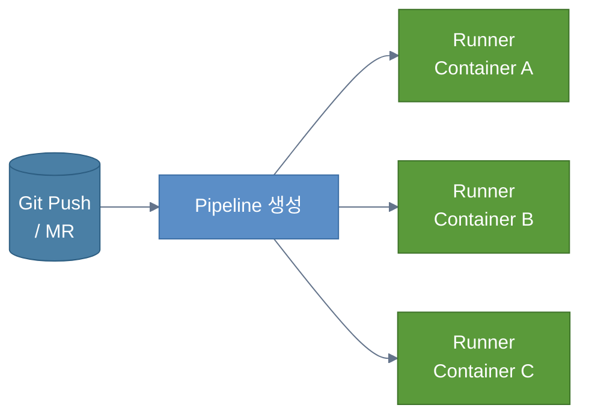
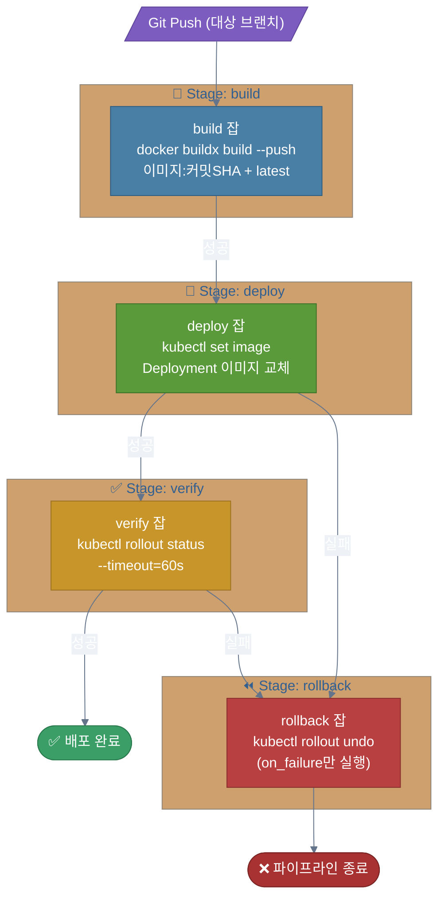
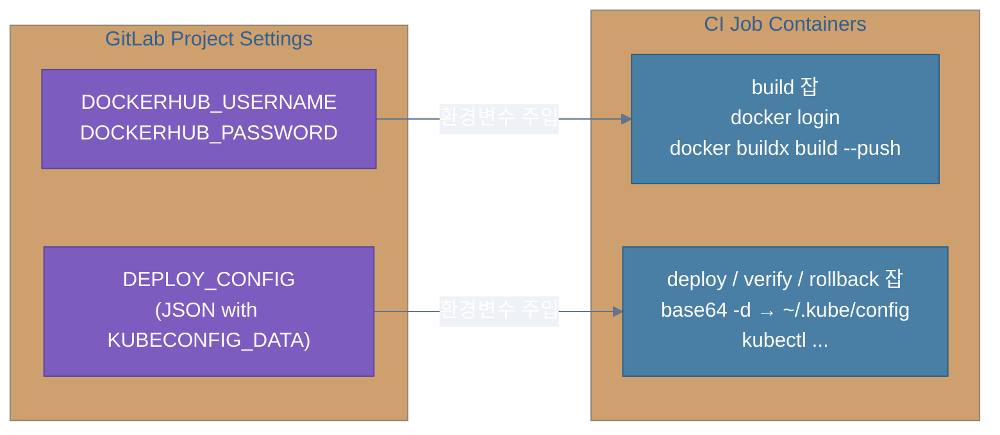
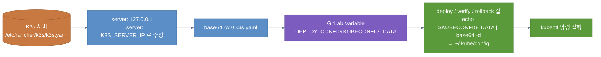
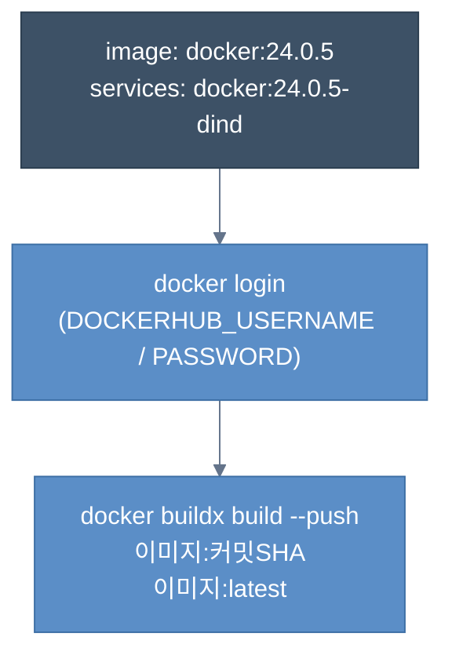
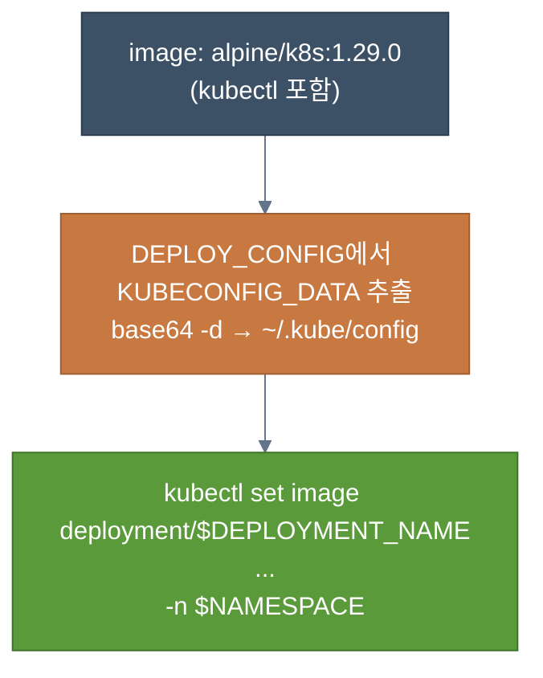
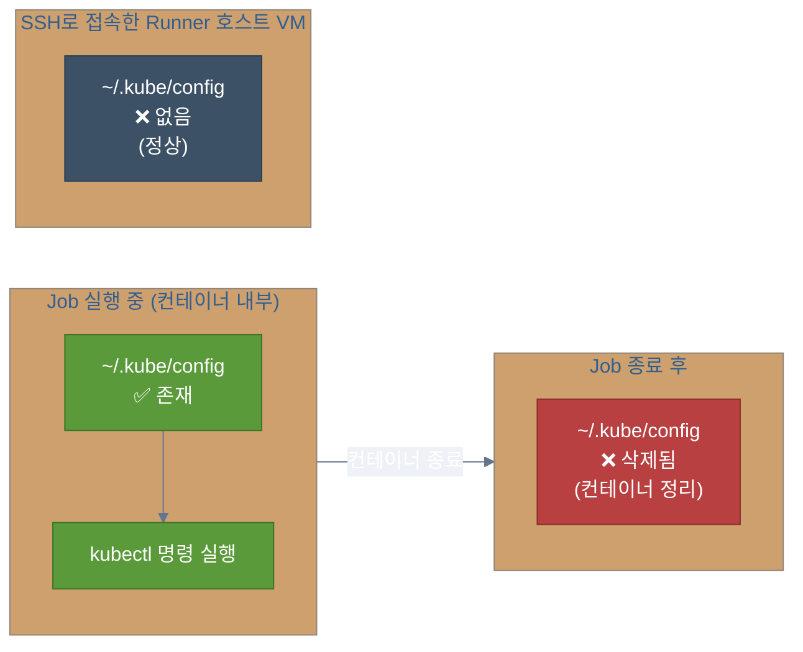
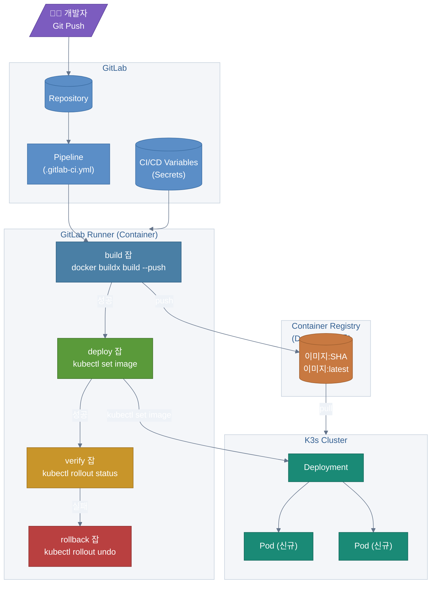

# GitLab CI/CD 완전 정복 — `.gitlab-ci.yml` 구조부터 K3s 배포까지

> 이 글은 실제 프로젝트에 적용한 GitLab CI/CD 파이프라인을 기반으로,
> **yml 구조가 어떻게 동작하는지**와 **Docker 빌드 → K3s 배포 흐름**을 정리합니다.

---

## 1. GitLab CI/CD란 무엇인가

GitLab은 저장소 루트의 `.gitlab-ci.yml`을 읽어 **파이프라인(Pipeline)** 을 자동 생성합니다.

- 파이프라인은 여러 **잡(Job)** 으로 구성됩니다.
- 각 잡은 **Runner**가 띄운 독립 컨테이너(또는 VM)에서 실행됩니다.
- **잡 간 파일 시스템은 공유되지 않습니다.** 어떤 잡에서 만든 파일은 그 잡이 끝나면 사라집니다.



---

## 2. 기본 구성 요소 한눈에 보기

| 키워드 | 역할 |
|---|---|
| `stages` | 파이프라인 단계 순서 정의 |
| Job 이름 | `stages` / `variables` 외 최상위 키 = 잡 |
| `variables` | 잡에서 참조할 환경 변수 |
| `rules` | 잡 실행 조건 (브랜치, MR, 태그 등) |
| `needs` | 잡 간 의존 관계 (DAG 구성) |
| `before_script` | 준비 단계 (로그인, 설정 파일 생성 등) |
| `script` | 실제 작업 (빌드 / 배포 / 검증 / 롤백) |

---

## 3. 파이프라인 전체 흐름

이 글에서 다루는 파이프라인의 목표는 다음과 같습니다.

1. 서버 코드를 **Docker 이미지로 빌드**
2. 레지스트리에 **푸시**
3. K3s(Kubernetes)에 **배포** (Deployment 이미지 태그 교체)
4. **롤아웃 상태 검증**
5. 실패 시 **자동 롤백**



---

## 4. GitLab Variables(시크릿) 설계

민감정보(비밀번호 / 토큰 / kubeconfig)는 코드에 직접 넣으면 안 됩니다.
GitLab **프로젝트 Settings → CI/CD → Variables** 에 등록하고, CI가 주입받는 구조를 씁니다.

### 필수 변수 목록

| 변수명 | 설명 | 타입 권장 |
|---|---|---|
| `DOCKERHUB_USERNAME` | Docker 레지스트리 로그인 사용자명 | Variable |
| `DOCKERHUB_PASSWORD` | Docker 레지스트리 비밀번호 / Access Token | Variable (Masked) |
| `DEPLOY_CONFIG` | JSON 문자열 (KUBECONFIG_DATA 포함) | Variable / File |

### `DEPLOY_CONFIG` JSON 예시

```json
{
  "KUBECONFIG_DATA": "<k3s.yaml 전체를 base64 인코딩한 문자열>"
}
```

### 시크릿 주입 흐름



---

## 5. kubeconfig 준비 방법 (K3s)

### 5-1. K3s 서버에서 kubeconfig 가져오기

```bash
cat /etc/rancher/k3s/k3s.yaml
```

### 5-2. `server:` 주소 수정

K3s 기본 설정은 `127.0.0.1`로 되어 있어, CI Runner에서 접근할 수 없습니다.
Runner가 접근 가능한 실제 서버 IP로 변경해야 합니다.

```yaml
# 변경 전
server: https://127.0.0.1:6443

# 변경 후 (Runner가 접근 가능한 K3s 서버 주소)
server: https://<K3S_SERVER_IP>:6443
```

### 5-3. base64 인코딩

```bash
# Linux
base64 -w 0 k3s.yaml

# macOS
base64 -i k3s.yaml
```

이 출력값을 `DEPLOY_CONFIG` JSON의 `KUBECONFIG_DATA` 값으로 사용합니다.

### kubeconfig 준비 흐름



> **포인트:** `~/.kube/config`는 **각 잡 컨테이너 안에서만** 존재합니다.
> 잡이 끝나면 사라지므로, deploy / verify / rollback 잡마다 각각 생성해야 합니다.

---

## 6. Job별 상세 설명

### (A) `build` 잡 — Docker 이미지 빌드 & 푸시



- `docker:24.0.5-dind` : Docker-in-Docker, 컨테이너 안에서 docker 명령 사용 가능하게 해줌
- `--push` : 빌드와 동시에 레지스트리에 푸시 (로컬에만 저장하지 않음)
- 이미지 태그로 `$CI_COMMIT_SHA` 사용 → 롤백 시 정확한 버전 특정 가능

---

### (B) `deploy` 잡 — K3s Deployment 이미지 교체



---

### (C) `verify` 잡 — 롤아웃 상태 검증

```bash
kubectl rollout status deployment/$DEPLOYMENT_NAME \
  -n $NAMESPACE \
  --timeout=60s
```

- 60초 내에 모든 파드가 정상 기동되지 않으면 실패 → `rollback` 잡 트리거

---

### (D) `rollback` 잡 — 자동 롤백

```yaml
rules:
  - when: on_failure   # 이전 잡이 실패했을 때만 실행
allow_failure: true    # 롤백 자체 실패가 파이프라인 블로킹하지 않도록
```

```bash
kubectl rollout undo deployment/$DEPLOYMENT_NAME -n $NAMESPACE
```

---

## 7. "VM에 kubeconfig 파일이 없는데?" — 정상입니다



CI에서 kubeconfig는 **job 컨테이너 안에서만** 생성되고, 잡이 끝나면 컨테이너가 정리되며 파일도 사라집니다.
SSH로 접속한 VM에서 `~/.kube/config`가 없어도 완전히 정상입니다.

---

## 8. 트러블슈팅 체크리스트

### Docker login 실패

```
Error response from daemon: unauthorized
```

- `DOCKERHUB_USERNAME`, `DOCKERHUB_PASSWORD` 가 GitLab Variables에 등록되어 있는지 확인
- Docker Hub Access Token 만료 여부 확인
- Variable이 **Masked** 설정이면 값 앞뒤 공백 없는지 확인

---

### `DEPLOY_CONFIG` 관련 에러

```
jq: error: null and null cannot be added
```

- GitLab Variables에 `DEPLOY_CONFIG` 가 존재하는지 확인
- 값이 유효한 JSON 문자열인지 확인 (`echo $DEPLOY_CONFIG | python3 -m json.tool`)
- JSON에 `KUBECONFIG_DATA` 키가 있는지 확인

---

### kubectl 클러스터 연결 실패

```
Unable to connect to the server: dial tcp ...
```

- `k3s.yaml`의 `server:` 가 CI Runner에서 접근 가능한 주소인지 확인
- K3s API 포트(기본 `6443`) 방화벽/보안그룹 허용 여부 확인
- `KUBECONFIG_DATA` 가 base64로 인코딩된 값인지 확인 (이중 인코딩 주의)

---

## 9. 전체 아키텍처 요약



---

## 10. 다음 스터디 주제

- `rules` 로 MR / Tag / Release 조건 분기하기
- `environment` / `workflow:rules` 활용법
- `artifacts` vs `cache` 차이와 실전 적용 포인트
- **DAG 파이프라인** (`needs`) 으로 병렬 잡 구성하기
