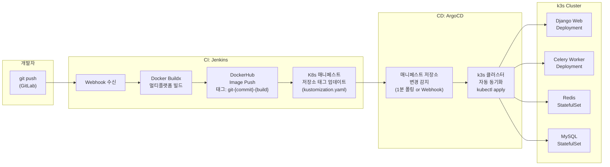
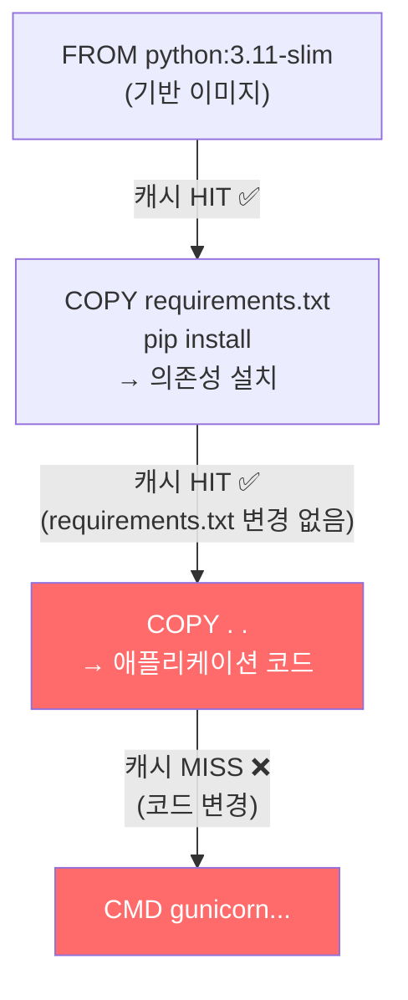
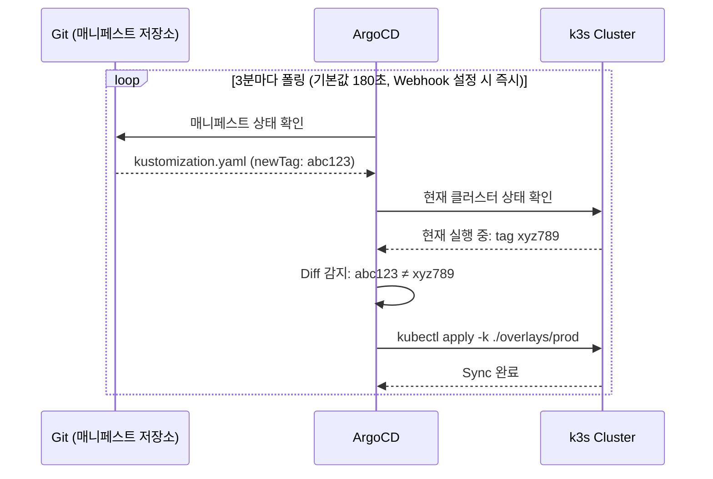
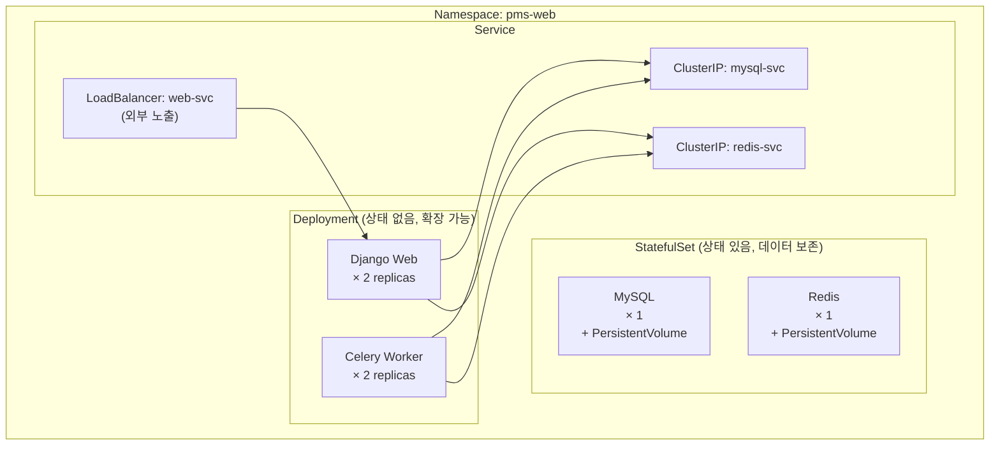
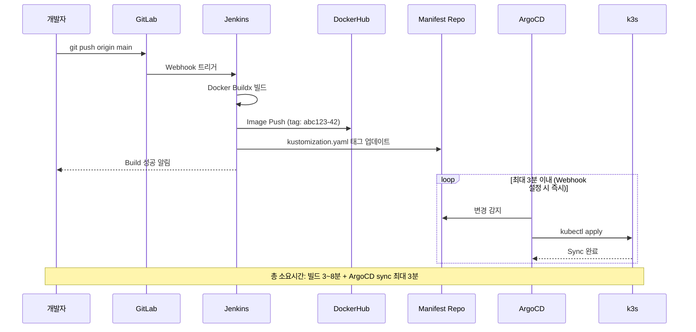

## 현대 배포의 목표: "사람이 서버에 로그인하지 않는다"

코드를 배포하는 방법은 크게 두 가지다.

| 방식 | 설명 | 문제점 |
|---|---|---|
| **Push 방식** | CI 서버가 직접 kubectl apply | CI 서버에 클러스터 자격증명 노출 |
| **Pull 방식 (GitOps)** | Git 변경 → ArgoCD가 감지 후 적용 | **보안 ↑, 감사 이력 ↑** |

GitOps는 **Git 저장소가 인프라의 단일 진실의 원천(Single Source of Truth)**이 되는 방식이다.<a href="https://argo-cd.readthedocs.io/en/stable/core_concepts/" target="_blank"><sup>[1]</sup></a>

---

## 전체 파이프라인 구조



---

## Jenkins: CI 파이프라인 상세

### Jenkinsfile 구조

```groovy
// Jenkinsfile
pipeline {
    agent any

    environment {
        // Jenkins Credentials에 저장된 비밀값 주입
        DOCKERHUB_CRED  = credentials('dockerhub-credentials')
        IMAGE_NAME      = "myorg/pms-web"
        // 이미지 태그: Git 커밋 해시 + Jenkins 빌드 번호
        IMAGE_TAG       = "${GIT_COMMIT[0..7]}-${BUILD_NUMBER}"
        MANIFEST_REPO   = "git@gitlab.com:myorg/k8s-manifests.git"
    }

    stages {
        stage('Checkout') {
            steps {
                checkout scm
            }
        }

        stage('Build & Push') {
            steps {
                script {
                    // Docker Buildx: 멀티 플랫폼 빌드
                    sh """
                        docker buildx create --use --name multiarch-builder || true

                        docker buildx build \\
                            --platform linux/amd64,linux/arm64 \\
                            --cache-from type=registry,ref=${IMAGE_NAME}:buildcache \\
                            --cache-to   type=registry,ref=${IMAGE_NAME}:buildcache,mode=max \\
                            --tag ${IMAGE_NAME}:${IMAGE_TAG} \\
                            --tag ${IMAGE_NAME}:latest \\
                            --push \\
                            .
                    """
                }
            }
        }

        stage('Update Manifest') {
            steps {
                script {
                    // 매니페스트 저장소의 이미지 태그를 새 태그로 교체
                    sh """
                        git clone ${MANIFEST_REPO} manifests
                        cd manifests
                        sed -i 's|newTag:.*|newTag: ${IMAGE_TAG}|' kustomization.yaml
                        git config user.email "jenkins@ci"
                        git config user.name  "Jenkins CI"
                        git add kustomization.yaml
                        git commit -m "ci: update image tag to ${IMAGE_TAG}"
                        git push origin main
                    """
                }
            }
        }
    }

    post {
        failure {
            // Slack, Email 알림
            echo "Pipeline failed!"
        }
    }
}
```

---

## Docker Buildx: 멀티 플랫폼 빌드와 레이어 캐싱

### 왜 Buildx인가

일반 `docker build`는 현재 시스템 아키텍처(amd64)만 지원한다. Buildx를 쓰면 **한 번의 명령으로 amd64/arm64 양쪽 이미지**를 동시에 빌드할 수 있다.<a href="https://docs.docker.com/reference/cli/docker/buildx/build/" target="_blank"><sup>[2]</sup></a>



```dockerfile
# Dockerfile — 캐싱을 최대화하는 레이어 순서
FROM python:3.11-slim

WORKDIR /app

# requirements.txt를 먼저 복사 → pip install 결과가 캐시됨
COPY requirements.txt .
RUN pip install --no-cache-dir -r requirements.txt

# 코드는 마지막에 복사 → 코드가 바뀌어도 pip install은 재실행 안 됨
COPY . .

CMD ["gunicorn", "config.wsgi:application", "--bind", "0.0.0.0:8000"]
```

### 캐시 플래그 설명

```bash
docker buildx build \
  --cache-from type=registry,ref=myimage:buildcache \
  # ↑ 이전 빌드의 캐시를 레지스트리에서 가져옴

  --cache-to type=registry,ref=myimage:buildcache,mode=max \
  # ↑ 현재 빌드 캐시를 레지스트리에 저장 (mode=max: 모든 레이어 저장)

  --platform linux/amd64,linux/arm64 \
  # ↑ 두 아키텍처 동시 빌드

  --push \
  # ↑ 빌드 후 즉시 레지스트리에 푸시
```

**효과**: 의존성이 변경되지 않으면 `pip install` 단계를 건너뛰어 **빌드 시간 70~80% 절약**.

---

## ArgoCD: GitOps CD

### ArgoCD가 동작하는 원리

**폴링 vs Webhook**:
- 기본: **3분(180초)** 마다 매니페스트 저장소를 폴링 (`timeout.reconciliation` 설정값)<a href="https://argo-cd.readthedocs.io/en/stable/user-guide/auto_sync/" target="_blank"><sup>[1]</sup></a>
- Webhook 설정 시: GitLab/GitHub push 이벤트를 즉시 수신 → 폴링 대기 없이 Sync 트리거
- Webhook은 **신뢰하지 않음** — Refresh만 트리거하고 blind sync는 하지 않음




### kustomization.yaml 구조

```yaml
# k8s-manifests/overlays/prod/kustomization.yaml
apiVersion: kustomize.config.k8s.io/v1beta1
kind: Kustomization

resources:
  - ../../base

images:
  - name: myorg/pms-web
    newTag: abc1234-42   # ← Jenkins가 이 값을 sed로 교체
```

```yaml
# k8s-manifests/base/deployment.yaml
apiVersion: apps/v1
kind: Deployment
metadata:
  name: pms-web
  namespace: pms-web
spec:
  replicas: 2
  selector:
    matchLabels:
      app: pms-web
  template:
    spec:
      containers:
        - name: web
          image: myorg/pms-web  # kustomize가 태그를 붙여줌
          ports:
            - containerPort: 8000
          env:
            - name: DJANGO_SECRET_KEY
              valueFrom:
                secretKeyRef:
                  name: pms-secrets
                  key: secret-key
```

---

## k3s: 왜 경량 Kubernetes인가

k3s는 Rancher Lab이 만든 **경량 Kubernetes 배포판**이다.<a href="https://docs.k3s.io/" target="_blank"><sup>[3]</sup></a>

| | 일반 K8s | k3s |
|---|---|---|
| 바이너리 크기 | ~수백 MB | ~70MB |
| 메모리 요구량 | 2GB+ | 512MB |
| 설치 | 복잡 | `curl -sfL https://get.k3s.io | sh -` |
| 용도 | 대규모 프로덕션 | 소규모 서버, 엣지, IoT, 개발 |

### 이 프로젝트의 k3s 리소스 구조



**Deployment vs StatefulSet**:
- `Deployment`: Pod이 죽어도 데이터가 없어도 됨 → Django, Celery
- `StatefulSet`: Pod에 고정 이름이 붙고 PVC(영구 스토리지)가 유지됨 → MySQL, Redis

---

## 이미지 태그 전략: 왜 git-{commit}-{build} 형태인가

```bash
# 나쁜 예: latest 태그만 사용
docker push myimage:latest
# → 어느 커밋이 배포됐는지 알 수 없음
# → Rollback 불가

# 좋은 예: Commit Hash + Build Number
docker push myimage:a1b2c3d4-42
# → git show a1b2c3d4로 어느 코드인지 즉시 확인
# → 이전 태그로 kustomization.yaml만 되돌리면 Rollback 완료
```

### 롤백 방법

```bash
# 방법 1: Git revert (권장 — GitOps 원칙 유지)
git revert HEAD
git push origin main
# → ArgoCD가 감지 후 이전 태그로 자동 롤백

# 방법 2: 직접 태그 수정 (긴급 상황)
sed -i 's|newTag:.*|newTag: a1b2c3d4-38|' kustomization.yaml
git commit -am "hotfix: rollback to build 38"
git push
```

---

## 배포 흐름 최종 요약



---

## 참고

<ol>
<li><a href="https://argo-cd.readthedocs.io/en/stable/core_concepts/" target="_blank">[1] ArgoCD Core Concepts — 공식 문서</a></li>
<li><a href="https://docs.docker.com/reference/cli/docker/buildx/build/" target="_blank">[2] Docker Buildx build — 공식 문서</a></li>
<li><a href="https://docs.k3s.io/" target="_blank">[3] k3s 공식 문서</a></li>
<li><a href="https://www.jenkins.io/doc/book/pipeline/syntax/" target="_blank">[4] Jenkins Pipeline Syntax — 공식 문서</a></li>
<li><a href="https://kustomize.io/" target="_blank">[5] Kustomize 공식 문서</a></li>
</ol>

---

## 관련 글

- [kubectl 실전 — 로그, 디버깅, 모니터링 →](/post/kubectl-debugging)
- [GitLab CI/CD — .gitlab-ci.yml → K3s →](/post/gitlab-cicd-guide)
