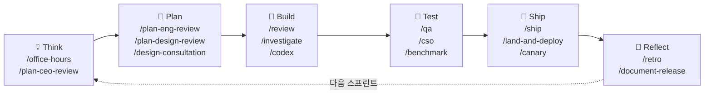
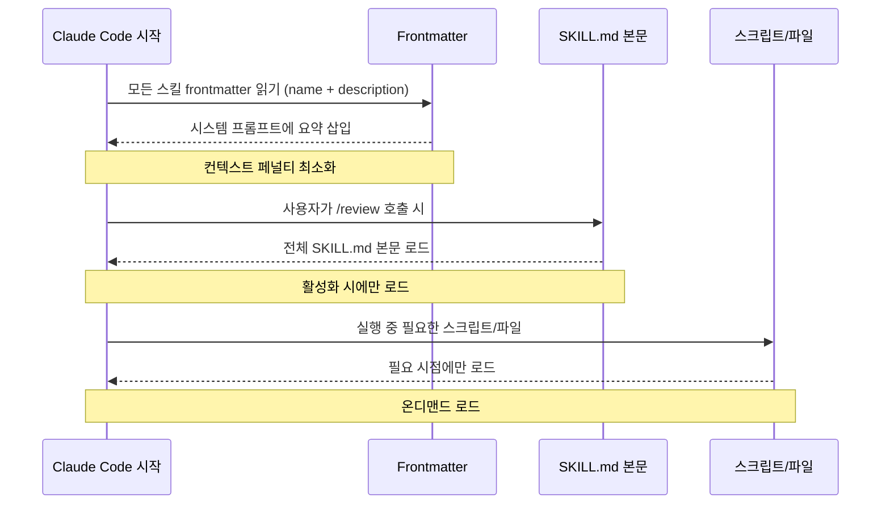

## gstack이 뭔가?

**gstack**은 Y Combinator CEO **Garry Tan**이 2026년 3월 12일 공개한 오픈소스 Claude Code 스킬 모음이다.<a href="https://github.com/garrytan/gstack" target="_blank"><sup>[1]</sup></a>

Claude Code CLI를 *가상 엔지니어링팀*으로 변환하는 것이 핵심 아이디어다. 슬래시 커맨드 하나로 CEO, 시니어 디자이너, 엔지니어링 매니저, 스태프 엔지니어, QA 리드, 보안 책임자, 릴리즈 엔지니어가 번갈아 등장한다.

출시 11일 만에 GitHub Star **39,000개**, Fork **2,700+**. MIT 라이선스, 무료 오픈소스.

---

## 핵심 철학: 프로세스다, 도구가 아니다

> **"gstack is a process, not a collection of tools."**

같은 AI에게 같은 대화에서 기획 → 구현 → 리뷰 → 배포를 모두 맡기면 조직적 진실을 거스른다. 개발의 각 단계는 근본적으로 다른 인지 모드가 필요하다. gstack은 이걸 분리한다.



각 스킬은 다음 스킬에 아웃풋을 넘긴다:

- `/office-hours` 가 설계 문서 작성 → `/plan-ceo-review` 가 읽음
- `/plan-eng-review` 가 테스트 플랜 작성 → `/qa` 가 픽업
- `/review` 가 버그 발견 → `/ship` 이 수정 검증
- `/ship` 이 자동으로 `/document-release` 호출

---

## 숫자로 보는 신뢰도

Garry Tan이 gstack으로 직접 찍은 수치:

| 지표 | 수치 |
|---|---|
| 기간 | 60일 (파트타임) |
| 총 코드량 | 60만+ 줄 (35%가 테스트) |
| 일일 생산량 | 1만~2만 줄 |
| 1주 커밋 수 | 362개 |
| 1주 추가 라인 | 140,751줄 (3개 프로젝트) |

---

## 지원 도구 — 어디서 쓸 수 있나?

gstack은 **Claude Code 네이티브**이지만 `--host` 플래그로 다른 AI 코딩 도구도 공식 지원한다.

| 도구 | 지원 | 설치 플래그 | 슬래시 커맨드 |
|---|---|---|---|
| **Claude Code** | ✅ Primary | `./setup` | `/skill-name` |
| **Codex CLI** (OpenAI) | ✅ 공식 | `./setup --host codex` | 자연어 |
| **Cursor** | ✅ 공식 | `./setup --host codex` | `@skill-name` |
| **Gemini CLI** | ✅ 공식 | `./setup --host gemini` | 자연어 |
| **Antigravity** | ⚠️ 비공식 | `antigravity-awesome-skills` | `Use @skill-name` |
| **Windsurf / Kiro** | ⚠️ 비공식 | `antigravity-awesome-skills` | 자연어 |

> **Antigravity(Google)**는 gstack 공식 지원 대상이 아니다. 동일한 **SKILL.md 오픈 표준**을 쓰는 커뮤니티 라이브러리 [`antigravity-awesome-skills`](https://github.com/sickn33/antigravity-awesome-skills) 를 통해 연결한다.

---

## 설치 방법

### Claude Code (전역)

```bash
git clone --single-branch --depth 1 https://github.com/garrytan/gstack.git ~/.claude/skills/gstack
cd ~/.claude/skills/gstack && ./setup
```

### Claude Code (프로젝트 단위 — 팀 공유)

```bash
# 프로젝트 루트에서
cp -Rf ~/.claude/skills/gstack .claude/skills/gstack
rm -rf .claude/skills/gstack/.git
cd .claude/skills/gstack && ./setup
```

팀원들이 repo를 클론하면 동일한 스킬을 바로 사용할 수 있다.

### Cursor / Codex CLI

```bash
git clone --single-branch --depth 1 https://github.com/garrytan/gstack.git .agents/skills/gstack
cd .agents/skills/gstack && ./setup --host codex
```

### Gemini CLI

```bash
git clone --single-branch --depth 1 https://github.com/garrytan/gstack.git ~/gstack
cd ~/gstack && ./setup --host gemini
```

### Antigravity / Kiro / Windsurf (커뮤니티)

```bash
npx antigravity-awesome-skills --antigravity  # Antigravity
npx antigravity-awesome-skills --cursor       # Cursor
npx antigravity-awesome-skills --kiro         # Kiro
```

### 업그레이드

```bash
/gstack-upgrade  # Claude Code 내에서 실행
```

---

## 내부 구조 — 스킬은 어떻게 동작하나?

gstack의 스킬은 **SKILL.md 파일**이다. 각 스킬 디렉터리 구조:

```
review/
├── SKILL.md          ← 스킬 정의 (frontmatter + 워크플로우)
└── (선택: 스크립트, 레퍼런스 문서)
```

SKILL.md 포맷:

```yaml
---
name: review
description: Staff engineer code review with auto-fixes. Use when...
---

## Overview
...

## When to Use
...

## Instructions
(단계별 워크플로우)
```

Claude Code는 **3단계 점진적 로딩**으로 스킬을 처리한다:



> `description` 필드가 **트리거 메커니즘**이다. "언제 사용하는가"에 대한 모든 안내가 반드시 여기에 있어야 한다. 본문은 활성화 이후에야 로드되기 때문이다.

### 저장 위치

| 범위 | Claude Code | Codex/Cursor |
|---|---|---|
| 전역 (사용자) | `~/.claude/skills/gstack/` | `~/.codex/skills/gstack/` |
| 프로젝트 (팀 공유) | `.claude/skills/gstack/` | `.agents/skills/gstack/` |
| 설정 파일 | `~/.gstack/config.yaml` | 동일 |
| 설계/플랜 상태 | `~/.gstack/projects/` | 동일 |

프로젝트 레벨 스킬이 전역 스킬보다 우선된다.

---

## 13개 스프린트 스킬 전체 목록

gstack의 28개 커맨드 중 핵심은 스프린트 라이프사이클을 구성하는 **13개 스프린트 스킬**이다.

### Think & Plan (기획)

| 커맨드 | 역할 | 한 줄 설명 |
|---|---|---|
| `/office-hours` | 프로덕트 전략가 | YC 오피스 아워 — 6가지 강제 질문으로 코드 전에 리프레이밍 |
| `/plan-ceo-review` | CEO / 창업자 | 10-star product 찾기 — 4가지 Scope 모드 |
| `/plan-eng-review` | 엔지니어링 매니저 | 아키텍처 잠금 — **유일한 필수 배포 게이트** |
| `/plan-design-review` | 시니어 디자이너 | 구현 전 디자인 0~10점 채점 + 플랜 수정 |
| `/design-consultation` | 디자인 파트너 | 디자인 시스템 + DESIGN.md 생성 |

### Build & Test (구현 · 검증)

| 커맨드 | 역할 | 한 줄 설명 |
|---|---|---|
| `/review` | 스태프 엔지니어 | diff 기반 프로덕션 버그 헌팅 + 자동 수정 |
| `/qa` | QA 리드 | 실제 Chromium으로 클릭 테스트 + 자동 버그 수정 |

### Ship & Reflect (배포 · 회고)

| 커맨드 | 역할 | 한 줄 설명 |
|---|---|---|
| `/ship` | 릴리즈 엔지니어 | sync → test → coverage → push → PR (원커맨드) |
| `/land-and-deploy` | 릴리즈 엔지니어 | 머지 → CI 대기 → 프로덕션 헬스 검증 |
| `/canary` | SRE | 배포 후 에러·회귀 감시 |
| `/benchmark` | 퍼포먼스 엔지니어 | Core Web Vitals + 성능 베이스라인 |
| `/document-release` | 테크니컬 라이터 | README·CHANGELOG·ARCHITECTURE 자동 최신화 |
| `/retro` | 엔지니어링 매니저 | 주간 커밋 분석 + 팀 메트릭 회고 |

→ 각 스킬 상세 분석: [Think & Plan 스킬 →](/post/gstack-skills-plan) · [Build, Test & Ship 스킬 →](/post/gstack-skills-ship)

---

## 왜 각광받나?

**1. 조직 문제를 해결한다**
같은 AI가 같은 대화에서 여러 역할을 동시에 하면 인지 모드 충돌이 일어난다. gstack은 단계별로 완전히 다른 페르소나를 부여해 이를 분리한다.

**2. YC CEO의 실제 사고를 인코딩했다**
`/plan-ceo-review`가 "10-star product는?"을 묻는 건 제네릭 프롬프트가 아니다. 수천 개 스타트업을 평가한 Garry Tan의 실제 사고 방식이다. 의도적으로 편향(opinionated)된 도구다.

**3. 실제 브라우저 통합**
텍스트 기반 AI 코딩 도구와 달리, `/qa`는 Playwright 기반 실제 Chromium 데몬을 써서 앱을 직접 클릭하고 스크린샷을 어노테이션한다.

**4. 스마트 리뷰 라우팅**
CEO는 인프라 버그 안 봄, 디자인 리뷰는 백엔드 전용 변경 때 스킵. 어느 리뷰가 적절한지 자동 라우팅된다.

---

## 논란

수용은 양극화됐다. 지지 측: *"소프트웨어 개발의 미래를 엿본다."* 비판 측: *"그냥 텍스트 파일에 프롬프트 넣은 것."*<a href="https://techcrunch.com/2026/03/17/why-garry-tans-claude-code-setup-has-gotten-so-much-love-and-hate/" target="_blank"><sup>[2]</sup></a>

비판은 기술적으로 맞다. gstack은 최하위 레벨에서 마크다운 파일이다. 반론도 기술적으로 맞다. 모든 소프트웨어는 최하위 레벨에서 디스크의 비트다. 가치는 그 안에 인코딩된 구조·순서·철학에 있다.

---

## Superpowers와의 비교

gstack과 직접 비교되는 도구는 IDE(Cursor, Codex)가 아니라 동일한 "스킬 팩" 개념의 **Superpowers** (Jesse Vincent)다.

| | **gstack** | **Superpowers** |
|---|---|---|
| 창작자 | Garry Tan (YC CEO) | Jesse Vincent |
| GitHub Stars | 39,000+ | 106,000+ |
| 핵심 철학 | 가상 엔지니어링팀, 단계별 인지 분리 | 7단계 TDD 강제 파이프라인 |
| QA | 실제 Chromium 브라우저 | 텍스트 기반 |
| 설치 | Claude Code, Cursor, Gemini CLI, Codex | Claude Code 중심 |
| 병행 사용 | ✅ 권장 | ✅ 권장 |

> YC Bookface 포럼 최다 추천: **둘 다 써라.** Superpowers로 TDD 구현 규율, gstack으로 기획·시각 QA를 담당한다.

---

## 참고

<a href="https://github.com/garrytan/gstack" target="_blank">[1] garrytan/gstack — GitHub</a>

<a href="https://techcrunch.com/2026/03/17/why-garry-tans-claude-code-setup-has-gotten-so-much-love-and-hate/" target="_blank">[2] Why Garry Tan's Claude Code setup has gotten so much love, and hate — TechCrunch</a>

<a href="https://www.sitepoint.com/gstack-garry-tan-claude-code/" target="_blank">[3] GStack Tutorial: Garry Tan's Claude Code Workflow — SitePoint</a>

<a href="https://github.com/sickn33/antigravity-awesome-skills" target="_blank">[4] antigravity-awesome-skills — GitHub</a>

<a href="https://agentnativedev.medium.com/garry-tans-gstack-running-claude-like-an-engineering-team-392f1bd38085" target="_blank">[5] Garry Tan's gstack: Running Claude Like an Engineering Team — Agent Native</a>

---

## 관련 글

- [gstack Think & Plan 스킬 1~5 상세 분석 →](/post/gstack-skills-plan)
- [gstack Build, Test & Ship 스킬 6~13 상세 분석 →](/post/gstack-skills-ship)
