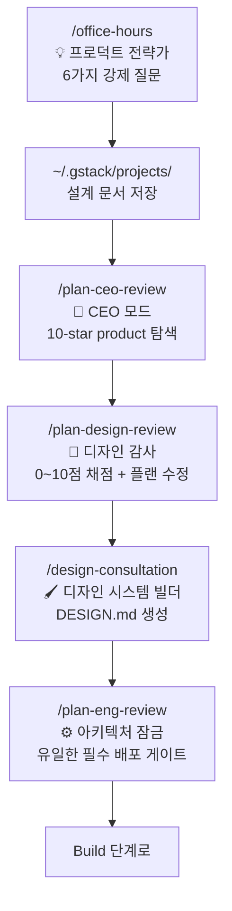
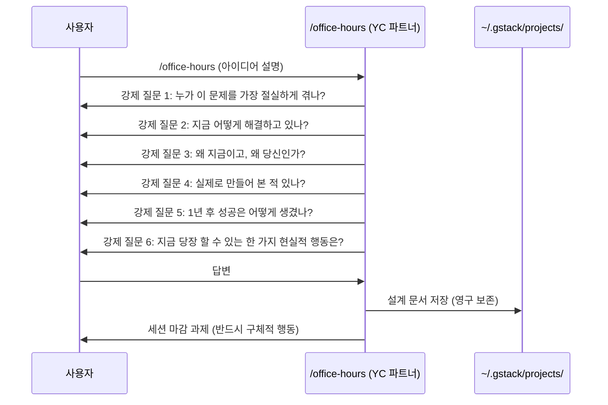
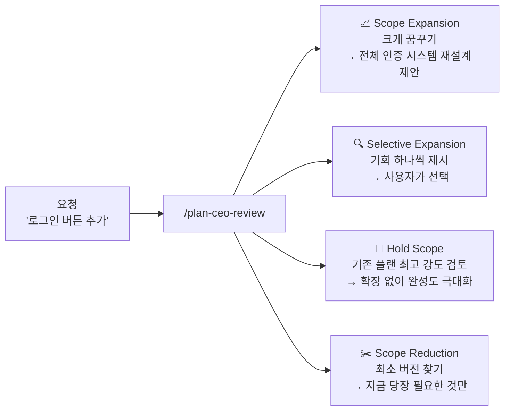
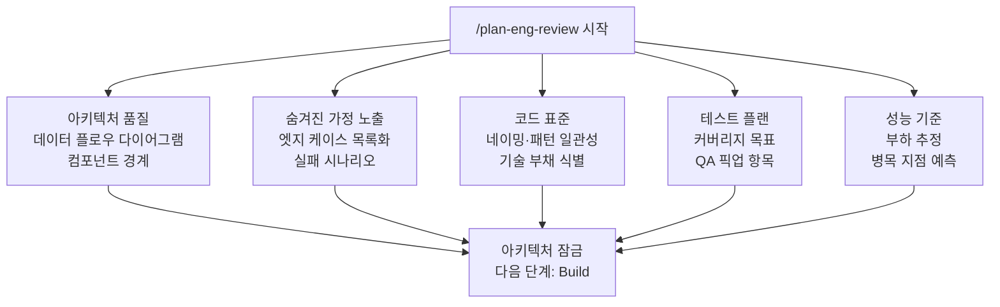
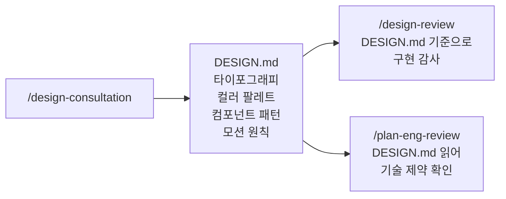

## Think & Plan 단계 개요

gstack 스프린트의 첫 번째 단계. **코드를 한 줄도 쓰기 전에** 제품을 리프레이밍하고, 아키텍처를 확정하고, 디자인 시스템을 잡는다.



> **핵심**: `/office-hours`가 만든 설계 문서를 `/plan-ceo-review`가 읽고, `/design-consultation`이 만든 `DESIGN.md`를 `/plan-eng-review`와 `/design-review`가 읽는다. 각 스킬은 독립적으로 동작하지 않고 서로 아웃풋을 넘긴다.

---

## 스킬 1: `/office-hours` — YC 오피스 아워 모드

**역할:** 프로덕트 전략가 / 창업 어드바이저

Claude가 YC 파트너 페르소나를 취해 오피스 아워를 진행한다. 아이디어를 실제 YC 심사 관점에서 6가지 강제 질문으로 재검토한다.<a href="https://github.com/garrytan/gstack" target="_blank"><sup>[1]</sup></a>

### 동작 방식



### 핵심 규칙

- **절대 구현을 시작하지 않는다.** 오직 설계 문서만 생성한다.
- 세션은 `~/.gstack/projects/`에 영구 저장되어 대화 종료 후에도 결정이 살아있다.
- 마지막 과제는 반드시 구체적 현실 행동이어야 한다. *"가서 만들어라"* 같은 추상적 지시는 금지.

### 언제 쓰나?

새 기능이나 프로젝트를 시작하기 전. 특히 구현에 뛰어들고 싶은 충동이 강할 때일수록 먼저 여기서 멈춰야 한다.

---

## 스킬 2: `/plan-ceo-review` — 10-Star Product 모드

**역할:** CEO / 창업자 (Brian Chesky 모드)

기능 요청을 문자 그대로 받지 않는다. 그 안에 숨겨진 10-star product를 찾는다.<a href="https://www.sitepoint.com/gstack-garry-tan-claude-code/" target="_blank"><sup>[2]</sup></a>

### 4가지 Scope 모드



### 예시 사용

```bash
# 기본 (자동 모드 선택)
/plan-ceo-review

# 명시적 모드 지정
/plan-ceo-review --scope expand
/plan-ceo-review --scope reduce
```

### 포인트

이 스킬이 "Brian Chesky 모드"라고 불리는 이유: Airbnb CEO가 팀에게 5-star가 아닌 11-star 경험을 먼저 설계하게 한 뒤 현실적 버전으로 내려오는 방식을 쓴다. Garry Tan이 수천 개 스타트업을 평가하며 몸에 밴 사고 방식을 그대로 인코딩했다.

---

## 스킬 3: `/plan-eng-review` — 아키텍처 잠금 (유일한 필수 게이트)

**역할:** 엔지니어링 매니저

gstack의 28개 커맨드 중 **배포를 실제로 막을 수 있는 유일한 게이트**다. 나머지 리뷰는 모두 정보 제공용이고 건너뛸 수 있다. 이것만 필수다.

### 검토 항목



### 비활성화 (팀 결정 시)

```bash
gstack-config set skip_eng_review true
```

### 왜 이것만 필수인가?

설계는 나중에 바꾸기 어렵다. 디자인 문제는 UI를 고치면 되고, 보안 문제는 패치하면 된다. 하지만 잘못된 아키텍처 결정은 전체 시스템을 다시 쓰게 만든다. `/plan-eng-review`는 이 순간을 강제로 잡는다.

---

## 스킬 4: `/plan-design-review` — 구현 전 디자인 감사

**역할:** 시니어 디자이너

구현이 시작되기 전 **플랜 단계에서** 디자인을 심사한다. `/design-review`가 구현 후 실제 UI를 감사하는 것과 다르다.

### 채점 방식

각 디자인 차원을 **0~10점**으로 채점한다:

| 차원 | 0점 | 10점 |
|---|---|---|
| 정보 계층 | 모든 것이 동등하게 강조됨 | 사용자 시선이 자연스럽게 흐름 |
| 타이포그래피 | 폰트 크기·굵기 무작위 | 의미와 계층을 정확히 반영 |
| 간격 리듬 | 일관성 없는 패딩·마진 | 4px/8px 그리드 기반 일관성 |
| 상태 완전성 | 기본 상태만 설계 | 빈 상태·에러·로딩 모두 설계 |
| 반응형 | 데스크톱만 고려 | 모든 중단점에서 의도적 레이아웃 |

10점이 어떤 모습인지 설명한 뒤 플랜을 직접 수정한다.

---

## 스킬 5: `/design-consultation` — 디자인 시스템 빌더

**역할:** 디자인 파트너

단순히 폰트와 컬러를 고르는 것이 아니다. 경쟁 환경을 리서치하고 실제 제품 목업을 생성하며 `DESIGN.md`를 작성한다.

### 아웃풋 흐름



### 단계

1. **리서치**: 경쟁 제품 디자인 분석
2. **제안**: 안전한 선택 + 창의적 리스크 옵션 둘 다 제시
3. **목업**: 실제 제품의 핵심 화면 생성
4. **문서화**: `DESIGN.md` 작성

### 포인트

`DESIGN.md`는 단순 문서가 아니다. 이후 `/design-review`와 `/plan-eng-review`가 이 파일을 읽어 작업한다. 디자인 결정이 전체 시스템으로 흘러가는 구조다.

---

## Think & Plan 단계 요약

| 스킬 | 필수 여부 | 주요 아웃풋 |
|---|---|---|
| `/office-hours` | 선택 (신규 프로젝트 강권) | 설계 문서 (`~/.gstack/projects/`) |
| `/plan-ceo-review` | 선택 | Scope 결정 문서 |
| `/plan-design-review` | 선택 | 디자인 채점 + 수정된 플랜 |
| `/design-consultation` | 선택 | `DESIGN.md` |
| `/plan-eng-review` | **필수** ⚠️ | 아키텍처 잠금 + 테스트 플랜 |

이 5개를 순서대로 마치면 Build 단계에서 AI가 구현에 집중할 수 있는 명확한 토대가 만들어진다.

---

## 참고

<a href="https://github.com/garrytan/gstack" target="_blank">[1] garrytan/gstack — GitHub</a>

<a href="https://www.sitepoint.com/gstack-garry-tan-claude-code/" target="_blank">[2] GStack Tutorial: Garry Tan's Claude Code Workflow — SitePoint</a>

<a href="https://agentnativedev.medium.com/garry-tans-gstack-running-claude-like-an-engineering-team-392f1bd38085" target="_blank">[3] Garry Tan's gstack: Running Claude Like an Engineering Team — Agent Native</a>

---

## 관련 글

- [gstack 개요 — 전체 구조와 철학 →](/post/gstack-overview)
- [gstack Build, Test & Ship 스킬 6~13 →](/post/gstack-skills-ship)
