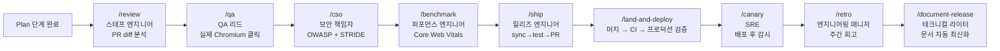
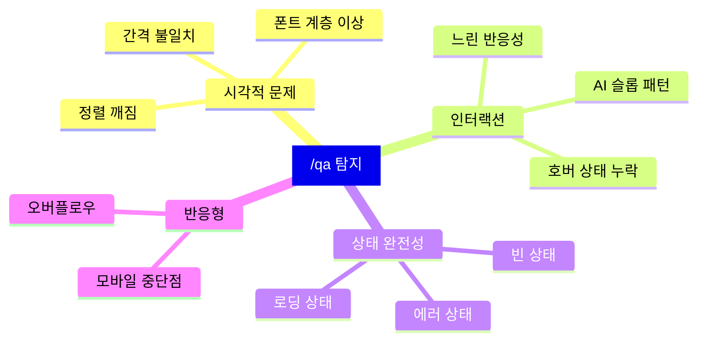
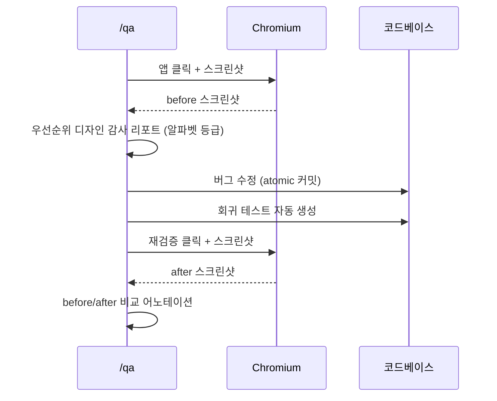
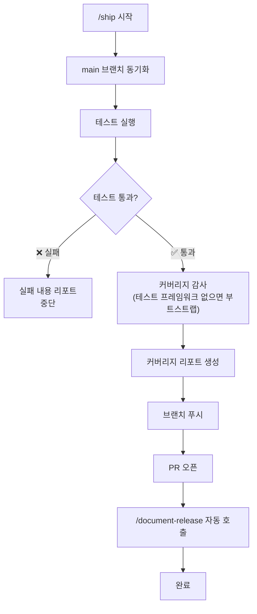
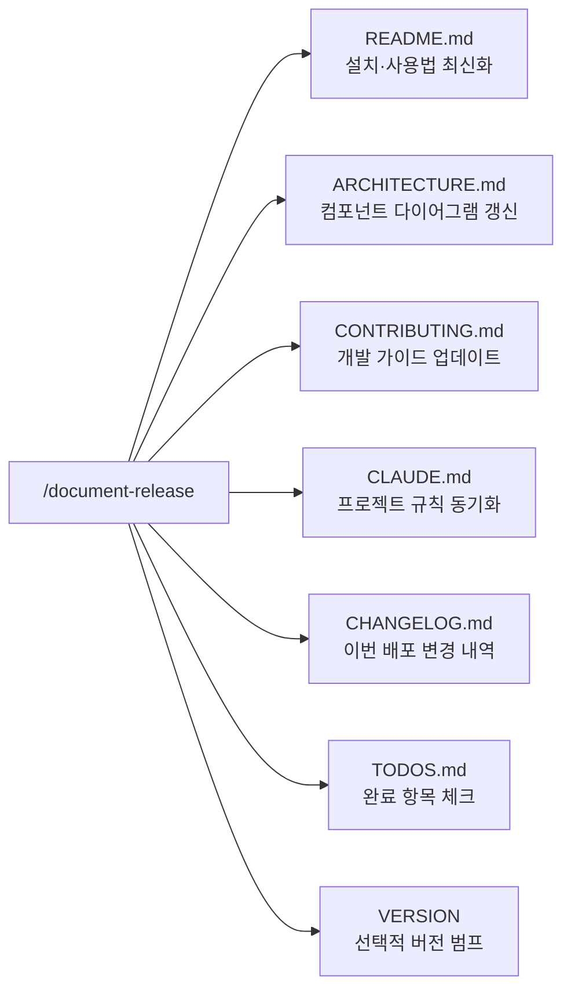
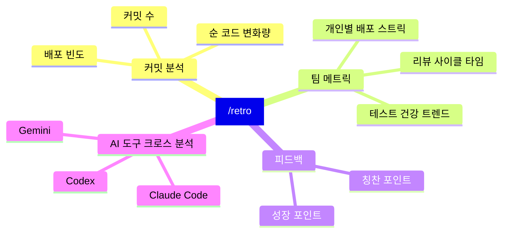

## Build, Test & Ship 단계 개요

Think & Plan이 끝난 뒤의 단계. 코드를 짜고, 실제 브라우저로 검증하고, 프로덕션에 올린다.



---

## 스킬 6: `/review` — 프로덕션 버그 헌터

**역할:** 스태프 엔지니어

base 브랜치 대비 diff를 분석해 **CI는 통과하지만 프로덕션에서 터지는 버그**를 찾는다.<a href="https://github.com/garrytan/gstack" target="_blank"><sup>[1]</sup></a>

### 탐지 항목

| 카테고리 | 탐지 내용 |
|---|---|
| 보안 | SQL injection, LLM 트러스트 바운더리 위반, 인증 우회 |
| 구조적 | 조건부 사이드 이펙트, 암묵적 상태 전이, 숨겨진 결합 |
| 성능 | N+1 쿼리, 불필요한 재렌더링, 메모리 누수 패턴 |
| 일관성 | API 응답 형식 불일치, 에러 처리 누락 |

### 동작 방식

```bash
/review           # 현재 브랜치 diff 전체 리뷰
/review --fix     # 명백한 이슈 자동 수정
```

명백한 이슈는 자동 수정. 판단이 필요한 이슈는 리포트만 생성하고 결정을 사용자에게 남긴다.

---

## 스킬 7: `/qa` — 실제 브라우저 QA

**역할:** QA 리드

gstack의 핵심 차별점. **실제 Playwright 기반 Chromium 브라우저**로 앱을 직접 클릭하고 스크린샷을 찍어 디자인까지 검증한다.

### 텍스트 기반 AI vs `/qa`

| | 텍스트 기반 AI | gstack `/qa` |
|---|---|---|
| 렌더링 확인 | ❌ 불가 | ✅ 실제 Chromium |
| 클릭 동작 | ❌ 불가 | ✅ 실제 클릭 (~100ms/커맨드) |
| 스크린샷 | ❌ 불가 | ✅ before/after 어노테이션 |
| 시각적 버그 | ❌ 코드만 분석 | ✅ 렌더링 결과 직접 확인 |
| 회귀 테스트 | 수동 | ✅ 버그 수정마다 자동 생성 |

### 탐지 항목



### 버그 수정 흐름



### `/qa-only` — 수정 없이 리포트만

```bash
/qa        # 버그 탐지 + 자동 수정 + 회귀 테스트 생성
/qa-only   # 버그 탐지 + 리포트만 (코드 변경 없음)
```

---

## 스킬 8: `/ship` — 릴리즈 엔지니어

**역할:** 릴리즈 엔지니어

sync → test → coverage audit → push → PR 오픈을 **한 커맨드**로 처리한다.

### 실행 순서



### 테스트 커버리지 목표

| 상태 | 동작 |
|---|---|
| 테스트 프레임워크 없음 | 처음부터 자동 부트스트랩 |
| 커버리지 < 기준 | 커버리지 감사 리포트 + 경고 |
| 커버리지 통과 | 정상 진행 |

> **목표: 100% 테스트 커버리지.** Vibe coding(감으로 짜기)을 yolo coding이 아닌 안전한 개발로 만든다.

### `/document-release` 자동 연동

`/ship`이 완료되면 자동으로 `/document-release`를 호출해 문서를 최신화한다. 별도로 실행할 필요 없다.

---

## 스킬 9: `/land-and-deploy` — 머지 후 프로덕션 검증

**역할:** 릴리즈 엔지니어 (머지 후)

PR 머지, CI 파이프라인 완료 대기, 프로덕션 헬스 검증을 순서대로 처리한다.

```bash
/land-and-deploy   # PR 머지 → CI 대기 → 프로덕션 헬스 체크 → 성공 선언
```

`/ship`이 PR을 열었다면, `/land-and-deploy`가 그것을 프로덕션까지 완전히 도달시킨다.

---

## 스킬 10: `/canary` — 배포 후 모니터링

**역할:** SRE (Site Reliability Engineer)

배포 직후 에러율과 회귀를 실시간으로 감시한다.

```bash
/canary            # 배포 후 모니터링 시작
/canary --window=30m  # 30분 감시 윈도우
```

문제 발생 시 알림. 롤백 여부 결정을 위한 데이터 제공.

---

## 스킬 11: `/benchmark` — 성능 베이스라인

**역할:** 퍼포먼스 엔지니어

모든 배포에 측정 가능한 성능 데이터를 붙인다.

### 측정 항목

| 메트릭 | 기준 |
|---|---|
| LCP (Largest Contentful Paint) | < 2.5초 (Good) |
| FID (First Input Delay) | < 100ms (Good) |
| CLS (Cumulative Layout Shift) | < 0.1 (Good) |
| TTFB (Time to First Byte) | < 800ms |
| 번들 사이즈 | 이전 배포 대비 변화량 |

배포마다 베이스라인을 기록해 성능 회귀를 추적한다.

---

## 스킬 12: `/document-release` — 자동 문서화

**역할:** 테크니컬 라이터 (없던 그 엔지니어)

코드가 바뀌면 문서도 바뀌어야 한다. `/document-release`가 이를 자동화한다.

### 업데이트 대상



동작 방식:
1. 프로젝트 내 모든 문서 파일 읽기
2. 현재 diff와 교차 참조
3. 드리프트된 모든 섹션 업데이트

`/ship`에 의해 자동 호출되지만 독립 실행도 가능:

```bash
/document-release          # 문서 갱신만
/document-release --bump   # 문서 갱신 + VERSION 범프
```

---

## 스킬 13: `/retro` — 주간 엔지니어링 회고

**역할:** 엔지니어링 매니저

커밋 히스토리, 작업 패턴, 코드 품질 메트릭을 분석해 팀 회고를 진행한다.

### 분석 항목



### 모드

```bash
/retro             # 현재 프로젝트 주간 회고
/retro global      # 모든 프로젝트 + 모든 AI 도구 크로스 분석
```

### 영구 히스토리

회고 결과는 `~/.gstack/retros/`에 저장된다. 시간이 지나면서 트렌드를 추적할 수 있다.

---

## Build, Test & Ship 단계 요약

| 스킬 | 필수 여부 | 실행 시점 | 주요 아웃풋 |
|---|---|---|---|
| `/review` | 선택 | PR 생성 전 | 버그 리포트 + 자동 수정 |
| `/qa` | 선택 (강권) | 머지 전 | 스크린샷 감사 + 자동 수정 + 회귀 테스트 |
| `/cso` | 선택 | 배포 전 | OWASP + STRIDE 감사 리포트 |
| `/benchmark` | 선택 | 배포마다 | Core Web Vitals 베이스라인 |
| `/ship` | 선택 | 배포 준비 시 | PR + 커버리지 리포트 |
| `/land-and-deploy` | 선택 | 머지 결정 시 | 프로덕션 헬스 검증 |
| `/canary` | 선택 | 배포 직후 | 에러율 + 회귀 감시 |
| `/document-release` | 자동 (`/ship` 연동) | 배포마다 | 전체 문서 최신화 |
| `/retro` | 선택 | 주 1회 | 팀 메트릭 + 트렌드 |

---

## 참고

<ol>
<li><a href="https://github.com/garrytan/gstack" target="_blank">[1] garrytan/gstack — GitHub</a></li>
<li><a href="https://www.toolworthy.ai/tool/gstack" target="_blank">[2] GStack Review 2026 — toolworthy.ai</a></li>
<li><a href="https://agentnativedev.medium.com/garry-tans-gstack-running-claude-like-an-engineering-team-392f1bd38085" target="_blank">[3] Garry Tan's gstack: Running Claude Like an Engineering Team — Agent Native</a></li>
<li><a href="https://www.marktechpost.com/2026/03/14/garry-tan-releases-gstack-an-open-source-claude-code-system-for-planning-code-review-qa-and-shipping/" target="_blank">[4] Garry Tan Releases gstack — MarkTechPost</a></li>
</ol>

---

## 관련 글

- [gstack 개요 — 전체 구조와 철학 →](/post/gstack-overview)
- [gstack Think & Plan 스킬 1~5 →](/post/gstack-skills-plan)
