# Jenkins + ArgoCD로 구현하는 K8s 무중단 배포

> 이 글은 "서버를 절대 끄지 않고 새 버전을 배포하는 방법"을 처음부터 설명합니다.

---

## 0. 왜 무중단 배포가 필요한가?

### 전통적인 배포 방식의 문제

예전 방식은 간단했습니다.

```
1. 서버 중지
2. 새 파일 복사
3. 서버 재시작
```

문제는 **2번과 3번 사이에 서비스가 중단**된다는 것입니다.

- 사용자는 "서버 점검 중" 화면을 보게 됩니다
- 쇼핑몰이라면 결제 중이던 사용자의 세션이 날아갑니다
- 매일 배포하는 서비스라면 매일 중단이 발생합니다

### 무중단 배포(Zero-Downtime Deployment)란?

**서비스를 멈추지 않고 새 버전으로 교체하는 기술**입니다.

핵심 아이디어는 "낡은 버전과 새 버전을 잠깐 동시에 실행한 뒤, 트래픽을 서서히 새 버전으로 옮기는 것"입니다.

```
[사용자 요청] → [로드밸런서]
                    ├── [구버전 서버 (처리 중)] ← 기존 요청 처리 완료까지 유지
                    └── [신버전 서버 (준비 완료)] ← 새 요청은 여기로
```

---

## 1. 이 글에서 다루는 기술 스택

이 글은 용어 정의를 본문에 길게 적기보다, 글을 읽는 흐름을 끊지 않도록 **용어를 탭/호버로 바로 설명**해주는 방식으로 정리합니다.

- PC: 단어에 마우스를 올리거나(hover), 키보드로 포커스하면 설명이 뜹니다.\n+- 모바일: 단어를 탭하면 설명이 뜹니다.

---

### 1-2. 전체 아키텍처 한눈에 보기

이 글에서 구현하는 시스템의 전체 흐름입니다.

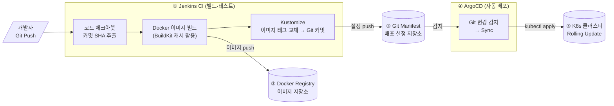

**흐름 요약:**

| 단계 | 담당                | 하는 일                                         |
| ---- | ------------------- | ----------------------------------------------- |
| ①    | Jenkins             | 코드를 Docker 이미지로 빌드 → 레지스트리에 푸시 |
| ②    | Docker Registry     | 빌드된 이미지를 버전별로 보관                   |
| ③    | Git (Manifest Repo) | "어떤 이미지를 배포할지" 설정 파일 보관         |
| ④    | ArgoCD              | Git 변경 감지 → K8s에 자동 반영                 |
| ⑤    | Kubernetes          | 무중단 롤링 업데이트로 새 Pod 교체              |

---

## 2. Jenkins 파이프라인 — CI 자동화

### Jenkinsfile이란?

Jenkins 파이프라인을 **코드로 정의한 파일**입니다. 프로젝트 루트에 `Jenkinsfile`을 두면, Jenkins가 이 파일을 읽어 자동으로 빌드·배포를 진행합니다.

```
pipeline {
    stages {
        stage('스테이지 이름') {  // 파이프라인의 각 단계
            steps { ... }        // 실제 실행할 명령어
        }
    }
}
```

파이프라인은 **스테이지(stage)** 단위로 실행됩니다. 아래에서 각 스테이지를 하나씩 살펴봅니다.

---

### 2-1. Checkout — 코드 가져오기 & 이미지 태그 결정

**Checkout**은 Jenkins가 Git 저장소에서 최신 코드를 가져오는(clone/pull) 단계입니다.

이 단계에서 중요한 것은 **이미지 태그를 무엇으로 정할지** 결정하는 것입니다.

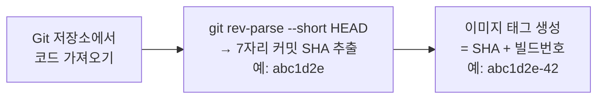

```groovy
stage('Checkout') {
    steps {
        checkout scm  // Git에서 코드 가져오기 (scm = Source Control Management)
        script {
            // git rev-parse --short HEAD: 현재 커밋의 짧은 SHA 가져오기
            env.GIT_COMMIT_SHORT = sh(
                script: "git rev-parse --short HEAD",
                returnStdout: true
            ).trim()

            // IMAGE_TAG 예시: abc1d2e-42 (SHA 7자리 + 빌드 번호)
            env.IMAGE_TAG = "${env.GIT_COMMIT_SHORT}-${env.BUILD_NUMBER}"

            // FULL_IMAGE_TAG 예시: docker.io/myorg/app:abc1d2e-42
            env.FULL_IMAGE_TAG = "${DOCKER_REGISTRY}/${IMAGE_NAME}:${env.IMAGE_TAG}"
        }
    }
}
```

**왜 커밋 SHA를 태그로 쓰나요?**

| 태그 방식      | 예시             | 장·단점                                         |
| -------------- | ---------------- | ----------------------------------------------- |
| `latest`       | `app:latest`     | 편하지만 "어느 버전인지" 알 수 없음             |
| 날짜           | `app:20260401`   | 날짜는 알지만 코드 버전과 연결 어려움           |
| 커밋 SHA       | `app:abc1d2e`    | 이미지만 보면 어느 코드 커밋인지 바로 추적 가능 |
| SHA + 빌드번호 | `app:abc1d2e-42` | 동일 커밋을 두 번 빌드해도 구별 가능 ✅         |

> **장애 발생 시:** 실행 중인 이미지 태그 `abc1d2e-42`를 보고 → Git에서 커밋 `abc1d2e`를 찾으면 → 어떤 코드 변경이 문제였는지 바로 확인 가능

---

### 2-2. Credentials 관리 — 비밀번호를 코드에 넣지 않는 방법

**Credentials(크리덴셜)**은 비밀번호, API 키, 인증서처럼 외부에 노출되면 안 되는 정보입니다.

코드에 직접 쓰면 안 되는 이유:

- Git에 올라가면 전 세계에 공개
- 해커가 DockerHub 계정을 탈취하면 이미지를 마음대로 올릴 수 있음

Jenkins는 **Credentials Store**에 이런 정보를 암호화해서 저장하고, 파이프라인 실행 시에만 환경변수로 주입합니다.

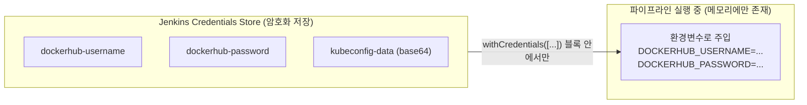

**Credentials 등록하는 방법**

```
Jenkins 대시보드 접속
→ Manage Jenkins (젠킨스 관리)
→ Manage Credentials (자격증명 관리)
→ Global credentials (전역)
→ Add Credentials (자격증명 추가)
  ├─ Kind: Secret text       ← 단순 텍스트 비밀값
  ├─ Secret: <비밀값 입력>
  └─ ID: dockerhub-username  ← 코드에서 이 ID로 참조
```

**파이프라인에서 사용하는 방법**

```groovy
stage('Parse Deploy Config') {
    steps {
        script {
            // withCredentials: 이 블록 안에서만 비밀값을 환경변수로 사용 가능
            // 블록 밖에서는 접근 불가 → 보안 유지
            withCredentials([
                string(credentialsId: 'dockerhub-username', variable: 'DOCKERHUB_USERNAME'),
                string(credentialsId: 'dockerhub-password', variable: 'DOCKERHUB_PASSWORD'),
                string(credentialsId: 'kubeconfig-data',    variable: 'KUBECONFIG_DATA')
            ]) {
                // pipeline 환경변수로 복사해 다른 stage에서도 사용
                env.DOCKERHUB_USERNAME = DOCKERHUB_USERNAME
                env.DOCKERHUB_PASSWORD = DOCKERHUB_PASSWORD
                env.KUBECONFIG_DATA    = KUBECONFIG_DATA
            }
        }
    }
}
```

---

### 2-3. kubeconfig 설정 — Jenkins가 K8s에 명령하는 방법

**kubeconfig**는 K8s 클러스터에 접속하기 위한 "열쇠"입니다. 클러스터 주소, 인증서, 토큰이 담겨 있습니다.

Jenkins 컨테이너는 매 빌드마다 새로 시작되기 때문에, kubeconfig를 매번 파일로 복원해야 합니다.

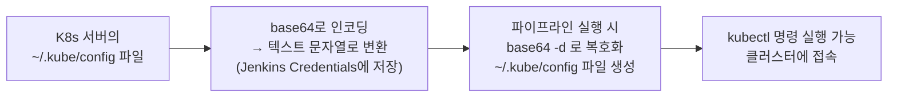

**K8s 서버에서 kubeconfig 준비하는 방법**

```bash
# 1. K8s 서버에서 kubeconfig 파일 확인
cat ~/.kube/config

# 2. server 주소가 127.0.0.1이면 Jenkins가 접근할 수 없음 → 실제 서버 IP로 변경
# server: https://127.0.0.1:6443  (변경 전)
# server: https://192.168.1.100:6443  (변경 후 - Jenkins가 접근 가능한 IP)

# 3. base64로 인코딩 (-w 0: 줄바꿈 없이 한 줄로)
base64 -w 0 ~/.kube/config

# 4. 출력된 긴 문자열을 Jenkins Credentials에 'kubeconfig-data' ID로 저장
```

**파이프라인에서 kubeconfig 복원**

```groovy
stage('Configure kubeconfig') {
    steps {
        script {
            sh """
                # .kube 폴더 생성 (없으면 오류)
                mkdir -p \$HOME/.kube

                # base64 -d: base64 디코딩 → 원래 파일 내용으로 복원
                echo "${env.KUBECONFIG_DATA}" | base64 -d > \$HOME/.kube/config

                # 파일 권한 600: 소유자만 읽기/쓰기 (보안상 필수)
                chmod 600 \$HOME/.kube/config

                # 연결 확인
                kubectl cluster-info   # 클러스터 정보 출력
                kubectl get nodes      # 연결된 서버(노드) 목록 출력
            """
        }
    }
}
```

---

### 2-4. 인프라 분리 배포 — DB와 앱은 왜 따로 배포하나?

**핵심 원칙**: MySQL(데이터베이스)과 Redis(캐시)는 **데이터를 가지고 있는 상태 저장(Stateful) 서비스**이므로, 앱 배포와 분리합니다.

**왜 분리해야 하나요?**

앱은 매 커밋마다 새 버전으로 교체합니다. 하지만 MySQL은 아무 때나 재시작하면 안 됩니다.

- 데이터 손실 위험
- 복제(Replication) 구성이 깨질 수 있음
- 초기화 순서가 중요함

따라서 파이프라인에서 "DB가 이미 배포되어 있으면 건너뛴다"는 로직을 넣습니다.

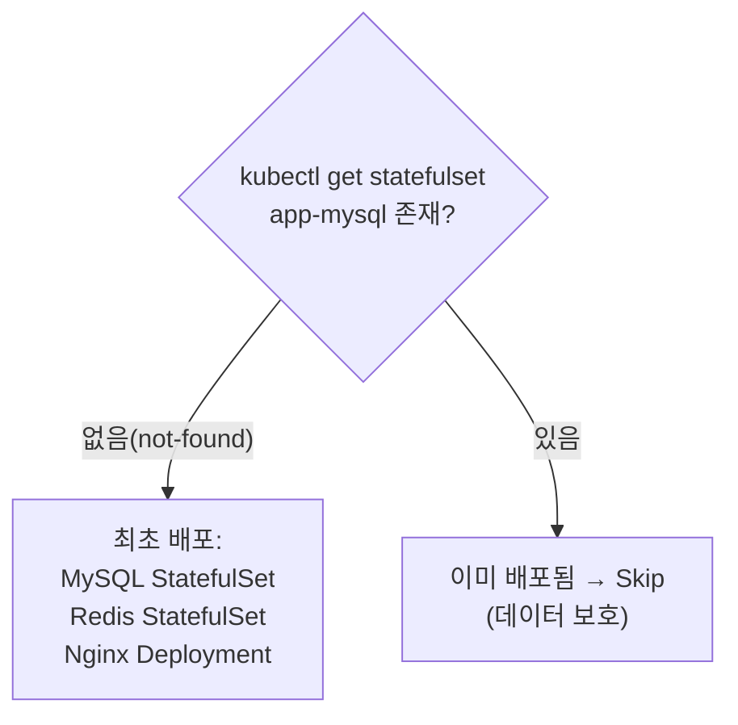

**Deployment vs StatefulSet — 언제 무엇을 쓰나?**

| 비교 항목         | Deployment                   | StatefulSet                          |
| ----------------- | ---------------------------- | ------------------------------------ |
| **Pod 이름**      | 랜덤 (예: `app-7f9b-abc12`)  | 고정 순서 (예: `mysql-0`, `mysql-1`) |
| **네트워크 주소** | Pod가가 재시작되면 IP가 바뀜 | `mysql-0.mysql.ns.svc` 고정 DNS      |
| **데이터 저장**   | Pod별 전용 볼륨 없음         | Pod마다 PVC(디스크) 자동 생성        |
| **시작 순서**     | 동시에 시작                  | 0번부터 순서대로 시작                |
| **주 사용처**     | 웹 앱, API 서버              | MySQL, Redis, Elasticsearch 등       |

**왜 MySQL은 고정 DNS가 필요한가?**

MySQL을 Primary 1대 + Replica 2대로 구성하면, Replica는 Primary의 주소를 설정 파일에 써야 합니다.

```yaml
# MySQL Replica 설정 예시
master_host: mysql-0.mysql.databases.svc.cluster.local # 고정 주소
```

Deployment라면 Pod가 재시작될 때마다 IP가 바뀌어 이 설정이 깨집니다. StatefulSet은 `mysql-0`이라는 이름(DNS)이 고정되므로 안전합니다.

**MySQL StatefulSet YAML 구조**

```yaml
apiVersion: apps/v1
kind: StatefulSet
metadata:
  name: app-mysql
  namespace: databases # 앱과 다른 네임스페이스에 분리
spec:
  serviceName: "mysql" # Headless Service 이름 (DNS 생성에 필요)
  replicas: 1 # MySQL 인스턴스 수
  selector:
    matchLabels:
      app: mysql
  template:
    spec:
      containers:
        - name: mysql
          image: mysql:8.0
          ports:
            - containerPort: 3306
          env:
            - name: MYSQL_ROOT_PASSWORD
              valueFrom:
                secretKeyRef:
                  name: mysql-secret # Secret에서 비밀번호 가져오기
                  key: password
          volumeMounts:
            - name: mysql-data
              mountPath: /var/lib/mysql # 데이터 저장 경로

  # volumeClaimTemplates: Pod가 생성될 때 자동으로 PVC(디스크)도 함께 생성
  volumeClaimTemplates:
    - metadata:
        name: mysql-data
      spec:
        accessModes: ["ReadWriteOnce"] # 하나의 노드에서만 읽기/쓰기
        resources:
          requests:
            storage: 10Gi # 10GB 요청
```

**Headless Service란?**

일반 Service는 하나의 고정 IP를 제공합니다. 하지만 StatefulSet에서는 각 Pod에 직접 접근해야 할 때가 있습니다.

Headless Service(`clusterIP: None`)는 고정 IP 없이 각 Pod의 DNS 레코드만 만들어줍니다.

```yaml
apiVersion: v1
kind: Service
metadata:
  name: mysql
  namespace: databases
spec:
  clusterIP: None # Headless: 고정 IP 없음
  selector:
    app: mysql
  ports:
    - port: 3306

# 결과: 각 Pod에 DNS 주소 생성
# mysql-0.mysql.databases.svc.cluster.local
# mysql-1.mysql.databases.svc.cluster.local
```

---

### 2-5. Docker Buildx 빌드 & 푸시

**Docker Buildx**는 기본 `docker build`의 확장 버전입니다. 여러 CPU 아키텍처(AMD64, ARM64 등)용 이미지를 동시에 빌드하고, BuildKit의 고급 캐싱 기능을 활용할 수 있습니다.

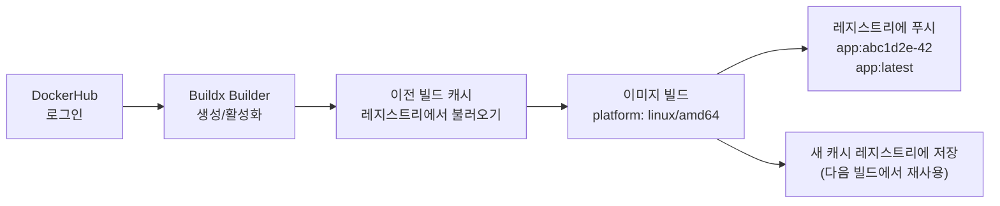

```groovy
// Stage 1: Docker Hub 로그인
stage('Docker Login') {
    steps {
        script {
            // --password-stdin: 비밀번호를 표준 입력으로 전달 (보안상 권장)
            sh """
                echo "${env.DOCKERHUB_PASSWORD}" | docker login ${DOCKER_REGISTRY} \\
                    -u "${env.DOCKERHUB_USERNAME}" \\
                    --password-stdin
            """
        }
    }
}

// Stage 2: Docker Buildx 설정
stage('Set up Docker Buildx') {
    steps {
        script {
            sh '''
                # Buildx 버전 확인, 없으면 설치
                docker buildx version || docker buildx install

                # 'builder'라는 이름의 Buildx Builder 생성
                # docker-container 드라이버: BuildKit 기능 전체 사용 가능
                docker buildx create --use --name builder --driver docker-container || true

                # Builder 초기화 및 상태 확인
                docker buildx inspect --bootstrap
            '''
        }
    }
}

// Stage 3: 이미지 빌드 & 푸시
stage('Build and Push with Cache') {
    steps {
        script {
            sh """
                docker buildx build \\
                    --platform linux/amd64 \\         # AMD64 아키텍처용 이미지 빌드
                    --push \\                          # 빌드 완료 즉시 레지스트리에 업로드
                    --tag ${env.FULL_IMAGE_TAG} \\     # 예: docker.io/myorg/app:abc1d2e-42
                    --tag ${env.LATEST_IMAGE_TAG} \\   # 예: docker.io/myorg/app:latest
                    --cache-from type=registry,ref=${DOCKER_REGISTRY}/${IMAGE_NAME}:buildcache \\
                    --cache-to   type=registry,ref=${DOCKER_REGISTRY}/${IMAGE_NAME}:buildcache,mode=max \\
                    .
            """
        }
    }
}
```

**BuildKit 레이어 캐시란?**

Dockerfile의 각 명령어는 **레이어(Layer)**를 만듭니다. 레이어가 변경되지 않으면 이전 빌드의 캐시를 재사용합니다.

```dockerfile
# 자주 변하지 않는 것을 먼저 (캐시 유지)
COPY package.json package-lock.json ./
RUN npm ci              # package.json이 안 바뀌면 캐시 사용 → 빠름

# 자주 바뀌는 소스 코드는 나중에
COPY . .
RUN npm run build
```

```
소스 코드 변경 시:
  Layer 1 (FROM node:18)    → 캐시 재사용 ⚡
  Layer 2 (COPY package.json)→ 캐시 재사용 ⚡  (package.json 변경 없음)
  Layer 3 (RUN npm ci)       → 캐시 재사용 ⚡  (의존성 재설치 불필요)
  Layer 4 (COPY . .)         → 새로 빌드      (소스 변경됨)
  Layer 5 (RUN npm build)    → 새로 빌드
```

`--cache-from/to type=registry`: CI 서버가 매번 새 컨테이너로 실행되어도, 레지스트리에 캐시를 저장·불러와서 빠른 빌드 유지

---

### 2-6. 이전 버전 저장 — 롤백 기준점 확보

새 버전 배포 전에 현재 실행 중인 이미지 태그를 저장해둡니다. 배포 실패 시 이 값으로 롤백합니다.

```groovy
stage('Save Previous Version') {
    steps {
        script {
            try {
                // kubectl get deployment: 현재 배포 정보 조회
                // -o jsonpath: JSON 결과에서 특정 값만 추출 (여기서는 이미지 주소)
                env.PREVIOUS_IMAGE = sh(
                    script: """
                        kubectl get deployment web -n ${K8S_NAMESPACE} \\
                            -o jsonpath='{.spec.template.spec.containers[0].image}' 2>/dev/null || echo ""
                    """,
                    returnStdout: true
                ).trim()
                echo "롤백 기준점: ${env.PREVIOUS_IMAGE}"
            } catch (Exception e) {
                env.PREVIOUS_IMAGE = ""  // 최초 배포면 이전 버전 없음
            }
        }
    }
}
```

---

### 2-7. Kustomize로 매니페스트 업데이트 — GitOps의 핵심

**매니페스트(Manifest)**는 K8s에게 "이렇게 배포해줘"라고 알려주는 YAML 파일입니다.

GitOps에서는 이 파일을 Git 저장소에 보관하고, 변경하면 ArgoCD가 자동으로 클러스터에 반영합니다.

**왜 이미지 태그만 바꾸나요?**

매번 YAML 전체를 새로 쓰면 실수가 생깁니다. Kustomize는 기본 설정(base)을 그대로 두고, 환경별로 "이 값만 덮어써"라는 방식으로 관리합니다.

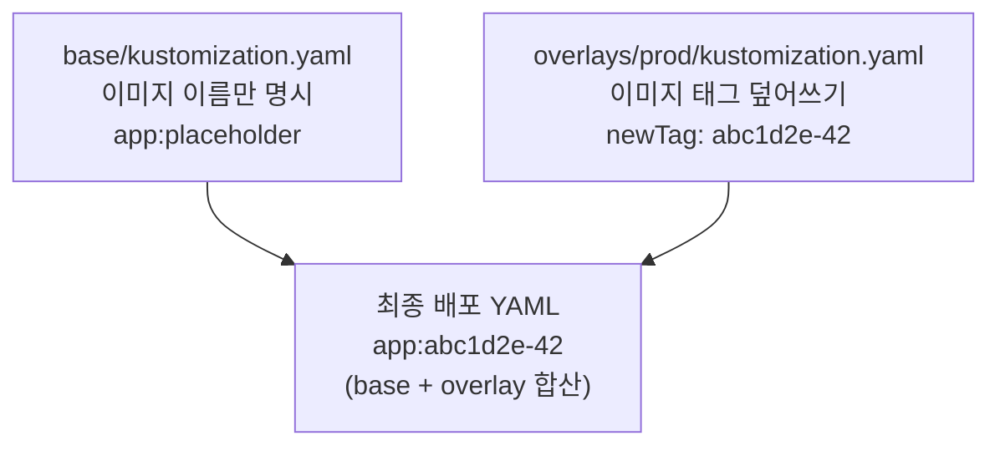

**디렉토리 구조**

```
k8s/
├── base/
│   ├── kustomization.yaml   ← 기본 설정 (이미지 이름만)
│   └── deployment.yaml      ← Deployment 기본 구조
└── overlays/
    ├── dev/
    │   └── kustomization.yaml  ← 개발 환경용 (replicas: 1)
    └── prod/
        └── kustomization.yaml  ← 운영 환경용 (replicas: 3)
                                   Jenkins가 newTag 값을 여기 교체
```

**overlays/prod/kustomization.yaml**

```yaml
apiVersion: kustomize.config.k8s.io/v1beta1
kind: Kustomization

bases:
  - ../../base # base 디렉토리를 기반으로 사용

namespace: app-prod

images:
  - name: app # base에서 사용한 이미지 이름
    newName: docker.io/myorg/app # 실제 레지스트리 주소
    newTag: "abc1d2e-42" # ← Jenkins가 이 값을 새 이미지 태그로 교체
```

**Jenkins에서 태그 교체 & Git 커밋**

```groovy
stage('Update K8s Manifest') {
    steps {
        script {
            sh """
                # Git 커밋 작성자 설정 (Jenkins가 커밋하는 것)
                git config user.name  "Jenkins"
                git config user.email "jenkins@example.com"

                # sed 명령: kustomization.yaml에서 newTag 줄을 새 태그로 교체
                # sed -i 's|찾을 패턴|교체할 값|g' 파일명
                sed -i 's|newTag:.*|newTag: ${env.IMAGE_TAG}|g' \\
                    k8s/overlays/prod/kustomization.yaml

                # 변경된 파일만 커밋
                git add k8s/overlays/prod/kustomization.yaml
                git commit -m "ci: update image tag to ${env.IMAGE_TAG} [skip ci]"
                # [skip ci]: 이 커밋은 다시 Jenkins를 실행하지 않도록 하는 신호
                # 없으면: git push → Jenkins 재실행 → git push → Jenkins 재실행 → 무한 루프!

                git push origin ${K8S_BRANCH}
            """
        }
    }
}
```

> **[skip ci] 키워드가 없으면 어떻게 되나요?**
> Jenkins가 Git 저장소를 감시하다가, 새 커밋이 생기면 파이프라인을 실행합니다.
> 그런데 파이프라인 자체가 Git에 커밋을 만드니까, 다시 파이프라인이 실행됩니다.
> `[skip ci]`는 "이 커밋으로 CI를 돌리지 마라"는 약속된 신호입니다.

---

## 3. ArgoCD — GitOps 기반 자동 배포

### 3-1. ArgoCD가 하는 일

ArgoCD는 **Git 저장소를 지속적으로 감시**합니다. Git의 상태(원하는 상태)와 K8s 클러스터의 실제 상태가 다르면 자동으로 맞춰줍니다.

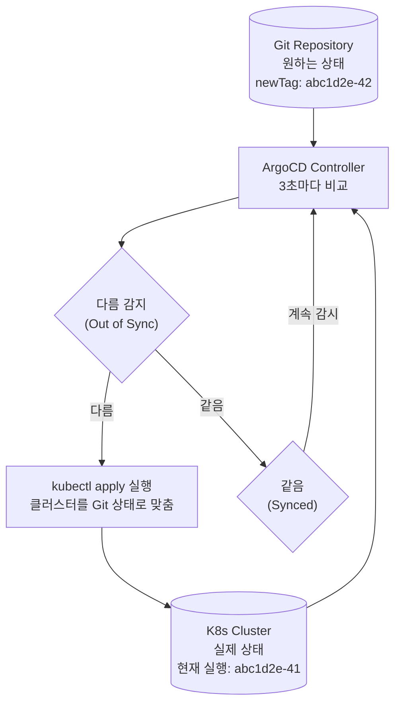

**왜 "Git이 유일한 진실(Single Source of Truth)"인가?**

ArgoCD 없이 직접 `kubectl` 명령으로 배포하면:

- "누가 언제 어떻게 바꿨는지" 기록이 없음
- 서버가 망가지면 어디서부터 복구해야 할지 막막
- 개발·운영 환경이 언제 달라졌는지 모름

Git에 모든 배포 설정을 두면:

- 모든 변경이 commit으로 기록 → "언제 누가 뭘 바꿨는지" 추적 가능
- Git에서 이전 커밋으로 revert하면 바로 이전 상태로 복구
- PR 리뷰를 통해 배포 전 검토 가능

**직접 kubectl로 바꾸면 어떻게 되나요?**

ArgoCD의 `selfHeal: true` 옵션이 켜져 있으면, kubectl로 직접 수정해도 ArgoCD가 3초 안에 Git 상태로 되돌립니다.

```
개발자가 kubectl set image ... 실행 (직접 수정)
  → ArgoCD가 감지: "Git과 다름" (Out of Sync)
  → ArgoCD가 자동 복구: Git의 설정으로 되돌림
```

### 3-2. ArgoCD Application 설정

ArgoCD에 "이 Git 저장소의 이 경로를 감시해서 이 클러스터에 배포해라"를 알려주는 설정 파일입니다.

```yaml
apiVersion: argoproj.io/v1alpha1
kind: Application # ArgoCD의 커스텀 리소스 타입
metadata:
  name: app-prod
  namespace: argocd # ArgoCD 자체가 설치된 네임스페이스
spec:
  project: default

  # source: 어디서 설정 파일을 가져올지
  source:
    repoURL: https://github.com/your-org/k8s-manifests.git
    targetRevision: main # 감시할 브랜치
    path: k8s/overlays/prod # 저장소 내 경로

  # destination: 어느 클러스터·네임스페이스에 배포할지
  destination:
    server: https://kubernetes.default.svc # 현재 클러스터
    namespace: app-prod

  # syncPolicy: 동기화 정책
  syncPolicy:
    automated:
      prune: true # Git에서 삭제된 리소스를 클러스터에서도 자동 삭제
      selfHeal: true # kubectl 직접 수정 시 Git 상태로 자동 복구
    syncOptions:
      - CreateNamespace=true # 네임스페이스가 없으면 자동 생성
    retry:
      limit: 5 # 실패 시 최대 5번 재시도
      backoff:
        duration: 5s # 처음 재시도는 5초 후
        factor: 2 # 재시도마다 2배씩 대기 시간 증가 (5s → 10s → 20s...)
        maxDuration: 3m # 최대 3분까지만
```

**Auto-Sync vs Manual Sync**

|               | Auto-Sync (자동)                  | Manual Sync (수동)                   |
| ------------- | --------------------------------- | ------------------------------------ |
| **동작 방식** | Git 변경 감지 즉시 자동 배포      | 운영자가 직접 ArgoCD UI/CLI에서 실행 |
| **적합 환경** | 개발·스테이징 환경                | 프로덕션 환경                        |
| **장점**      | 완전 자동화, 빠른 반영            | 배포 전 사람이 검토 가능             |
| **단점**      | 잘못된 코드가 바로 배포될 수 있음 | 배포가 느림, 사람 개입 필요          |

---

## 4. K8s 무중단 배포 — Rolling Update 상세

### 4-1. Rolling Update란?

**롤링 업데이트(Rolling Update)**는 "기존 Pod을 한 번에 다 끄지 않고, 하나씩 새 버전으로 교체하는 방식"입니다.

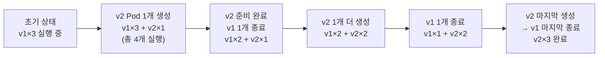

이 과정에서 서비스가 중단되지 않으려면, **항상 Ready 상태의 Pod가 요청을 처리할 수 있어야** 합니다.

### 4-2. maxSurge & maxUnavailable — 교체 속도 조절

| 파라미터         | 의미                                        | 예시                                   |
| ---------------- | ------------------------------------------- | -------------------------------------- |
| `maxSurge`       | 원래 Pod 수보다 얼마나 더 많이 만들 수 있나 | `1` → replicas 3이면 최대 4개까지 허용 |
| `maxUnavailable` | 원래 Pod 수보다 얼마나 줄어들 수 있나       | `0` → 항상 3개 유지 (무중단 보장)      |

**무중단 설정: `maxUnavailable: 0`**

```yaml
strategy:
  type: RollingUpdate
  rollingUpdate:
    maxSurge: 1 # replicas(3)+1 = 4개까지 허용 (신규 Pod 생성 여유)
    maxUnavailable: 0 # 0개: 언제나 replicas만큼 정상 Pod 유지 → 무중단 보장
```

> `maxSurge: 0, maxUnavailable: 0`은 불가능합니다. 교체 자체가 진행될 수 없기 때문입니다.

**속도 vs 안정성 트레이드오프**

```
replicas: 3 기준

maxSurge: 1, maxUnavailable: 0 (무중단, 느림)
  → 한 번에 1개씩 교체
  → 항상 최소 3개 정상 운영
  → 배포 시간 ∝ replicas 수

maxSurge: 25%, maxUnavailable: 25% (빠름, 일시적 축소 허용)
  → 동시에 여러 개 교체 (25% 줄어들어도 OK)
  → 배포 빠르지만, 순간적으로 용량 줄어듦
```

### 4-3. Readiness Probe — 무중단 배포의 실질적 보증

**Probe(프로브)**는 K8s가 Pod의 상태를 확인하기 위해 주기적으로 보내는 "안녕하세요?" 신호입니다.

**Readiness Probe**가 없으면 어떻게 되나요?

K8s는 컨테이너가 시작됐다는 것만 알고, "앱이 실제로 요청을 처리할 준비가 됐는지"는 모릅니다.

```
Readiness Probe 없을 때:
  컨테이너 시작 (5초)
  → K8s: "시작됐네? 트래픽 보내!"
  → 앱: "아직 DB 연결 중인데..." → 오류 발생 ❌

Readiness Probe 있을 때:
  컨테이너 시작 (5초)
  → K8s: "준비됐어?" → /health/ready 호출
  → 앱: "DB 연결 중... (503 반환)"
  → K8s: "아직이구나. 트래픽 안 보냄"
  → 10초 후 다시 확인 → "OK 이제 됐어! 트래픽 보냄" ✅
```

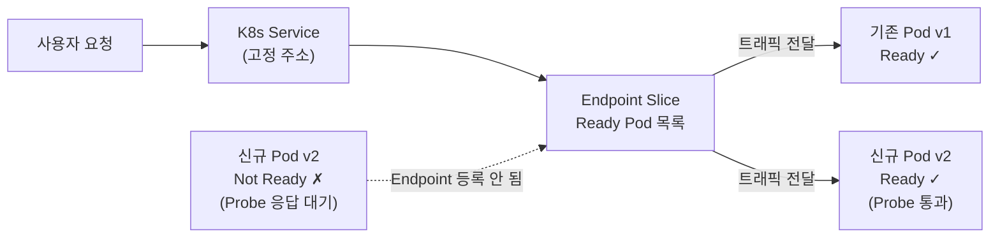

**Probe 3종 역할 비교**

| Probe 종류       | 실패하면?                                                | 언제 쓰나?                                          |
| ---------------- | -------------------------------------------------------- | --------------------------------------------------- |
| `readinessProbe` | Service Endpoint에서 제외 (Pod은 유지, 트래픽만 안 보냄) | 앱이 요청 처리 준비가 됐는지 확인                   |
| `livenessProbe`  | Pod을 강제 재시작                                        | 앱이 응답 불가 상태(교착, 무한루프)에 빠졌는지 감지 |
| `startupProbe`   | livenessProbe 비활성화 (시작 시간만큼 여유)              | JVM처럼 시작이 느린 앱 보호                         |

### 4-4. 완전한 Deployment YAML — 실전 설정

```yaml
apiVersion: apps/v1
kind: Deployment
metadata:
  name: app
  namespace: app-prod
spec:
  replicas: 3 # 항상 3개의 Pod 유지

  # ── 배포 전략 ────────────────────────────────
  strategy:
    type: RollingUpdate
    rollingUpdate:
      maxSurge: 1 # replicas+1까지 허용 → 최대 4개
      maxUnavailable: 0 # 항상 3개 이상 유지 → 무중단 보장

  # Ready 후 추가 안정화 시간
  # 0이면 Readiness Probe 통과 즉시 트래픽 받음
  # 예열(warmup)이 필요한 앱이면 10~30 권장
  minReadySeconds: 10

  # 이 시간(초) 내에 배포가 완료 안 되면 실패 처리
  # 기본 600초(10분). CI/CD에서 실패 여부 판단에 사용
  progressDeadlineSeconds: 600

  # 롤백을 위해 이전 ReplicaSet 몇 개 보관할지
  # 이전 10개 버전으로 롤백 가능
  revisionHistoryLimit: 10

  selector:
    matchLabels:
      app: myapp # 이 라벨을 가진 Pod을 관리

  template:
    metadata:
      labels:
        app: myapp
    spec:
      # SIGTERM 신호 후 Pod가 강제 종료되기까지 대기 시간
      # preStop 시간보다 반드시 길게 설정
      terminationGracePeriodSeconds: 30

      containers:
        - name: app
          image: docker.io/myorg/app:abc1d2e-42
          imagePullPolicy: IfNotPresent # 이미지가 이미 있으면 다운로드 안 함

          ports:
            - name: http # 포트에 이름 붙이기 → Probe에서 이름으로 참조 가능
              containerPort: 8080

          # ── 준비 확인 (무중단 배포 핵심) ──────
          readinessProbe:
            httpGet:
              path: /health/ready # 이 경로로 HTTP GET 요청
              port: http # 위에서 정의한 'http' 포트
            initialDelaySeconds: 10 # 컨테이너 시작 후 10초 기다렸다가 첫 체크
            periodSeconds: 5 # 이후 5초마다 체크
            failureThreshold: 3 # 3번 연속 실패하면 Not Ready로 판정

          # ── 생존 확인 (응답 불가 상태 감지) ───
          livenessProbe:
            httpGet:
              path: /health/live
              port: http
            initialDelaySeconds: 30 # readiness보다 늦게 시작 (초기화 실패 방지)
            periodSeconds: 10
            failureThreshold: 3 # 3번 연속 실패하면 Pod 재시작

          # ── 우아한 종료 (Graceful Shutdown) ───
          lifecycle:
            preStop:
              exec:
                # Pod 종료 신호(SIGTERM)를 받으면 즉시 종료하지 않고
                # 15초 대기 → 처리 중인 요청이 완료될 시간 확보
                command: ["/bin/sh", "-c", "sleep 15"]

          # ── 리소스 제한 ────────────────────────
          resources:
            requests: # Pod 실행에 필요한 최소 자원 (스케줄링 기준)
              cpu: 200m # 200 밀리코어 = 0.2 CPU
              memory: 256Mi # 256 MiB
            limits: # Pod가 사용할 수 있는 최대 자원
              cpu: 500m
              memory: 512Mi
```

**CPU 단위 m(밀리코어)이란?**

- `1000m` = CPU 1개 전체
- `500m` = CPU 반 개
- `200m` = CPU 0.2개

일반적으로 요청(requests)은 낮게, 한계(limits)는 버스트 허용을 위해 높게 설정합니다.

**Graceful Shutdown 흐름**

```
1. K8s가 Pod에 종료 신호(SIGTERM) 전송
2. preStop 훅 실행: sleep 15 (15초 대기)
   ← 이 15초 동안 새 요청은 안 오고, 처리 중인 요청만 마무리
3. 15초 후 앱이 SIGTERM 받아 종료 처리 시작
4. terminationGracePeriodSeconds(30초) 지나면 강제 종료(SIGKILL)

총 유예 시간: 최대 30초 (terminationGracePeriodSeconds)
preStop 시간(15) + 앱 종료 시간이 30초보다 짧아야 함
```

---

## 5. 롤백 전략 — 장애 시 빠른 복구

### 5-1. 롤백이 왜 쉬운가?

K8s는 배포할 때마다 **ReplicaSet**이라는 스냅샷을 남겨둡니다. 롤백은 이전 스냅샷으로 되돌아가는 것입니다.

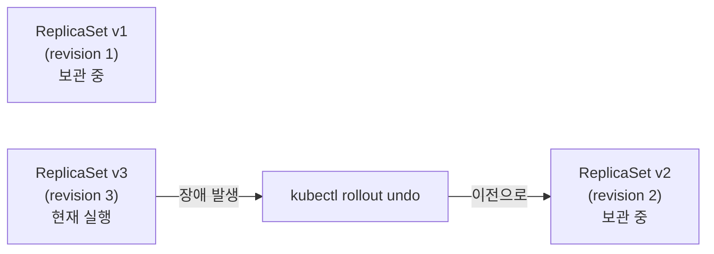

### 5-2. minReadySeconds & progressDeadlineSeconds

이 두 파라미터는 배포 타이밍과 실패 감지를 제어합니다.

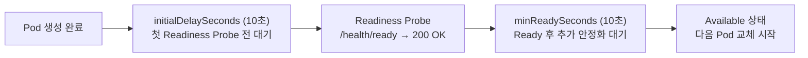

| 파라미터                  | 역할                                                         | 기본값 | 설정 권장              |
| ------------------------- | ------------------------------------------------------------ | ------ | ---------------------- |
| `minReadySeconds`         | Ready 후 추가 안정화 대기 시간                               | 0초    | 예열 필요 앱: 10~30초  |
| `progressDeadlineSeconds` | 전체 배포 제한 시간. 초과 시 `ProgressDeadlineExceeded` 오류 | 600초  | Probe 설정에 맞게 조정 |

### 5-3. kubectl rollout 명령어 완전 정리

```bash
# 배포 진행 상황 실시간 확인
# "successfully rolled out" 메시지가 나올 때까지 대기
kubectl rollout status deployment/app -n app-prod

# 배포 이력 조회 (몇 번째 revision이 있는지)
kubectl rollout history deployment/app -n app-prod
# REVISION  CHANGE-CAUSE
# 1         최초 배포
# 2         v1.1.0 업데이트
# 3         v1.2.0 업데이트 (현재)

# 특정 revision의 상세 내용 확인 (어떤 이미지였는지)
kubectl rollout history deployment/app -n app-prod --revision=2

# 직전 버전으로 즉시 롤백 (가장 많이 쓰임)
kubectl rollout undo deployment/app -n app-prod

# 특정 revision으로 롤백
kubectl rollout undo deployment/app -n app-prod --to-revision=1

# 배포 일시 중지 (canary 검증 시: 일부만 배포하고 잠깐 멈춤)
kubectl rollout pause  deployment/app -n app-prod

# 배포 재개
kubectl rollout resume deployment/app -n app-prod
```

> **rollout undo는 새 revision을 만든다**
> revision 3에서 `undo`하면 revision 1의 내용으로 revision 4가 생성됩니다.
> 이전 revision은 삭제되지 않고 history에 남습니다.

### 5-4. Jenkins 자동 롤백

```groovy
post {
    success {
        echo "✅ 배포 성공! 이미지: ${env.FULL_IMAGE_TAG}"
    }
    failure {
        script {
            echo "❌ 배포 실패! 롤백 시작..."
            sh """
                # 직전 버전으로 즉시 롤백
                kubectl rollout undo deployment/web -n ${K8S_NAMESPACE}

                # 롤백 완료까지 대기 (최대 5분)
                kubectl rollout status deployment/web -n ${K8S_NAMESPACE} --timeout=5m
            """
        }
    }
}
```

---

## 6. 배포 이력 추적 — 언제 무엇이 배포됐나?

GitOps의 강점: **모든 배포가 Git 커밋으로 기록**됩니다.

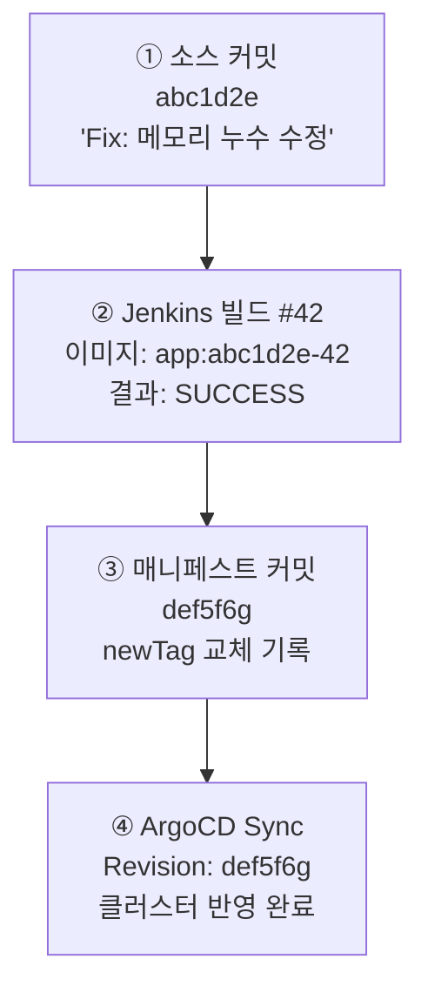

```bash
# 매니페스트 저장소에서 배포 이력 확인
git log --oneline overlays/prod/kustomization.yaml
# def5f6g ci: update image to abc1d2e-42
# bcd4e5f ci: update image to aaa9b8c-41
# ...

# 특정 커밋에서 어떤 이미지 태그로 바뀌었는지 확인
git show def5f6g

# 이미지 태그 변경 이력만 추출
git log -p overlays/prod/kustomization.yaml | grep "newTag:"
# -newTag: "aaa9b8c-41"
# +newTag: "abc1d2e-42"

# ArgoCD CLI로 배포 이력 확인
argocd app history app-prod
# ID  DATE                          REVISION
# 0   2026-04-01 10:30:22 +0000 UTC main (def5f6g)
# 1   2026-03-31 14:15:10 +0000 UTC main (bcd4e5f)
```

**좋은 커밋 메시지 예시**

```
ci: update app image to abc1d2e-42

Triggered by: Jenkins #42
Source Commit: abc1d2e (Fix: 메모리 누수 수정)
Image: docker.io/myorg/app:abc1d2e-42
Environment: prod
Time: 2026-04-01T10:30:00Z
```

"언제 누가 무엇을 왜 배포했는지"가 한눈에 보입니다.

---

## 7. 인프라 분리 설계 — Namespace로 계층 나누기

### Namespace란?

K8s 클러스터 안에서 리소스를 **논리적으로 격리**하는 공간입니다. 마치 하나의 사무실 건물 안에 부서별로 방을 나눈 것과 같습니다.

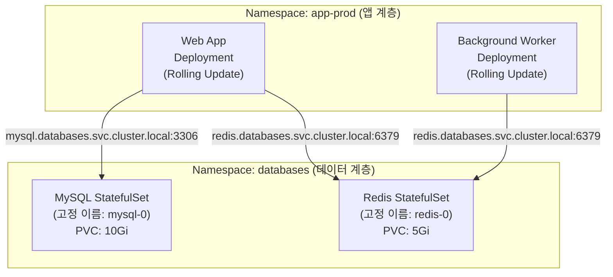

**왜 Namespace를 분리하나요?**

| 이유            | 설명                                                     |
| --------------- | -------------------------------------------------------- |
| **배포 독립성** | 앱 업데이트 시 DB는 건드리지 않음                        |
| **권한 분리**   | 앱 개발자는 `app-prod`만 접근, DBA는 `databases`만 접근  |
| **리소스 관리** | Namespace별로 CPU·메모리 사용량 제한 가능                |
| **보안**        | NetworkPolicy로 `app-prod`에서 `databases`로만 접근 허용 |

**Namespace 간 통신 주소 (FQDN)**

FQDN(Fully Qualified Domain Name, 완전한 도메인 이름)은 Namespace를 포함한 전체 DNS 주소입니다.

```
형식: [서비스 이름].[네임스페이스].svc.cluster.local:[포트]

예시:
  mysql.databases.svc.cluster.local:3306
  redis.databases.svc.cluster.local:6379

같은 Namespace 내에서는 서비스 이름만으로 접근 가능:
  mysql:3306
```

| 계층            | K8s 리소스        | 배포 빈도             | 데이터                |
| --------------- | ----------------- | --------------------- | --------------------- |
| **데이터 계층** | StatefulSet + PVC | 초기 1회 (잘 안 바꿈) | 영속 저장             |
| **앱 계층**     | Deployment        | 매 커밋마다           | Stateless (상태 없음) |

---

## 8. 전체 파이프라인 타이밍

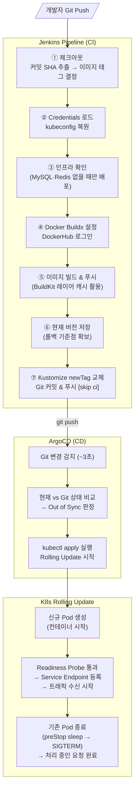

---

## 9. 핵심 개념 요약

| 개념                  | 한 줄 정리                                   |
| --------------------- | -------------------------------------------- |
| **무중단 배포**       | 서비스를 멈추지 않고 새 버전으로 교체        |
| **Rolling Update**    | Pod을 하나씩 순서대로 교체하는 K8s 배포 전략 |
| **maxUnavailable: 0** | 항상 기존 Pod 수 유지 → 무중단 실질 보증     |
| **Readiness Probe**   | 준비된 Pod에만 트래픽 보내는 K8s 헬스 체크   |
| **Graceful Shutdown** | 기존 요청을 처리 완료한 뒤 Pod 종료          |
| **GitOps**            | Git이 유일한 진실. 모든 변경은 Git 커밋으로  |
| **ArgoCD**            | Git 감시 → K8s 자동 배포 도구                |
| **Kustomize**         | 환경별 YAML 설정 관리 (base + overlay)       |
| **StatefulSet**       | 고정 이름·저장소 필요한 앱 (DB, Redis)       |
| **Deployment**        | 상태 없는 앱의 무중단 배포 (웹 앱, API)      |
| **PVC**               | Pod가 요청하는 영구 저장 공간                |
| **Namespace**         | K8s 클러스터 안에서 리소스를 논리 분리       |

---

## 체크리스트

**Jenkins 파이프라인**

- [ ] 이미지 태그 = 커밋 SHA + 빌드번호 (추적 가능)
- [ ] 민감 정보는 Jenkins Credentials에 저장 (코드에 직접 쓰지 않음)
- [ ] kubeconfig는 base64 인코딩해서 Credentials 저장
- [ ] Kustomize로 이미지 태그만 교체 후 Git 커밋
- [ ] Git 커밋 메시지에 `[skip ci]` 포함 (무한 루프 방지)
- [ ] BuildKit 레지스트리 캐시 설정 (빌드 속도 향상)

**K8s 무중단 배포 설정**

- [ ] `strategy.type: RollingUpdate`
- [ ] `maxUnavailable: 0` (트래픽 중단 없이 교체)
- [ ] `readinessProbe` 반드시 정의
- [ ] `livenessProbe` 설정 (응답 불가 상태 자동 재시작)
- [ ] `lifecycle.preStop` 설정 (기존 요청 처리 완료 후 종료)
- [ ] `terminationGracePeriodSeconds` > preStop 시간

**운영**

- [ ] `revisionHistoryLimit` 설정 (롤백 이력 보관)
- [ ] `progressDeadlineSeconds` 설정 (무한 대기 방지)
- [ ] 배포 실패 시 자동 롤백 (`post { failure { ... } }`)
- [ ] MySQL · Redis는 StatefulSet (Deployment 아님)
- [ ] 앱과 DB는 다른 Namespace에 분리
