# Jenkins + ArgoCD로 구현하는 K8s 무중단 배포

> 이 글은 Jenkins CI 파이프라인 → Docker 이미지 빌드·푸시 → Kustomize 매니페스트 업데이트 → ArgoCD GitOps 배포까지,
> **실제 프로젝트에서 쓰이는 무중단 배포(Zero-Downtime Deployment) 전체 흐름**을 정리합니다.

---

## 1. 전체 아키텍처 한눈에 보기

무중단 배포 파이프라인은 크게 두 단계로 나뉩니다.

- **CI(Jenkins)**: 코드 체크아웃 → Docker 이미지 빌드·푸시 → 매니페스트 커밋
- **CD(ArgoCD)**: Git 변경 감지 → K8s 클러스터에 롤링 업데이트 자동 적용

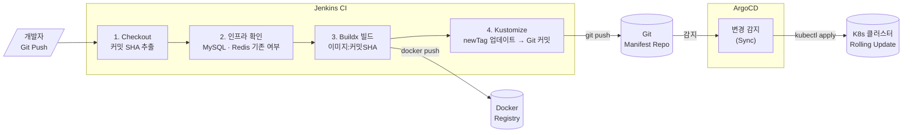

---

## 2. Jenkins 파이프라인 전체 구성

Jenkins 파이프라인은 **스테이지 단위**로 실행됩니다. 각 스테이지의 역할과 핵심 코드를 살펴봅시다.

### 2-1. 체크아웃 & 이미지 태그 결정

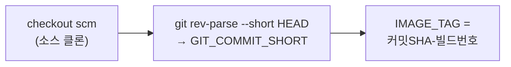

```groovy
stage('Checkout') {
    steps {
        checkout scm
        script {
            env.GIT_COMMIT_SHORT = sh(
                script: "git rev-parse --short HEAD",
                returnStdout: true
            ).trim()
            // 예: abc1d2e-42
            env.IMAGE_TAG = "${env.GIT_COMMIT_SHORT}-${env.BUILD_NUMBER}"
            env.FULL_IMAGE_TAG = "${DOCKER_REGISTRY}/${IMAGE_NAME}:${env.IMAGE_TAG}"
        }
    }
}
```

**이미지 태그 전략**

| 방식 | 예시 | 특징 |
| --- | --- | --- |
| 커밋 SHA | `app:abc1d2e` | 소스 버전 추적 가능 |
| SHA + 빌드번호 | `app:abc1d2e-42` | 같은 커밋 재빌드도 구별 |
| Semantic | `app:v1.2.3` | 사람이 읽기 쉬움, 수동 관리 |

> **왜 SHA?** 이미지 태그로 소스 커밋을 역추적할 수 있어 장애 시 원인 파악이 빠릅니다.

---

### 2-2. Credentials 관리

민감 정보(비밀번호, kubeconfig)는 코드에 직접 넣지 않고 **Jenkins Credentials**에 등록합니다.

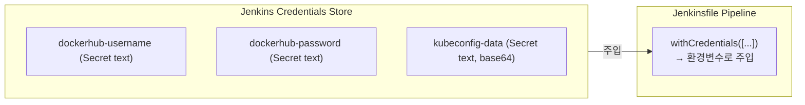

```groovy
stage('Parse Deploy Config') {
    steps {
        script {
            withCredentials([
                string(credentialsId: 'dockerhub-username', variable: 'DOCKERHUB_USERNAME'),
                string(credentialsId: 'dockerhub-password', variable: 'DOCKERHUB_PASSWORD'),
                string(credentialsId: 'kubeconfig-data',    variable: 'KUBECONFIG_DATA')
            ]) {
                env.DOCKERHUB_USERNAME = DOCKERHUB_USERNAME
                env.DOCKERHUB_PASSWORD = DOCKERHUB_PASSWORD
                env.KUBECONFIG_DATA    = KUBECONFIG_DATA
            }
        }
    }
}
```

**Credentials 등록 위치**

```
Jenkins Dashboard
→ Manage Jenkins
→ Manage Credentials
→ Global credentials
→ Add Credentials
  ├─ Kind: Secret text
  ├─ Secret: <값>
  └─ ID: dockerhub-username
```

---

### 2-3. kubeconfig 설정

K8s 클러스터와 통신하려면 `~/.kube/config`가 필요합니다. Jenkins는 base64로 인코딩된 kubeconfig를 복호화해 파일로 씁니다.

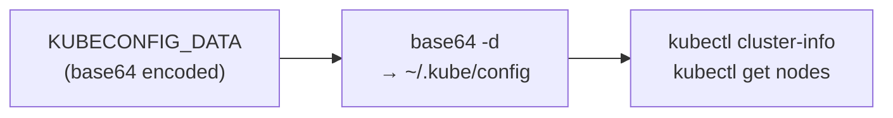

```bash
# K3s / K8s 서버에서 kubeconfig 추출 & 인코딩
# server: 127.0.0.1 → 실제 서버 IP로 변경 후
base64 -w 0 ~/.kube/config
```

```groovy
stage('Configure kubeconfig') {
    steps {
        script {
            sh """
                mkdir -p \$HOME/.kube
                echo "${env.KUBECONFIG_DATA}" | base64 -d > \$HOME/.kube/config
                chmod 600 \$HOME/.kube/config
                kubectl cluster-info
                kubectl get nodes
            """
        }
    }
}
```

---

### 2-4. 인프라 분리 배포 (MySQL · Redis)

**핵심 원칙**: MySQL·Redis는 **데이터 계층**이므로 앱 배포와 분리합니다. 이미 배포된 경우 건너뜁니다.

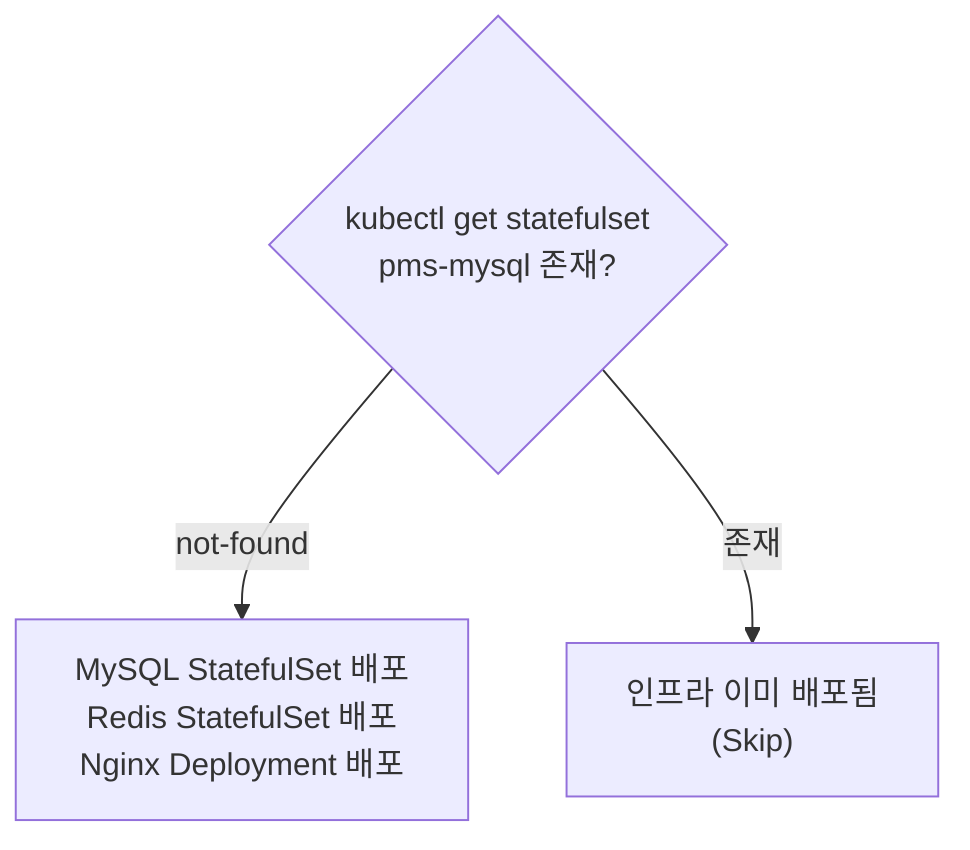

**StatefulSet을 쓰는 이유**

| 항목 | Deployment | StatefulSet |
| --- | --- | --- |
| Pod 이름 | 랜덤 (hash) | 고정 (`mysql-0`, `mysql-1`) |
| 네트워크 ID | 동적 | 안정적 DNS (`mysql-0.mysql.ns.svc`) |
| 스토리지 | Pod 공유 또는 없음 | Pod별 PVC 자동 생성 |
| 사용처 | 웹 앱, API | DB, 메시지큐, Redis Cluster |

```yaml
# MySQL StatefulSet 핵심 구조
apiVersion: apps/v1
kind: StatefulSet
metadata:
  name: app-mysql
spec:
  serviceName: "mysql"       # Headless Service 연결
  replicas: 1
  selector:
    matchLabels:
      app: mysql
  template:
    spec:
      containers:
      - name: mysql
        image: mysql:8.0
        env:
        - name: MYSQL_ROOT_PASSWORD
          valueFrom:
            secretKeyRef:
              name: mysql-secret
              key: password
        volumeMounts:
        - name: mysql-data
          mountPath: /var/lib/mysql
  # Pod마다 PVC 자동 생성
  volumeClaimTemplates:
  - metadata:
      name: mysql-data
    spec:
      accessModes: ["ReadWriteOnce"]
      resources:
        requests:
          storage: 10Gi
```

---

### 2-5. Docker Buildx 빌드 & 푸시

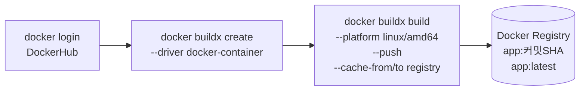

```groovy
stage('Build and Push with Cache') {
    steps {
        script {
            sh """
                docker buildx build \\
                    --platform linux/amd64 \\
                    --push \\
                    --tag ${env.FULL_IMAGE_TAG} \\
                    --tag ${env.LATEST_IMAGE_TAG} \\
                    --cache-from type=registry,ref=${DOCKER_REGISTRY}/${IMAGE_NAME}:buildcache \\
                    --cache-to   type=registry,ref=${DOCKER_REGISTRY}/${IMAGE_NAME}:buildcache,mode=max \\
                    .
            """
        }
    }
}
```

**BuildKit 레이어 캐시 전략**

```dockerfile
# 의존성(변경 빈도 낮음)을 먼저
COPY package.json package-lock.json ./
RUN npm ci

# 소스(변경 빈도 높음)는 나중에
COPY . .
RUN npm run build
```

> `package.json`이 변경되지 않으면 `npm ci` 레이어는 캐시에서 바로 불러옵니다.
> `--cache-from/to type=registry`를 쓰면 CI 컨테이너가 교체되어도 캐시가 유지됩니다.

---

### 2-6. 이전 버전 저장 (롤백 포인트)

배포 전에 현재 실행 중인 이미지 태그를 저장해 롤백 기준점을 확보합니다.

```groovy
stage('Save Previous Version') {
    steps {
        script {
            try {
                env.PREVIOUS_IMAGE = sh(
                    script: """
                        kubectl get deployment web -n ${K8S_NAMESPACE} \\
                            -o jsonpath='{.spec.template.spec.containers[0].image}' 2>/dev/null || echo ""
                    """,
                    returnStdout: true
                ).trim()
                echo "Previous image: ${env.PREVIOUS_IMAGE}"
            } catch (Exception e) {
                env.PREVIOUS_IMAGE = ""
            }
        }
    }
}
```

---

### 2-7. Kustomize로 매니페스트 업데이트

**GitOps의 핵심**: 이미지 태그만 교체한 뒤 Git에 커밋합니다. ArgoCD가 이 변경을 감지해 자동으로 클러스터에 반영합니다.

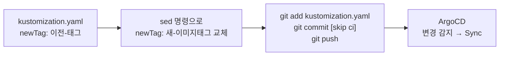

**Kustomize 디렉토리 구조**

```
k8s/
├── base/
│   ├── kustomization.yaml
│   └── deployment.yaml        # 이미지 이름만 명시
└── overlays/
    └── prod/
        └── kustomization.yaml  # 환경별 이미지 태그 관리
```

```yaml
# k8s/overlays/prod/kustomization.yaml
apiVersion: kustomize.config.k8s.io/v1beta1
kind: Kustomization

bases:
  - ../../base

namespace: app-prod

images:
  - name: app
    newName: docker.io/myorg/app
    newTag: "abc1d2e-42"     # Jenkins가 이 값을 교체
```

```groovy
stage('Update K8s Manifest') {
    steps {
        script {
            sh """
                git config user.name  "Jenkins"
                git config user.email "jenkins@example.com"

                # newTag 교체
                sed -i 's|newTag:.*|newTag: ${env.IMAGE_TAG}|g' \\
                    k8s/overlays/prod/kustomization.yaml

                git add k8s/overlays/prod/kustomization.yaml
                git commit -m "ci: update image tag to ${env.IMAGE_TAG} [skip ci]"
                git push origin ${K8S_BRANCH}
            """
        }
    }
}
```

> `[skip ci]` 키워드가 없으면 Git 푸시가 다시 파이프라인을 트리거해 무한 루프가 됩니다.

---

## 3. ArgoCD — GitOps 기반 자동 배포

### 3-1. ArgoCD 동작 원리

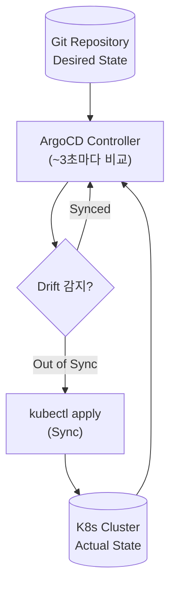

**GitOps 4대 원칙**

| 원칙 | 설명 |
| --- | --- |
| **선언형** | "이 상태로 만들어라" — 절차가 아닌 최종 상태를 정의 |
| **Git = SSOT** | Git이 유일한 진실 소스. kubectl 직접 수정은 ArgoCD가 자동 복구 |
| **자동화** | Git 변경 → 클러스터 자동 반영 (수동 개입 불필요) |
| **지속 감시** | Drift(의도치 않은 변경) 자동 감지 및 복구 |

### 3-2. ArgoCD Application YAML

```yaml
apiVersion: argoproj.io/v1alpha1
kind: Application
metadata:
  name: app-prod
  namespace: argocd
  finalizers:
    - resources-finalizer.argocd.argoproj.io
spec:
  project: default

  source:
    repoURL: https://github.com/your-org/k8s-manifests.git
    targetRevision: main
    path: k8s/overlays/prod

  destination:
    server: https://kubernetes.default.svc
    namespace: app-prod

  syncPolicy:
    automated:
      prune: true      # Git에서 삭제된 리소스 자동 제거
      selfHeal: true   # Drift 자동 복구
    syncOptions:
      - CreateNamespace=true
    retry:
      limit: 5
      backoff:
        duration: 5s
        factor: 2
        maxDuration: 3m
```

**Auto-Sync vs Manual Sync**

| | Auto-Sync | Manual Sync |
| --- | --- | --- |
| 동기화 방식 | Git 변경 감지 즉시 자동 | 운영자가 직접 트리거 |
| 적합 환경 | 개발 · 스테이징 | 프로덕션 |
| 장점 | 완전 자동화 | 배포 전 검증 가능 |

---

## 4. K8s 무중단 배포 — Rolling Update

### 4-1. 핵심 파라미터

Rolling Update는 K8s 기본 배포 전략으로, 기존 Pod을 점진적으로 새 Pod으로 교체합니다.

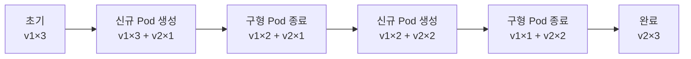

| 파라미터 | 기본값 | 역할 |
| --- | --- | --- |
| `maxSurge` | `25%` | 동시에 추가 생성할 수 있는 최대 Pod 수 |
| `maxUnavailable` | `25%` | 배포 중 사용 불가 허용 최대 Pod 수 |

**무중단 = `maxUnavailable: 0`**

```yaml
strategy:
  type: RollingUpdate
  rollingUpdate:
    maxSurge: 1          # desired+1 까지 허용
    maxUnavailable: 0    # 항상 desired 수만큼 가용 유지
```

> `maxSurge`와 `maxUnavailable` 둘 다 0은 불가합니다.

### 4-2. Readiness Probe — 무중단 배포의 핵심

Readiness Probe가 **성공한 Pod만** Service의 Endpoint에 등록됩니다. 즉, 아직 준비되지 않은 신규 Pod에는 트래픽이 가지 않습니다.

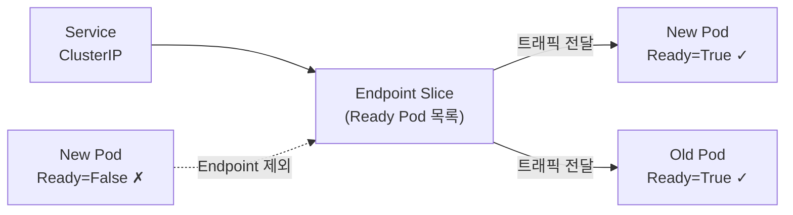

```yaml
containers:
- name: app
  image: myapp:v2

  # 무중단 배포 핵심: 준비 완료 여부 판단
  readinessProbe:
    httpGet:
      path: /health/ready
      port: 8080
    initialDelaySeconds: 10   # 컨테이너 시작 후 10초 대기
    periodSeconds: 5          # 5초마다 체크
    failureThreshold: 3       # 3회 연속 실패 시 not ready

  # Pod 재시작 필요 여부 판단 (별도 역할)
  livenessProbe:
    httpGet:
      path: /health/live
      port: 8080
    initialDelaySeconds: 30
    periodSeconds: 10
    failureThreshold: 3

  # Graceful Shutdown: 기존 연결 처리 후 종료
  lifecycle:
    preStop:
      exec:
        command: ["/bin/sh", "-c", "sleep 15"]

# 종료 신호 후 최대 대기 시간 (preStop + SIGTERM 처리 합산보다 길어야 함)
terminationGracePeriodSeconds: 30
```

**Probe 3종 비교**

| Probe | 실패 시 동작 | 용도 |
| --- | --- | --- |
| `readinessProbe` | Service Endpoint에서 제외 (재시작 없음) | 트래픽 수신 준비 여부 |
| `livenessProbe` | 컨테이너 재시작 | 교착 상태 · 응답 불가 감지 |
| `startupProbe` | livenessProbe 비활성화 | 느린 시작 앱 대응 (JVM 등) |

### 4-3. 완전한 Deployment YAML

```yaml
apiVersion: apps/v1
kind: Deployment
metadata:
  name: app
  namespace: app-prod
spec:
  replicas: 3

  # 무중단 배포 전략
  strategy:
    type: RollingUpdate
    rollingUpdate:
      maxSurge: 1
      maxUnavailable: 0

  # Ready 후 추가 안정화 시간 (0이면 즉시 available 처리)
  minReadySeconds: 10

  # 이 시간 내 완료 안 되면 실패 처리
  progressDeadlineSeconds: 600

  # 롤백용 이전 ReplicaSet 보관 개수
  revisionHistoryLimit: 10

  selector:
    matchLabels:
      app: myapp

  template:
    metadata:
      labels:
        app: myapp
    spec:
      terminationGracePeriodSeconds: 30

      containers:
      - name: app
        image: docker.io/myorg/app:abc1d2e-42
        imagePullPolicy: IfNotPresent

        ports:
        - name: http
          containerPort: 8080

        readinessProbe:
          httpGet:
            path: /health/ready
            port: http
          initialDelaySeconds: 10
          periodSeconds: 5
          failureThreshold: 3

        livenessProbe:
          httpGet:
            path: /health/live
            port: http
          initialDelaySeconds: 30
          periodSeconds: 10
          failureThreshold: 3

        lifecycle:
          preStop:
            exec:
              command: ["/bin/sh", "-c", "sleep 15"]

        resources:
          requests:
            cpu: 200m
            memory: 256Mi
          limits:
            cpu: 500m
            memory: 512Mi
```

---

## 5. 롤백 전략

### 5-1. minReadySeconds & progressDeadlineSeconds

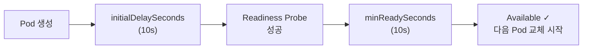

| 파라미터 | 역할 | 비고 |
| --- | --- | --- |
| `minReadySeconds` | Ready 후 추가 안정화 대기 | 기본 0초. 예열 필요 앱에 설정 |
| `progressDeadlineSeconds` | 전체 배포 시간 제한 | 기본 600초. 초과 시 `ProgressDeadlineExceeded` |

### 5-2. kubectl rollout 명령어

```bash
# 배포 진행 상황 실시간 확인
kubectl rollout status deployment/app -n app-prod

# 리비전 이력 조회
kubectl rollout history deployment/app -n app-prod

# 특정 리비전 내용 확인
kubectl rollout history deployment/app -n app-prod --revision=3

# 직전 버전으로 즉시 롤백
kubectl rollout undo deployment/app -n app-prod

# 특정 리비전으로 롤백
kubectl rollout undo deployment/app -n app-prod --to-revision=2

# 배포 일시 중지 (Canary 검증 시)
kubectl rollout pause  deployment/app -n app-prod

# 배포 재개
kubectl rollout resume deployment/app -n app-prod
```

### 5-3. CI/CD 파이프라인 자동 롤백

```groovy
// 배포 실패 시 자동 롤백
post {
    failure {
        script {
            sh """
                echo "배포 실패. 롤백 시작..."
                kubectl rollout undo deployment/web -n ${K8S_NAMESPACE}
                kubectl rollout status deployment/web -n ${K8S_NAMESPACE}
            """
        }
    }
}
```

---

## 6. 배포 이력 추적 (Audit Trail)

GitOps의 강점 중 하나는 **모든 배포가 Git 커밋으로 기록된다**는 점입니다.

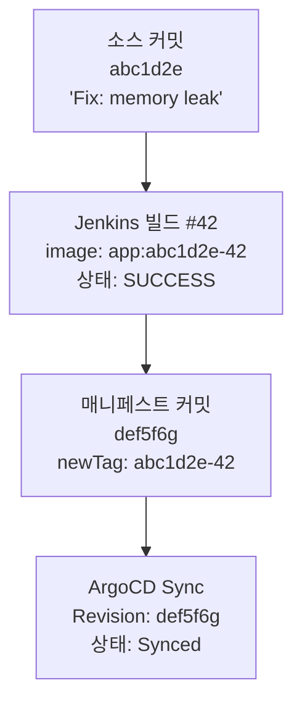

```bash
# 매니페스트 변경 이력 조회
git log --oneline overlays/prod/kustomization.yaml

# 특정 커밋의 이미지 태그 변경 확인
git show def5f6g

# 어떤 버전이 언제 배포됐는지 확인
git log -p overlays/prod/kustomization.yaml | grep "newTag:"

# ArgoCD CLI로 배포 이력
argocd app history app-prod
```

**의미있는 커밋 메시지 예시**

```
ci: update app image to abc1d2e-42

Triggered by: Jenkins #42
Source Commit: abc1d2e
Image: docker.io/myorg/app:abc1d2e-42
Environment: prod
Time: 2026-04-01T10:30:00Z
```

---

## 7. 인프라 분리 설계 요약

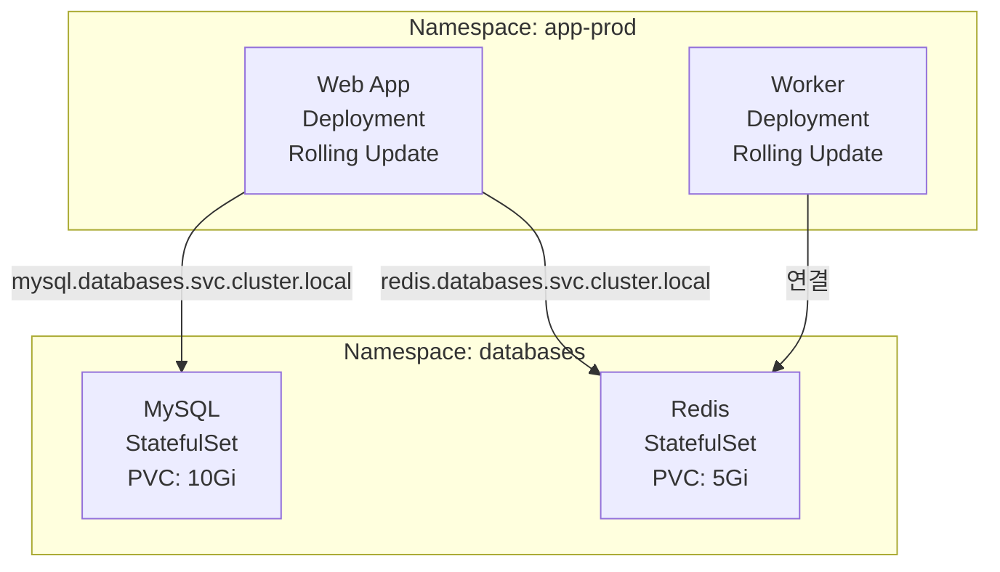

| 계층 | 리소스 종류 | 배포 전략 | 데이터 |
| --- | --- | --- | --- |
| 인프라(DB) | StatefulSet | 초기 1회만 배포 | PVC로 영속 |
| 애플리케이션 | Deployment | 매 커밋마다 Rolling Update | Stateless |

**Namespace 간 통신**은 FQDN으로 접근합니다.

```
mysql.databases.svc.cluster.local:3306
redis.databases.svc.cluster.local:6379
```

---

## 8. 파이프라인 흐름 정리

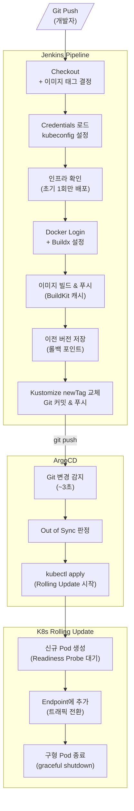

---

## 체크리스트

**파이프라인 구성**

- [ ] 이미지 태그에 커밋 SHA 포함 (추적 가능성)
- [ ] Credentials는 Jenkins Credentials Store 관리
- [ ] `[skip ci]` 커밋 메시지로 무한 루프 방지
- [ ] BuildKit 레지스트리 캐시 설정

**K8s 무중단 배포**

- [ ] `maxUnavailable: 0` 설정 (무중단 보장)
- [ ] `readinessProbe` 반드시 정의
- [ ] `preStop` 훅으로 graceful shutdown
- [ ] `terminationGracePeriodSeconds` > `preStop` 대기 시간

**운영**

- [ ] `revisionHistoryLimit` 설정 (롤백 이력 보관)
- [ ] `progressDeadlineSeconds` 설정 (무한 대기 방지)
- [ ] 배포 실패 시 자동 롤백 파이프라인 구성
- [ ] MySQL · Redis는 StatefulSet으로 인프라 분리
