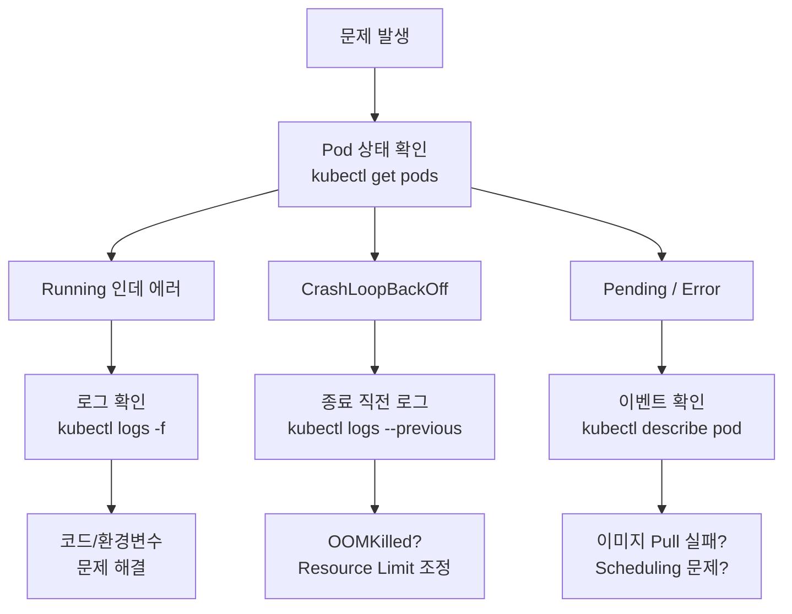

## 배포 이후: "서버가 이상해요"

자동화 배포가 완성되면 다음 문제가 찾아온다. "잘 배포됐다는데 왜 에러가 나요?" 

SSH로 서버에 들어가 로그 파일을 찾는 시대는 끝났다. 쿠버네티스 환경에서는 **kubectl**로 모든 것을 진단한다.



---

## 기본: Pod 상태 한눈에 보기

```bash
# 특정 네임스페이스의 모든 Pod 확인
kubectl get pods -n pms-web

# 출력 예시:
# NAME                         READY   STATUS    RESTARTS   AGE
# pms-web-7d9f8b6c4-xk2pq     1/1     Running   0          2d
# pms-web-7d9f8b6c4-r8mnv     1/1     Running   0          2d
# celery-worker-59b7d4-hj3lp   1/1     Running   2          1d
# mysql-0                      1/1     Running   0          7d

# 더 상세한 정보 (-o wide: 노드, IP까지)
kubectl get pods -n pms-web -o wide

# 모든 네임스페이스 동시 확인
kubectl get pods --all-namespaces
```

### STATUS 코드 해석

| STATUS | 의미 | 해결 방향 |
|---|---|---|
| `Running` | 정상 실행 중 | — |
| `Pending` | 노드 스케줄링 대기 | `describe`로 이벤트 확인 |
| `CrashLoopBackOff` | 실행 → 충돌 → 재시작 반복 | `logs --previous`로 원인 확인 |
| `OOMKilled` | 메모리 초과로 강제 종료 | Resource Limit 증가 |
| `ImagePullBackOff` | 이미지 Pull 실패 | 이미지 태그/레지스트리 인증 확인 |
| `Terminating` | 삭제 중 (오래되면 강제 삭제) | `delete pod --grace-period=0` |

---

## kubectl logs — 로그 확인

```bash
# 기본: 특정 Pod의 로그
kubectl logs pms-web-7d9f8b6c4-xk2pq -n pms-web

# -f (follow): 실시간 스트리밍 (tail -f와 동일)
kubectl logs -f pms-web-7d9f8b6c4-xk2pq -n pms-web

# --tail: 마지막 N줄만 출력
kubectl logs --tail=100 pms-web-7d9f8b6c4-xk2pq -n pms-web

# --since: 최근 시간 기준 (1h, 30m, 2h)
kubectl logs --since=30m pms-web-7d9f8b6c4-xk2pq -n pms-web

# --previous (-p): 이전 컨테이너 로그 (CrashLoopBackOff 시 핵심)
kubectl logs --previous pms-web-7d9f8b6c4-xk2pq -n pms-web

# Deployment 이름으로 (Pod 이름 모를 때)
kubectl logs -f deployment/pms-web -n pms-web

# 여러 Pod 동시 로그 (라벨 셀렉터)
kubectl logs -f -l app=pms-web -n pms-web --max-log-requests=10
```

### Django 에러 로그 찾기 예시

```bash
# 에러만 필터링 (grep 파이프)
kubectl logs -f deployment/pms-web -n pms-web | grep -i "error\|exception\|traceback"

# 특정 시간대 에러 확인
kubectl logs --since=1h deployment/pms-web -n pms-web | grep "ERROR"
```

---

## kubectl exec — 컨테이너 내부 접속

```bash
# 컨테이너에 bash 셸로 접속
kubectl exec -it pms-web-7d9f8b6c4-xk2pq -n pms-web -- /bin/bash

# sh만 있는 경우 (Alpine 등 경량 이미지)
kubectl exec -it pms-web-7d9f8b6c4-xk2pq -n pms-web -- /bin/sh

# 단일 명령 실행 (접속 없이)
kubectl exec pms-web-7d9f8b6c4-xk2pq -n pms-web -- python manage.py check
kubectl exec pms-web-7d9f8b6c4-xk2pq -n pms-web -- env | grep DJANGO
```

### 접속 후 활용 예시

```bash
# 컨테이너 내부에서 할 수 있는 것들:

# 환경변수 확인 (DB 연결 정보 등)
env | grep -E "DATABASE|SECRET|REDIS"

# Django 쉘 진입
python manage.py shell

# 수동 마이그레이션 실행
python manage.py migrate

# 파일 시스템 확인
ls -la /app/logs/
cat /app/config/settings.py

# DB 연결 테스트
python manage.py dbshell
```

> **주의**: 컨테이너는 임시(Ephemeral)다. `exec`으로 접속해서 파일을 수정해도 Pod가 재시작되면 사라진다. 영구 변경은 반드시 코드/ConfigMap/Secret을 통해 해야 한다.

---

## kubectl describe — 상세 이벤트 확인

```bash
# Pod 상세 정보 (Events 섹션이 핵심)
kubectl describe pod pms-web-7d9f8b6c4-xk2pq -n pms-web

# Deployment 상태
kubectl describe deployment pms-web -n pms-web

# Service 확인 (엔드포인트, 포트 등)
kubectl describe service pms-web-svc -n pms-web
```

### describe 출력에서 볼 것

```yaml
# kubectl describe pod 출력 예시 (핵심 부분)
Name:         pms-web-7d9f8b6c4-xk2pq
Namespace:    pms-web
Status:       Running

Containers:
  web:
    Image:      myorg/pms-web:a1b2c3d4-42
    Limits:
      cpu:     500m
      memory:  512Mi
    Requests:
      cpu:     250m
      memory:  256Mi
    Environment:
      DJANGO_SECRET_KEY:  <set to the key 'secret-key' in secret 'pms-secrets'>
      DATABASE_URL:       <set to the key 'db-url' in secret 'pms-secrets'>

Events:
  Type     Reason            Age   Message
  ----     ------            ---   -------
  Normal   Scheduled         5m    Successfully assigned pms-web/...
  Normal   Pulling           5m    Pulling image "myorg/pms-web:a1b2c3d4-42"
  Normal   Pulled            4m    Successfully pulled image
  Normal   Created           4m    Created container web
  Normal   Started           4m    Started container web
  Warning  BackOff           2m    Back-off restarting failed container  # ← 문제 신호
```

---

## kubectl top — 리소스 모니터링

```bash
# 노드별 CPU/Memory 사용량
kubectl top nodes

# 출력 예시:
# NAME         CPU(cores)   CPU%   MEMORY(bytes)   MEMORY%
# k3s-server   234m         11%    1842Mi           47%

# Pod별 리소스 사용량
kubectl top pods -n pms-web

# 출력 예시:
# NAME                          CPU(cores)   MEMORY(bytes)
# pms-web-7d9f8b6c4-xk2pq     15m          145Mi
# celery-worker-59b7d4-hj3lp   85m          212Mi
# mysql-0                      32m          387Mi

# 컨테이너별 세분화
kubectl top pods -n pms-web --containers
```

> **필요 조건**: `kubectl top`은 Metrics Server가 설치되어 있어야 한다. k3s는 기본 포함.

### OOMKilled 진단

```bash
# 메모리로 인해 죽은 Pod 확인
kubectl describe pod <pod-name> -n pms-web | grep -A5 "OOMKilled\|Last State"

# 출력:
# Last State: Terminated
#   Reason: OOMKilled       # ← 메모리 초과
#   Exit Code: 137

# 해결: Deployment의 resources.limits.memory 증가
kubectl edit deployment pms-web -n pms-web
# 또는 kustomization에서 patch로 설정
```

---

## Deployment 운영 명령어

```bash
# 재시작 (코드 변경 없이 Pod 교체)
kubectl rollout restart deployment/pms-web -n pms-web

# 롤아웃 상태 확인
kubectl rollout status deployment/pms-web -n pms-web

# 롤백 (이전 버전으로)
kubectl rollout undo deployment/pms-web -n pms-web

# 스케일 조정
kubectl scale deployment pms-web --replicas=3 -n pms-web

# 특정 리비전으로 롤백
kubectl rollout undo deployment/pms-web --to-revision=3 -n pms-web

# 롤아웃 히스토리 확인
kubectl rollout history deployment/pms-web -n pms-web
```

---

## 실전 디버깅 시나리오

### 시나리오 1: 배포 직후 Pod이 계속 재시작됨

```bash
# 1. 상태 확인
kubectl get pods -n pms-web
# → CrashLoopBackOff 확인

# 2. 이전 실행 로그 확인 (죽기 전 로그)
kubectl logs --previous deployment/pms-web -n pms-web
# → Django 에러: ImproperlyConfigured: DATABASE_URL not set

# 3. 환경변수 확인
kubectl exec deployment/pms-web -n pms-web -- env | grep DATABASE
# → DATABASE_URL이 없음 → Secret 누락

# 4. Secret 확인
kubectl get secret pms-secrets -n pms-web -o yaml
```

### 시나리오 2: 배포는 됐는데 API가 500 에러

```bash
# 1. 실시간 로그 모니터링하면서 요청 보내기
kubectl logs -f deployment/pms-web -n pms-web | grep -v "GET /health"

# 2. Django Traceback 발견
# → AttributeError: 'NoneType' object has no attribute 'team'
# → 신규 User에 Profile이 없어서 created_by 권한 체크에서 실패

# 3. 컨테이너 접속 후 확인
kubectl exec -it deployment/pms-web -n pms-web -- python manage.py shell
# >>> from django.contrib.auth import get_user_model
# >>> User = get_user_model()
# >>> User.objects.filter(profile__isnull=True).count()
# 3  → Profile 없는 유저 존재
```

### 시나리오 3: Django migration 적용 안 됨

```bash
# 배포 후 마이그레이션 실행
kubectl exec deployment/pms-web -n pms-web -- python manage.py migrate

# 또는 Job으로 실행 (권장)
kubectl apply -f - <<EOF
apiVersion: batch/v1
kind: Job
metadata:
  name: django-migrate
  namespace: pms-web
spec:
  template:
    spec:
      containers:
        - name: migrate
          image: myorg/pms-web:a1b2c3d4-42
          command: ["python", "manage.py", "migrate"]
          envFrom:
            - secretRef:
                name: pms-secrets
      restartPolicy: Never
EOF
```

---

## 자주 쓰는 명령어 치트시트

```bash
# ── 상태 확인 ──────────────────────────────────────────────────────
kubectl get pods -n pms-web                          # Pod 목록
kubectl get all -n pms-web                           # 모든 리소스
kubectl get events -n pms-web --sort-by='.lastTimestamp'  # 최근 이벤트

# ── 로그 ────────────────────────────────────────────────────────────
kubectl logs -f deployment/pms-web -n pms-web        # 실시간 로그
kubectl logs --previous <pod> -n pms-web             # 이전 실행 로그
kubectl logs --since=30m deployment/pms-web -n pms-web  # 최근 30분

# ── 접속 ────────────────────────────────────────────────────────────
kubectl exec -it <pod> -n pms-web -- /bin/bash       # bash 접속
kubectl exec <pod> -n pms-web -- <command>           # 단일 명령

# ── 상세 정보 ────────────────────────────────────────────────────────
kubectl describe pod <pod> -n pms-web                # Pod 이벤트
kubectl describe node <node>                         # 노드 상태

# ── 리소스 사용량 ────────────────────────────────────────────────────
kubectl top nodes                                    # 노드 CPU/MEM
kubectl top pods -n pms-web                          # Pod CPU/MEM

# ── 배포 관리 ────────────────────────────────────────────────────────
kubectl rollout restart deployment/pms-web -n pms-web
kubectl rollout status deployment/pms-web -n pms-web
kubectl rollout undo deployment/pms-web -n pms-web
kubectl scale deployment pms-web --replicas=3 -n pms-web
```

---

## 참고

<a href="https://kubernetes.io/docs/reference/kubectl/quick-reference/" target="_blank">[1] kubectl Quick Reference — 공식 문서</a>

<a href="https://kubernetes.io/docs/tasks/debug/debug-application/debug-pods/" target="_blank">[2] Debug Pods — Kubernetes 공식 문서</a>

<a href="https://kubernetes.io/docs/tasks/debug/debug-cluster/resource-usage-monitoring/" target="_blank">[3] Resource Usage Monitoring — Kubernetes 공식 문서</a>

<a href="https://docs.k3s.io/quick-start" target="_blank">[4] k3s Quick Start — 공식 문서</a>

---

## 관련 글

- [GitOps 파이프라인 — Jenkins + ArgoCD + k3s →](/post/jenkins-argocd-gitops)
- [GitLab CI/CD — .gitlab-ci.yml → K3s →](/post/gitlab-cicd-guide)
