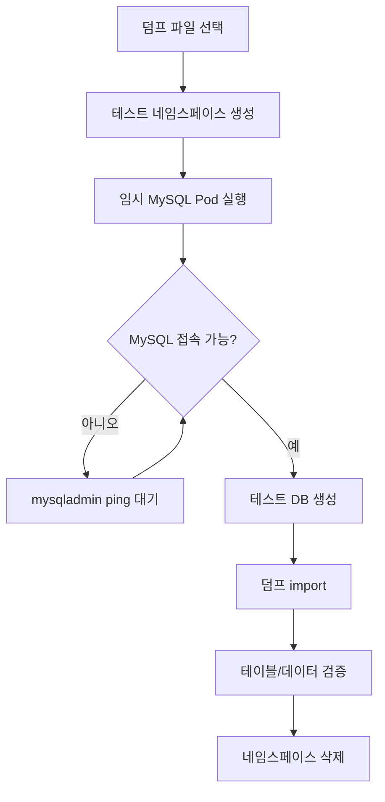

"백업 완료"라는 로그만 보고 안심한 적이 있다.

막상 복구가 필요한 순간이 오면 그때서야 파일이 깨졌거나, import가 안 되거나, 테이블이 절반밖에 없다는 걸 알게 된다. 그게 최악의 타이밍이다.

백업 파일이 생겼다면, 그 다음 해야 할 일은 그 파일로 실제로 복구해보는 것이다. 운영 환경에 직접 하면 위험하니, 클러스터 안에 임시 네임스페이스를 만들어서 테스트한다.

---

## 전체 흐름



---

## 0) 덤프 파일 확인

먼저 어떤 파일을 복구할지 정한다.

```bash
ls -la /data/pms/mysql-dumps | tail -10
du -sh /data/pms/mysql-dumps
```

```bash
# 복구할 파일 지정 (실제 파일명으로 변경)
DUMP=/data/pms/mysql-dumps/pms_db_20260406_030012.sql.gz
```

파일 내용이 정상인지 미리 확인해두면 좋다.

```bash
# mysqldump 헤더가 나오면 파일이 깨지지 않은 것
zcat "$DUMP" | head -n 20

# 테이블 목록
zcat "$DUMP" | grep -n "CREATE TABLE" | head -20
```

---

## 1) 테스트 네임스페이스와 Pod 준비

운영 네임스페이스(`pms-web`)와 완전히 분리된 공간을 만든다. 테스트가 끝나면 이 네임스페이스째 삭제한다.

```bash
kubectl create ns mysql-restore-test

kubectl -n mysql-restore-test run mysql-test \
  --image=mysql:8.0 \
  --env MYSQL_ROOT_PASSWORD='testpass' \
  --port 3306

kubectl -n mysql-restore-test expose pod mysql-test \
  --name mysql-test \
  --port 3306
```

---

## 2) MySQL이 "접속 가능"할 때까지 대기

여기서 흔히 실수하는 부분이 있다.

`kubectl wait --for=condition=Ready pod/mysql-test`로 Pod가 Ready가 됐다고 해서 MySQL에 바로 접속할 수 있는 게 아니다. readinessProbe를 설정하지 않으면 컨테이너가 시작되자마자 Ready 상태가 된다. 하지만 MySQL 초기화(root 비밀번호 설정, 시스템 테이블 생성 등)는 아직 진행 중일 수 있다.[^k8s-readiness]

이 상태에서 접속하면 아래 오류가 나온다:

```
ERROR 1045 (28000): Access denied for user 'root'@'localhost'
```

실제로 비밀번호가 틀린 게 아니라 MySQL이 아직 준비가 안 된 것이다.

### 방법 A: 로그로 확인

```bash
kubectl -n mysql-restore-test logs pod/mysql-test --follow
```

아래 메시지가 나오면 준비 완료다:

```
2026-04-06T03:00:00.000000Z 0 [System] [MY-010931] [Server] /usr/sbin/mysqld: ready for connections.
```

### 방법 B: mysqladmin ping 루프 (권장)

로그를 보고 있을 수 없으면 자동으로 대기하는 스크립트를 쓴다.

```bash
for i in $(seq 1 60); do
  kubectl -n mysql-restore-test exec mysql-test -- \
    mysqladmin ping -uroot -ptestpass --silent 2>/dev/null && break
  echo "대기 중... ($i/60)"
  sleep 2
done
echo "MySQL 준비 완료"
```

최대 2분을 60회 대기한다. 보통 20~40초면 된다.

---

## 3) 테스트 DB 생성

```bash
kubectl -n mysql-restore-test exec mysql-test -- \
  mysql -uroot -ptestpass \
  -e "CREATE DATABASE pms_restore_test
      DEFAULT CHARACTER SET utf8mb4
      COLLATE utf8mb4_unicode_ci;"
```

운영 DB 이름과 다르게 만든다. 이름이 같으면 나중에 혼동될 수 있다.

---

## 4) 덤프 Import

파일을 Pod 안으로 복사하지 않아도 된다. stdin 파이프로 바로 넘긴다.

```bash
gunzip -c "$DUMP" | kubectl -n mysql-restore-test exec -i mysql-test -- \
  mysql -uroot -ptestpass pms_restore_test
```

DB 크기에 따라 수십 초~수 분이 걸릴 수 있다. 오류 없이 프롬프트로 돌아오면 완료다.

import 중 오류가 발생하면 MySQL Pod 로그를 확인한다.

```bash
kubectl -n mysql-restore-test logs pod/mysql-test --tail=100
```

---

## 5) 복구 검증

### 테이블 목록 확인

```bash
kubectl -n mysql-restore-test exec mysql-test -- \
  mysql -uroot -ptestpass \
  -D pms_restore_test \
  -e "SHOW TABLES;"
```

원본 DB의 테이블 수와 일치하는지 확인한다.

### 대표 테이블 row count 확인

운영 DB와 row 수가 비슷한지 대략적으로 확인한다. 백업 시점에 따라 약간 다를 수 있다.

```bash
# 테이블명은 실제 존재하는 것으로 변경
kubectl -n mysql-restore-test exec mysql-test -- \
  mysql -uroot -ptestpass \
  -D pms_restore_test \
  -e "SELECT COUNT(*) FROM users;
      SELECT COUNT(*) FROM orders;
      SELECT COUNT(*) FROM products;"
```

### 특정 레코드 확인 (선택)

최근 생성된 레코드가 있다면 그 데이터가 덤프에 포함돼 있는지 확인한다.

```bash
kubectl -n mysql-restore-test exec mysql-test -- \
  mysql -uroot -ptestpass \
  -D pms_restore_test \
  -e "SELECT id, created_at FROM users ORDER BY created_at DESC LIMIT 5;"
```

---

## 6) 테스트 정리

검증이 끝나면 테스트 네임스페이스를 삭제한다.

```bash
kubectl delete ns mysql-restore-test
```

Pod, Service, 임시 데이터가 전부 삭제된다.

---

## 트러블슈팅

### Pod Ready인데 접속이 안 됨

readinessProbe가 없어서 MySQL 초기화 전에 Ready 상태가 된 것이다.
`mysqladmin ping` 루프로 대기한 뒤 재시도한다.

### `Access denied for user 'root'@'localhost'`

두 가지 원인:
1. MySQL 초기화가 아직 진행 중 → `mysqladmin ping` 대기 후 재시도
2. 비밀번호가 실제로 틀린 경우 → `MYSQL_ROOT_PASSWORD` 환경변수 확인

### import 도중 `Table doesn't exist` 또는 FK 오류

덤프에 `SET FOREIGN_KEY_CHECKS=0`이 없으면 FK 참조 순서 문제로 실패할 수 있다. mysqldump 기본 옵션으로 만든 덤프라면 이 구문이 포함돼 있어야 한다.

```bash
zcat "$DUMP" | grep "FOREIGN_KEY_CHECKS"
```

없으면 import 전에 수동으로 비활성화한다.

```bash
gunzip -c "$DUMP" | kubectl -n mysql-restore-test exec -i mysql-test -- \
  mysql -uroot -ptestpass \
  -e "SET FOREIGN_KEY_CHECKS=0;" pms_restore_test
```

### import가 너무 오래 걸림

DB 크기와 노드 리소스(CPU, 디스크 I/O)에 따라 다르다. 수백 MB 이상이면 수 분 이상 걸릴 수 있다.

```bash
# 노드 디스크 I/O 확인
kubectl top nodes
# Pod 리소스 확인
kubectl -n mysql-restore-test top pod mysql-test
```

---

## 복구 테스트를 정례화해야 하는 이유

파일이 존재하는 것과 복구가 되는 것은 다르다.

실제로 발생하는 문제들:
- 덤프 도중 네트워크 오류로 파일이 잘림 (gzip 오류로 확인 가능)
- 권한 문제로 일부 테이블이 누락됨
- 캐릭터셋 불일치로 한글 데이터가 깨짐
- mysqldump 버전과 MySQL 버전 불일치

이런 문제는 복구를 실제로 해보기 전까지는 발견하기 어렵다. 장애가 나서 복구하는 순간에 알게 되면 늦다.

월 1회 이 Runbook을 그대로 실행해보는 것을 권장한다. 복잡한 작업이 아니니 20분이면 된다.

---

## References

[^mysqldump-docs]: MySQL Documentation — mysqldump: https://dev.mysql.com/doc/refman/8.0/en/mysqldump.html
[^k8s-readiness]: Kubernetes Documentation — Configure Liveness, Readiness and Startup Probes: https://kubernetes.io/docs/tasks/configure-pod-container/configure-liveness-readiness-startup-probes/
[^k8s-namespace]: Kubernetes Documentation — Namespaces: https://kubernetes.io/docs/concepts/overview/working-with-objects/namespaces/
[^mysql-restore]: MySQL Documentation — Reloading SQL-Format Backups: https://dev.mysql.com/doc/refman/8.0/en/reloading-sql-format-dumps.html
