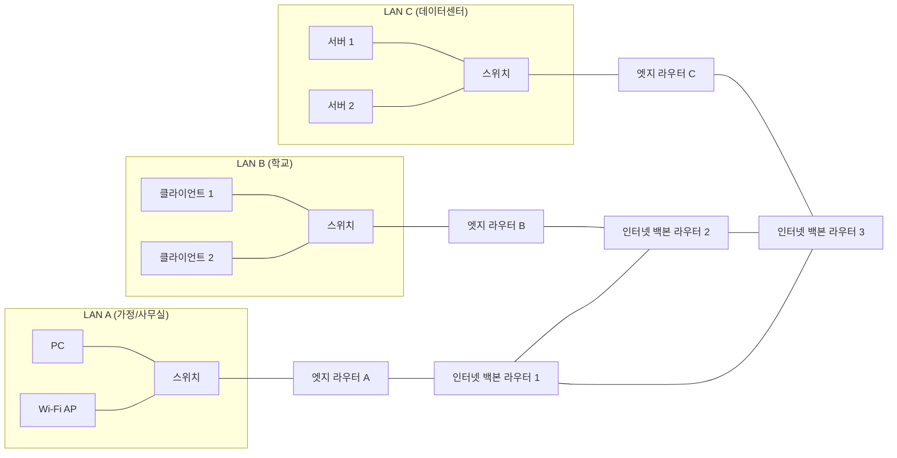
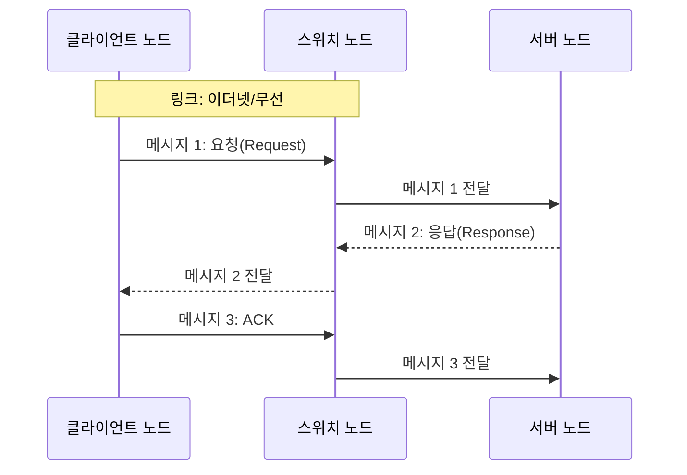
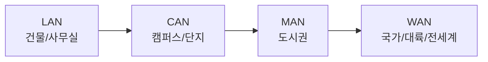

## 네트워크란?

네트워크(Network)는 통신 가능한 장치들이 공통 프로토콜에 따라 연결되어 데이터를 교환하는 구조를 의미한다.  
각 장치는 IP, MAC과 같은 주소 체계로 식별되며, 유선 또는 무선 링크를 통해 메시지를 전달한다.  
즉 네트워크의 본질은 단순한 물리적 연결이 아니라, 규칙 기반의 신뢰 가능한 데이터 전달에 있다.[^computer-network]

### LAN 여러 개가 WAN으로 연결되는 기본 구조

위 구조는 "작은 로컬 네트워크(LAN)가 라우터를 통해 광역 네트워크(WAN)로 확장된다"는 핵심 개념을 시각화한다.  
각 LAN 내부에서는 스위치가 단말을 연결하고, LAN 경계에서는 라우터가 외부 네트워크와의 경로를 결정한다.

## 인터넷이란?

인터넷(Internet)은 TCP/IP를 공통 규약으로 채택한 네트워크들의 집합, 즉 "네트워크의 네트워크"로 정의된다.  
가정, 기업, 학교, 정부의 개별 네트워크는 라우터와 백본망을 통해 상호 연결되며, 이 연결이 전 세계 규모의 통신 인프라를 구성한다.  
웹(WWW), 이메일, 스트리밍은 인터넷 자체가 아니라 인터넷 위에서 제공되는 대표적 응용 서비스다.[^internet]

### 거시 인터넷 구조: 자율 시스템(AS)과 IXP

인터넷의 거시 구조는 하나의 단일 소유 네트워크가 아니라, 다수의 자율 시스템(AS)이 상호 접속해 구성한 연합 구조로 이해한다.[^as]  
AS(Autonomous System)는 단일 관리 주체가 공통 라우팅 정책으로 운영하는 IP 네트워크 집합이며, 인터넷에서는 ASN(Autonomous System Number)으로 식별한다.[^as]  
AS 간 경로 교환은 BGP(Border Gateway Protocol)를 사용하며, 각 사업자는 정책 기반으로 어떤 경로를 우선할지 결정한다.[^bgp]  
IXP(Internet Exchange Point)는 ISP, CDN, 기업망 등 서로 다른 AS가 물리적으로 연결되어 트래픽을 직접 교환하는 지점이다.[^ixp]  
여기서 ISP(Internet Service Provider)는 인터넷 접속과 전송을 제공하는 사업자이며, CDN(Content Delivery Network)은 사용자와 가까운 엣지 서버에 콘텐츠를 분산 배치해 전달 속도와 안정성을 높이는 인프라다.[^isp][^cdn]  
IXP 기반 피어링은 중간 트랜짓 구간을 줄여 비용 절감, 경로 단축, 혼잡 완화에 기여하며, 결과적으로 지연 시간(latency) 개선에 유리하게 동작한다.[^peering]

## 거시적 관점: 노드, 링크, 메시지

거시적 관점에서 네트워크는 노드(node), 링크(link), 메시지(message)의 세 요소로 모델링한다.

- **노드**: 데이터를 생성, 처리, 전달하는 주체로서 클라이언트, 서버, 스위치, 라우터를 포함한다.
- **링크**: 노드 간 전달 경로로서 이더넷 케이블, 광섬유, 무선 전파를 포함한다.
- **메시지**: 링크를 통해 이동하는 정보 단위이며, 현대 데이터 네트워크에서는 주로 패킷 형태로 전송한다.

이 다이어그램은 네트워크를 구성하는 노드, 링크, 메시지의 관계를 가장 단순한 요청-응답 패턴으로 표현한다.  
클라이언트와 서버 사이의 실제 통신은 중간 노드(예: 스위치)를 거치며, 메시지는 링크를 따라 단계적으로 전달한다.

## 네트워크 장비

- **허브(Hub)**: 입력 신호를 여러 포트로 반복 전송하는 물리 계층 장비로 동작한다.
- **스위치(Switch)**: MAC 주소 기반으로 목적지 포트를 식별해 프레임을 전달한다.
- **라우터(Router)**: 네트워크 경계에서 IP 라우팅 정보를 바탕으로 패킷 경로를 결정한다.
- **무선 AP(Access Point)**: 무선 단말을 유선 LAN에 수용하는 접속 계층 장비로 사용한다.[^devices]

<table>
  <tr>
    <td align="center"></td>
    <td align="center"></td>
    <td align="center"></td>
    <td align="center"></td>
  </tr>
  <tr>
    <td align="center">허브(Hub): 수신 신호를 모든 포트로 반복 전달한다.</td>
    <td align="center">스위치(Switch): MAC 주소 기반으로 목적지 포트만 선택 전달한다.</td>
    <td align="center">라우터(Router): 서로 다른 네트워크 간 경로를 선택한다.</td>
    <td align="center">무선 AP: 무선 단말을 유선 LAN에 연결한다.</td>
  </tr>
</table>

## 통신 매체

- **유선 매체**: 꼬임쌍선, 동축 케이블, 광섬유를 사용한다.
- **무선 매체**: 전파 기반 통신(Wi-Fi 등)을 사용한다.

유선 매체는 일반적으로 대역폭과 안정성 측면에서 우위를 보이고, 무선 매체는 이동성과 구축 편의성 측면에서 강점을 보인다.  
다만 실제 품질은 거리, 간섭, 장애물과 같은 환경 변수에 의해 크게 달라진다.[^media]

## 범위에 따른 분류

Wikipedia의 분류 체계를 기준으로 네트워크 범위는 다음과 같이 구분한다.

- **PAN**: 개인 주변의 매우 좁은 범위를 다루는 개인 네트워크다.
- **LAN**: 건물, 사무실, 가정 단위의 로컬 영역 네트워크다.
- **CAN**: 캠퍼스 또는 기업 단지 수준에서 여러 LAN을 통합한 네트워크다.
- **MAN**: 도시권 규모에서 기관 네트워크를 상호 연결한 네트워크다.
- **WAN**: 국가, 대륙, 전 세계 단위로 확장된 광역 네트워크다.

### LAN < CAN < MAN < WAN 관계

위 계층은 네트워크 범위를 이해할 때 가장 자주 사용하는 기준이다.  
범위가 커질수록 운영 주체가 분산되고, 외부 통신 사업자 인프라 의존도가 높아진다.[^scope]

| 구분 | 일반적 범위           | 대표 예시              | 운영 주체             |
| ---- | --------------------- | ---------------------- | --------------------- |
| LAN  | 건물/사무실/가정 내부 | 사내망, 가정 Wi-Fi     | 개인/조직 내부 관리자 |
| CAN  | 캠퍼스/기업 단지      | 대학 건물 간 망        | 학교/기관/기업        |
| MAN  | 도시권                | 도시 Metro Ethernet    | 통신사 + 기관 협업    |
| WAN  | 국가/대륙/전 세계     | 지사 간 전용선, 인터넷 | 통신사업자 백본 중심  |

## 메시지 교환 방식

- **회선 교환(Circuit Switching)**: 통신 전에 전용 경로를 설정하고 세션 동안 자원을 점유
  - 장점: 지연 특성을 예측하기 쉬워 품질 보장이 용이하다.
  - 단점: 전송 데이터가 없는 구간에서도 회선을 점유해 자원 활용이 비효율적이다.
- **패킷 교환(Packet Switching)**: 데이터를 패킷으로 나눠 공유 경로로 전송
  - 장점: 네트워크 자원을 공유해 활용 효율을 높이고, 현대 인터넷의 기본 전송 방식으로 정착해 있다.
  - 단점: 혼잡 구간에서는 지연 증가와 패킷 순서 변동이 발생할 수 있다.

거시 네트워크 관점에서는 패킷 교환의 동적 경로 선택이 핵심이며, 동일한 출발지와 목적지라도 시간대나 혼잡도에 따라 실제 경로가 달라질 수 있다.[^packet-switching]  
이 특성은 인터넷 확장성과 장애 우회에 유리하지만, 지연 편차(jitter)와 순서 역전(out-of-order) 가능성을 함께 고려해야 한다.

## 주소와 송수신지 유형에 따른 전송 방식

- **유니캐스트(Unicast)**: 1:1 전송 방식으로 특정 단일 수신자에게 데이터를 전달한다.
- **브로드캐스트(Broadcast)**: 1:전체 전송 방식으로 동일 브로드캐스트 도메인의 모든 호스트에 데이터를 전파한다.

일반적인 웹 통신은 대부분 유니캐스트 기반으로 동작하며, 브로드캐스트는 주소 탐색이나 초기 발견 과정에서 제한적으로 활용한다.[^switching-and-delivery]

## 깊이 읽기

거시 구조에서 언급된 핵심 개념들을 각각 상세히 다룬 글이다.

- [ISP — 인터넷 접속을 파는 사람들 →](/post/isp-internet-service-provider) — ISP 계층 구조(Tier 1/2/3)와 Transit·Peering의 차이
- [CDN — 콘텐츠를 가장 빠른 경로로 전달하는 방법 →](/post/cdn-content-delivery-network) — 엣지 서버 분산과 DNS 기반 라우팅
- [IXP — ISP들이 만나는 물리적 교차로 →](/post/ixp-internet-exchange-point) — ISP 간 직접 트래픽 교환으로 비용과 지연을 동시에 줄이는 방법
- [회선 교환 vs 패킷 교환 →](/post/circuit-vs-packet-switching) — 인터넷이 전화망과 다른 이유
- [유니캐스트와 브로드캐스트 →](/post/unicast-and-broadcast) — 누구에게 데이터를 보낼 것인가

[^computer-network]: Computer network, <a href="https://en.wikipedia.org/wiki/Computer_network" target="_blank">Wikipedia</a>
[^internet]: Internet, <a href="https://en.wikipedia.org/wiki/Internet" target="_blank">Wikipedia</a>
[^as]: Autonomous system (Internet), <a href="https://en.wikipedia.org/wiki/Autonomous_system_(Internet)" target="_blank">Wikipedia</a>
[^bgp]: Border Gateway Protocol, <a href="https://en.wikipedia.org/wiki/Border_Gateway_Protocol" target="_blank">Wikipedia</a>
[^ixp]: Internet exchange point, <a href="https://en.wikipedia.org/wiki/Internet_exchange_point" target="_blank">Wikipedia</a>
[^isp]: Internet service provider, <a href="https://en.wikipedia.org/wiki/Internet_service_provider" target="_blank">Wikipedia</a>
[^cdn]: Content delivery network, <a href="https://en.wikipedia.org/wiki/Content_delivery_network" target="_blank">Wikipedia</a>
[^peering]: Peering, <a href="https://en.wikipedia.org/wiki/Peering" target="_blank">Wikipedia</a>
[^devices]: Network devices — <a href="https://en.wikipedia.org/wiki/Ethernet_hub" target="_blank">Hub</a>, <a href="https://en.wikipedia.org/wiki/Network_switch" target="_blank">Switch</a>, <a href="https://en.wikipedia.org/wiki/Router_(computing)" target="_blank">Router</a>, <a href="https://en.wikipedia.org/wiki/Wireless_access_point" target="_blank">Wireless AP</a>
[^media]: Transmission media in computer network, <a href="https://en.wikipedia.org/wiki/Computer_network" target="_blank">Wikipedia</a>
[^scope]: Network scope (LAN/CAN/MAN/WAN) — <a href="https://en.wikipedia.org/wiki/Local_area_network" target="_blank">LAN</a>, <a href="https://en.wikipedia.org/wiki/Campus_area_network" target="_blank">CAN</a>, <a href="https://en.wikipedia.org/wiki/Metropolitan_area_network" target="_blank">MAN</a>, <a href="https://en.wikipedia.org/wiki/Wide_area_network" target="_blank">WAN</a>
[^packet-switching]: Packet switching, <a href="https://en.wikipedia.org/wiki/Packet_switching" target="_blank">Wikipedia</a>
[^switching-and-delivery]: Delivery methods — <a href="https://en.wikipedia.org/wiki/Circuit_switching" target="_blank">Circuit switching</a>, <a href="https://en.wikipedia.org/wiki/Packet_switching" target="_blank">Packet switching</a>, <a href="https://en.wikipedia.org/wiki/Unicast" target="_blank">Unicast</a>, <a href="https://en.wikipedia.org/wiki/Broadcasting_(networking)" target="_blank">Broadcasting</a>
