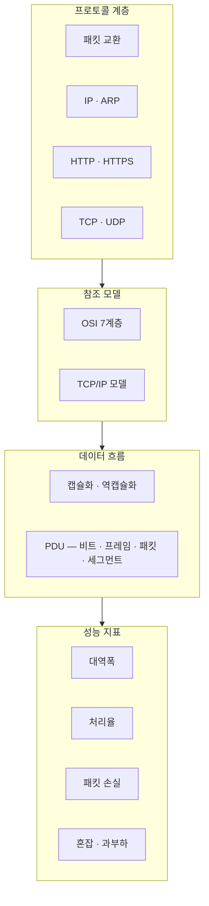
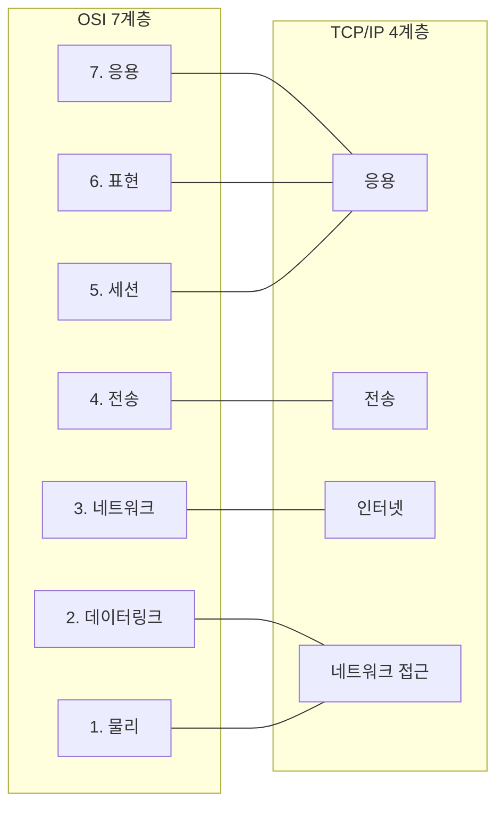
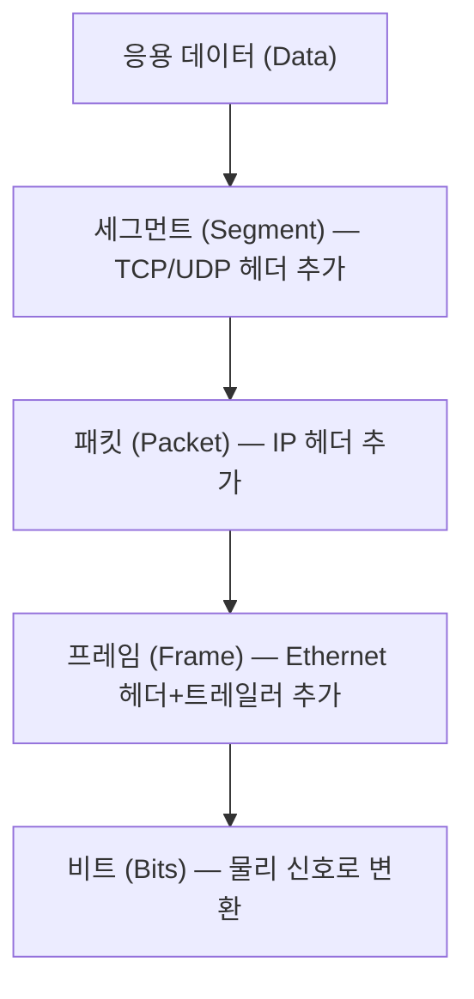

## 미시 네트워크란?

[거시 네트워크](/post/macro-network-view)가 ISP, CDN, IXP 같은 인프라 구조를 다뤘다면,
미시 네트워크는 **데이터가 두 노드 사이를 실제로 이동하는 방식**을 다룬다.

패킷 하나가 출발지에서 목적지로 전달되는 과정에는 수십 가지 규칙이 동시에 적용된다.
그 규칙 체계가 **프로토콜(Protocol)**이며, 프로토콜은 계층 구조로 조직되어 역할을 분담한다.

## 프로토콜 — 통신의 규칙

인터넷은 단일 회사가 설계한 시스템이 아니다.
수천 개의 서로 다른 장비, 운영체제, 애플리케이션이 공통 규칙 없이는 통신할 수 없다.
그 공통 규칙이 **프로토콜**이며, 인터넷은 수십 개의 프로토콜이 계층적으로 맞물려 동작한다.[^protocol]

현대 인터넷이 채택한 핵심 원칙은 **패킷 교환(Packet Switching)**이다.
Paul Baran(1962)과 Donald Davies(1965)가 독립적으로 제안한 이 방식은,
데이터를 패킷 단위로 쪼개어 공유 경로를 통해 동적으로 전달한다.

| 계층 | 대표 프로토콜 | 역할 |
|------|-------------|------|
| 응용 | HTTP, HTTPS, DNS | 애플리케이션 간 데이터 교환 |
| 전송 | TCP, UDP | 프로세스 간 통신, 신뢰성 제어 |
| 네트워크 | IP, ARP | 주소 지정, 경로 선택 |
| 링크 | Ethernet, Wi-Fi | 인접 노드 간 프레임 전달 |

## 참조 모델 — 계층으로 보는 네트워크

복잡한 통신 과정을 이해하고 표준화하기 위해 두 가지 참조 모델이 사용된다.

**[OSI 7계층 모델](/post/micro-osi-7layer)**은 ISO가 1984년 국제 표준으로 발표한 이론 모델로,
네트워크 기능을 7개 계층으로 구분해 각 계층의 책임 범위를 명확히 정의한다.

**[TCP/IP 모델](/post/micro-tcp-ip-model)**은 ARPANET에서 실제 구현된 4계층 실용 모델로,
현재 인터넷의 실질적 기준이다.

## 캡슐화 — 데이터가 헤더를 입는 방법

데이터가 상위 계층에서 하위 계층으로 내려가면서 각 계층의 **헤더(Header)**가 추가된다.
이 과정을 **[캡슐화(Encapsulation)](/post/micro-encapsulation)**라 하고,
수신 측에서 헤더를 제거하며 올라가는 과정을 **역캡슐화(De-encapsulation)**라 한다.

각 계층에서 다루는 데이터 단위를 **PDU(Protocol Data Unit)**라고 한다.

## 트래픽 지표 — 네트워크 성능 측정

데이터가 네트워크를 통과하는 양과 속도를 이해하기 위해 여러 지표를 사용한다.[^traffic]

- **[대역폭(Bandwidth)](/post/micro-network-traffic)**: 단위 시간에 전달 가능한 최대 데이터 양 (이론적 상한)
- **[처리율(Throughput)](/post/micro-network-traffic)**: 실제로 전달된 데이터 양 (대역폭 ≤ 처리율은 불가능)
- **[패킷 손실(Packet Loss)](/post/micro-network-traffic)**: 전송 도중 유실된 패킷의 비율
- **[혼잡(Congestion)](/post/micro-network-traffic)**: 라우터 큐가 가득 차 패킷이 버려지거나 지연이 급증하는 상태

## 깊이 읽기

미시 구조에서 언급된 핵심 개념들을 각각 상세히 다룬 글이다.

### 프로토콜
- [프로토콜 — 왜 패킷 교환을 쓰는가 →](/post/micro-protocol) — 회선 교환의 한계, 패킷 교환의 등장 배경
- [IP와 ARP — 주소와 경로의 언어 →](/post/micro-ip-arp) — IPv4 헤더 구조, ARP 요청·응답 흐름
- [HTTP와 HTTPS — 웹을 움직이는 프로토콜 →](/post/micro-http-https) — HTTP 버전 진화, TLS 핸드셰이크
- [TCP와 UDP — 신뢰성과 속도의 트레이드오프 →](/post/micro-tcp-udp) — 3-way 핸드셰이크, 흐름 제어, 혼잡 제어

### 참조 모델
- [OSI 7계층 모델 →](/post/micro-osi-7layer) — 각 계층의 역할과 대표 프로토콜
- [TCP/IP 참조 모델 →](/post/micro-tcp-ip-model) — 현재 인터넷의 실질적 4계층 모델

### 데이터 흐름
- [캡슐화와 역캡슐화 — PDU의 여정 →](/post/micro-encapsulation) — 헤더 구조, 각 계층의 PDU 이름

### 성능 지표
- [트래픽 — 대역폭, 처리율, 패킷 손실, 혼잡 →](/post/micro-network-traffic) — 네트워크 성능을 측정하는 방법

---

[^protocol]: Protocol (communication), <a href="https://en.wikipedia.org/wiki/Communication_protocol" target="_blank">Wikipedia</a>
[^traffic]: Network traffic, <a href="https://en.wikipedia.org/wiki/Network_traffic" target="_blank">Wikipedia</a>
[^packet-switching]: Packet switching, <a href="https://en.wikipedia.org/wiki/Packet_switching" target="_blank">Wikipedia</a>
[^osi]: OSI model, <a href="https://en.wikipedia.org/wiki/OSI_model" target="_blank">Wikipedia</a>
[^encapsulation]: Encapsulation (networking), <a href="https://en.wikipedia.org/wiki/Encapsulation_(networking)" target="_blank">Wikipedia</a>
