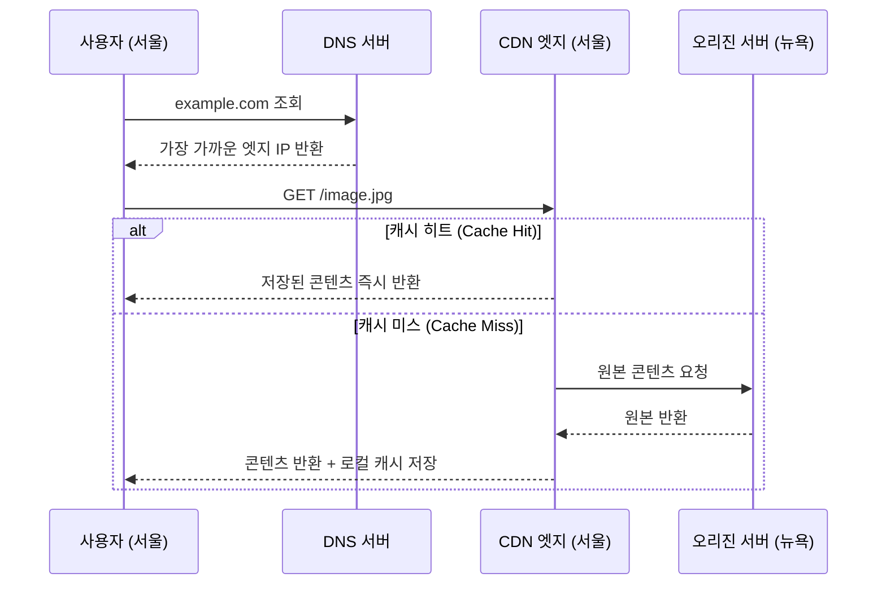

## CDN이 없던 시절

2000년대 초반, 전 세계 사용자가 특정 웹사이트에 접속하면 요청은 모두 단 하나의 서버로 몰렸다. 미국 뉴욕에 서버가 있다면, 서울에서 접속하는 사용자의 요청도 태평양을 건너가야 했다.

물리적 거리는 빛의 속도조차 이길 수 없다. 서울에서 뉴욕까지 광케이블로도 왕복 약 170ms 이상의 지연이 발생한다. 거기에 라우터를 수십 개 거치면 지연은 더 늘어난다. 콘텐츠가 무거워질수록, 접속자가 많아질수록 원거리 서버는 병목이 됐다.[^latency]

**CDN(Content Delivery Network)**은 이 문제를 해결하기 위해 등장했다.

---

## CDN의 핵심 아이디어

CDN의 전략은 단순하다. **콘텐츠의 복사본을 전 세계 여러 곳에 미리 배포해 두는 것**이다.[^cdn]

이 구조에서 핵심 개념은 세 가지다.

### 엣지 서버 (Edge Server)

사용자와 가장 가까운 곳에 배치된 CDN의 캐시 서버다. Cloudflare는 전 세계 330개 이상의 도시에 엣지 서버를 운영한다. 사용자는 뉴욕의 오리진 서버 대신 가장 가까운 엣지 서버에 접속하게 된다.

### 캐싱 (Caching)

엣지 서버는 오리진에서 한 번 받은 콘텐츠를 일정 기간 저장해 둔다. 이미지, CSS, JavaScript, 동영상처럼 자주 바뀌지 않는 **정적 콘텐츠**가 캐싱의 주요 대상이다. TTL(Time To Live) 설정으로 얼마나 오래 캐시할지 결정한다.

### DNS 기반 라우팅

CDN이 사용자를 가장 가까운 엣지 서버로 보내는 방법은 **DNS 응답을 통해서**다. 사용자가 `example.com`을 조회하면, CDN의 DNS 서버는 사용자의 IP 위치를 파악해 가장 가까운 엣지 서버의 IP를 돌려준다. 사용자 입장에서는 투명하게 처리된다.

---

## CDN과 ISP의 관계

CDN 사업자들은 더 나아가 **ISP 네트워크 내부에 직접 엣지 서버를 배치**하기도 한다. Netflix의 Open Connect, Google의 GGC(Google Global Cache)가 대표적 예다.

KT 같은 [Tier 2 ISP](./isp) 데이터센터 안에 Netflix 서버가 있다면, 국내 KT 사용자는 Netflix 콘텐츠를 KT 내부망 안에서 받게 된다. ISP 입장에서도 외부로 나가는 트래픽 비용(트랜짓 비용)을 아낄 수 있으니 윈-윈이다.

---

## 실제 CDN 서비스 예시

| 서비스 | 특징 |
|--------|------|
| **Cloudflare** | 전 세계 330+ 도시, DDoS 방어 포함, 무료 플랜 제공 |
| **AWS CloudFront** | AWS 인프라와 긴밀히 통합, S3·EC2와 연동 |
| **Akamai** | 세계 최초의 상용 CDN, 기업용 대규모 배포 |
| **Fastly** | 실시간 캐시 purge, 개발자 친화적 |

---

## CDN이 해결하지 못하는 것

CDN은 정적 콘텐츠에 강하지만, **동적 콘텐츠**(로그인 세션, 실시간 검색 결과 등)는 캐시할 수 없다. 이런 요청은 결국 오리진 서버까지 가야 한다. CDN은 그 경우에도 경로 최적화(TCP 연결 유지, HTTP/2 사용 등)로 지연을 줄이려 하지만, 정적 콘텐츠만큼의 극적인 효과는 없다.

---

## 핵심 인사이트

> CDN은 "더 빠른 서버를 만들자"가 아니라 "복사본을 전 세계에 뿌려서 물리적 거리 자체를 줄이자"는 전략이다. 빛의 속도는 높일 수 없으니, 거리를 줄이는 것이 유일한 해답이다.

유튜브 영상이 버벅임 없이 재생되고, 해외 쇼핑몰이 국내 사이트처럼 빠른 이유가 바로 여기 있다. 오늘날 대부분의 대형 서비스는 CDN 없이는 운영이 불가능하다.

---

## 관련 글

- [ISP — 인터넷 접속을 파는 사람들](./isp): CDN이 배치되는 네트워크 인프라의 기반
- [IXP — ISP들이 만나는 물리적 교차로](./ixp): CDN 트래픽이 ISP 간을 넘나드는 교차점

---

[^cdn]: Content delivery network — <a href="https://en.wikipedia.org/wiki/Content_delivery_network" target="_blank">https://en.wikipedia.org/wiki/Content_delivery_network</a>
[^latency]: Network latency — <a href="https://en.wikipedia.org/wiki/Network_delay" target="_blank">https://en.wikipedia.org/wiki/Network_delay</a>
