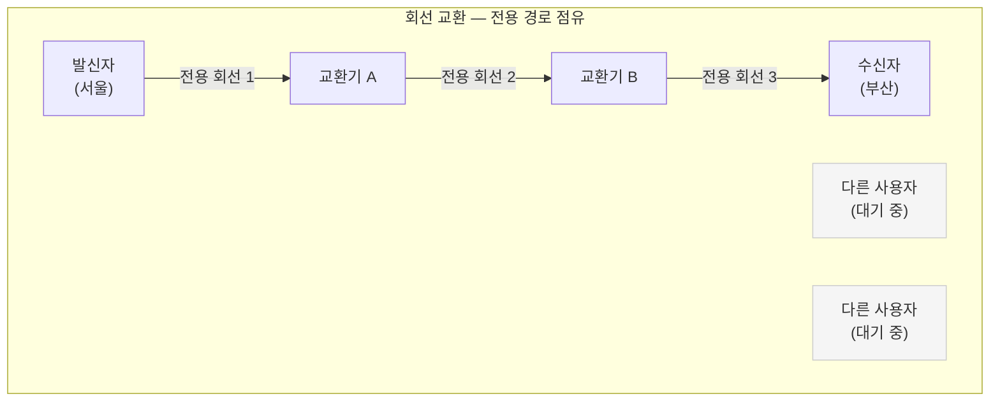
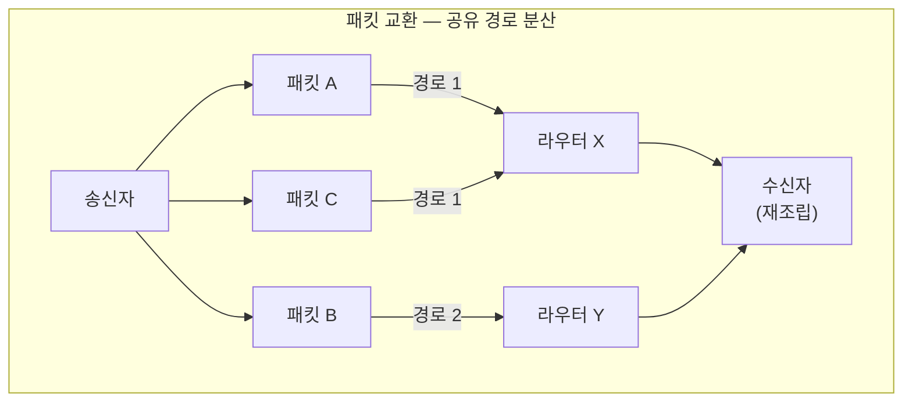

## 전화를 걸 때와 인터넷에 접속할 때의 차이

유선 전화를 걸면 상대방이 받기 전까지 "연결 중..." 상태가 된다. 연결되는 순간, 두 사람 사이에는 **전용 경로**가 하나 생긴다. 통화가 끝날 때까지 그 경로는 오직 이 두 사람을 위해 예약된다.

반면 웹 브라우저에서 Google을 열 때는 이런 과정이 없다. 그냥 바로 데이터가 온다. 경로가 미리 잡히지 않고, 데이터가 작은 조각으로 나뉘어 그때그때 가장 좋은 경로를 찾아 이동한다.

이 두 가지 방식의 차이가 바로 **회선 교환(Circuit Switching)**과 **패킷 교환(Packet Switching)**이다.

---

## 회선 교환 (Circuit Switching)

회선 교환은 통신을 시작하기 전에 출발지부터 목적지까지 **전용 경로를 미리 설정**하는 방식이다.[^circuit-switching] PSTN(Public Switched Telephone Network), 즉 일반 전화망이 대표적인 예다.

### 회선 교환의 장점

- **예측 가능한 지연**: 경로가 고정되어 있어 지연 시간이 일정하다.
- **품질 보장(QoS)**: 대역폭이 전용으로 할당되므로 음성 통화처럼 실시간성이 중요한 통신에 적합하다.
- **순서 보장**: 데이터가 항상 같은 경로를 타므로 순서가 뒤바뀌지 않는다.

### 회선 교환의 단점

- **자원 낭비**: 통화 중 아무 말을 하지 않는 무음 구간에도 회선은 계속 점유된다. "침묵 = 낭비"다.
- **동시 수용 한계**: 회선이 유한하므로 동시에 수용할 수 있는 통화 수가 물리적으로 제한된다.
- **설정 지연**: 통화를 시작하기 전에 경로를 설정하는 과정(Call Setup) 시간이 필요하다.

---

## 패킷 교환 (Packet Switching)

패킷 교환은 데이터를 **작은 패킷(packet)** 단위로 나누어 전송하는 방식이다.[^packet-switching] 각 패킷은 독립적으로 최적 경로를 찾아 이동하며, 목적지에서 다시 조립된다.

### 패킷 교환의 장점

- **자원 효율**: 패킷이 없을 때는 다른 사용자가 같은 링크를 쓸 수 있다. 네트워크 자원을 공유한다.
- **확장성**: 사용자 수가 늘어나도 경로를 동적으로 할당하므로 물리적 회선 수에 덜 종속된다.
- **내결함성**: 한 경로가 끊기면 다른 경로로 우회한다. 이것이 패킷 교환의 가장 중요한 특성이다.

### 패킷 교환의 단점

- **지연 편차(Jitter)**: 패킷마다 다른 경로를 탈 수 있어 도착 시간이 불규칙하다.
- **패킷 손실 가능성**: 혼잡한 구간에서 라우터 버퍼가 가득 차면 패킷이 버려질 수 있다.
- **순서 역전(Out-of-order)**: 패킷이 다른 경로를 타면 순서가 뒤바뀔 수 있다. TCP가 이를 재정렬한다.

---

## 두 방식의 비교

| 구분 | 회선 교환 | 패킷 교환 |
|------|-----------|-----------|
| 경로 | 통신 전 전용 경로 설정 | 패킷마다 동적 결정 |
| 자원 | 전용 점유 (비효율) | 공유 (효율적) |
| 지연 | 일정하고 예측 가능 | 변동 가능 (jitter) |
| 손실 | 없음 (회선 보장) | 혼잡 시 발생 가능 |
| 확장성 | 낮음 | 높음 |
| 대표 사례 | 유선 전화(PSTN) | 인터넷(IP 네트워크) |

---

## 왜 인터넷은 패킷 교환을 선택했나

인터넷의 전신인 **ARPANET**은 1960년대 말 미국 국방부(DARPA)가 개발한 프로젝트다.[^arpanet] 냉전 시대, 설계 목표 중 하나는 **핵 공격으로 일부 노드가 파괴되어도 통신이 유지되는 네트워크**였다.

회선 교환 방식으로는 이 목표를 달성할 수 없었다. 전용 경로 중 하나라도 파괴되면 통신이 끊기기 때문이다. 반면 패킷 교환은 경로가 끊기면 자동으로 다른 경로를 찾는다.

이 철학이 오늘날 인터넷의 근본 구조로 이어졌다. 인터넷은 어느 특정 노드나 링크 없이도 동작하도록 설계된 **내결함성(Fault Tolerance)** 네트워크다.

---

## 현대의 절충: VoIP와 QoS

음성 통화를 인터넷(패킷 교환)으로 전달하는 **VoIP(Voice over IP)**는 패킷 교환의 지연 편차 문제를 안고 있다.[^voip] 카카오톡 보이스톡, 줌(Zoom) 음성이 가끔 끊기는 이유가 여기 있다.

이 문제를 완화하기 위해 **QoS(Quality of Service)** 기술이 사용된다. 음성·영상 패킷을 일반 데이터 패킷보다 먼저 처리하도록 우선순위를 부여한다. 완전한 회선 교환의 품질에는 못 미치지만, 실용적인 수준의 통화 품질을 확보할 수 있다.

---

## 핵심 인사이트

> 패킷 교환의 진짜 가치는 단순히 자원을 효율적으로 쓰는 것 이상이다. 한 회선이 끊겨도 다른 경로로 우회하는 **내결함성**이 핵심이다. 인터넷이 수십 년간 성장하면서도 단일 장애점 없이 유지될 수 있었던 근본 이유가 바로 이 설계 철학에 있다.

전화망은 "이 경로를 보장한다"고 약속하고, 인터넷은 "어떻게든 도달시킨다"고 약속한다. 두 방식은 트레이드오프가 다를 뿐, 각자 최적화된 영역에서 오늘도 함께 쓰인다.

---

## 관련 글

- [ISP — 인터넷 접속을 파는 사람들](./isp): 패킷 교환 트래픽을 전달하는 인터넷 사업자 계층 구조
- [IXP — ISP들이 만나는 물리적 교차로](./ixp): 패킷이 ISP 간을 넘나드는 교환 포인트
- [유니캐스트와 브로드캐스트](./unicast-broadcast): 패킷이 누구에게 전달되는지 결정하는 전송 방식

---

[^circuit-switching]: Circuit switching, <a href="https://en.wikipedia.org/wiki/Circuit_switching" target="_blank">Wikipedia</a>
[^packet-switching]: Packet switching, <a href="https://en.wikipedia.org/wiki/Packet_switching" target="_blank">Wikipedia</a>
[^arpanet]: ARPANET, <a href="https://en.wikipedia.org/wiki/ARPANET" target="_blank">Wikipedia</a>
[^voip]: Voice over IP, <a href="https://en.wikipedia.org/wiki/Voice_over_IP" target="_blank">Wikipedia</a>
[^pstn]: Public switched telephone network, <a href="https://en.wikipedia.org/wiki/Public_switched_telephone_network" target="_blank">Wikipedia</a>
