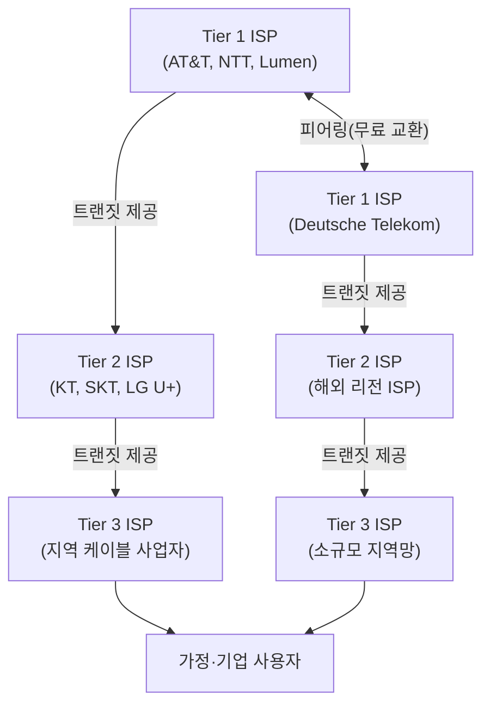

## 인터넷을 파는 사람들

"인터넷에 연결한다"는 말은 자연스럽게 쓰지만, 실제로 그 연결을 제공하는 주체가 누구인지는 잘 모르는 경우가 많다. 우리는 KT, SKT, LG U+에 돈을 내고 인터넷을 쓴다. 이 회사들이 바로 **ISP(Internet Service Provider)**, 즉 인터넷 서비스 제공자다.[^isp]

그런데 KT가 전 세계 서버에 직접 연결선을 깔아 둔 걸까? 당연히 아니다. 인터넷은 하나의 회사가 운영하는 단일 망이 아니라, 수천 개의 ISP가 서로 계약을 맺고 트래픽을 주고받으며 만들어진 **분산된 네트워크의 집합**이다. 이 구조를 이해하면 인터넷의 본질에 한 걸음 가까워진다.

---

## ISP의 세 계층

ISP는 규모와 역할에 따라 크게 세 계층으로 나눌 수 있다.

### Tier 1 ISP

Tier 1은 전 세계 인터넷 백본(backbone)을 구성하는 최상위 사업자다. AT&T, NTT, Lumen(구 CenturyLink), Deutsche Telekom 등이 여기에 해당한다.[^tier1]

이들의 특징은 **다른 ISP에게 트랜짓 비용을 내지 않는다**는 점이다. 전 세계 모든 Tier 1 ISP는 서로 **피어링(Peering)** 계약을 맺고 무료로 트래픽을 교환한다. 전 세계 어디로든 도달할 수 있는 경로를 직접 보유하고 있기 때문이다.

### Tier 2 ISP

Tier 1과 Tier 3의 중간 계층이다. 한국의 KT, SKT, LG U+가 여기에 해당한다. Tier 2 ISP는 일부 구간은 직접 연결(피어링)로 처리하고, 닿지 않는 구간은 Tier 1에게 **트랜짓(Transit) 비용을 지불**해 경로를 확보한다.

즉, KT가 미국 AWS 서버와 통신할 때는 KT → Tier 1 ISP → AWS 리전 네트워크 경로를 따라가게 된다.

### Tier 3 ISP

가정과 기업에 직접 인터넷을 연결하는 마지막 단계다. 지역 케이블 사업자, 소규모 인터넷 사업자들이 여기에 속한다. 이들은 Tier 2 ISP에게 비용을 내고 상위 인터넷에 접근한다.

---

## 트랜짓(Transit) vs 피어링(Peering)

ISP 간 트래픽 교환 방식은 크게 두 가지로 나뉜다.

| 구분 | 트랜짓 (Transit) | 피어링 (Peering) |
|------|-----------------|-----------------|
| 방향 | 상위 ISP → 하위 ISP | 동등한 ISP 간 |
| 비용 | 하위 ISP가 상위에 지불 | 무료 (혹은 협상) |
| 범위 | 전체 인터넷 경로 제공 | 상호 트래픽만 교환 |
| 예시 | KT가 AT&T에게 비용 지불 | KT와 SKT 직접 연결 |

**트랜짓**은 "당신이 가진 모든 경로를 나에게 팔아라"는 계약이다. 돈을 내고 상위 ISP의 경로를 통째로 빌리는 것이다.

**피어링**은 "우리 둘 사이 트래픽은 서로 무료로 교환하자"는 계약이다. 양쪽 트래픽 규모가 비슷할 때 성립하며, 주로 [IXP(인터넷 교환 포인트)](./ixp)에서 이루어진다.

---

## BGP — 경로를 결정하는 언어

ISP 간에 경로 정보를 주고받는 프로토콜이 **BGP(Border Gateway Protocol)**이다.[^bgp] 각 ISP는 하나의 **AS(Autonomous System, 자율 시스템)**로 식별되며, BGP를 통해 "나는 이 IP 대역에 도달할 수 있다"는 정보를 이웃 ISP에게 광고한다.

BGP는 인터넷의 GPS라고 할 수 있다. 단, 가장 빠른 경로가 아니라 **가장 비용이 적은 경로** 혹은 **정책상 선호되는 경로**를 선택한다는 점이 일반 라우팅과 다르다. 이 때문에 BGP 설정 실수 하나가 전 세계 트래픽 경로를 바꿔버리는 사고(BGP Hijacking, BGP Leak)로 이어지기도 한다.

---

## 핵심 인사이트

> 인터넷은 하나의 회사가 운영하는 것이 아니다. 수천 개의 ISP가 트랜짓과 피어링 계약으로 얽혀서 만들어진 네트워크다. 우리가 내는 인터넷 요금의 일부는 이 계층 구조를 타고 올라가 결국 전 세계 백본을 유지하는 비용으로 흘러들어간다.

인터넷의 "연결성"은 기술만으로 만들어지는 게 아니라, 수천 개의 사업자 간 **비즈니스 계약**으로 유지된다. ISP가 파산하거나 계약이 끊기면 실제로 인터넷 경로가 사라지기도 한다.

---

## 관련 글

- [IXP — ISP들이 만나는 물리적 교차로 →](/post/ixp-internet-exchange-point) — 피어링이 실제로 일어나는 물리적 공간
- [CDN — 콘텐츠를 가장 빠른 경로로 전달하는 방법 →](/post/cdn-content-delivery-network) — ISP 네트워크 위에서 작동하는 콘텐츠 배포 전략
- [회선 교환 vs 패킷 교환 →](/post/circuit-vs-packet-switching) — 인터넷이 선택한 데이터 전달 방식

---

[^isp]: Internet Service Provider, <a href="https://en.wikipedia.org/wiki/Internet_service_provider" target="_blank">Wikipedia</a>
[^tier1]: Tier 1 network, <a href="https://en.wikipedia.org/wiki/Tier_1_network" target="_blank">Wikipedia</a>
[^bgp]: Border Gateway Protocol, <a href="https://en.wikipedia.org/wiki/Border_Gateway_Protocol" target="_blank">Wikipedia</a>
