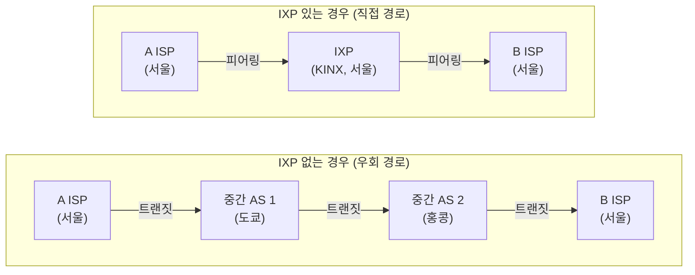
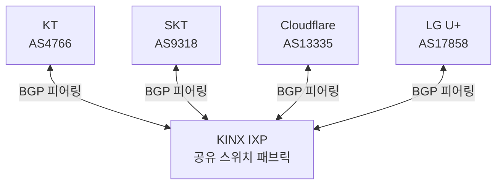

## 인터넷에도 교차로가 있다

고속도로에는 인터체인지가 있다. 서로 다른 도로망이 만나는 지점이다. 인터넷에도 같은 역할을 하는 시설이 있다. 바로 **IXP(Internet Exchange Point, 인터넷 교환 포인트)**다.[^ixp]

IXP가 없다면 어떻게 될까? A ISP 사용자가 B ISP 서버에 접근할 때, 데이터는 C, D, E ISP를 거쳐 돌아가는 긴 경로를 타야 한다. 홉(hop)이 늘어날수록 지연이 커지고, 중간 경유 ISP에게 내야 하는 **트랜짓 비용**도 쌓인다.

IXP는 이 문제를 우아하게 해결한다.

---

## IXP 없을 때 vs 있을 때

IXP가 있으면 같은 IXP에 연결된 두 AS는 **직접 트래픽을 교환**할 수 있다. 중간 사업자를 거칠 이유가 없다.

---

## IXP의 구조

IXP는 물리적으로 **대형 데이터센터 안의 스위치 패브릭(Switch Fabric)**이다.[^ixp] 수십 개에서 수백 개의 ISP, CDN, 기업망이 이 스위치에 물리적으로 케이블을 연결한다.

각 참여자는 BGP(Border Gateway Protocol)[^bgp]를 통해 서로의 IP 경로 정보를 교환한다. "나는 이 IP 대역을 가지고 있다"고 광고하고, 상대방도 마찬가지로 광고한다. 이렇게 서로가 서로의 경로를 학습하면 직접 통신이 가능해진다.

---

## 피어링(Peering) 계약

IXP에서 이루어지는 트래픽 교환 방식을 **피어링**이라 부른다.[^peering] 피어링에는 두 가지 형태가 있다.

| 구분 | 공개 피어링 (Public Peering) | 비공개 피어링 (Private Peering) |
|------|-------|------|
| 장소 | IXP의 공유 스위치 | 전용 직접 연결(전용선) |
| 비용 | IXP 포트 이용료만 | 전용선 회선 비용 |
| 대상 | 동일 IXP 참여자 모두 | 특정 두 사업자 간 |
| 예시 | KINX에서 다수 ISP와 연결 | Netflix-KT 직접 전용선 |

트래픽 규모가 작을 때는 공개 피어링이 효율적이다. 그러나 Netflix와 KT처럼 트래픽 규모가 압도적으로 크면, IXP 공유 스위치를 거치는 것보다 **전용 직접 연결(Private Peering)**을 구성하는 편이 더 안정적이다.

---

## IXP가 가져다 주는 이점

IXP 참여로 얻는 혜택은 세 가지로 정리할 수 있다.

**1. 비용 절감**
트랜짓 비용은 MB당 단가가 붙는다. IXP에서 직접 피어링하면 그 트래픽에 대한 트랜짓 비용이 0이 된다. 트래픽이 클수록 절감 효과가 크다.

**2. 지연 감소**
서울의 A ISP에서 서울의 B ISP로 가는 트래픽이 도쿄를 경유할 이유가 없다. IXP를 통한 직접 경로는 물리적 거리와 홉 수를 동시에 줄인다.

**3. 경로 안정성 향상**
중간 AS를 많이 거칠수록 그 중 하나가 장애를 일으킬 확률이 높아진다. 직접 경로는 의존하는 외부 AS 수를 줄여 경로 안정성을 높인다.

---

## 대형 IXP 사례

전 세계에는 수백 개의 IXP가 운영되고 있다.

| IXP | 위치 | 특징 |
|-----|------|------|
| **DE-CIX** | 프랑크푸르트 | 세계 최대 IXP, 피크 트래픽 14+ Tbps |
| **AMS-IX** | 암스테르담 | 유럽 주요 IXP, 1,000개 이상 연결 사업자 |
| **LINX** | 런던 | 영국 주요 인터넷 허브 |
| **KINX** | 서울 | 한국 최대 IXP, 국내 ISP·CDN 집결 |
| **JPIX / JPNAP** | 도쿄 | 일본 주요 IXP |

한국의 **KINX(Korea Internet Neutral Exchange)**는 국내 주요 ISP, CDN, 클라우드 사업자들이 모이는 중심 교환 포인트다.[^kinx] 국내 트래픽의 상당 부분이 KINX를 통해 ISP 간을 이동한다.

---

## AS와 BGP의 관계

IXP를 제대로 이해하려면 **AS(Autonomous System)**[^as] 개념이 필요하다.

인터넷에서 각 ISP나 대형 기업은 하나의 AS로 식별된다. AS는 고유한 번호(ASN)를 부여받으며, 자신이 관리하는 IP 대역을 BGP로 광고한다. IXP에서 두 AS가 피어링을 맺으면, 서로의 BGP 광고를 수신해 직접 경로를 라우팅 테이블에 등록한다.

이 구조에서 KT 사용자가 Cloudflare CDN에 접근하면, 데이터는 해외를 돌아가지 않고 KINX를 통해 직접 Cloudflare 엣지로 전달된다.

---

## 핵심 인사이트

> 인터넷 트래픽의 대부분은 실제로 IXP를 통해 지름길을 찾는다. 유튜브 영상이 한국에서 빠르게 재생되는 이유 중 하나는, Google이 KINX 같은 IXP에 참여해 국내 ISP와 직접 피어링을 맺고 있기 때문이다.

IXP는 인터넷의 인프라 중에서도 가장 덜 알려져 있지만, 인터넷 성능과 비용 구조에 가장 직접적인 영향을 미치는 시설 중 하나다.

---

## 관련 글

- [ISP — 인터넷 접속을 파는 사람들](./isp): IXP에서 만나는 사업자들의 계층 구조
- [CDN — 콘텐츠를 가장 빠른 경로로 전달하는 방법](./cdn): IXP 피어링을 활용해 속도를 높이는 콘텐츠 네트워크
- [회선 교환 vs 패킷 교환](./circuit-vs-packet-switching): IXP가 주고받는 데이터의 전달 방식

---

[^ixp]: Internet exchange point, <a href="https://en.wikipedia.org/wiki/Internet_exchange_point" target="_blank">Wikipedia</a>
[^peering]: Peering, <a href="https://en.wikipedia.org/wiki/Peering" target="_blank">Wikipedia</a>
[^bgp]: Border Gateway Protocol, <a href="https://en.wikipedia.org/wiki/Border_Gateway_Protocol" target="_blank">Wikipedia</a>
[^as]: Autonomous system (Internet), <a href="https://en.wikipedia.org/wiki/Autonomous_system_(Internet)" target="_blank">Wikipedia</a>
[^kinx]: KINX, <a href="https://en.wikipedia.org/wiki/Korea_Internet_Neutral_Exchange" target="_blank">Wikipedia</a>
