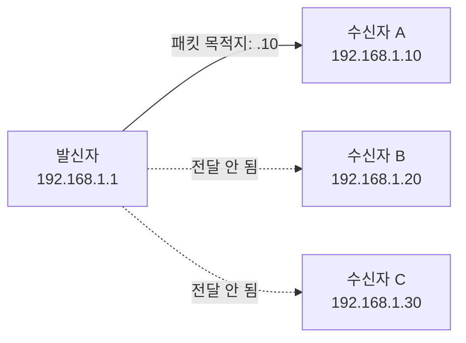
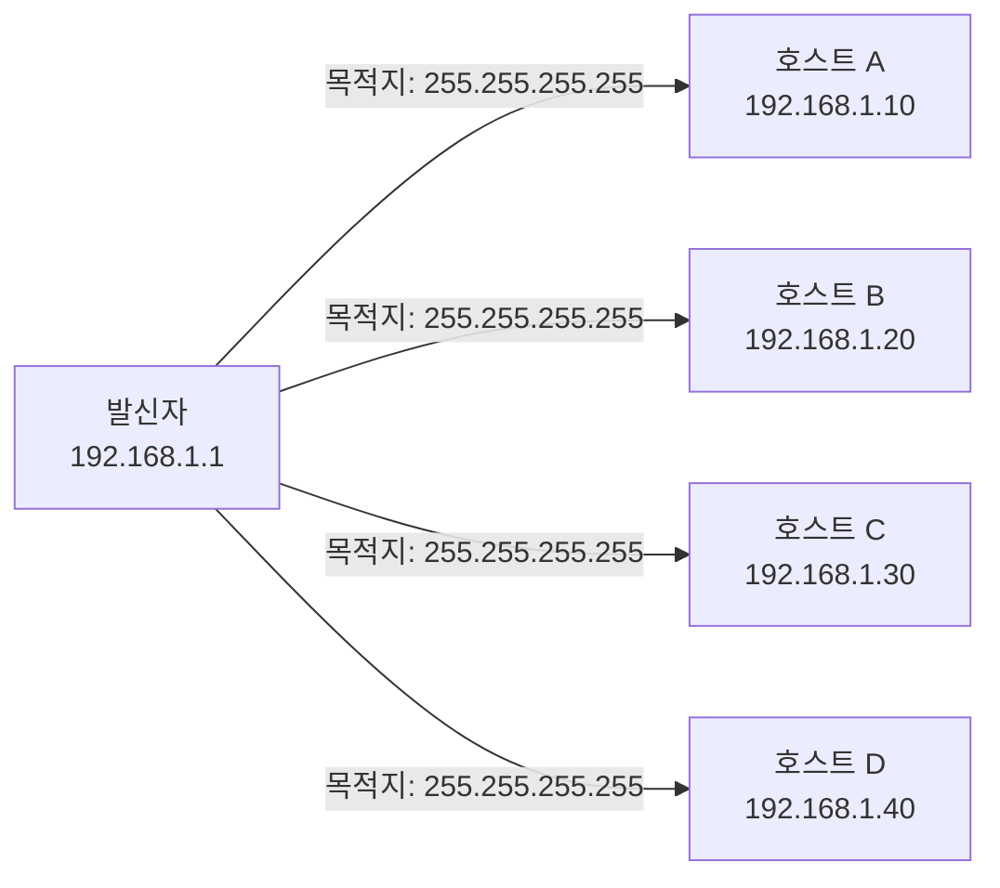
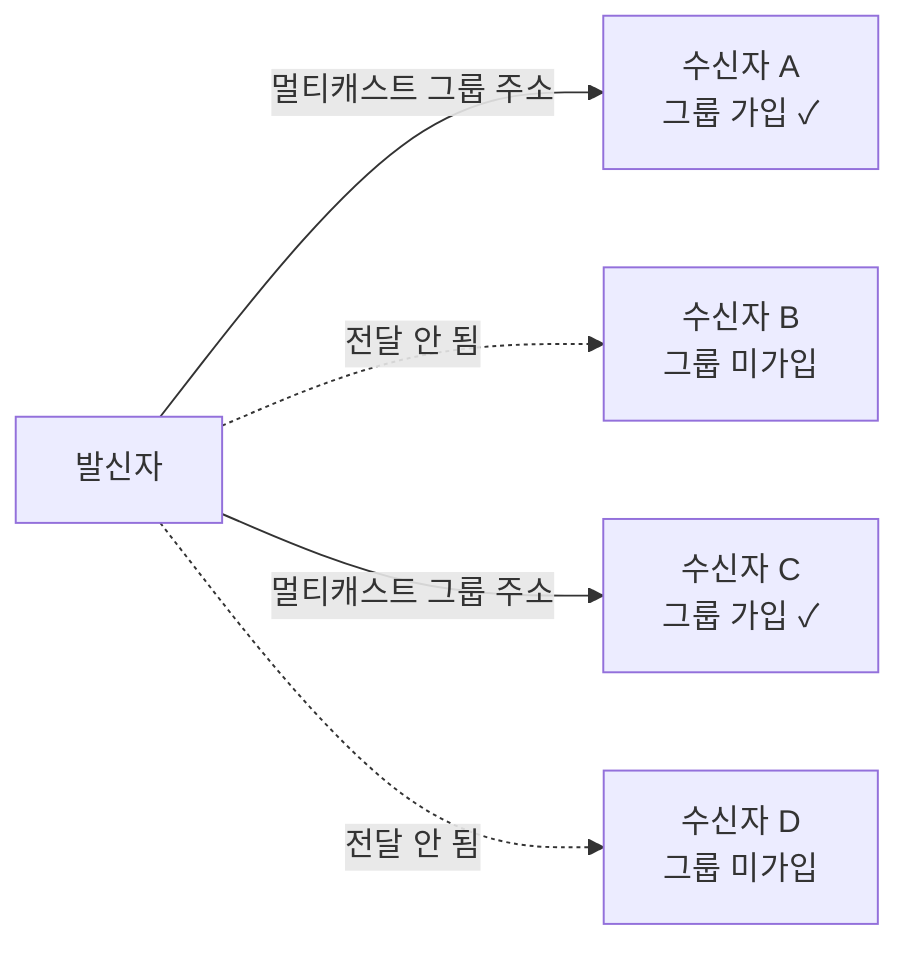

## 데이터를 누구에게 보낼 것인가

네트워크에서 패킷을 보낼 때, 수신자를 어떻게 지정하느냐에 따라 전송 방식이 달라진다.  
크게 세 가지로 나뉜다: **유니캐스트(Unicast)**, **브로드캐스트(Broadcast)**, **멀티캐스트(Multicast)**.  
웹 검색, 파일 다운로드, 영상 스트리밍 — 이 모두는 상황에 따라 서로 다른 전송 방식을 사용한다.[^unicast][^broadcast]

## 유니캐스트 — 1:1 정밀 전달

유니캐스트는 발신자가 **특정 단일 수신자**에게 데이터를 보내는 방식이다.  
웹 브라우저에서 서버에 HTTP 요청을 보낼 때, 그 서버의 IP 주소가 정확히 지정된다. 이것이 유니캐스트다.

### 유니캐스트가 쓰이는 곳

- HTTP/HTTPS 웹 통신
- FTP 파일 전송
- SSH 원격 접속
- 일반적인 TCP 기반 통신 대부분

유니캐스트의 특징은 **정밀성**이다. 불필요한 곳에 패킷이 흘러가지 않아 효율적이다.  
단, 같은 데이터를 100명에게 보내려면 100개의 개별 스트림이 필요하다. 이때 비효율이 생긴다.

## 브로드캐스트 — 1:전체 탐색

브로드캐스트는 **같은 네트워크(브로드캐스트 도메인)의 모든 호스트**에게 패킷을 동시에 보내는 방식이다.  
목적지 IP로 `255.255.255.255`(제한 브로드캐스트) 또는 서브넷 브로드캐스트 주소를 사용한다.

### 브로드캐스트가 쓰이는 곳

- **ARP(Address Resolution Protocol)**: IP 주소에 대응하는 MAC 주소를 모를 때 "이 IP 가진 사람 누구야?"라고 전체에 물어본다.[^arp]
- **DHCP Discovery**: 새로 연결된 장치가 IP를 받기 위해 "IP 주는 서버 있어요?"라고 전체에 송신한다.[^dhcp]

브로드캐스트의 핵심은 **발견(Discovery)** 이다. 상대방의 주소를 아직 모를 때 네트워크 전체에 물어보는 용도다.

### 브로드캐스트의 한계

브로드캐스트는 도메인 내 모든 장치의 CPU를 잠깐이나마 점유한다.  
장치가 수십 개라면 문제없지만, 수천 개로 늘어나면 브로드캐스트 트래픽만으로 네트워크가 포화될 수 있다.  
이 때문에 **라우터는 브로드캐스트 패킷을 다른 네트워크로 전달하지 않는다**.  
라우터가 네트워크를 분리하는 이유 중 하나가 바로 브로드캐스트 도메인을 제한하기 위해서다.

## 멀티캐스트 — 1:특정 그룹

멀티캐스트는 유니캐스트와 브로드캐스트의 중간이다.  
**관심 있는 특정 그룹**에만 패킷을 전달한다. IP 주소 대역 `224.0.0.0 ~ 239.255.255.255`를 멀티캐스트용으로 사용한다.[^multicast]

### 멀티캐스트가 쓰이는 곳

- **IPTV, 라이브 스트리밍**: 같은 영상을 수천 명에게 보낼 때, 유니캐스트면 수천 개의 스트림이 필요하지만 멀티캐스트는 단 하나의 스트림으로 처리한다.
- **라우팅 프로토콜**: OSPF, PIM 등의 라우팅 업데이트 교환에 멀티캐스트를 사용한다.

## 세 가지 방식 비교

| 구분 | 유니캐스트 | 브로드캐스트 | 멀티캐스트 |
| --- | --- | --- | --- |
| 수신자 | 단일 지정 | 동일 네트워크 전체 | 그룹 가입자만 |
| 대역폭 효율 | 수신자 수만큼 증가 | 낮음 (전체 전파) | 높음 (그룹만) |
| 대표 용도 | HTTP, SSH | ARP, DHCP | IPTV, 라우팅 |
| 라우터 통과 | 가능 | 불가(차단) | 가능(설정 시) |

## 핵심 인사이트

브로드캐스트는 **상대를 모를 때 쓰는 질문**이다. ARP로 MAC 주소를 찾고, DHCP로 IP 서버를 발견한다.  
정보를 얻고 나면 이후 통신은 **유니캐스트**로 전환한다. "모를 때 브로드캐스트, 알고 나서 유니캐스트"가 실제 네트워크의 작동 패턴이다.

---

## 관련 글

- [회선 교환 vs 패킷 교환 →](/post/circuit-vs-packet-switching) — 패킷이 어떤 방식으로 전달되는지와 맞닿은 개념
- [IP와 ARP — 주소와 경로의 언어 →](/post/micro-ip-arp) — ARP·DHCP에서 브로드캐스트가 쓰이는 맥락

[^unicast]: Unicast, <a href="https://en.wikipedia.org/wiki/Unicast" target="_blank">Wikipedia</a>
[^broadcast]: Broadcasting (networking), <a href="https://en.wikipedia.org/wiki/Broadcasting_(networking)" target="_blank">Wikipedia</a>
[^arp]: Address Resolution Protocol, <a href="https://en.wikipedia.org/wiki/Address_Resolution_Protocol" target="_blank">Wikipedia</a>
[^dhcp]: Dynamic Host Configuration Protocol, <a href="https://en.wikipedia.org/wiki/Dynamic_Host_Configuration_Protocol" target="_blank">Wikipedia</a>
[^multicast]: Multicast, <a href="https://en.wikipedia.org/wiki/Multicast" target="_blank">Wikipedia</a>
