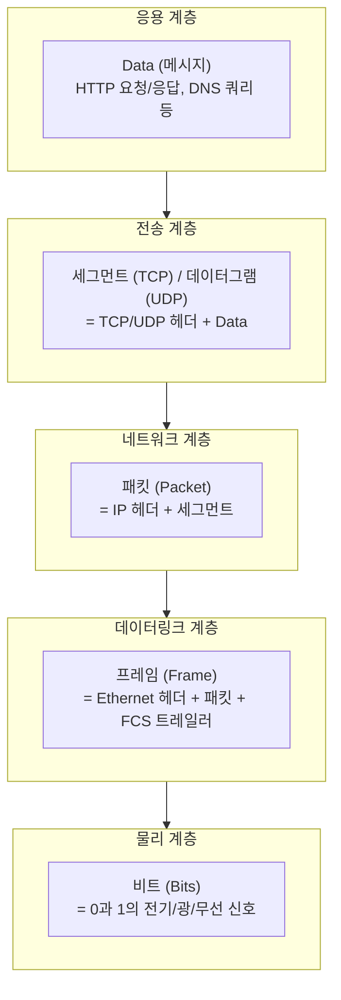
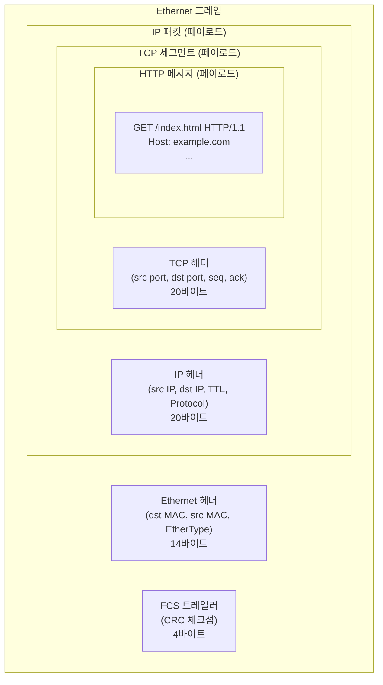
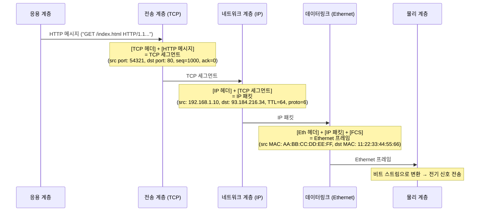
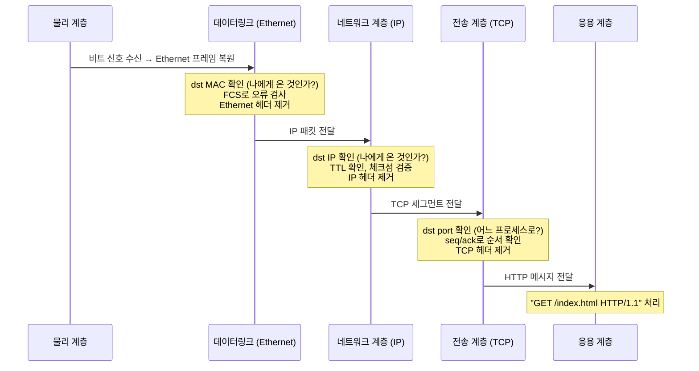
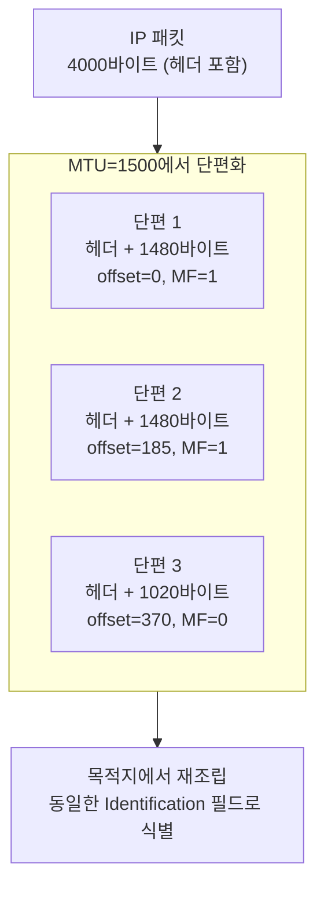

## 캡슐화란 무엇인가

네트워크에서 데이터를 전송할 때, 상위 계층의 데이터는 그냥 전선에 흘러가지 않는다.
각 계층은 자신이 담당하는 **제어 정보(헤더)**를 데이터에 덧붙인다.

마치 편지를 봉투에 넣고, 그 봉투를 또 다른 봉투에 넣는 것처럼 — 이 과정을 **캡슐화(Encapsulation)**라 한다.[^encapsulation]

수신 측에서는 역순으로 봉투를 열어가며 헤더를 제거하는데, 이를 **역캡슐화(De-encapsulation)**라 한다.

## PDU — 계층별 데이터 단위

각 계층에서 다루는 데이터 덩어리를 **PDU(Protocol Data Unit)**라 한다.
계층마다 다른 이름이 붙는다.[^pdu]

| 계층 | PDU 이름 | 포함 내용 |
|------|---------|----------|
| 응용 (7) | 데이터 / 메시지 | 실제 전달할 내용 (HTTP 메시지, DNS 쿼리 등) |
| 전송 (4) | 세그먼트 (TCP) / 데이터그램 (UDP) | 전송 계층 헤더 + 상위 데이터 |
| 네트워크 (3) | 패킷 (Packet) | IP 헤더 + 세그먼트 |
| 데이터링크 (2) | 프레임 (Frame) | Ethernet 헤더 + 패킷 + 트레일러(FCS) |
| 물리 (1) | 비트 (Bit) | 프레임을 0/1로 인코딩한 신호 |

## 헤더와 페이로드

모든 PDU는 두 부분으로 구성된다.

- **헤더(Header)**: 해당 계층의 제어 정보. 주소, 길이, 오류 검출 코드 등.
- **페이로드(Payload)**: 상위 계층에서 내려온 데이터. 하위 계층 입장에서는 페이로드가 "무엇인지" 알 필요가 없다.

> 이 구조에서 각 계층은 자신의 헤더만 처리한다.
> IP는 Ethernet 헤더를 해석하지 않고, TCP는 IP 헤더를 해석하지 않는다.
> 이것이 계층화의 핵심 가치 — **캡슐화가 계층 독립성을 구현한다**.

## 캡슐화 전체 과정

### 송신 측 (캡슐화)

실제 HTTP 요청(`GET /index.html HTTP/1.1`)이 어떻게 전기 신호가 되는지 따라가보자.

### 수신 측 (역캡슐화)

수신 측은 역순으로 각 헤더를 제거한다.

## 각 헤더의 핵심 필드 요약

### Ethernet 헤더 (14바이트)

| 필드 | 크기 | 용도 |
|------|------|------|
| Destination MAC | 6바이트 | 목적지 MAC 주소 |
| Source MAC | 6바이트 | 출발지 MAC 주소 |
| EtherType | 2바이트 | 페이로드 프로토콜 (0x0800 = IPv4, 0x0806 = ARP, 0x86DD = IPv6) |

+ **FCS 트레일러** (4바이트): CRC-32 오류 검출 코드

### IP 헤더 (20바이트 기본, 최대 60바이트)

핵심 필드: 출발지/목적지 IP 주소, TTL, Protocol (6=TCP, 17=UDP), 체크섬

→ 상세 내용: [IP와 ARP](/post/micro-ip-arp)

### TCP 헤더 (20바이트 기본, 최대 60바이트)

핵심 필드: 출발지/목적지 포트, Sequence Number, Acknowledgment Number, Flags, Window Size

→ 상세 내용: [TCP와 UDP](/post/micro-tcp-udp)

## 단편화 — MTU를 넘는 패킷의 처리

각 네트워크 링크는 한 번에 전송할 수 있는 최대 프레임 크기 **MTU(Maximum Transmission Unit)**가 있다.
Ethernet의 표준 MTU는 **1500바이트**다.

IP 패킷이 MTU를 초과하면 IP 계층에서 **단편화(Fragmentation)**가 발생한다.

- **DF(Don't Fragment) 플래그**: 단편화 금지. 설정 시 라우터가 ICMP "Fragmentation Needed" 반환 → PMTUD(Path MTU Discovery) 기반
- **MF(More Fragments) 플래그**: 뒤에 더 단편이 있음을 표시
- **Fragment Offset**: 원본 데이터 내 이 단편의 위치 (8바이트 단위)

## 캡슐화가 주는 것

1. **계층 독립성**: 각 계층은 자신의 헤더만 처리하고 나머지는 불투명한 페이로드로 본다. Ethernet을 Wi-Fi로 바꿔도 IP, TCP, HTTP는 변경 없다.

2. **프로토콜 교체 가능성**: IP → IPv6, TCP → QUIC으로 교체해도 다른 계층은 영향받지 않는다.

3. **멀티플렉싱**: 하나의 IP 패킷이 TCP/UDP를 구분하고, 하나의 TCP 연결이 여러 포트를 구분해 다수의 응용이 공존한다.

## 관련 글

- [OSI 7계층 모델](/post/micro-osi-7layer): 각 PDU가 속한 [계층의 역할](/post/micro-osi-7layer) 전체 그림
- [TCP/IP 참조 모델](/post/micro-tcp-ip-model): [TCP/IP 4계층](/post/micro-tcp-ip-model)에서의 캡슐화 구조
- [IP와 ARP — 주소와 경로의 언어](/post/micro-ip-arp): [IP 헤더](/post/micro-ip-arp) 상세 구조
- [TCP와 UDP — 신뢰성과 속도의 트레이드오프](/post/micro-tcp-udp): [TCP 헤더](/post/micro-tcp-udp)와 세그먼트 구조

---

[^encapsulation]: Encapsulation (networking), <a href="https://en.wikipedia.org/wiki/Encapsulation_(networking)" target="_blank">Wikipedia</a>
[^pdu]: Protocol data unit, <a href="https://en.wikipedia.org/wiki/Protocol_data_unit" target="_blank">Wikipedia</a>
[^mtu]: Maximum transmission unit, <a href="https://en.wikipedia.org/wiki/Maximum_transmission_unit" target="_blank">Wikipedia</a>
[^ethernet-frame]: Ethernet frame, <a href="https://en.wikipedia.org/wiki/Ethernet_frame" target="_blank">Wikipedia</a>
[^fragmentation]: IP fragmentation, <a href="https://en.wikipedia.org/wiki/IP_fragmentation" target="_blank">Wikipedia</a>
