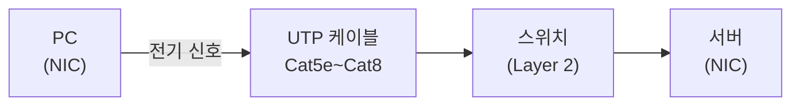

랜선을 꽂으면 인터넷이 된다.

너무 당연한 말처럼 들리지만, 저 짧은 문장 안에는 꽤 많은 것들이 숨어 있다. 케이블 안에서 신호가 어떻게 오가는지, 컴퓨터는 그 신호를 어떻게 알아보는지, 그리고 그 규칙은 누가 만들었는지.

이 글은 그 물리적인 기반, 즉 이더넷과 NIC와 케이블에 대한 이야기다.

---

## 이더넷이 처음 나왔을 때

1973년, 제록스(Xerox)의 연구소 PARC에서 Bob Metcalfe라는 엔지니어가 재밌는 문제를 고민하고 있었다. 연구소 안에 여러 컴퓨터가 있는데, 이걸 어떻게 연결하면 좋을까. 그가 만들어낸 것이 **이더넷(Ethernet)**이다.[^ieee8023]

이름이 묘하다. 'Ether'는 예전에 빛이 파동으로 전달되는 매질이라 여겼던 가상의 물질 이름이다. 신호가 보이지 않는 매질을 타고 퍼진다는 뉘앙스였는데, 오늘날 이더넷은 그 이름 그대로 전선 하나에 여러 기기가 동시에 신호를 보내는 방식으로 시작했다.

1980년대에 디지털이퀴프먼트(DEC), 인텔, 제록스가 공동으로 이더넷 표준을 정리했고, 이후 IEEE가 **802.3** 번호로 공식 표준화했다. 거기서 지금까지 계속 발전하고 있다.

### 속도가 어떻게 올라왔는가

처음 이더넷은 10 Mbps였다. 당시 파일 하나가 수십 KB였으니 충분했다.

| 표준 | 이름 | 속도 | 등장 시기 |
|------|------|------|---------|
| IEEE 802.3 | 이더넷 | 10 Mbps | 1983 |
| IEEE 802.3u | 패스트 이더넷 | 100 Mbps | 1995 |
| IEEE 802.3ab | 기가비트 이더넷 | 1 Gbps | 1999 |
| IEEE 802.3an | 10기가 이더넷 | 10 Gbps | 2006 |

지금 사무실 대부분은 기가비트 환경이고, 데이터센터는 10G, 40G, 100G도 흔하다. 이름은 계속 '이더넷'이지만, 속도는 1000배가 올라갔다.

한 가지 흥미로운 사실은 1000BASE-T(기가비트)부터 케이블의 4쌍을 전부 동시에 쓴다는 것이다. 100Mbps까지는 4쌍 중 2쌍만 썼는데, 기가비트부터는 에코 캔슬링 기술을 써서 모든 쌍으로 동시에 양방향 전송을 한다. 케이블을 보면 똑같이 생겼어도 내부에서 꽤 다른 일이 벌어지고 있다.

---

## NIC — 컴퓨터와 네트워크 사이의 번역기

NIC(Network Interface Card)는 컴퓨터를 물리적으로 네트워크에 연결하는 하드웨어다. 랜포트가 있는 그 부분이다. 요즘은 메인보드에 통합돼 있어서 별도 카드 형태를 보기 힘들지만, 역할은 그대로다.

NIC가 하는 일을 한 문장으로 표현하면 이렇다: **컴퓨터 안의 디지털 데이터를 전선 위의 전기 신호로 바꾸고, 반대로 신호를 받아 데이터로 복원한다.**

그런데 네트워크에 여러 기기가 연결돼 있으면 신호를 누구한테 보내는지 구분해야 한다. 이때 쓰는 것이 **MAC 주소**다.

### MAC 주소가 뭔가

MAC(Media Access Control) 주소는 네트워크 장치마다 고유하게 부여된 48비트 식별자다. 주로 이렇게 표시된다:

```
00:1A:2B:3C:4D:5E
```

앞 24비트는 **OUI(Organizationally Unique Identifier)**로, 제조사를 나타낸다. 뒤 24비트는 제조사가 개별 장치에 붙이는 고유 번호다. `00:1A:2B`가 인텔이라면 인텔이 만든 NIC라는 의미다.[^ieee-mac]

48비트면 약 281조 개의 주소를 만들 수 있다. 지구상 모든 사람이 수백만 개씩 갖고도 남는다.

한 가지 알아두면 좋은 것: MAC 주소는 소프트웨어로 바꿀 수 있다. 하드웨어에 새겨진 값을 "burnt-in address"라고 하고, 운영체제가 덮어쓴 값을 "locally administered address"라고 한다. 보안이나 프라이버시 이유로 변경하는 경우도 있다.

### 전이중(Full-Duplex)과 반이중(Half-Duplex)

NIC에는 두 가지 동작 모드가 있다.

**반이중(Half-Duplex)**은 한 번에 송신 또는 수신 하나만 할 수 있다. 무전기와 비슷하다. 말하고 있을 때는 들을 수 없다. 허브 환경에서는 여러 기기가 하나의 선을 공유하기 때문에 반이중으로 동작한다.

**전이중(Full-Duplex)**은 동시에 송수신이 가능하다. 스위치와 연결될 때 사용한다. 현대 네트워크는 거의 전이중이다.

**오토니고시에이션(Auto-Negotiation)**은 두 장치가 연결될 때 서로 "나는 기가비트도 되고 전이중도 가능해"라고 광고하면서 가장 좋은 조합을 자동으로 협상하는 기능이다. 요즘은 기본 동작이라 의식할 일이 없지만, 한쪽이 수동 설정이고 한쪽이 오토니고시에이션이면 **듀플렉스 불일치(Duplex Mismatch)**가 생겨서 성능이 심각하게 떨어진다. 이걸 모르고 몇 시간 삽질하는 경우가 종종 있다.

---

## 케이블 — Cat 뒤에 붙은 숫자의 의미

UTP 케이블(흔히 '랜선')에는 Cat5e, Cat6, Cat6a 같은 이름이 붙는다. 'Cat'은 Category의 줄임말이고, 뒤의 숫자는 성능 등급이다.

| 케이블 | 최대 속도 | 최대 거리 | 주파수 | 특징 |
|--------|---------|---------|------|------|
| Cat5e | 1 Gbps | 100m | 100 MHz | 현재도 사무용으로 충분 |
| Cat6 | 1 Gbps (100m), 10 Gbps (55m 이내) | 100m | 250 MHz | 크로스토크 감소 |
| Cat6a | 10 Gbps | 100m | 500 MHz | 10G 전체 거리 지원 |
| Cat7 | 10 Gbps | 100m | 600 MHz | 쉴딩 있음, 커넥터 비표준 |
| Cat8 | 25~40 Gbps | 30m | 2000 MHz | 데이터센터 전용 |

대부분의 가정이나 사무실 환경에서는 Cat5e나 Cat6으로 충분하다. 만약 앞으로 10G 환경을 고려하고 있다면 **Cat6a**가 현실적인 선택이다. 100m 전 구간에서 10 Gbps를 지원하는 가장 보편적인 기준이다.

Cat7과 Cat8은 쉴딩(Shielding)이 들어가서 외부 노이즈에 강하지만, 무겁고 뻣뻣하고 비싸다. Cat7은 커넥터가 RJ-45 표준을 벗어나는 경우도 있다. 특별한 이유가 없다면 Cat6a로 충분하다.



케이블 안에는 4쌍, 8가닥의 선이 꼬여 있다. 꼬아놓는 이유는 **크로스토크(Crosstalk)** 때문이다. 인접한 선끼리 전자기 간섭이 생기는데, 일정 간격으로 꼬으면 그 간섭이 서로 상쇄된다. 단순해 보이는 설계지만 수십 년째 유효하다.

---

## 정리하자면

이더넷은 하나의 규격이 아니라 30년 넘게 계속 발전해온 표준 체계다. 10 Mbps에서 100G까지 이름은 같고 속도는 천 배 넘게 올라갔다.

NIC는 그 이더넷 신호를 주고받는 하드웨어이고, MAC 주소라는 고유 식별자로 네트워크 안에서 자신을 드러낸다.

케이블은 그 신호가 달리는 물리적인 통로다. 어떤 케이블을 쓰느냐에 따라 얼마나 멀리, 얼마나 빠르게 보낼 수 있는지가 결정된다.

이 세 가지가 맞물려야 비로소 물리적 연결이 완성된다. 랜선 하나 꽂는 행위가 이걸 전부 한 번에 시작시킨다.

다음에는 이 연결된 기기들이 데이터를 주고받을 때 신호를 어떻게 나누는지, 허브와 스위치가 거기서 어떤 역할을 하는지 이어서 살펴보겠다.

---

## References

[^ieee8023]: IEEE 802.3 Ethernet Working Group: https://standards.ieee.org/ieee/802.3/6935/
[^ieee8023ab]: IEEE 802.3ab — 1000BASE-T (Gigabit Ethernet): https://standards.ieee.org/ieee/802.3ab/2165/
[^ieee8023an]: IEEE 802.3an — 10GBASE-T: https://standards.ieee.org/ieee/802.3an/3560/
[^ieee-mac]: IEEE MAC Address Registration Authority: https://standards.ieee.org/products-programs/regauth/mac/
[^cisco-autoneg]: Cisco — Configuring and Troubleshooting Ethernet 10/100/1000Mb Half/Full Duplex Auto-Negotiation: https://www.cisco.com/c/en/us/support/docs/lan-switching/ethernet/10561-3.html
