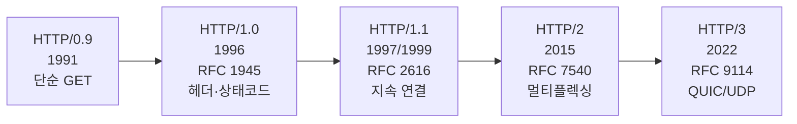
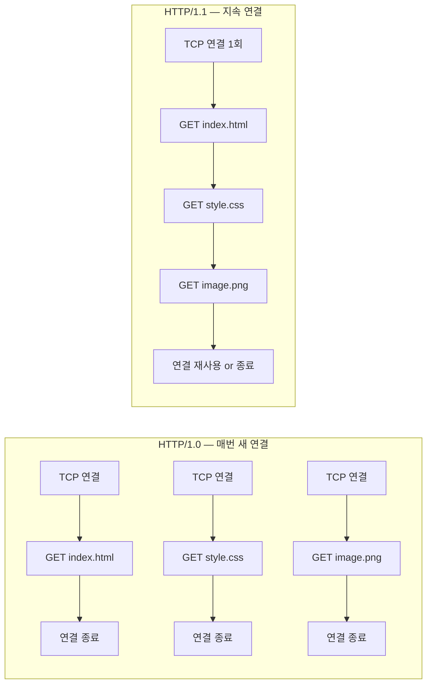
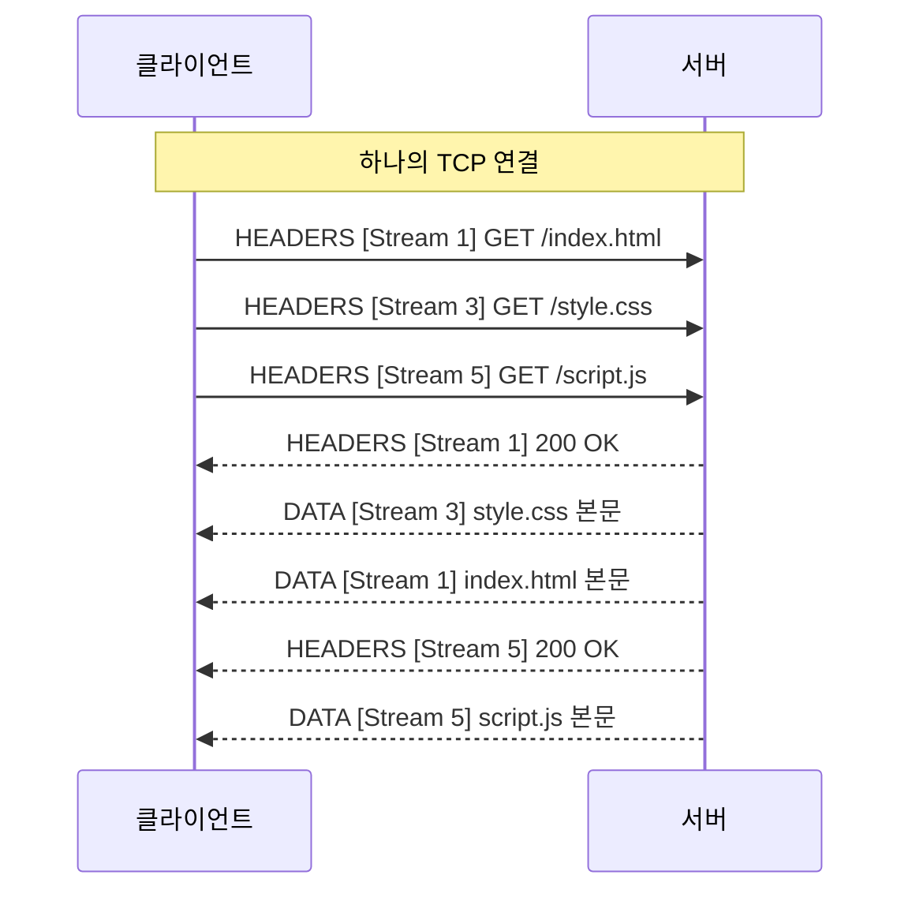
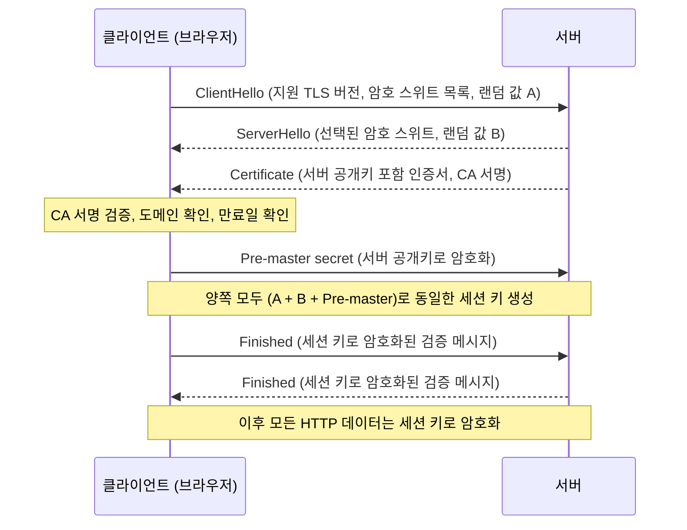
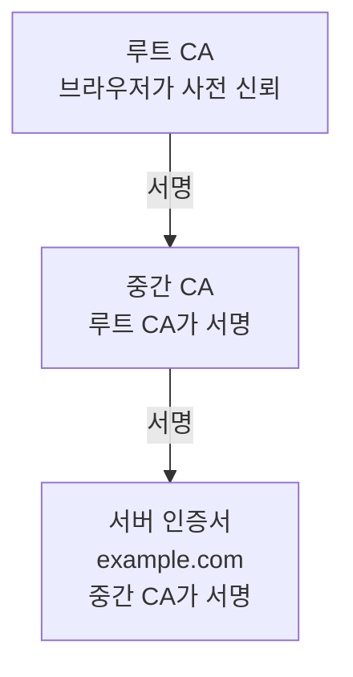

## 웹을 발명하다 — HTTP의 탄생

1989년 CERN의 Tim Berners-Lee는 상사에게 제안서를 제출했다.
제목은 **"Information Management: A Proposal"**.
상사는 여백에 "Vague but exciting(모호하지만 흥미롭다)"이라고 적었다.

그 제안이 **월드와이드웹(World Wide Web)**이 됐고,
그 위에서 문서를 전달하기 위해 만든 프로토콜이 **HTTP(HyperText Transfer Protocol)**다.[^http]

1991년 8월 6일, Berners-Lee는 alt.hypertext 뉴스그룹에 첫 웹 서버를 공개했다.
이날이 웹의 공개 탄생일이다.

## HTTP의 진화 — 버전별 역사

### HTTP/0.9 (1991) — 단 한 줄

최초의 HTTP는 놀랍도록 단순했다.
요청은 딱 한 줄: `GET /index.html`
응답은 HTML 본문만. 상태 코드도, 헤더도, 버전 번호도 없었다.

### HTTP/1.0 — RFC 1945 (1996)

공식 표준이 아닌 **정보 RFC**로, 이미 현장에서 사용되던 관행을 문서화한 것이다.

도입된 것:
- **헤더(Header)**: `Content-Type`, `Content-Length` 등 메타데이터
- **상태 코드**: 200 OK, 301 Moved, 404 Not Found, 500 Internal Server Error
- **POST 메서드**: 서버로 데이터 전송
- **멀티미디어**: HTML 이외의 콘텐츠(이미지, 바이너리) 전송 가능

문제: **요청마다 새 TCP 연결**을 열었다.
이미지 20개가 있는 페이지를 열면 21번의 TCP 핸드셰이크가 필요했다.

### HTTP/1.1 — RFC 2616 (1999) / RFC 7230~7235 (2014)

HTTP의 첫 **공식 인터넷 표준**. 15년 이상 인터넷의 주력 프로토콜이었다.

핵심 개선:
- **지속 연결(Persistent Connections)**: `Connection: keep-alive` — 하나의 TCP 연결로 여러 요청 처리
- **파이프라이닝**: 응답을 기다리지 않고 여러 요청을 연속 전송 (하지만 HOL 블로킹 문제 존재)
- **청크 전송 인코딩**: 크기를 모르는 응답을 스트리밍
- **Host 헤더 필수화**: 하나의 IP에서 여러 도메인 호스팅 가능 (가상 호스팅)

### HTTP/2 — RFC 7540 (2015)

Google의 내부 프로토콜 **SPDY(2009)**에서 영감을 받아 표준화됐다.
HTTP의 의미(메서드, 상태 코드, 헤더)는 그대로 유지하면서 **전송 방식**을 완전히 바꿨다.

**바이너리 프레이밍(Binary Framing)**
텍스트 기반이던 HTTP를 이진 프레임 구조로 변환한다.

**멀티플렉싱(Multiplexing)**
하나의 TCP 연결에서 여러 **스트림(Stream)**이 동시에 동작한다.
각 스트림은 고유한 스트림 ID를 가지며 독립적으로 처리된다.

**HPACK 헤더 압축 (RFC 7541)**
반복되는 헤더(`User-Agent`, `Accept`, `Cookie` 등)를 정적/동적 테이블로 압축한다.
헤더 크기를 약 76% 감소시킨다.

**서버 푸시(Server Push)**
클라이언트가 요청하기 전에 서버가 `PUSH_PROMISE` 프레임으로 리소스를 미리 전송한다.

한계: TCP 레벨의 **헤드-오브-라인(HOL) 블로킹**은 여전히 존재.
TCP 패킷 하나가 손실되면 그 연결의 모든 스트림이 대기한다.

### HTTP/3 — RFC 9114 (2022)

TCP HOL 블로킹을 근본적으로 해결하기 위해 TCP를 버리고 **QUIC(RFC 9000)** 위에서 동작한다.
QUIC은 UDP 기반이지만 신뢰성·순서·혼잡 제어를 user space에서 구현한다.[^http3]

| | HTTP/1.1 | HTTP/2 | HTTP/3 |
|--|---------|--------|--------|
| 전송 프로토콜 | TCP | TCP | QUIC (UDP) |
| 연결 수 | 도메인당 6~8개 | 1개 | 1개 |
| 헤더 압축 | 없음 | HPACK | QPACK |
| HOL 블로킹 | 있음 (요청) | 있음 (TCP) | 없음 |
| 연결 설정 | 1 RTT (TCP) + 1~2 RTT (TLS) | 동일 | 0~1 RTT |
| 연결 이동성 | 불가 | 불가 | Connection ID로 가능 |

## HTTPS — 왜 암호화가 필요한가

HTTP는 모든 데이터를 **평문(Plaintext)**으로 전송한다.
중간에서 패킷을 가로채면 로그인 정보, 카드 번호, 개인 정보가 그대로 노출된다.

이를 해결하기 위해 **Netscape**가 1994년 **SSL(Secure Sockets Layer)**을 개발했다.
이후 IETF가 SSL을 계승해 **TLS(Transport Layer Security)**로 표준화했다.[^tls]

**HTTPS = HTTP + TLS**

TLS는 세 가지를 보장한다.

| 보장 | 의미 |
|------|------|
| **기밀성(Confidentiality)** | 데이터를 암호화해 도청자가 내용을 알 수 없다 |
| **무결성(Integrity)** | 전송 중 데이터가 변조되면 즉시 탐지한다 |
| **인증(Authentication)** | 서버가 진짜 해당 도메인의 서버임을 인증서로 증명한다 |

### TLS 핸드셰이크 (TLS 1.2 기준)

**TLS 1.3 (RFC 8446, 2018)**은 핸드셰이크를 **1 RTT**로 줄이고 (TLS 1.2는 2 RTT),
재방문 클라이언트는 **0-RTT**로 연결을 복원할 수 있다.
TLS 1.0·1.1은 RFC 8996(2021)으로 공식 폐기됐다.

### 인증서(Certificate) 체계

서버의 신원은 **X.509 인증서**로 증명된다.
인증서에는 도메인명, 공개키, 발급자(CA), 유효기간이 포함된다.
브라우저는 사전에 신뢰하는 CA 목록을 가지고 있으며, 그 CA가 서명한 인증서만 신뢰한다.

## HTTP 메서드와 상태 코드

### 주요 메서드

| 메서드 | 의미 | 멱등성 |
|--------|------|--------|
| GET | 리소스 조회 | ✓ |
| POST | 리소스 생성 | ✗ |
| PUT | 리소스 전체 교체 | ✓ |
| PATCH | 리소스 부분 수정 | ✗ |
| DELETE | 리소스 삭제 | ✓ |
| HEAD | GET과 동일하나 본문 없음 | ✓ |
| OPTIONS | 지원 메서드 조회 | ✓ |

### 주요 상태 코드

| 범위 | 의미 | 예시 |
|------|------|------|
| 2xx | 성공 | 200 OK, 201 Created, 204 No Content |
| 3xx | 리다이렉션 | 301 Moved Permanently, 304 Not Modified |
| 4xx | 클라이언트 오류 | 400 Bad Request, 401 Unauthorized, 404 Not Found |
| 5xx | 서버 오류 | 500 Internal Server Error, 503 Service Unavailable |

## 관련 글

- [TCP와 UDP — 신뢰성과 속도의 트레이드오프](/post/micro-tcp-udp): HTTP가 기반으로 사용하는 [TCP](/post/micro-tcp-udp)의 연결 방식
- [캡슐화와 역캡슐화 — PDU의 여정](/post/micro-encapsulation): HTTP 메시지가 [TCP 세그먼트](/post/micro-encapsulation)로 캡슐화되는 과정
- [OSI 7계층 모델](/post/micro-osi-7layer): HTTP가 속한 [응용 계층](/post/micro-osi-7layer)의 전체 구조
- [프로토콜 — 왜 패킷 교환을 쓰는가](/post/micro-protocol): HTTP 이전에 필요한 네트워크 기초 개념

---

[^http]: Hypertext Transfer Protocol, <a href="https://en.wikipedia.org/wiki/HTTP" target="_blank">Wikipedia</a>
[^rfc1945]: T. Berners-Lee et al., "Hypertext Transfer Protocol -- HTTP/1.0", RFC 1945, May 1996, <a href="https://datatracker.ietf.org/doc/html/rfc1945" target="_blank">IETF</a>
[^rfc2616]: R. Fielding et al., "Hypertext Transfer Protocol -- HTTP/1.1", RFC 2616, June 1999, <a href="https://datatracker.ietf.org/doc/html/rfc2616" target="_blank">IETF</a>
[^rfc7540]: M. Belshe et al., "Hypertext Transfer Protocol Version 2 (HTTP/2)", RFC 7540, May 2015, <a href="https://datatracker.ietf.org/doc/html/rfc7540" target="_blank">IETF</a>
[^http3]: M. Bishop, "HTTP/3", RFC 9114, June 2022, <a href="https://datatracker.ietf.org/doc/html/rfc9114" target="_blank">IETF</a>
[^tls]: Transport Layer Security, <a href="https://en.wikipedia.org/wiki/Transport_Layer_Security" target="_blank">Wikipedia</a>
[^rfc8446]: E. Rescorla, "The Transport Layer Security (TLS) Protocol Version 1.3", RFC 8446, August 2018, <a href="https://datatracker.ietf.org/doc/html/rfc8446" target="_blank">IETF</a>
[^quic]: QUIC, <a href="https://en.wikipedia.org/wiki/QUIC" target="_blank">Wikipedia</a>
