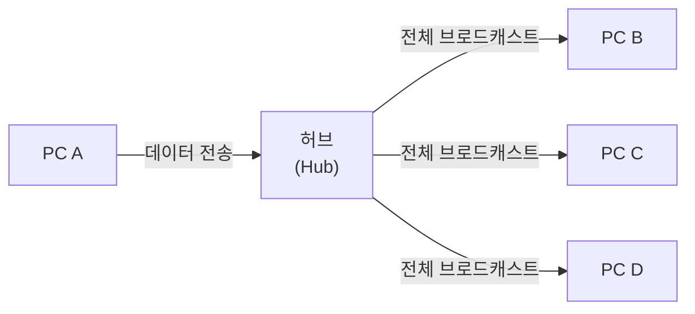
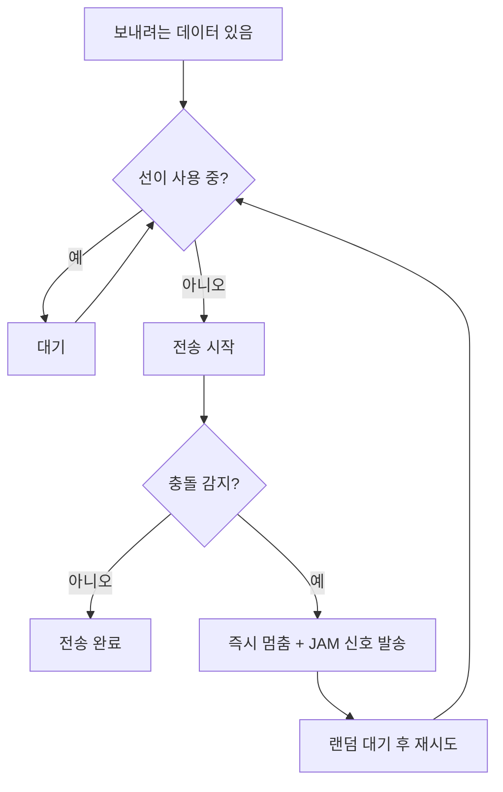
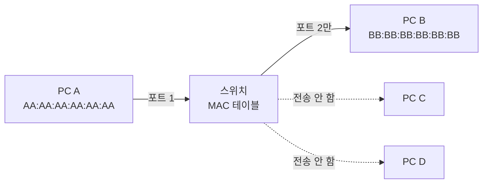

한때 사무실 네트워크 구성은 이랬다. 여러 PC를 허브에 꽂고, 허브에서 라우터로 연결. 당시는 그게 표준이었다.

그런데 어느 시점부터 허브가 사라졌다. 지금 IT 매장에서 허브를 찾으면 없다. 스위치만 있다. 대체 무슨 일이 있었던 걸까.

**이전 글:** [이더넷, NIC, 케이블 →](/post/micro-ethernet-nic-cable) — 랜선·NIC·MAC 주소로 물리 연결을 까는 부분. 이 글은 그 연결 위에서 **여러 기기가 동시에 신호를 쓸 때** 벌어지는 일과 허브·스위치의 차이를 다룬다.

---

## 허브는 어떻게 동작하는가

허브(Hub)는 **1계층(물리 계층)** 장치다. 하는 일이 매우 단순하다. 한 포트에 신호가 들어오면 **나머지 모든 포트로 그대로 뿌린다.** 그게 전부다.[^hub-cisco]

PC A가 PC B에게 데이터를 보내면, 허브는 그 신호를 PC C, D, E에도 전부 보낸다. 수신한 쪽에서 "이건 내 거 아니네"라고 버리는 방식이다.

허브는 목적지를 알지 못한다. 그냥 들어온 걸 모두에게 내보낸다. 이건 설계상 선택이 아니라 1계층 장치의 본질적 한계다. 신호를 증폭해서 재전송하는 것(리피터)이 역할의 전부이기 때문에, 어디로 보낼지 판단하는 로직 자체가 없다.

---

## 문제: 충돌

여러 기기가 하나의 선을 공유하면 자연스럽게 충돌이 생긴다.

PC A가 신호를 보내는 도중에 PC C도 신호를 보내면 두 신호가 전선 위에서 섞인다. 이걸 **충돌(Collision)**이라고 한다. 충돌이 발생하면 두 신호 모두 깨진다. 아무도 데이터를 받지 못한다.

이 문제를 해결하려고 이더넷이 채택한 방법이 **CSMA/CD**다.

### CSMA/CD — 보내기 전에 먼저 듣는다

CSMA/CD는 Carrier Sense Multiple Access with Collision Detection의 줄임말이다. 긴 이름이지만 원리는 직관적이다.[^csmacd]

**Carrier Sense** — 전송 전에 선이 사용 중인지 확인한다. 아무도 안 쓰고 있으면 보낸다.

**Multiple Access** — 여러 기기가 같은 선을 공유한다. 선이 비어 있으면 누구든 보낼 수 있다.

**Collision Detection** — 전송 중에도 계속 선을 모니터링한다. 내가 보낸 신호와 선 위의 신호가 다르면 충돌이 생긴 것이다. 이때 즉시 멈추고 JAM 신호를 보내 모두에게 충돌을 알린다.

충돌 후 대기 시간은 랜덤으로 설정된다. 두 기기가 동시에 충돌하고 동시에 재시도하면 또 충돌이 생기기 때문이다. 이걸 **지수 백오프(Exponential Backoff)**라고 하는데, 충돌이 반복될수록 대기 시간이 점점 길어진다.

CSMA/CD는 당시로선 합리적인 해법이었지만 근본 문제는 남아 있다. 허브에 연결된 모든 기기가 **하나의 충돌 도메인(Collision Domain)**을 공유한다는 것이다. 기기가 많아질수록 충돌이 더 자주 발생하고, 결과적으로 실제 처리량은 이론치보다 훨씬 낮아진다.

Cisco의 테스트에 따르면 허브 기반 환경에서 100대 기기를 연결했을 때 처리량이 이론치의 10% 수준으로 떨어졌다.[^cisco-switch] 90%가 충돌과 재시도로 낭비된 셈이다.

---

## 스위치의 등장

스위치(Switch)는 **2계층(데이터링크 계층)** 장치다. 허브와 달리 목적지를 알고 있다.

정확하게는 목적지를 '기억한다'는 표현이 맞다. 스위치는 프레임이 들어올 때마다 **출발지 MAC 주소와 들어온 포트 번호**를 자신의 테이블에 저장한다. 이 테이블을 **MAC 주소 테이블**, 또는 **CAM(Content Addressable Memory) 테이블**이라고 한다.[^cam-table]

### MAC 주소 테이블이 어떻게 만들어지는가

처음에 스위치는 아무것도 모른다. 테이블이 비어 있다.

PC A(MAC: `AA:AA:AA:AA:AA:AA`)가 PC B로 데이터를 보냈다고 하자. 스위치는 이 프레임을 받으면 다음 두 가지를 한다:

1. **출발지 MAC(`AA:AA:AA:AA:AA:AA`)과 들어온 포트(1번)를 테이블에 기록한다.**
2. **목적지 MAC은 아직 모르니까 모든 포트로 내보낸다 (flooding).**

PC B(MAC: `BB:BB:BB:BB:BB:BB`)가 응답을 보내면, 이번엔 `BB:BB:BB:BB:BB:BB` → 포트 2번이 기록된다. 이제 스위치는 PC B의 위치를 안다. 다음에 PC A가 PC B로 데이터를 보내면, 스위치는 **포트 2번으로만** 내보낸다.

이게 허브와 스위치의 핵심 차이다. 허브는 전부에게, 스위치는 필요한 곳에만.

MAC 테이블의 항목은 일정 시간(보통 5분)이 지나면 삭제된다. 기기가 포트를 바꾸거나 네트워크를 떠나는 경우를 대비한 aging 메커니즘이다.

---

## 충돌 도메인이 사라지다

스위치가 가져온 또 다른 변화는 **충돌 도메인의 분리**다.

허브에서는 포트가 10개면 10개 기기가 하나의 충돌 도메인 안에 있다. 누군가 보내면 나머지 9명은 대기해야 한다.

스위치에서는 포트마다 독립적인 충돌 도메인이 생긴다. 포트 1번의 PC A와 포트 2번의 PC B는 서로 충돌 없이 동시에 통신할 수 있다.

게다가 스위치는 **전이중(Full-Duplex)** 통신을 지원한다. 스위치와 PC 사이에는 공유 매체가 없으니 CSMA/CD 자체가 필요 없고, 동시 송수신이 가능하다. 1 Gbps 링크에서 이론상 양방향 각각 1 Gbps가 나올 수 있다.

---

## STP — 루프를 막는 조용한 장치

스위치가 많아지면 이중화를 위해 스위치끼리 여러 경로로 연결하는 경우가 생긴다. 그런데 루프가 생기면 큰일이다.

브로드캐스트 프레임 하나가 루프를 타면 영원히 돌면서 네트워크를 마비시킨다. **브로드캐스트 스톰**이라고 부르는데, 몇 초 안에 전체 네트워크가 불능 상태가 된다.

**STP(Spanning Tree Protocol)**는 이런 루프를 예방하는 프로토콜이다. 스위치들이 서로 통신하면서 논리적으로 루프가 없는 트리 구조를 만들고, 중복 경로는 차단 상태로 유지한다. 주 경로가 끊어지면 차단된 경로를 활성화한다.[^stp]

STP는 배경에서 조용히 동작하기 때문에 평소엔 의식하기 어렵지만, 이게 없으면 이중화 구성 자체가 불가능하다.

---

## 왜 허브는 사라졌는가

기술적 이유는 위에서 다 설명했다. 충돌 도메인, 브로드캐스트 범람, 반이중의 한계.

경제적 이유도 있었다. 1990년대 초 스위치는 허브보다 훨씬 비쌌다. 그런데 2000년대 들어 가격이 급격히 내려가면서 허브를 쓸 이유가 없어졌다.

오늘날 허브는 교육용이나 레거시 장비와의 호환 외에는 실제로 쓰이지 않는다. 네트워크 입문서에서는 허브를 설명하지만, 현장에서 허브를 만날 일은 거의 없다.

---

## 물리 계층에서 데이터링크 계층으로

허브는 1계층, 스위치는 2계층.

1계층은 비트를 전기 신호로 변환하는 것, 즉 물리적 전송만 담당한다. MAC 주소도, 프레임도 모른다.

2계층은 MAC 주소를 기반으로 같은 네트워크 내에서 어디로 보낼지 판단한다. 프레임 단위로 통신하고, 충돌 없이 효율적으로 경로를 결정한다.

[이더넷, NIC, 케이블 →](/post/micro-ethernet-nic-cable), 허브, 스위치 — 이것들이 전부 물리적인 연결과 같은 네트워크 안에서의 통신을 담당하는 레이어의 이야기다. 여기서 한 단계 위로 올라가면 서로 다른 네트워크를 연결하는 IP와 라우터의 영역이 시작된다.

---

## 관련 글

- [이더넷, NIC, 케이블 →](/post/micro-ethernet-nic-cable) — 물리 계층에서 비트가 오가는 기반
- [OSI 7계층 모델 →](/post/micro-osi-7layer) — 허브·스위치가 속한 계층을 분류하는 틀

[^hub-cisco]: <a href="https://www.cisco.com/c/en/us/solutions/small-business/resource-center/networking/network-switch-how.html" target="_blank">Cisco — Understanding Hub, Switch, and Router Differences</a>
[^csmacd]: <a href="https://en.wikipedia.org/wiki/Carrier-sense_multiple_access_with_collision_detection" target="_blank">Wikipedia — CSMA/CD</a>
[^cisco-switch]: <a href="https://www.alliedtelesis.com/us/en/foundations/difference-between-network-switch-and-hub" target="_blank">Allied Telesis — Difference between Network Switch and Hub</a>
[^cam-table]: <a href="https://www.networkacademy.io/ccna/ethernet/collision-domains" target="_blank">NetworkAcademy — Collision Domains and Broadcast Domains</a>
[^stp]: <a href="https://www.cisco.com/c/en/us/td/docs/routers/access/3200/software/wireless/SpanningTree.html" target="_blank">Cisco — Spanning Tree Protocol Overview</a>
