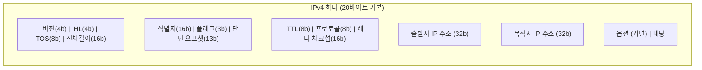
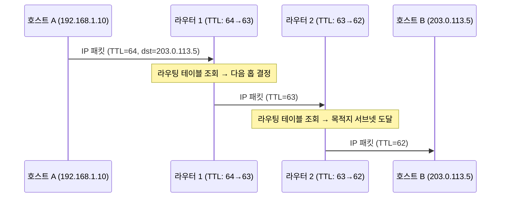
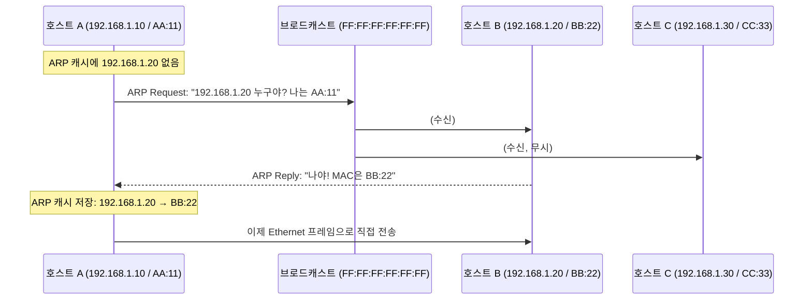
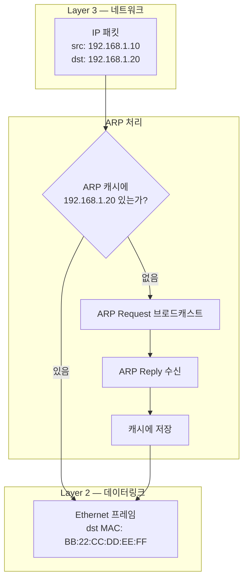

## 주소가 필요한 이유

[패킷 교환](/post/micro-protocol) 네트워크에서 패킷이 올바른 목적지에 도달하려면 **주소 체계**가 필요하다.
편지에 수신자 주소를 써야 우편 시스템이 배달할 수 있는 것과 같은 원리다.

인터넷에서 이 역할을 하는 것이 **IP(Internet Protocol)**다.[^ipv4]

IP는 두 가지 핵심 기능을 담당한다.

1. **주소 지정(Addressing)**: 모든 호스트에 고유한 논리 주소(IP 주소)를 부여
2. **단편화(Fragmentation)**: 큰 데이터그램을 작은 MTU에 맞게 분할하고 재조립

## IP의 역사 — RFC 791

IP는 Vinton Cerf와 Robert Kahn이 1974년 논문 *"A Protocol for Packet Network Intercommunication"*에서 처음 제안했다.[^cerf-kahn]
초기에는 TCP와 IP가 하나의 프로토콜이었다.

1978년 Jon Postel 등이 이를 **TCP**(신뢰성·순서)와 **IP**(주소·라우팅)로 분리했고,
1981년 9월 **RFC 791**로 IPv4가 공식 표준이 됐다.[^rfc791]

1983년 1월 1일, ARPANET의 모든 노드가 동시에 TCP/IP로 전환했다 — **"플래그 데이"**.
이날을 현대 인터넷의 실질적 출발점으로 본다.

## IPv4 헤더 구조

IPv4 헤더의 최소 크기는 **20바이트**이며, 옵션 포함 시 최대 60바이트다.

| 필드 | 크기 | 설명 |
|------|------|------|
| **Version** | 4비트 | IP 버전 번호 (IPv4 = 4, 이진수 `0100`) |
| **IHL** | 4비트 | 헤더 길이 (32비트 단어 단위, 최소 5 = 20바이트) |
| **TOS** | 8비트 | 서비스 품질 (현재 DSCP + ECN으로 재정의) |
| **Total Length** | 16비트 | 헤더+페이로드 전체 길이 (최대 65,535바이트) |
| **Identification** | 16비트 | 단편화된 패킷 재조립용 식별자 |
| **Flags** | 3비트 | DF(단편화 금지), MF(추가 단편 있음) |
| **Fragment Offset** | 13비트 | 원본 데이터그램 내 이 단편의 위치 (8바이트 단위) |
| **TTL** | 8비트 | 남은 홉 수. 0이 되면 패킷 폐기 → 라우팅 루프 방지 |
| **Protocol** | 8비트 | 페이로드 프로토콜 (TCP=6, UDP=17, ICMP=1) |
| **Header Checksum** | 16비트 | 헤더 오류 검출 (매 홉마다 TTL 변경으로 재계산) |
| **Source Address** | 32비트 | 송신자 IPv4 주소 |
| **Destination Address** | 32비트 | 수신자 IPv4 주소 |

### TTL의 역할

TTL(Time to Live)은 패킷이 라우팅 루프에 빠졌을 때 무한히 떠돌지 않도록 막는다.
라우터를 거칠 때마다 1씩 감소하며, 0이 되면 패킷을 폐기하고 ICMP "Time Exceeded" 메시지를 보낸다.
`traceroute` 명령은 이 원리를 이용해 경로상의 각 라우터를 식별한다.

## IP 주소 체계

IPv4는 **32비트** 주소를 사용해 최대 약 42억(2³²)개의 주소를 표현한다.
일반적으로 점으로 구분된 8비트 4개로 표기한다: `192.168.1.1`

### 공인 vs 사설 주소 (RFC 1918)

| 범위 | 설명 |
|------|------|
| `10.0.0.0/8` | 사설 주소 (Class A 규모) |
| `172.16.0.0/12` | 사설 주소 (Class B 규모) |
| `192.168.0.0/16` | 사설 주소 (가정/소규모 네트워크) |

사설 주소는 인터넷에서 라우팅되지 않으며, NAT를 통해 공인 주소로 변환된다.

### CIDR 표기

1993년 **CIDR(Classless Inter-Domain Routing, RFC 1517)**이 등장하면서
`192.168.1.0/24`처럼 슬래시 뒤 숫자로 서브넷 마스크를 표기한다.
`/24`는 앞 24비트가 네트워크 부분이고, 남은 8비트(256개)가 호스트 주소임을 의미한다.

## IP 라우팅의 흐름

## ARP — IP 주소를 MAC 주소로 변환

[IP](/post/micro-ip-arp)는 논리적 주소(Layer 3)이고, Ethernet은 물리적 MAC 주소(Layer 2)를 사용한다.
같은 LAN 안에서 패킷을 전달하려면 목적지의 **MAC 주소**를 알아야 한다.

**ARP(Address Resolution Protocol)**는 IP 주소를 MAC 주소로 변환하는 프로토콜이다.[^arp]
David C. Plummer가 설계하고 1982년 11월 **RFC 826**으로 표준화됐다.

### ARP가 필요한 이유

### ARP 동작 순서

1. **캐시 조회**: 먼저 ARP 테이블에서 IP→MAC 매핑을 확인
2. **ARP Request**: 없으면 브로드캐스트(`FF:FF:FF:FF:FF:FF`)로 요청 전송
3. **ARP Reply**: 해당 IP의 호스트가 자신의 MAC 주소로 유니캐스트 응답
4. **캐시 저장**: 결과를 ARP 캐시에 저장 (일반적으로 2~20분 유효)

### ARP 패킷 구조

| 필드 | 크기 | 설명 |
|------|------|------|
| Hardware Type | 16비트 | 네트워크 인터페이스 유형 (1 = Ethernet) |
| Protocol Type | 16비트 | 해석할 프로토콜 (0x0800 = IPv4) |
| Hardware Address Length | 8비트 | MAC 주소 길이 (Ethernet = 6) |
| Protocol Address Length | 8비트 | IP 주소 길이 (IPv4 = 4) |
| Opcode | 16비트 | 1 = Request, 2 = Reply |
| Sender MAC | 48비트 | 송신자 MAC 주소 |
| Sender IP | 32비트 | 송신자 IP 주소 |
| Target MAC | 48비트 | 대상 MAC (Request에서는 00:00:00:00:00:00) |
| Target IP | 32비트 | 대상 IP 주소 |

### ARP 변형

| 유형 | 설명 |
|------|------|
| **Gratuitous ARP** | 자신의 IP→MAC 매핑을 브로드캐스트로 능동 공지. IP 충돌 감지, 장애 조치(Failover)에 사용 |
| **Proxy ARP** | 라우터가 다른 서브넷의 호스트를 대신해 ARP에 응답 |
| **ARP Spoofing** | 악의적으로 잘못된 IP→MAC 매핑을 주입 → 중간자(MitM) 공격 |

> ARP는 인증 기능이 없어 보안에 취약하다.
> 관리형 스위치의 **DAI(Dynamic ARP Inspection)**가 대표적 방어 수단이다.
> IPv6에서는 ARP가 **NDP(Neighbor Discovery Protocol, RFC 4861)**로 대체됐다.

## IP와 ARP의 관계 요약

## 관련 글

- [프로토콜 — 왜 패킷 교환을 쓰는가 →](/post/micro-protocol) — 패킷 교환이 IP 주소 체계를 필요로 하게 된 배경
- [캡슐화와 역캡슐화 — PDU의 여정 →](/post/micro-encapsulation) — IP 헤더가 캡슐화되는 과정
- [OSI 7계층 모델 →](/post/micro-osi-7layer) — IP가 속한 네트워크 계층의 전체 그림
- [TCP와 UDP — 신뢰성과 속도의 트레이드오프 →](/post/micro-tcp-udp) — IP 위에서 동작하는 전송 계층 프로토콜

---

[^ipv4]: Internet Protocol version 4, <a href="https://en.wikipedia.org/wiki/Internet_Protocol_version_4" target="_blank">Wikipedia</a>
[^cerf-kahn]: V. Cerf, R. Kahn, "A Protocol for Packet Network Intercommunication", *IEEE Transactions on Communications*, May 1974 — <a href="https://en.wikipedia.org/wiki/Vint_Cerf" target="_blank">Wikipedia</a>
[^rfc791]: J. Postel, "Internet Protocol", RFC 791, September 1981, <a href="https://datatracker.ietf.org/doc/html/rfc791" target="_blank">IETF</a>
[^rfc1918]: Y. Rekhter et al., "Address Allocation for Private Internets", RFC 1918, February 1996, <a href="https://datatracker.ietf.org/doc/html/rfc1918" target="_blank">IETF</a>
[^arp]: Address Resolution Protocol, <a href="https://en.wikipedia.org/wiki/Address_Resolution_Protocol" target="_blank">Wikipedia</a>
[^rfc826]: D. Plummer, "An Ethernet Address Resolution Protocol", RFC 826, November 1982, <a href="https://datatracker.ietf.org/doc/html/rfc826" target="_blank">IETF</a>
[^cidr]: Classless Inter-Domain Routing, <a href="https://en.wikipedia.org/wiki/Classless_Inter-Domain_Routing" target="_blank">Wikipedia</a>
