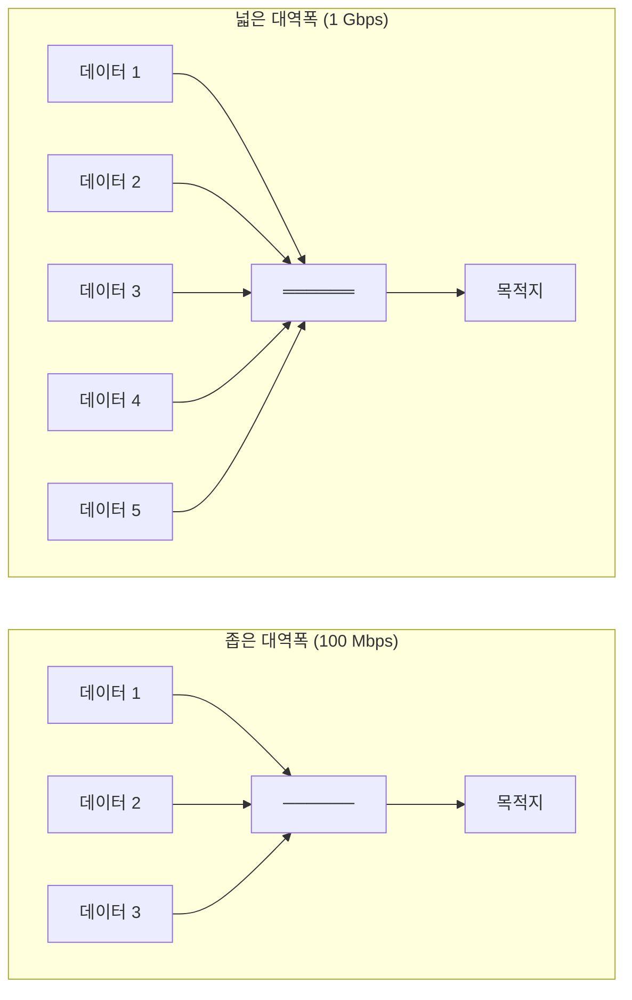
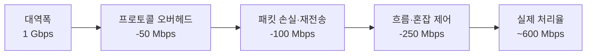
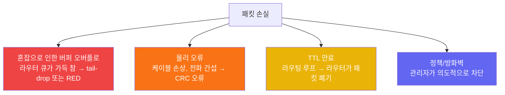
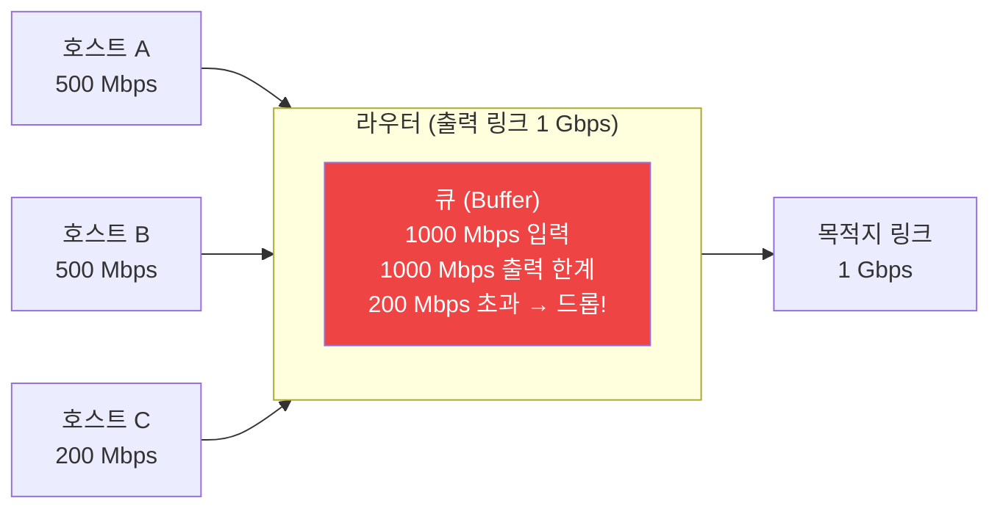
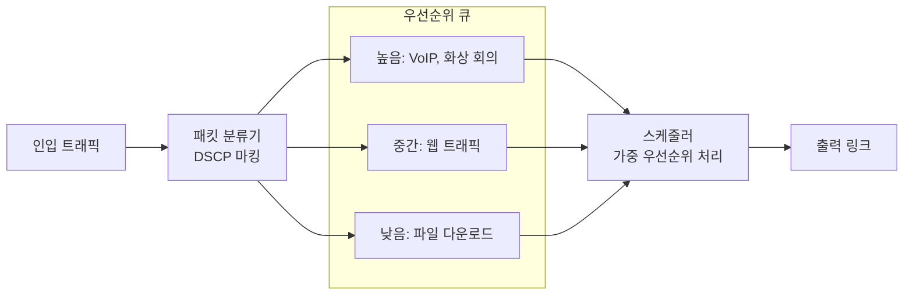
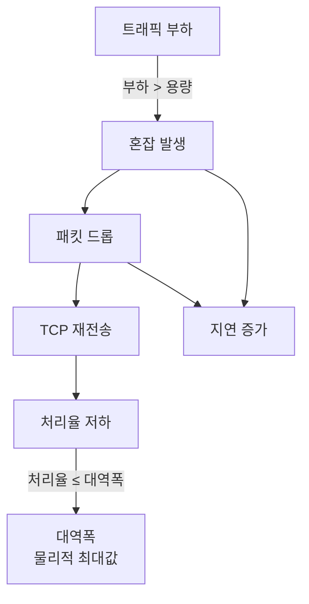

## 네트워크 성능을 어떻게 측정하는가

인터넷이 빠른지 느린지는 어떻게 판단할까?
단순히 "빠르다 / 느리다"는 모호하다.

네트워크 엔지니어는 아래 네 가지 지표로 성능을 정량화한다.[^network-performance]

| 지표 | 정의 | 단위 |
|------|------|------|
| **대역폭** | 링크가 이론적으로 전달 가능한 최대 데이터 양 | bps (bit/s) |
| **처리율** | 실제로 전달된 데이터 양 | bps (bit/s) |
| **지연(Latency)** | 패킷이 출발지에서 목적지까지 이동하는 시간 | ms |
| **패킷 손실** | 전송 중 유실된 패킷의 비율 | % |

## 대역폭 (Bandwidth)

**대역폭**은 네트워크 링크가 단위 시간에 전달할 수 있는 **최대** 데이터 양이다.[^bandwidth]
이것은 이론적 상한(upper bound)이며, 물리적 매체와 기술 규격으로 결정된다.



**대역폭 예시**

| 매체 | 표준 대역폭 |
|------|-----------|
| 전화 모뎀 | 56 Kbps |
| DSL | 1~100 Mbps |
| Fast Ethernet | 100 Mbps |
| Gigabit Ethernet | 1 Gbps |
| 광섬유 (DWDM) | 수십 Tbps |
| Wi-Fi 6 (802.11ax) | 최대 9.6 Gbps |

## 처리율 (Throughput)

**처리율**은 실제로 전달된 데이터 양이다.[^throughput]
대역폭은 파이프의 굵기, 처리율은 파이프 안을 실제로 흐르는 물의 양이다.

```
처리율 ≤ 대역폭
```

처리율이 대역폭보다 낮은 이유:

1. **프로토콜 오버헤드**: TCP/IP 헤더, Ethernet 프레임 헤더는 순수 데이터가 아니다. 일반적으로 전체 전송량의 2~10%가 헤더다.
2. **재전송**: [패킷 손실](#패킷-손실-packet-loss)이 발생하면 같은 데이터를 다시 보내 대역폭이 낭비된다.
3. **흐름 제어**: [TCP의 슬라이딩 윈도우](/post/micro-tcp-udp)가 전송 속도를 제한한다.
4. **혼잡 제어**: [TCP AIMD](/post/micro-tcp-udp)가 네트워크 혼잡 신호에 반응해 속도를 줄인다.
5. **처리 지연**: 라우터, 스위치에서 패킷을 처리하는 시간이 걸린다.

### 처리율 측정 예시



## 지연 (Latency)

**지연**은 패킷이 출발지에서 목적지까지 이동하는 데 걸리는 시간이다.
일반적으로 **RTT(Round-Trip Time)** — 요청 전송부터 응답 수신까지의 왕복 시간 — 으로 측정한다.

지연의 구성 요소:

| 종류 | 설명 |
|------|------|
| **전파 지연** | 신호가 물리 매체를 통해 이동하는 시간. 거리에 비례. 광섬유: 빛의 속도의 약 2/3 |
| **전송 지연** | 패킷을 링크에 올리는 시간. = 패킷 크기 / 대역폭 |
| **처리 지연** | 라우터/스위치에서 패킷 헤더를 분석하고 경로를 결정하는 시간 |
| **큐잉 지연** | 라우터 큐에서 대기하는 시간. 혼잡도에 따라 크게 변동 |

## 패킷 손실 (Packet Loss)

**패킷 손실**은 전송된 패킷이 목적지에 도달하지 못하는 비율이다.[^packet-loss]

```
패킷 손실률 = (손실된 패킷 수 / 전송된 패킷 수) × 100%
```

### 발생 원인



주요 원인:
1. **혼잡(Congestion)**: 가장 흔한 원인. 라우터 버퍼가 가득 차면 새로 들어오는 패킷을 버린다.
2. **물리 오류**: 이더넷 CRC 오류, Wi-Fi 간섭. 데이터링크 계층에서 감지해 해당 프레임을 버린다.
3. **TTL 만료**: 라우팅 루프에서 패킷이 무한 순환하지 않도록 TTL이 0이 되면 폐기.
4. **정책 필터링**: 방화벽, ACL로 의도적으로 차단.

### 패킷 손실의 영향

| 프로토콜 | 영향 |
|---------|------|
| [TCP](/post/micro-tcp-udp) | 재전송으로 손실 복구. 단, 혼잡 제어가 속도를 줄임. |
| [UDP](/post/micro-tcp-udp) | 손실 그대로. 영상 통화에서 화면 깨짐, 게임에서 캐릭터 순간이동 |
| QUIC | 스트림 단위로 독립 관리. TCP보다 손실 영향 범위가 좁음 |

1~2% 손실은 TCP 재전송으로 처리 가능하지만, 5% 이상이면 성능이 급격히 저하된다.

## 혼잡과 과부하 (Congestion & Overload)

**혼잡(Congestion)**은 네트워크 링크나 라우터가 처리할 수 있는 것보다 더 많은 트래픽이 몰릴 때 발생한다.[^congestion]



### 혼잡 발생 지점

- **병목 링크(Bottleneck Link)**: 경로 중 대역폭이 가장 좁은 링크. 전체 처리율을 제한한다.
- **과부하 라우터**: 초당 처리할 수 있는 패킷 수를 초과하면 지연과 손실이 증가한다.

### 혼잡 대응 방법

**1. TCP 혼잡 제어 (End-to-End)**

[TCP AIMD](/post/micro-tcp-udp)는 패킷 손실을 혼잡 신호로 해석하고 전송 속도를 줄인다.
네트워크 중간 장비의 협력 없이 엔드포인트만으로 혼잡을 완화한다.

**2. ECN — Explicit Congestion Notification (RFC 3168)**

라우터가 혼잡을 감지하면 패킷을 버리는 대신 IP 헤더의 ECN 비트를 1로 설정한다.
수신자가 이를 TCP ACK에 반영해 송신자에게 알린다.
패킷 손실 없이 혼잡을 미리 신호할 수 있다.

**3. AQM — Active Queue Management**

라우터 큐가 가득 차기 전에 미리 패킷을 확률적으로 버린다.
대표 알고리즘:
- **RED(Random Early Detection)**: 큐 길이에 따라 확률적으로 드롭
- **CoDel(Controlled Delay)**: 큐 지연 시간을 기반으로 제어

**4. QoS — Quality of Service**

모든 패킷을 동등하게 처리하는 대신, 중요도에 따라 우선순위를 부여한다.
VoIP(음성) 패킷을 파일 다운로드보다 먼저 처리하는 식이다.



## 지표 간 관계



> 혼잡이 발생하면 패킷 손실 → 재전송 → 처리율 저하 → 지연 증가의 악순환이 시작된다.
> TCP 혼잡 제어는 이 악순환을 끊기 위해 자발적으로 전송 속도를 줄이는 시스템이다.

## 관련 글

- [TCP와 UDP — 신뢰성과 속도의 트레이드오프 →](/post/micro-tcp-udp) — TCP 혼잡 제어(AIMD, Slow Start)의 상세 동작
- [프로토콜 — 왜 패킷 교환을 쓰는가 →](/post/micro-protocol) — 패킷 교환이 혼잡에 취약한 이유와 설계 트레이드오프
- [캡슐화와 역캡슐화 — PDU의 여정 →](/post/micro-encapsulation) — 트래픽을 구성하는 패킷 구조

---

[^network-performance]: Network performance, <a href="https://en.wikipedia.org/wiki/Network_performance" target="_blank">Wikipedia</a>
[^bandwidth]: Bandwidth (computing), <a href="https://en.wikipedia.org/wiki/Bandwidth_(computing)" target="_blank">Wikipedia</a>
[^throughput]: Throughput, <a href="https://en.wikipedia.org/wiki/Throughput" target="_blank">Wikipedia</a>
[^latency]: Latency (engineering), <a href="https://en.wikipedia.org/wiki/Latency_(engineering)" target="_blank">Wikipedia</a>
[^packet-loss]: Packet loss, <a href="https://en.wikipedia.org/wiki/Packet_loss" target="_blank">Wikipedia</a>
[^congestion]: Network congestion, <a href="https://en.wikipedia.org/wiki/Network_congestion" target="_blank">Wikipedia</a>
[^ecn]: Explicit Congestion Notification, <a href="https://en.wikipedia.org/wiki/Explicit_Congestion_Notification" target="_blank">Wikipedia</a>
[^qos]: Quality of service, <a href="https://en.wikipedia.org/wiki/Quality_of_service" target="_blank">Wikipedia</a>
[^aqm]: Active queue management, <a href="https://en.wikipedia.org/wiki/Active_queue_management" target="_blank">Wikipedia</a>
