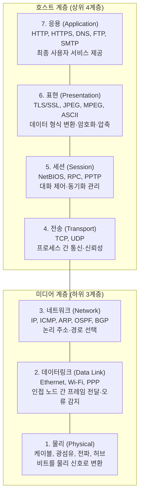
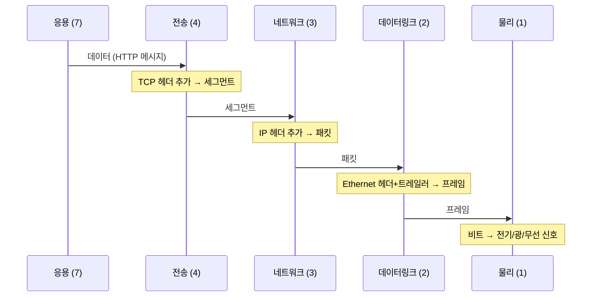

## 왜 계층 모델이 필요한가

1970년대 초, 네트워크 장비들은 제조사마다 독자적인 프로토콜을 사용했다.
IBM 장비는 IBM끼리만, DEC 장비는 DEC끼리만 통신할 수 있었다.

이 호환성 문제를 해결하기 위해 ISO(국제 표준화 기구)는 1977년부터
**"서로 다른 시스템이 어떻게 통신해야 하는가"**에 대한 범용 표준을 만들기 시작했다.

그 결과가 **OSI(Open Systems Interconnection) 모델**이다.
1984년 **ISO/IEC 7498-1**로 국제 표준이 됐다.[^osi]

OSI 모델은 통신 기능을 **7개의 계층**으로 분리했다.
핵심 원칙은 **각 계층이 위아래 계층에만 인터페이스를 제공하고, 내부 구현은 독립적으로 바꿀 수 있어야 한다**는 것이다.

## OSI 7계층 개요

## 각 계층 상세 설명

### 7계층 — 응용 (Application)

사람이 직접 사용하는 네트워크 서비스를 제공한다.
웹 브라우저, 이메일 클라이언트, FTP 프로그램이 이 계층에서 동작한다.

**역할**: 사용자와 네트워크 사이의 인터페이스
**PDU**: 데이터(Data) / 메시지(Message)
**대표 프로토콜**: [HTTP](/post/micro-http-https), HTTPS, DNS, FTP, SMTP, IMAP, SSH

### 6계층 — 표현 (Presentation)

응용 계층이 사용하는 데이터 형식을 네트워크 전송에 맞게 변환한다.
**암호화(TLS)**, **압축**, **인코딩(Base64, UTF-8)**이 여기서 이루어진다.

OSI 모델에서는 별도 계층이지만, [TCP/IP 모델](/post/micro-tcp-ip-model)에서는 응용 계층에 통합됐다.

**역할**: 데이터 형식 변환, 암호화/복호화, 압축
**대표 기능**: SSL/TLS, JPEG 인코딩, MPEG 압축, ASCII ↔ EBCDIC 변환

### 5계층 — 세션 (Session)

두 응용 프로세스 간의 **대화(Session)**를 관리한다.
연결을 언제 열고 닫을지, 통신이 끊겼을 때 어디서부터 다시 시작할지를 제어한다.

**역할**: 세션 수립·유지·종료, 동기화 포인트
**대표 프로토콜**: NetBIOS, RPC, PPTP

### 4계층 — 전송 (Transport)

**프로세스 대 프로세스** 통신을 담당한다.
포트 번호로 어느 애플리케이션에게 데이터를 전달할지 결정한다.

**역할**: 프로세스 식별(포트), 신뢰성, 흐름 제어, 혼잡 제어
**PDU**: 세그먼트(TCP), 데이터그램(UDP)
**대표 프로토콜**: [TCP](/post/micro-tcp-udp), [UDP](/post/micro-tcp-udp)

### 3계층 — 네트워크 (Network)

**호스트 대 호스트** 통신을 담당한다.
여러 네트워크를 넘어 목적지까지 최적의 경로를 선택한다.

**역할**: 논리 주소(IP) 부여, 라우팅, 단편화
**PDU**: 패킷(Packet)
**대표 프로토콜**: [IP](/post/micro-ip-arp), ICMP, OSPF, BGP

### 2계층 — 데이터링크 (Data Link)

**인접한 두 노드** 간의 신뢰성 있는 전달을 담당한다.
같은 LAN 내에서 어느 장치로 프레임을 보낼지 **MAC 주소**로 결정한다.

두 개의 하위 계층으로 분리된다.
- **LLC(Logical Link Control)**: 흐름 제어, 오류 감지
- **MAC(Media Access Control)**: 매체 접근 제어, 물리 주소

**역할**: 프레임 생성, MAC 주소 지정, 오류 감지(CRC), 매체 접근 제어
**PDU**: 프레임(Frame)
**대표 프로토콜**: Ethernet (IEEE 802.3), Wi-Fi (IEEE 802.11), PPP

### 1계층 — 물리 (Physical)

데이터를 실제 물리 신호(전기, 빛, 전파)로 변환해 케이블이나 무선 매체로 전송한다.
**비트(1과 0)**를 어떻게 인코딩할 것인지, 커넥터 모양, 전압 레벨 등을 정의한다.

**역할**: 비트를 물리 신호로 변환·전송
**PDU**: 비트(Bit)
**대표 장비/기술**: 이더넷 케이블(Cat5e/Cat6), 광섬유, 무선 전파, 허브, 리피터

## 계층 간 데이터 흐름

## 계층 독립성 — OSI 모델의 핵심 가치

OSI 모델의 진가는 **계층 독립성**이다.

예를 들어, 1990년대 초 Ethernet(10 Mbps)이 Fast Ethernet(100 Mbps)으로 바뀔 때,
1계층과 2계층 표준만 바꾸면 됐다.
TCP, IP, HTTP는 전혀 수정할 필요가 없었다.

마찬가지로 HTTP/1.1이 [HTTP/2](/post/micro-http-https)로 바뀔 때,
7계층만 변경됐고 하위 계층은 그대로였다.

## OSI 모델의 현실

OSI 모델은 **교육과 분석의 도구**로 지금도 강력하게 사용된다.
하지만 실제 인터넷은 OSI 7계층 프로토콜 스택(X.400, X.500 등)이 아니라
더 단순한 **[TCP/IP 4계층 모델](/post/micro-tcp-ip-model)**로 구현됐다.

> 흔히 하는 말: "OSI는 이론의 세계, TCP/IP는 현실의 세계"

OSI가 실패한 이유:
1. ARPANET과 TCP/IP가 이미 1980년대 초에 널리 보급됐다
2. OSI 표준이 너무 복잡하고 위원회 설계의 한계가 있었다
3. 미국 국방부가 1982년 군 표준으로 TCP/IP를 채택해 시장을 선점했다

그러나 OSI의 7계층 추상화 모델은 지금도 문제를 진단하고 통신을 설명하는 데 사용된다.
"이 문제는 3계층 문제야", "4계층에서 다뤄야 해"처럼 계층 언어는 업계 공용어다.

## 관련 글

- [TCP/IP 참조 모델 →](/post/micro-tcp-ip-model) — OSI 7계층을 4계층으로 압축한 TCP/IP 모델
- [캡슐화와 역캡슐화 — PDU의 여정 →](/post/micro-encapsulation) — 각 계층의 PDU가 실제로 어떻게 만들어지는지
- [IP와 ARP — 주소와 경로의 언어 →](/post/micro-ip-arp) — OSI 3계층인 네트워크 계층의 핵심 프로토콜
- [TCP와 UDP — 신뢰성과 속도의 트레이드오프 →](/post/micro-tcp-udp) — OSI 4계층인 전송 계층의 핵심 프로토콜

---

[^osi]: OSI model, <a href="https://en.wikipedia.org/wiki/OSI_model" target="_blank">Wikipedia</a>
[^iso7498]: ISO/IEC 7498-1:1994, "Information technology — Open Systems Interconnection — Basic Reference Model", <a href="https://en.wikipedia.org/wiki/OSI_model" target="_blank">Wikipedia</a>
[^physical]: Physical layer, <a href="https://en.wikipedia.org/wiki/Physical_layer" target="_blank">Wikipedia</a>
[^datalink]: Data link layer, <a href="https://en.wikipedia.org/wiki/Data_link_layer" target="_blank">Wikipedia</a>
[^network]: Network layer, <a href="https://en.wikipedia.org/wiki/Network_layer" target="_blank">Wikipedia</a>
[^transport]: Transport layer, <a href="https://en.wikipedia.org/wiki/Transport_layer" target="_blank">Wikipedia</a>
[^application]: Application layer, <a href="https://en.wikipedia.org/wiki/Application_layer" target="_blank">Wikipedia</a>
