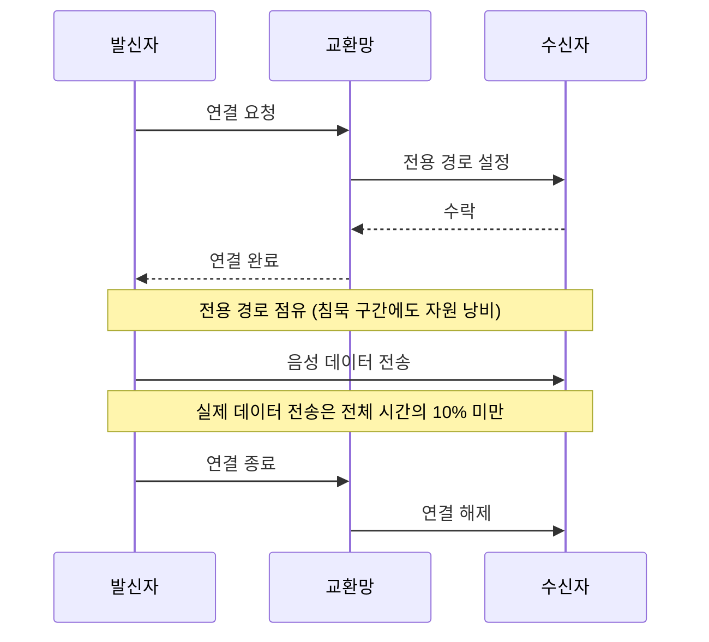
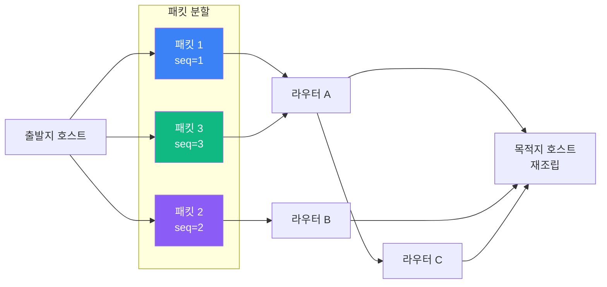
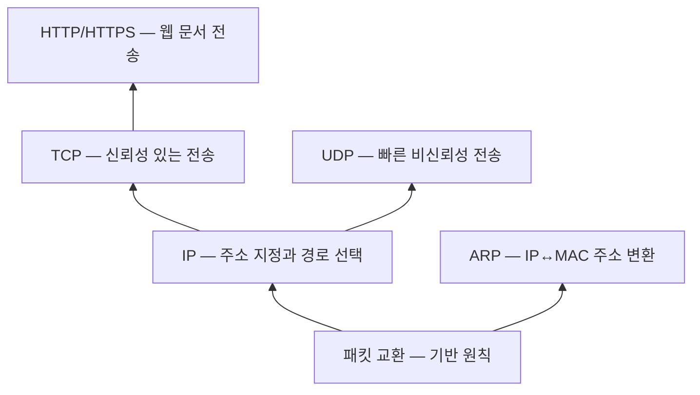

## 왜 프로토콜이 필요한가

1960년대 컴퓨터들은 서로 통신할 수 없었다.
IBM 컴퓨터는 DEC 컴퓨터를 이해하지 못했고, 미국 군의 컴퓨터는 대학 연구소의 컴퓨터와 연결할 방법이 없었다.

이 문제를 해결하는 방법은 하나뿐이었다: **공통 규칙을 정하는 것**.
그 공통 규칙이 **프로토콜(Protocol)**이다.[^protocol]

프로토콜은 세 가지를 정의한다.

1. **문법(Syntax)**: 데이터를 어떤 형식으로 표현할 것인가
2. **의미(Semantics)**: 각 비트 패턴이 무엇을 의미하는가
3. **타이밍(Timing)**: 언제 데이터를 보내고 얼마나 빠르게 전송할 것인가

## 회선 교환의 시대 — 왜 변화가 필요했는가

패킷 교환이 등장하기 전, 모든 통신은 **회선 교환(Circuit Switching)** 방식을 사용했다.
전화망이 대표적 예다.[^circuit-switching]

회선 교환은 통화를 시작하기 전에 출발지에서 목적지까지 **전용 경로**를 물리적으로 예약한다.
통화하는 동안 그 경로는 다른 사람이 사용할 수 없다.

### 회선 교환의 세 가지 문제

**1. 자원 낭비**
음성 통화에서 실제로 말하는 시간은 전체의 30~40%에 불과하다.
컴퓨터 데이터 통신은 더 심해서 실제 데이터 전송은 전체 시간의 10% 미만이다.
나머지 90%는 경로가 점유되어 있으면서도 아무 데이터도 흐르지 않는다.

**2. 단일 경로 의존성**
경로 중 한 지점만 끊어져도 통신 전체가 불가능해진다.
1960년대 냉전 시대, 핵 공격으로 일부 인프라가 파괴되더라도 통신이 유지되어야 했다.
회선 교환망은 이 요구를 만족할 수 없었다.

**3. 확장성 한계**
사용자가 늘수록 필요한 전용 회선 수가 기하급수적으로 증가한다.
N명이 동시에 통신하려면 최대 N(N-1)/2개의 회선이 필요하다.

## 패킷 교환의 발명 — 두 개의 독립된 아이디어

1960년대 초, 대서양 양편에서 동일한 문제를 해결하는 동일한 아이디어가 독립적으로 나타났다.

### Paul Baran — RAND Corporation, 1962

미국 공군은 RAND Corporation의 Paul Baran에게 핵 공격 이후에도 살아남을 수 있는 통신 네트워크 설계를 의뢰했다.

Baran의 답은 세 가지 원칙이었다.[^baran]

1. **분산 네트워크**: 단일 명령 센터 없이 모든 노드가 동등하게 연결
2. **메시지 블록 분할**: 메시지를 작은 블록으로 쪼개 독립적으로 전송
3. **저장-전달(Store and Forward)**: 각 노드가 수신한 블록을 임시 저장하고 다음 노드로 전달

그는 이 방식을 **"분산 적응형 메시지 블록 교환(Distributed Adaptive Message Block Switching)"**이라 불렀다.
1962년 RAND Paper P-2626으로 처음 발표했고, 1964년 11권짜리 기술 보고서 *On Distributed Communications*로 완성했다.

AT&T 엔지니어들은 그의 아이디어를 비웃었다. "당신은 통신을 이해 못 한다"고 했다.

### Donald Davies — National Physical Laboratory, UK, 1965

영국 NPL의 Donald Davies는 전혀 다른 문제에서 출발했다.
그의 관심사는 **효율성**이었다.

당시 시분할 컴퓨팅 시스템은 사용자마다 전용 전화선을 유지해야 했다.
Davies는 컴퓨터 통신이 **버스티(Bursty)**하다는 것을 간파했다.
즉, 짧은 데이터 폭발과 긴 침묵이 반복된다.

그는 이 특성에 최적화된 방식을 독립적으로 설계했고,
언어학자와 상담한 끝에 데이터 블록에 **"패킷(Packet)"**이라는 이름을 붙였다.
이 단어가 여러 언어로 깔끔하게 번역된다는 이유에서였다.

1967년 Davies의 발표를 들은 ARPANET 설계팀(BBN)이 그의 아이디어를 직접 채택했다.
Baran의 1964년 논문보다 Davies의 1967년 발표가 실용적 인터넷의 직접적 출발점이 됐다.

> 두 사람은 동일한 크기의 패킷을 독립적으로 제안했다: 1024비트.
> 이 일치는 통신 역사상 가장 놀라운 우연 중 하나로 꼽힌다.

각 패킷은 **독립적으로 라우팅**되어 서로 다른 경로를 취할 수 있다.
한 경로가 혼잡하거나 끊어져도 나머지 경로로 우회한다.
목적지에서 시퀀스 번호로 올바른 순서로 재조립한다.

## 패킷 교환이 해결한 것들

| 문제 | 회선 교환 | 패킷 교환 |
|------|----------|----------|
| 자원 효율 | 전용 경로 독점 → 낭비 | 경로 공유 → 효율적 |
| 장애 내성 | 경로 단절 = 통신 불가 | 우회 경로로 자동 전환 |
| 확장성 | N² 회선 필요 | 공유 인프라로 확장 용이 |
| 지연 예측성 | 일정한 지연 | 혼잡 시 지연 변동 가능 |
| 멀티미디어 | 단순 음성에 최적화 | 모든 종류의 데이터 전송 가능 |

## 패킷 교환 위의 프로토콜들

패킷 교환이라는 기반 위에, 각기 다른 목적의 프로토콜들이 계층을 이룬다.

각 프로토콜의 상세 내용은 아래 글에서 다룬다.

## 관련 글

- [IP와 ARP — 주소와 경로의 언어](/post/micro-ip-arp): [IP](/post/micro-ip-arp)가 어떻게 패킷에 주소를 붙이고, [ARP](/post/micro-ip-arp)가 IP 주소를 MAC 주소로 변환하는지
- [HTTP와 HTTPS — 웹을 움직이는 프로토콜](/post/micro-http-https): Tim Berners-Lee가 만든 웹 프로토콜의 진화
- [TCP와 UDP — 신뢰성과 속도의 트레이드오프](/post/micro-tcp-udp): [TCP](/post/micro-tcp-udp)의 3-way 핸드셰이크와 [UDP](/post/micro-tcp-udp)의 단순성
- [OSI 7계층 모델](/post/micro-osi-7layer): 프로토콜들을 어떻게 계층으로 분류하는가
- [회선 교환 vs 패킷 교환](/post/circuit-vs-packet-switching): 더 자세한 비교

---

[^protocol]: Communication protocol, <a href="https://en.wikipedia.org/wiki/Communication_protocol" target="_blank">Wikipedia</a>
[^circuit-switching]: Circuit switching, <a href="https://en.wikipedia.org/wiki/Circuit_switching" target="_blank">Wikipedia</a>
[^packet-switching]: Packet switching, <a href="https://en.wikipedia.org/wiki/Packet_switching" target="_blank">Wikipedia</a>
[^baran]: Paul Baran, *On Distributed Communications* (RAND Corporation, 1964) — <a href="https://en.wikipedia.org/wiki/Paul_Baran" target="_blank">Wikipedia</a>
[^davies]: Donald Davies, <a href="https://en.wikipedia.org/wiki/Donald_Davies" target="_blank">Wikipedia</a>
[^arpanet]: ARPANET, <a href="https://en.wikipedia.org/wiki/ARPANET" target="_blank">Wikipedia</a>
