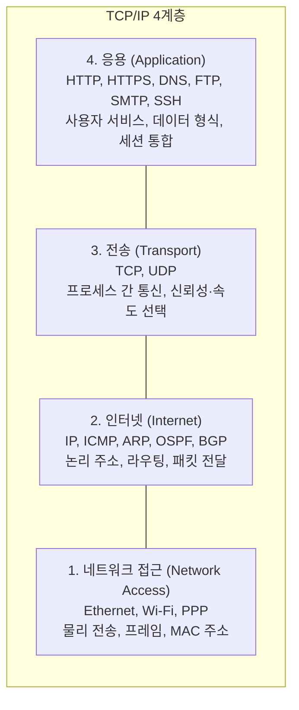
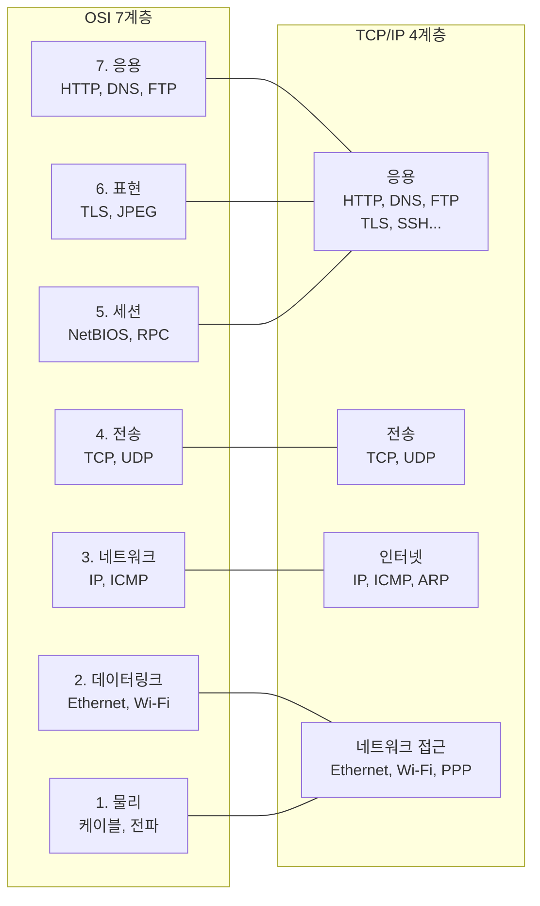
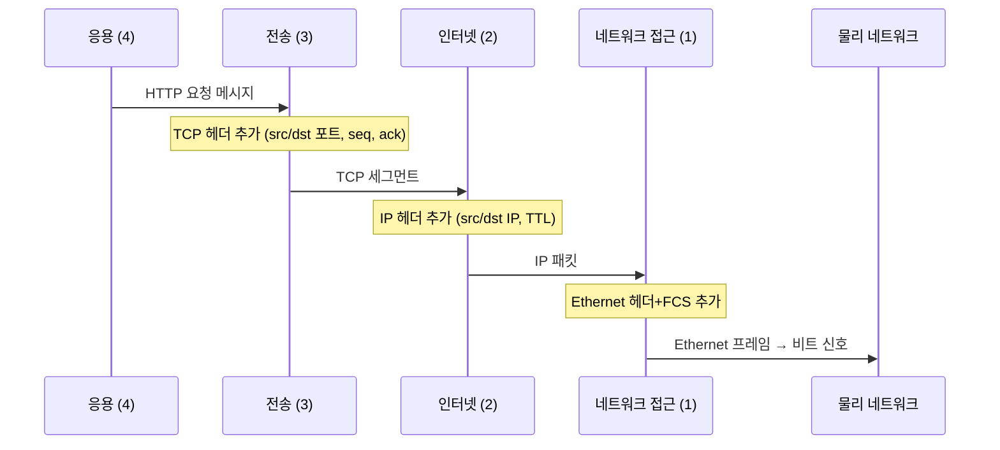

## TCP/IP 모델이란

[OSI 7계층 모델](/post/micro-osi-7layer)이 이론적 표준이라면,
**TCP/IP 모델**은 실제 인터넷에서 사용되는 실용 표준이다.[^tcpip-model]

1969년 ARPANET에서 출발해, 1982년 미국 국방부(DoD) 공식 표준으로 채택됐고,
1983년 플래그 데이(Flag Day)에 모든 ARPANET 노드가 일제히 전환하면서
현재 인터넷의 실질적 기반이 됐다.

OSI 7계층을 4계층으로 압축한 구조이며,
**DoD 모델(Department of Defense Model)**이라고도 불린다.

## 4계층 구조

| TCP/IP 계층 | OSI 대응 | 역할 |
|------------|---------|------|
| 응용 | 5, 6, 7계층 | 사용자 애플리케이션, 세션, 데이터 표현 |
| 전송 | 4계층 | 프로세스 간 통신, TCP/UDP |
| 인터넷 | 3계층 | 논리 주소 지정, 라우팅, IP |
| 네트워크 접근 | 1, 2계층 | 물리 전송, 프레임, 매체 접근 |

## 각 계층 상세

### 4계층 — 응용 (Application)

OSI의 5(세션) + 6(표현) + 7(응용) 계층을 하나로 통합했다.
애플리케이션 개발자가 직접 다루는 계층이다.

대표 프로토콜:
- **[HTTP/HTTPS](/post/micro-http-https)**: 웹 문서 전송 (포트 80, 443)
- **DNS**: 도메인 → IP 변환 (포트 53)
- **FTP**: 파일 전송 (포트 20, 21)
- **SMTP/IMAP**: 이메일 전송/수신 (포트 25, 143)
- **SSH**: 원격 접속 (포트 22)

### 3계층 — 전송 (Transport)

포트 번호로 프로세스를 식별하고, 필요에 따라 신뢰성 또는 속도를 선택한다.

- **[TCP](/post/micro-tcp-udp)**: 신뢰성 보장, 순서 보장, 흐름 제어, 혼잡 제어
- **[UDP](/post/micro-tcp-udp)**: 빠른 전송, 보장 없음, 낮은 오버헤드

### 2계층 — 인터넷 (Internet)

TCP/IP 모델의 핵심 계층. 이름 자체가 인터넷을 가리킨다.

- **[IP](/post/micro-ip-arp)** (RFC 791): 논리 주소 부여, 라우팅, 단편화
- **ICMP**: 오류 보고, 연결 진단 (`ping`, `traceroute`)
- **[ARP](/post/micro-ip-arp)**: IP → MAC 주소 변환
- **OSPF, BGP**: 라우팅 프로토콜 (AS 내부/간 경로 교환)

### 1계층 — 네트워크 접근 (Network Access)

OSI의 물리 계층과 데이터링크 계층을 합친 것이다.
TCP/IP는 이 계층을 명시적으로 정의하지 않는다 — 기존 기술(Ethernet, Wi-Fi, 광섬유 등)을 그대로 사용한다.

이 계층이 추상화되어 있기 때문에 TCP/IP는 어떤 물리 매체 위에서도 동작할 수 있다.

## TCP/IP vs OSI 비교

| 비교 항목 | OSI 7계층 | TCP/IP 4계층 |
|----------|----------|-------------|
| 목적 | 범용 이론 모델, 표준화 | 실용 구현 모델 |
| 계층 수 | 7 | 4 |
| 표준화 기구 | ISO | IETF (RFC) |
| 시장 채택 | 제한적 | 전 세계 인터넷 |
| 핵심 표준 | ISO/IEC 7498-1 (1984) | RFC 1122 (1989) |
| 물리 계층 | 별도 정의 | 명시적 정의 없음 (위임) |
| 용도 | 교육, 분석, 설계 기준 | 실제 인터넷 구현 |

## TCP/IP 모델에서의 데이터 흐름

## RFC 1122 — TCP/IP 구현 요구사항

TCP/IP 모델의 표준 문서는 **RFC 1122 (1989)**다.[^rfc1122]
이 문서는 인터넷 호스트가 통신 계층을 어떻게 구현해야 하는지 규정한다.

RFC 1122가 강조하는 핵심 원칙:
> **"Be liberal in what you accept, and conservative in what you send."**
> (수신은 너그럽게, 송신은 엄격하게)

이를 **Postel의 법칙(Robustness Principle)**이라 부른다.
인터넷이 다양한 구현 간에도 잘 동작하는 이유 중 하나다.

## 관련 글

- [OSI 7계층 모델](/post/micro-osi-7layer): [OSI 모델](/post/micro-osi-7layer)과의 상세 비교
- [캡슐화와 역캡슐화 — PDU의 여정](/post/micro-encapsulation): [TCP/IP 각 계층](/post/micro-encapsulation)에서 데이터가 포장되는 방식
- [IP와 ARP — 주소와 경로의 언어](/post/micro-ip-arp): [인터넷 계층](/post/micro-ip-arp)의 핵심 프로토콜
- [TCP와 UDP — 신뢰성과 속도의 트레이드오프](/post/micro-tcp-udp): [전송 계층](/post/micro-tcp-udp)의 두 프로토콜

---

[^tcpip-model]: Internet protocol suite, <a href="https://en.wikipedia.org/wiki/Internet_protocol_suite" target="_blank">Wikipedia</a>
[^rfc1122]: R. Braden, "Requirements for Internet Hosts — Communication Layers", RFC 1122, October 1989, <a href="https://datatracker.ietf.org/doc/html/rfc1122" target="_blank">IETF</a>
[^arpanet]: ARPANET, <a href="https://en.wikipedia.org/wiki/ARPANET" target="_blank">Wikipedia</a>
[^dod]: United States Department of Defense, TCP/IP adoption 1982, <a href="https://en.wikipedia.org/wiki/Internet_protocol_suite" target="_blank">Wikipedia</a>
[^postel]: Jon Postel, <a href="https://en.wikipedia.org/wiki/Jon_Postel" target="_blank">Wikipedia</a>
