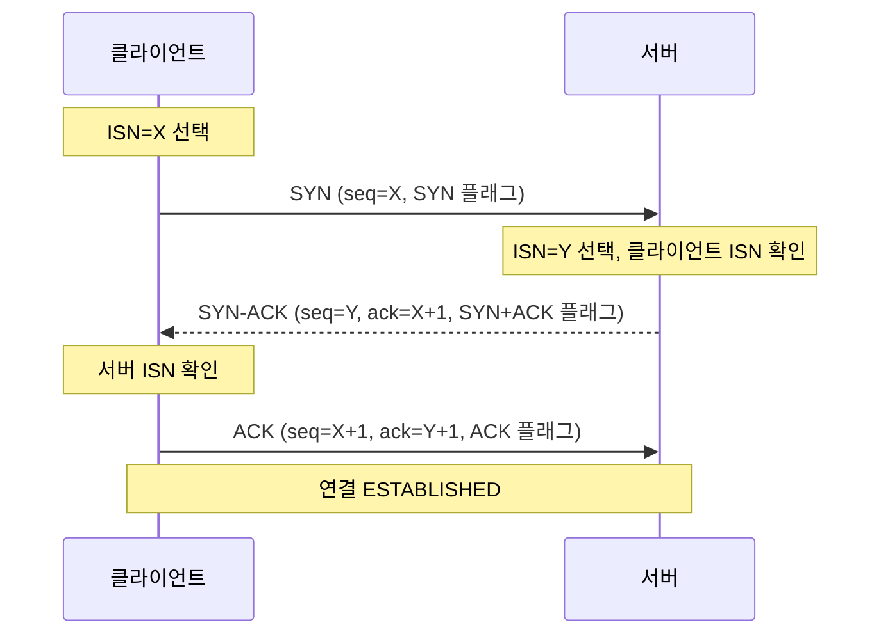
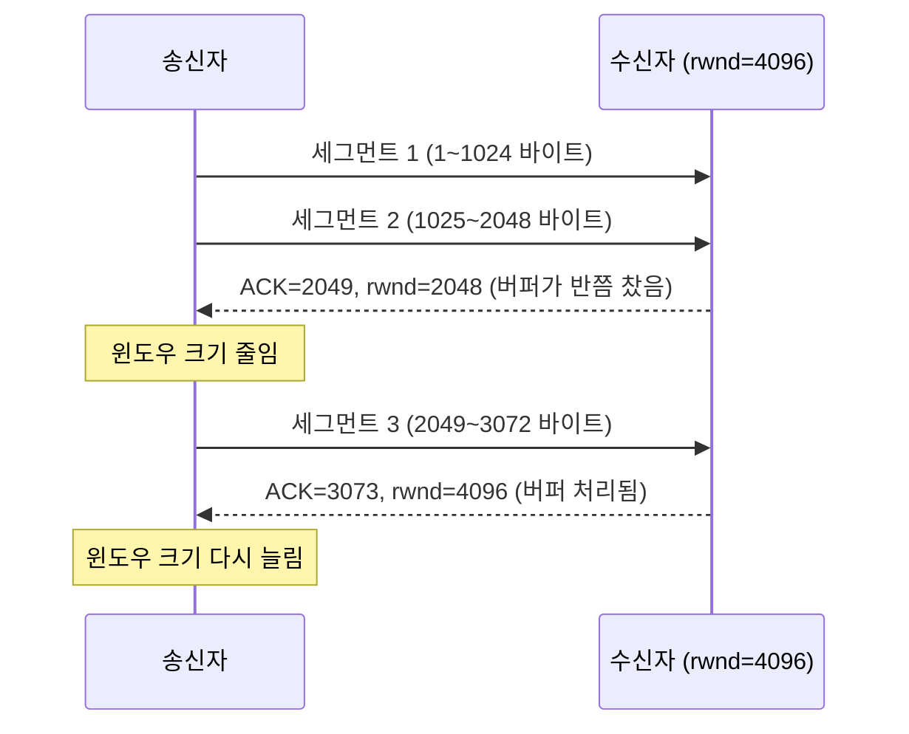
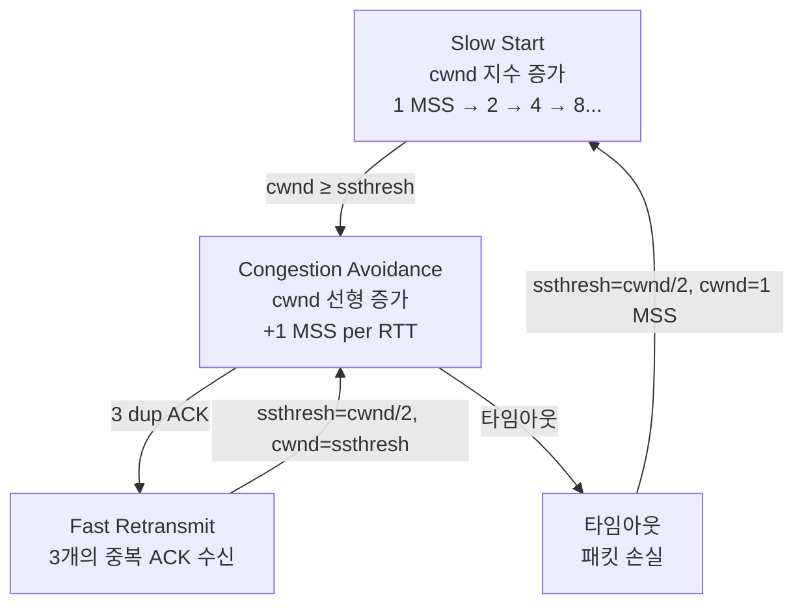
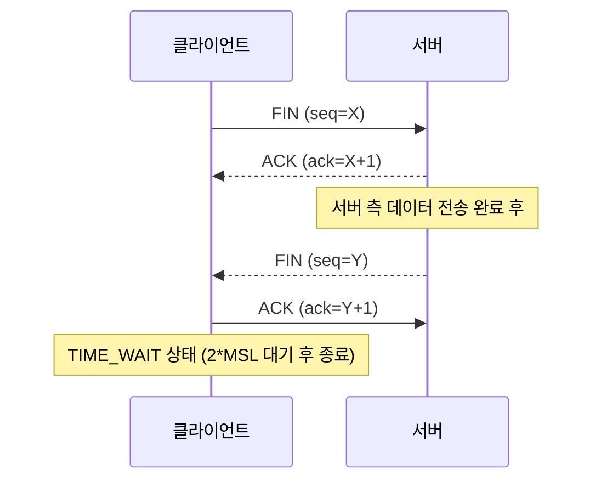
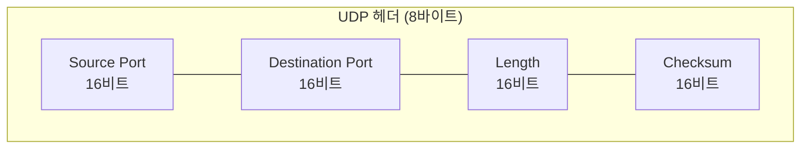
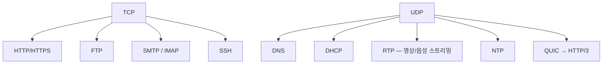

## 전송 계층의 역할

[IP](/post/micro-ip-arp)는 패킷을 올바른 **호스트**까지 배달한다.
하지만 호스트 안에는 수십 개의 프로세스(웹 브라우저, 게임, 음악 스트리밍 등)가 동시에 돌고 있다.

어느 프로세스에게 패킷을 전달해야 할까?

이 문제를 해결하는 것이 **전송 계층(Transport Layer)**이다.
전송 계층은 **포트 번호**로 프로세스를 식별하고,
**TCP**와 **UDP**로 서로 다른 전달 방식을 제공한다.[^transport-layer]

## TCP — Transmission Control Protocol

1974년 Vinton Cerf와 Robert Kahn의 논문 *"A Protocol for Packet Network Intercommunication"*에서 처음 제안됐다.[^cerf-kahn]
1981년 9월 Jon Postel이 **RFC 793**으로 표준화했다.
이 명세는 40년 이상 유효했고, 2022년 **RFC 9293**으로 갱신됐다.[^rfc793]

TCP는 네 가지를 보장한다.

1. **신뢰성**: 전송된 데이터는 반드시 목적지에 도달한다 (손실 시 재전송)
2. **순서 보장**: 데이터는 보낸 순서대로 도착한다
3. **중복 제거**: 같은 데이터가 두 번 전달되지 않는다
4. **오류 감지**: 체크섬으로 손상된 세그먼트를 탐지한다

### 3-Way 핸드셰이크 — 연결 수립

데이터를 보내기 전에 TCP는 **양방향 연결**을 먼저 수립한다.
이를 **3-Way 핸드셰이크**라고 한다.

핵심은 **ISN(Initial Sequence Number)**의 동기화다.
양쪽이 각자의 ISN을 공유해야 이후 데이터의 순서를 추적할 수 있다.

왜 3단계인가?
논리적으로는 4단계(SYN → SYN, ACK)지만,
서버의 SYN과 클라이언트에 대한 ACK를 하나의 메시지(SYN-ACK)로 합칠 수 있어 3단계가 된다.
3단계는 또한 **오래된 중복 SYN 패킷**이 새 연결을 방해하는 것을 방지한다.

### TCP 세그먼트 헤더

| 필드 | 크기 | 설명 |
|------|------|------|
| Source Port | 16비트 | 송신 프로세스 포트 번호 |
| Destination Port | 16비트 | 수신 프로세스 포트 번호 |
| Sequence Number | 32비트 | 이 세그먼트의 첫 바이트 위치 |
| Acknowledgment Number | 32비트 | 다음에 받기를 기대하는 바이트 번호 |
| Data Offset | 4비트 | 헤더 길이 (32비트 단위, 최소 5 = 20바이트) |
| Flags | 9비트 | URG, **ACK**, **PSH**, **RST**, **SYN**, **FIN** |
| Window Size | 16비트 | 수신 버퍼 여유 공간 (흐름 제어) |
| Checksum | 16비트 | 오류 검출 |
| Urgent Pointer | 16비트 | 긴급 데이터 위치 (URG 플래그 시 유효) |

### 흐름 제어 — 슬라이딩 윈도우

수신자가 처리할 수 있는 속도보다 빠르게 보내면 버퍼가 넘친다.
TCP의 **흐름 제어(Flow Control)**는 수신자가 **rwnd(Receive Window)**를 ACK에 담아 광고하는 방식으로 동작한다.

### 혼잡 제어 — AIMD

네트워크가 과부하 상태일 때 TCP는 **혼잡 제어(Congestion Control)**로 전송 속도를 줄인다.
핵심은 **cwnd(Congestion Window)**를 조절하는 것이다.[^congestion]

**Slow Start**: 새 연결에서 cwnd=1 MSS로 시작해 ACK마다 두 배로 증가
**Congestion Avoidance**: ssthresh 도달 후 RTT마다 1 MSS씩 증가 (선형)
**Fast Retransmit**: 3개의 중복 ACK = 패킷 손실 신호 → 즉시 재전송, 타임아웃 대기 없음

주요 TCP 변형: **TCP Tahoe, TCP Reno, TCP CUBIC(Linux 기본), TCP BBR(Google, 2016)**

### 연결 종료 — 4-Way FIN

TIME_WAIT는 지연된 패킷이 새 연결을 방해하지 않도록 잠시 대기하는 상태다.

---

## UDP — User Datagram Protocol

1980년 8월 28일 David P. Reed와 Jon Postel이 단 **3페이지짜리 RFC 768**로 정의했다.[^rfc768]
짧은 이유가 있다: UDP는 하는 일이 거의 없다.

> RFC 768 원문: *"This User Datagram Protocol (UDP) is defined to make available a datagram mode of packet-switched computer communication..."*

UDP는 **연결 없이**, **확인 없이**, **순서 보장 없이** 데이터를 전송한다.
전송 계층 프로토콜 중 가장 단순한 형태다.

### UDP 헤더 — 단 8바이트

| 필드 | 크기 | 설명 |
|------|------|------|
| Source Port | 16비트 | 송신 포트 (선택적, 0이면 사용 안 함) |
| Destination Port | 16비트 | 수신 포트 |
| Length | 16비트 | UDP 헤더 + 데이터 전체 길이 (최소 8) |
| Checksum | 16비트 | IPv4에서 선택적, IPv6에서 필수 |

TCP 헤더가 최소 20바이트인 것에 비해 UDP는 8바이트다.
핸드셰이크 없이 즉시 전송, ACK 없음, 재전송 없음, 흐름 제어 없음.

### TCP vs UDP 비교

| 특성 | TCP | UDP |
|------|-----|-----|
| 연결 방식 | 연결 지향 (3-way 핸드셰이크) | 비연결 |
| 신뢰성 | 보장 (재전송) | 미보장 |
| 순서 | 보장 | 미보장 |
| 흐름 제어 | 있음 (슬라이딩 윈도우) | 없음 |
| 혼잡 제어 | 있음 (AIMD) | 없음 |
| 헤더 크기 | 최소 20바이트 | 8바이트 |
| HOL 블로킹 | 있음 | 없음 |
| 지연 | 상대적으로 높음 | 낮음 |
| 적합한 용도 | 파일 전송, 웹, 이메일 | 스트리밍, DNS, 게임 |

### UDP가 선택받는 이유

**DNS**: 쿼리와 응답이 각각 단 하나의 패킷. TCP 핸드셰이크를 하면 왕복 시간이 두 배 이상 걸린다.

**실시간 스트리밍 (RTP over UDP)**: 늦게 도착한 오디오 패킷은 버린다.
TCP의 재전송을 기다리면 끊김이 더 심해진다.

**온라인 게임**: 플레이어의 위치 업데이트는 0.1초 후 정보가 무의미하다.
게임 엔진이 중요 이벤트에만 자체 재전송 로직을 구현한다.

**QUIC(RFC 9000)**: HTTP/3의 기반. UDP 위에서 TCP의 신뢰성을 user space에서 구현하면서도 스트림별 HOL 블로킹을 제거했다. UDP의 유연성 위에 신뢰성을 쌓은 현대적 접근법이다.

## 관련 글

- [HTTP와 HTTPS — 웹을 움직이는 프로토콜 →](/post/micro-http-https) — TCP 위에서 동작하는 HTTP의 진화
- [IP와 ARP — 주소와 경로의 언어 →](/post/micro-ip-arp) — TCP/UDP가 사용하는 IP 헤더의 Protocol 필드
- [캡슐화와 역캡슐화 — PDU의 여정 →](/post/micro-encapsulation) — TCP 세그먼트가 IP 패킷으로 캡슐화되는 과정
- [트래픽 — 대역폭, 처리율, 패킷 손실, 혼잡 →](/post/micro-network-traffic) — TCP 혼잡 제어와 네트워크 성능의 관계

---

[^transport-layer]: Transport layer, <a href="https://en.wikipedia.org/wiki/Transport_layer" target="_blank">Wikipedia</a>
[^tcp]: Transmission Control Protocol, <a href="https://en.wikipedia.org/wiki/Transmission_Control_Protocol" target="_blank">Wikipedia</a>
[^cerf-kahn]: V. Cerf, R. Kahn, "A Protocol for Packet Network Intercommunication", *IEEE Transactions on Communications*, May 1974 — <a href="https://en.wikipedia.org/wiki/Vint_Cerf" target="_blank">Wikipedia</a>
[^rfc793]: J. Postel, "Transmission Control Protocol", RFC 793, September 1981, <a href="https://datatracker.ietf.org/doc/html/rfc793" target="_blank">IETF</a>
[^rfc9293]: W. Eddy, "Transmission Control Protocol (TCP)", RFC 9293, August 2022, <a href="https://datatracker.ietf.org/doc/html/rfc9293" target="_blank">IETF</a>
[^congestion]: TCP congestion control, <a href="https://en.wikipedia.org/wiki/TCP_congestion_control" target="_blank">Wikipedia</a>
[^udp]: User Datagram Protocol, <a href="https://en.wikipedia.org/wiki/User_Datagram_Protocol" target="_blank">Wikipedia</a>
[^rfc768]: J. Postel, "User Datagram Protocol", RFC 768, August 28, 1980, <a href="https://datatracker.ietf.org/doc/html/rfc768" target="_blank">IETF</a>
[^quic]: QUIC, <a href="https://en.wikipedia.org/wiki/QUIC" target="_blank">Wikipedia</a>
