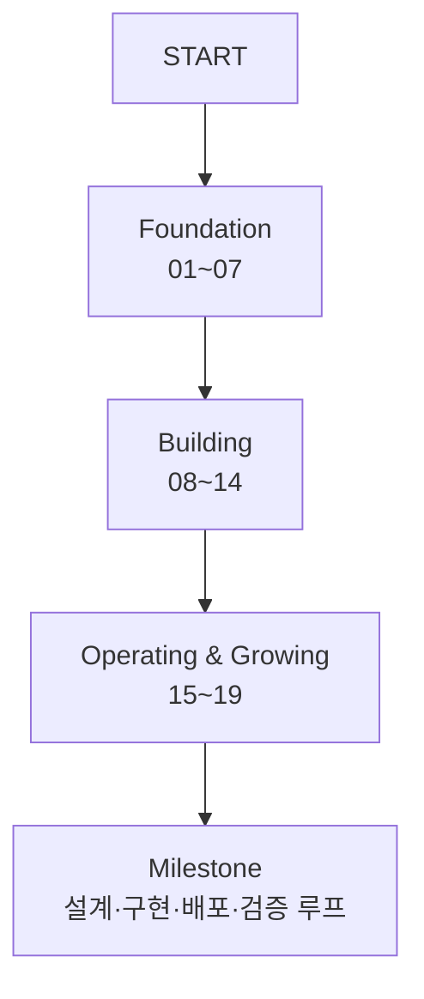

## 이 글의 역할

이 글은 **AI 웹개발자 로드맵 전체 인덱스**다.

기준은 [DevSkills 로드맵](https://devskills.net/roadmap)이다.<a href="https://devskills.net/roadmap" target="_blank">[1]</a> 원본 로드맵은 Foundation, Building, Operating & Growing 흐름으로 AI 시대 웹개발자에게 필요한 역량을 나눈다.

여기서는 그 흐름을 이 블로그의 글 구조에 맞게 01~19 포스트로 연결한다. 각 세부 포스트에는 **반드시 `## 참고` 섹션**을 두고, 공식 문서나 신뢰도 높은 자료를 달아 둔다.

::: notice
이 글은 로드맵 복제가 아니라 **학습 라우팅 페이지**다. 각 항목은 실제로 읽을 수 있는 포스트와 공식 참고 사이트로 이어진다.
:::

---

## Foundation — 기초 다지기

### 01 브라우저 & 클라이언트

- [JS 이벤트 루프와 비동기 큰 그림 →](/post/js-event-loop-and-async)
- [setTimeout vs Promise 실행 순서 →](/post/settimeout-vs-promise)
- [React 단방향 데이터 흐름 →](/post/react-component-data-flow)
- [controlled vs uncontrolled 컴포넌트 →](/post/react-controlled-vs-uncontrolled)
- [TypeScript 타입 시스템 기초 →](/post/typescript-type-system-basics)

### 02 서버 & 데이터

- [Node.js · Bun · Deno 런타임 비교 →](/post/js-runtime-node-bun-deno)
- [HTTP 메서드와 상태 코드 기초 →](/post/http-methods-and-status-codes)
- [Hono로 REST API 시작하기 →](/post/hono-rest-api-overview)
- [SQL JOIN · WHERE · HAVING · GROUP BY →](/post/sql-joins-where-having-group-by)

### 03 Engineering Practice — 코드 품질

- [코드 품질 기초 — ESLint, Prettier, Biome →](/post/code-quality-eslint-prettier-biome)

### 04 Engineering Practice — Git & 릴리즈

- [Git & 릴리즈 기초 — 브랜치 전략, Conventional Commits, Husky →](/post/git-branching-conventional-commits-husky)

### 05 브라우저 & 클라이언트 — UI & 스타일링

- [UI & 스타일링 기초 — 모던 CSS, Tailwind, shadcn/ui →](/post/modern-css-tailwind-shadcn)

### 06 AI Workflow — AI 코딩 도구

- [AI 코딩 도구 기초 — Cursor, Copilot, Claude Code, MCP →](/post/ai-coding-tools-cursor-copilot-claude-code-mcp)

### 07 서버 & 데이터 — DB & ORM

- [DB & ORM 기초 — PostgreSQL, Drizzle, Neon, Supabase →](/post/db-orm-postgres-drizzle-neon-supabase)

::: success
01~07을 마치면 **코드를 읽고 이해할 수 있는 기본 체력**이 생긴다.
:::

---

## Building — 기능 만들기

### 08 상태 & 데이터 페칭

- [상태 & 데이터 페칭 — TanStack Query, Zustand, Server Actions →](/post/state-data-fetching-tanstack-zustand-server-actions)

### 09 API 설계

- [API 설계 — REST 원칙, OpenAPI, Server Actions, RPC →](/post/api-design-rest-openapi-rpc-server-actions)

### 10 인증 & 보안

- [인증 & 보안 — Auth.js, OWASP, 패스키 기초 →](/post/auth-security-authjs-owasp-passkeys)

### 11 요구사항 분석

- [요구사항 분석 — Spec, 유저 스토리, 기술 선택 트레이드오프 →](/post/requirements-spec-user-story-tradeoff)

### 12 테스트

- [테스트 기초 — 테스트 사고법, Vitest, Playwright →](/post/testing-vitest-playwright)

### 13 Context Engineering

- [Context Engineering — 프롬프트, Rules, 메모리, Skill 시스템 →](/post/context-engineering-prompts-rules-memory-skills)

### 14 빌드 · 성능 · a11y

- [빌드 · 성능 · a11y — Vite, Turbopack, Lighthouse, WCAG →](/post/build-performance-a11y-vite-turbopack-lighthouse-wcag)

::: success
08~14를 마치면 **기능을 설계하고 만들 수 있는 단계**로 올라간다.
:::

---

## Operating & Growing — 운영과 성장

### 15 배포 & 운영

- [배포 & 운영 기초 — Vercel, Railway, GitHub Actions →](/post/deployment-vercel-railway-github-actions)

### 16 아키텍처 패턴

- [아키텍처 패턴 — 레이어, 컴포넌트 기반 설계, 클린 아키텍처 →](/post/architecture-patterns-layered-component-clean)

### 17 관측 & 보안

- [관측 & 보안 — Sentry, PostHog, OpenTelemetry, npm audit →](/post/observability-security-sentry-posthog-otel-npm-audit)

### 18 AI 개발 프로세스

- [AI 개발 프로세스 — 작업 분할, Spec, TDD Workflow, Hook 설계 →](/post/ai-development-process-spec-tdd-hooks)

### 19 AI 코드 검증

- [AI 코드 검증 — 품질·보안·성능·UX 리뷰 루프 →](/post/ai-code-verification-review-quality-security-performance-ux)

::: success
15~19를 마치면 **만든 기능을 배포하고, 관측하고, 검증하며 성장시키는 흐름**을 갖게 된다.
:::

---

## 전체 흐름

::: tip
로드맵은 한 번에 외우는 목록이 아니다. 각 포스트의 예제와 참고 문서를 같이 보면서, **읽기 → 실습 → 검증** 순서로 반복해야 실제 역량이 된다.
:::

---

## 참고

<ol>
<li><a href="https://devskills.net/roadmap" target="_blank">[1] DevSkills — AI 웹개발자 로드맵</a></li>
<li><a href="https://developer.mozilla.org/en-US/docs/Web/JavaScript" target="_blank">[2] MDN — JavaScript</a></li>
<li><a href="https://react.dev/learn" target="_blank">[3] React Docs — Learn React</a></li>
<li><a href="https://nodejs.org/learn" target="_blank">[4] Node.js Learn</a></li>
<li><a href="https://www.postgresql.org/docs/" target="_blank">[5] PostgreSQL Documentation</a></li>
<li><a href="https://docs.github.com/en/actions" target="_blank">[6] GitHub Docs — GitHub Actions</a></li>
<li><a href="https://owasp.org/www-project-top-ten/" target="_blank">[7] OWASP Top 10</a></li>
<li><a href="https://docs.anthropic.com/en/docs/claude-code/overview" target="_blank">[8] Anthropic Docs — Claude Code overview</a></li>
</ol>

---

## 관련 글

- [TanStack Query 개요 →](/post/react-query-overview)
- [Claude Code 하네스 유출이 말해 주는 것 →](/post/claude-code-harness-leak-architecture)
- [gstack 개요 — 전체 구조와 철학 →](/post/gstack-overview)
