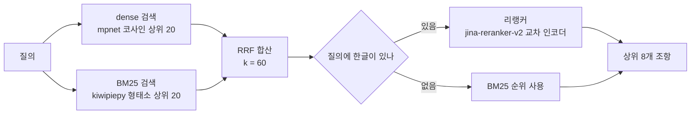

::: abstract
설계기준 조항 검색에서 dense 검색은 Hit@3 0.35에 그쳤다. kiwipiepy 형태소 BM25 결과와 dense 결과를 RRF($k = 60$)로 합치고 교차 인코더 리랭커로 후보 20개를 재정렬해, KDS 질의 20개 기준 Hit@3 0.90, Hit@1 0.75를 얻었다. 코퍼스를 1,287개로 늘린 뒤에도 Hit@3 0.90을 유지했다. 수식 기호만으로 된 질의에서는 리랭커가 순위를 내려(Hit@3 0.533), 한글이 없는 질의는 리랭커를 건너뛰도록 분기했다(0.767).
:::

## 1. 배경

### 1.1 문제 상황

구조 계산서에는 판단의 근거가 된 설계기준을 적는다. 「[[kds|KDS]] 11 80 05 4.4.1」처럼 조항 번호를 달거나, 설계기준 PDF의 식과 표를 쪽 번호와 함께 옮겨 적는다. 이 레퍼런스 인용 작업을 줄이려고 KDS 웹 원문과 설계기준 PDF를 한 번에 검색하는 [[rag|RAG]] 검색을 만들기 시작했다. 질문을 넣으면 근거 조항을 조항 번호, 쪽 번호와 함께 돌려주고, 로컬 [[llm|LLM]]이 그 조항을 인용해 답한다. 인용한 조항이 맞는지는 사람이 원문으로 확인하므로, 검색이 정답 조항을 상위에 올리는 것이 먼저다.

### 1.2 dense 검색의 실패 유형

처음 구현은 [[embedding|임베딩]] 벡터만 쓰는 [[denseSearch|dense 검색]]이었다. 조항 20개를 정답으로 지정한 [[evalSet|평가셋]]으로 재 보니 정답 조항이 상위 3개 안에 든 비율(Hit@3)이 0.35였다.

| 임베딩 모델 | 크기 | Hit@1 | Hit@3 | Hit@5 | MRR |
| --- | --- | --- | --- | --- | --- |
| paraphrase-multilingual-MiniLM-L12-v2 | 0.22GB | 0.10 | 0.25 | 0.35 | 0.187 |
| paraphrase-multilingual-mpnet-base-v2 | 1.0GB | 0.20 | 0.35 | 0.40 | 0.285 |

실패한 질의를 하나씩 열어 보면 두 종류였다.

1. 「주동토압 수동토압 정지토압」, 「국부좌굴 폭두께비」처럼 전문용어를 그대로 친 질의가 상위 20개에도 들지 못했다. 임베딩은 문장 의미를 벡터 하나로 압축하므로, 용어가 정확히 일치하는지는 점수에 약하게만 반영된다.
2. 정답 문서는 찾았지만 조항이 틀렸다. 「기준안전율」 질의가 `4.4 안정 검토` 대신 같은 기준의 `4.7 점검 및 유지관리`로 갔다. 또 `1.5 기호의 정의`, `1.2 적용 범위` 같은 짧은 일반 조항이 무관한 질의 여러 개에서 1위를 차지했다.

첫째는 어휘 일치 문제라 키워드 검색([[bm25|BM25]])으로, 둘째는 순위 문제라 [[reranker|리랭커]]로 풀었다. 모델을 MiniLM에서 mpnet으로 키워 0.25가 0.35가 됐지만 실패 유형은 그대로였다.

---

## 2. 방법

### 2.1 검색 대상과 평가셋

검색 단위는 **조항** 하나다. KDS 웹 원문은 국가건설기준센터 [[openapi|OpenAPI]]에서 받아 조항 번호 단위로 자르고, PDF는 목차(북마크) 항목 단위로 자른다. 조항 한 행에는 원문, 임베딩 벡터, 조항 번호, 쪽 번호, 딸린 표가 함께 저장된다([[lancedb|LanceDB]]).

평가셋 `eval_set.jsonl`은 질의 20개와 정답 조항의 `(doc_code, labels)`로 이루어진다. KDS 11 80 05(옹벽), KDS 17 10 00(내진), KDS 41 30 10(강구조), KDS 24 10 11(교량)의 조항을 직접 보고 만들었다. 자연어 질의와 용어만 나열한 질의가 섞여 있다.

```json
{"query": "주동토압 수동토압 정지토압", "doc_code": "KDS 11 80 05", "labels": ["1.7.3"], "note": "키워드형(dense 약점 측정)"}
```

### 2.2 평가 지표

지표는 검색 결과 안에서 정답 조항이 처음 나온 순위로 계산한다. 답변 문장이 아니라 검색만 따로 잰다.

- [[hitk|Hit@k]]: 정답 조항이 상위 k개 안에 든 질의의 비율
- [[mrr|MRR]](Mean Reciprocal Rank): 정답 순위의 역수 평균. 상위 20개 밖이면 0으로 친다.

$$
\text{MRR} = \frac{1}{|Q|} \sum_{i=1}^{|Q|} \frac{1}{\text{rank}_i}
$$

목표는 Hit@3 0.9 이상으로 잡았다. 화면에 상위 결과 몇 개를 펼쳐 보여 주므로 3위 안에 들면 사용자가 바로 확인할 수 있다.

### 2.3 전체 구조



코드는 `civil_engine/rag/` 아래에 있다. `store.py`가 dense 검색, `lexical.py`가 BM25, `hybrid.py`가 합산과 분기, `rerank.py`가 리랭커를 맡는다. `hybrid.search()`의 `use_bm25`, `use_rerank` 인자로 단계를 하나씩 끄고 켤 수 있어서 같은 평가셋으로 각 단계의 기여를 따로 잰다.

모델은 모두 [[fastembed|fastembed]]의 [[onnx|ONNX]] 런타임으로 돌린다. PyTorch 없이 CPU에서 동작하므로 GPU가 없는 업무용 PC에서도 로컬로 실행된다.

### 2.4 dense 검색

질의와 조항을 같은 임베딩 모델(`paraphrase-multilingual-mpnet-base-v2`, 768차원)로 각각 벡터로 바꾸고 [[cosine|코사인 유사도]]로 정렬한다. 질의와 문서를 따로 인코딩하는 이 방식을 [[biEncoder|bi-encoder]]라고 한다<a href="https://arxiv.org/abs/2004.04906" target="_blank"><sup>[7]</sup></a>. 조항 벡터는 색인할 때 한 번만 계산해 두므로 질의 시점에는 질의 벡터 하나만 계산하면 된다.

```python
# store.py
rows = db.open_table(_TABLE).search(qv).metric("cosine").limit(k).to_list()
d["score"] = 1.0 - float(r.get("_distance", 1.0))  # cosine 유사도
```

표현이 달라도 뜻이 같으면 찾는다. 「옹벽이 밀리는 것」으로 물어도 「활동」 조항이 나온다. 반대로 문장 전체를 벡터 하나로 요약하므로, 질의에 들어간 특정 용어가 조항에 그대로 있는지는 구분하지 못한다.

### 2.5 BM25와 한국어 토큰화

BM25는 질의 [[token|토큰]]이 문서에 몇 번 나오는지(tf), 그 토큰이 [[corpus|코퍼스]] 전체에서 얼마나 드문지(idf), 문서 길이가 평균보다 긴지를 조합한 점수다<a href="https://doi.org/10.1561/1500000019" target="_blank"><sup>[1]</sup></a>.

$$
\text{score}(D, Q) = \sum_{q_i \in Q} \text{IDF}(q_i) \cdot \frac{f(q_i, D)\,(k_1 + 1)}{f(q_i, D) + k_1 \left(1 - b + b \cdot \frac{|D|}{\text{avgdl}}\right)}
$$

$f(q_i, D)$는 문서 $D$ 안의 토큰 빈도, $|D|$는 문서 토큰 수, avgdl은 평균 문서 길이다. `rank_bm25`의 `BM25Okapi` 기본값($k_1 = 1.5$, $b = 0.75$)을 그대로 쓴다<a href="https://github.com/dorianbrown/rank_bm25" target="_blank"><sup>[2]</sup></a>. 코퍼스가 조항 1,000여 개라 [[invertedIndex|역색인]] 서버 없이 메모리에 올린다.

점수 계산보다 토큰화가 결과를 더 크게 좌우했다. 한국어는 「주동토압에」처럼 명사에 조사가 붙고 「다차로재하계수」처럼 명사가 이어 붙는다. 공백으로 자르면 「주동토압에」와 「주동토압」이 다른 토큰이 된다. 그래서 [[kiwipiepy|kiwipiepy]] [[morpheme|형태소]] 분석기로 자른다<a href="https://github.com/bab2min/kiwipiepy" target="_blank"><sup>[3]</sup></a>.

```python
# lexical.py
def _morphs(text: str) -> list[str]:
    # 형태소 표면형. 1글자 조사·기호는 BM25에서 노이즈라 길이 2+만(숫자/영문 코드는 유지)
    toks = []
    for t in _kiwi.tokenize(text):
        f = t.form
        if len(f) >= 2 or f.isdigit() or f.isascii():
            toks.append(f)
    return toks
```

한 글자 형태소를 버리는 필터는 「의」, 「를」 같은 조사를 없애려고 넣었다. 이 필터가 나중에 `ω` 같은 한 글자 그리스 문자까지 버린다는 사실이 드러났고, 그 과정은 [설계기준 PDF 색인과 수식 기호 검색 실험](/post/rag-pdf-symbol-retrieval)에서 다룬다.

색인 텍스트는 조항 제목과 본문을 합친 `search_text`다. 제목에 조항 번호와 조항 이름이 들어 있어서 「옹벽 활동」 같은 짧은 질의가 제목에서 바로 걸린다.

### 2.6 RRF로 두 순위 합치기

dense 점수는 코사인 유사도(0~1)이고 BM25 점수는 상한이 없는 양수다. 두 점수를 더하려면 정규화 방식과 가중치를 정해야 한다. [[rrf|RRF]](Reciprocal Rank Fusion)는 점수를 버리고 순위만 쓴다<a href="https://doi.org/10.1145/1571941.1572114" target="_blank"><sup>[4]</sup></a>.

$$
\text{RRF}(d) = \sum_{r \in R} \frac{1}{k + \text{rank}_r(d)}
$$

$R$은 합칠 순위 목록들, $\text{rank}_r(d)$는 목록 $r$에서 문서 $d$의 순위(1부터)다. 목록에 없는 문서는 그 목록에서 0점을 받는다. $k = 60$은 원 논문의 값이다.

```python
# hybrid.py
_RRF_K = 60

def _rrf(rankings: list[list[str]], k: int = _RRF_K) -> dict[str, float]:
    """Reciprocal Rank Fusion: 각 순위에서 1/(k+rank) 합산."""
    scores: dict[str, float] = {}
    for ranking in rankings:
        for rank_pos, _id in enumerate(ranking, 1):
            scores[_id] = scores.get(_id, 0.0) + 1.0 / (k + rank_pos)
    return scores
```

$k = 60$에 목록마다 후보 20개를 쓰면 점수 범위가 이렇게 나뉜다.

| 경우 | 최고 점수 | 최저 점수 |
| --- | --- | --- |
| 한 목록에만 있음 | 1/61 = 0.0164 (1위) | 1/80 = 0.0125 (20위) |
| 두 목록에 모두 있음 | 2/61 = 0.0328 | 2/80 = 0.0250 |

두 목록에 모두 든 문서의 최저 점수(0.0250)가 한 목록에만 든 문서의 최고 점수(0.0164)보다 크다. 그래서 이 설정의 RRF는 두 검색기가 모두 찾은 문서를 먼저 세우고, 그 안에서 순위 합으로 정렬한다. 한쪽에서 1위를 해도 다른 쪽 상위 20개에 없으면 두 목록에 모두 든 문서들 뒤로 밀린다.

이 성질은 아래 질의별 결과에서 그대로 보인다.

| 질의 | dense 순위 | BM25 순위 | RRF 순위 |
| --- | --- | --- | --- |
| 옹벽 기초지반 지지력 검토 | 3 | 14 | 3 |
| 주동토압 수동토압 정지토압 | 20위 밖 | 1 | 3 |
| 깎기 경계구간에서의 토압 산정 방법 | 20위 밖 | 9 | 18 |

첫 질의는 두 목록에 모두 있어서 BM25 14위가 3위로 올라왔다. 둘째와 셋째 질의는 정답이 BM25 목록에만 있어서, 두 목록에 모두 든 오답들 뒤로 밀렸다. 전문용어 질의에서는 합산이 BM25 단독보다 나빠질 수 있다는 뜻이다. 이 손실은 다음 단계의 리랭커가 복구한다.

### 2.7 교차 인코더 리랭커

리랭커는 질의와 조항을 한 입력으로 이어 붙여 [[transformer|트랜스포머]]에 넣고, 관련도 점수 하나를 출력한다. 이 방식을 [[crossEncoder|cross-encoder]]라고 한다<a href="https://arxiv.org/abs/1901.04085" target="_blank"><sup>[5]</sup></a>. 질의 토큰과 조항 토큰이 모든 층에서 [[attention|어텐션]]으로 직접 비교되므로 bi-encoder보다 정확하다. 대신 조항 벡터를 미리 계산해 둘 수 없어서 후보마다 모델을 한 번씩 실행해야 한다.

```python
# rerank.py
_RERANK_MODEL = "jinaai/jina-reranker-v2-base-multilingual"

def rerank(query: str, rows: list[dict[str, Any]], top_k: int) -> list[dict[str, Any]]:
    scores = list(_model().rerank(query, [r.get("text", "") for r in rows]))
    order = sorted(range(len(rows)), key=lambda i: scores[i], reverse=True)[:top_k]
    ...
    # 리랭커는 logit(음수 가능) → 표시용 0~1 정규화(순서 보존)
    r["score"] = 1.0 / (1.0 + math.exp(-float(scores[i])))
```

모델 출력은 범위 제한이 없는 [[logit|logit]]이라 화면 표시용으로만 시그모이드를 씌워 0~1로 바꾼다. 순서는 바뀌지 않는다.

모델은 다국어 학습이 명시된 `jina-reranker-v2-base-multilingual`을 골랐다<a href="https://huggingface.co/jinaai/jina-reranker-v2-base-multilingual" target="_blank"><sup>[6]</sup></a>. RRF 상위 20개를 넘기고 상위 8개를 받는다. CPU에서 질의 하나당 약 9초가 걸린다. 후보를 20개보다 늘리면 이 시간이 비례해서 늘어난다.

---

## 3. 결과

### 3.1 도입 시점 측정

처음 도입할 때(KDS 4개 기준의 웹 조항만 색인한 상태) 같은 20문항으로 잰 결과다.

| 구성 | Hit@1 | Hit@3 | Hit@5 | MRR |
| --- | --- | --- | --- | --- |
| dense | 0.20 | 0.35 | 0.40 | 0.285 |
| dense + BM25 (RRF) | 0.30 | 0.60 | 0.75 | 0.463 |
| dense + BM25 + 리랭커 | 0.75 | 0.90 | 0.95 | 0.829 |

### 3.2 코퍼스 확장 후 측정

이후 도로교 설계기준 PDF 조항 481개와 KDS 웹 조항 806개를 합친 1,287개로 코퍼스가 커진 상태에서, 같은 20문항을 방식별로 다시 쟀다. 질의별 순위가 모두 남아 있는 측정이다.

| 구성 | Hit@1 | Hit@3 | Hit@5 | MRR |
| --- | --- | --- | --- | --- |
| dense | 0.15 | 0.30 | 0.30 | 0.225 |
| BM25 | 0.40 | 0.60 | 0.75 | 0.535 |
| dense + BM25 (RRF) | 0.25 | 0.65 | 0.75 | 0.450 |
| dense + BM25 + 리랭커 | 0.75 | 0.90 | 0.95 | 0.838 |

검색 대상이 네 배 가까이 늘었는데 최종 Hit@3은 0.90으로 같았다.

### 3.3 질의별 순위 분석

```chart
{
  "type": "heatmap",
  "caption": "KDS 질의 20개의 정답 순위, 검색 단계별. 칸의 숫자는 정답이 처음 나온 순위다. RRF 열에서 BM25에만 걸린 정답의 순위가 내려가고, 리랭커 열에서 대부분 1위로 올라온다.",
  "source": "/post-assets/work/rag/symbol-retrieval/exp_result4.json",
  "cell": "per_query.H2.{col}.E",
  "rowLabels": { "path": "queries", "filter": { "type": "E" }, "field": "query", "maxChars": 26 },
  "columns": [
    { "key": "dense", "label": "dense" },
    { "key": "bm25", "label": "BM25" },
    { "key": "hybrid", "label": "RRF" },
    { "key": "hybrid+rerank", "label": "+리랭커" }
  ]
}
```

같은 값을 표로 옮기면 다음과 같다. 0은 상위 20개 밖이다.

| # | 질의 | 정답 조항 | dense | BM25 | RRF | +리랭커 |
| --- | --- | --- | --- | --- | --- | --- |
| 1 | 옹벽에 작용하는 토압의 종류와 어떤 토압이론으로 계산하는가 | KDS 11 80 05 1.7.3 | 2 | 1 | 1 | 1 |
| 2 | 옹벽 배면 상재하중에 의한 토압은 어떻게 고려하나 | KDS 11 80 05 1.7.4 | 15 | 3 | 3 | 1 |
| 3 | 깎기 경계구간에서의 토압 산정 방법 | KDS 11 80 05 1.7.7 | 0 | 9 | 18 | 1 |
| 4 | 옹벽 활동에 대한 안정성 검토 | KDS 11 80 05 4.4.1 | 3 | 1 | 1 | 1 |
| 5 | 옹벽 전도에 대한 안정성은 어떻게 검토하는가 | KDS 11 80 05 4.4.3 | 6 | 5 | 2 | 1 |
| 6 | 옹벽 기초지반 지지력 검토 | KDS 11 80 05 4.4.4 | 3 | 14 | 3 | 2 |
| 7 | 옹벽 안정해석 시 적용하는 기준안전율 | KDS 11 80 05 4.4 | 0 | 2 | 5 | 1 |
| 8 | 연약지반 위에 옹벽을 설치할 때 고려사항 | KDS 11 80 05 4.3.2 | 1 | 1 | 1 | 1 |
| 9 | 옹벽 배면 배수공 설계 | KDS 11 80 05 4.6.3 | 1 | 5 | 1 | 1 |
| 10 | 주동토압 수동토압 정지토압 | KDS 11 80 05 1.7.3 | 0 | 1 | 3 | 1 |
| 11 | 활동 전도 지지력 안전율 검토 항목 | KDS 11 80 05 4.1.1, 4.4 | 0 | 1 | 2 | 1 |
| 12 | 시설물 내진등급은 어떻게 분류하는가 | KDS 17 10 00 4.1.1 | 0 | 1 | 2 | 1 |
| 13 | 내진성능수준의 종류와 정의 | KDS 17 10 00 4.1.2 | 0 | 3 | 6 | 1 |
| 14 | 설계지반운동 수준은 어떻게 분류하나 | KDS 17 10 00 4.1.3 | 0 | 1 | 3 | 1 |
| 15 | 지반 액상화 검토 | KDS 17 10 00 4.7 | 0 | 4 | 10 | 2 |
| 16 | 성능기반 내진설계 해석방법 | KDS 17 10 00 4.4.3 | 1 | 2 | 1 | 1 |
| 17 | 강구조 사용하중에 의한 처짐 사용성 기준 | KDS 41 30 10 4.11.3 | 0 | 10 | 18 | 1 |
| 18 | 휨과 압축 조합력에서 국부좌굴 폭두께비 검토 | KDS 41 30 10 4.15.4 | 0 | 0 | 0 | 0 |
| 19 | 교량 설계기준의 적용범위 | KDS 24 10 11 1.1 | 10 | 10 | 4 | 4 |
| 20 | 슬래브교에 대한 등가 스트립 폭 | KDS 24 10 11 4.6.4 | 0 | 1 | 3 | 2 |

표에서 읽히는 것은 다음과 같다.

- dense는 20개 중 11개에서 정답을 상위 20개 안에 넣지 못했다.
- BM25는 12개를 3위 안에 넣었고, 20위 밖으로 놓친 것은 18번 하나다.
- RRF는 BM25에만 걸린 정답을 뒤로 민다(3, 7, 10, 11, 12, 13, 14, 15, 17, 20번). 반대로 양쪽에 걸린 정답은 끌어올린다(5, 6, 9, 19번). 합계로는 BM25 단독보다 Hit@3이 0.05 높다.
- 리랭커는 RRF 상위 20개 안에 들어온 정답을 18번과 19번을 빼고 모두 3위 안으로 올렸다. 3번과 17번은 RRF 18위에서 1위가 됐다.
- 18번은 어느 단계에서도 상위 20개에 들지 않았다. 리랭커는 받은 후보 안에서만 순서를 바꾸므로 후보에 없는 정답은 고칠 수 없다.
- 19번의 「적용범위」는 KDS 대부분의 1.1절 제목이다. 리랭커 뒤에도 교량 기준의 1.1절은 4위였다.

::: note
Hit@1 기준으로는 리랭커 효과가 더 크다. RRF 0.25에서 리랭커 뒤 0.75가 됐다. 앞 단계가 정답을 후보 20개 안에 넣고, 리랭커가 그 안에서 1위를 고르는 분업이다.
:::

### 3.4 기호 질의 예외 처리

설계기준 PDF를 색인에 넣은 뒤 `fyt`, `φs`처럼 수식 기호만으로 검색하는 질의를 따로 모아 쟀다(질의 150개, 리랭커는 30개 표본). 한글 문장 질의와 결과가 반대였다.

| 기호 질의 Hit@3 | dense | BM25 | RRF | +리랭커 |
| --- | --- | --- | --- | --- |
| 수식 기호 질의 (A 유형) | 0.027 | 0.833 | 0.627 | 0.533 |

```chart
{
  "type": "bar",
  "caption": "한글 문장 질의(E)와 수식 기호 질의(A)의 검색 방식별 Hit@3. 두 유형에서 단계별 추세가 반대다. 리랭커는 E 20개 전부, A 표본 30개.",
  "source": "/post-assets/work/rag/symbol-retrieval/exp_result4.json",
  "value": "variants.H2.{bar}.{panel}.Hit@3",
  "panels": [
    { "key": "E", "label": "E 한글 문장 질의" },
    { "key": "A", "label": "A 수식 기호 질의" }
  ],
  "bars": [
    { "key": "dense", "label": "dense" },
    { "key": "bm25", "label": "BM25" },
    { "key": "hybrid", "label": "RRF" },
    { "key": "hybrid+rerank", "label": "+리랭커" }
  ]
}
```

BM25 단독이 가장 높고, 단계를 더할수록 떨어진다. RRF 뒤 후보 20개 안에 정답이 있는 비율은 0.967이었다. 정답은 리랭커에 들어갔는데 리랭커가 순위를 내렸다. 한 단어짜리 기호 질의는 리랭커가 질의와 조항의 관계를 판단할 문맥이 거의 없다.

그래서 한글이 한 글자도 없는 질의는 리랭커를 건너뛰고 BM25 순위를 그대로 앞에 둔다.

```python
# hybrid.py
_HANGUL = re.compile(r"[가-힣]")

# 기호 질의(한글 없음, 예 「fyt」 「φs」)는 리랭커를 건너뛰고 BM25 순위를 쓴다
if use_bm25 and bm and not _HANGUL.search(query):
    use_rerank = False
    bm_ids = [row["id"] for row, _ in bm]
    seen = set(bm_ids)
    fused_ids = bm_ids + [i for i in fused_ids if i not in seen]
```

기호 질의 Hit@3은 0.533에서 0.767이 됐다. 한글 질의는 이 분기를 타지 않으므로 앞의 20문항 결과(0.90)는 바뀌지 않는다. 판별 규칙을 「한글 포함 여부」 하나로 둔 이유도 이것이다. 기존 질의에 영향이 없다는 것을 코드만 보고 확인할 수 있다.

기호 질의가 애초에 BM25에서 0.833이 나오기까지는 PDF에 [[pua|PUA]] 코드로 저장된 수식 글자를 복원하는 작업이 필요했다. 복원 전 기호 질의 Hit@3은 0.013이었다. 그 과정과 표 색인 실험은 [설계기준 PDF 색인과 수식 기호 검색 실험](/post/rag-pdf-symbol-retrieval)에 정리했다.

---

## 4. 논의

### 4.1 검토한 대안

| 대안 | 판단 |
| --- | --- |
| dense 모델을 multilingual-e5-large(2.24GB)로 교체 | MiniLM에서 mpnet으로 키웠을 때 0.25가 0.35가 됐다. 실패 원인이 어휘 일치여서 모델 크기로는 절반만 해결된다고 봤다. 학습 도메인 밖 문서에서 BM25가 여러 dense 모델보다 강하다는 벤치마크 결과도 있다<a href="https://arxiv.org/abs/2104.08663" target="_blank"><sup>[8]</sup></a>. BM25와 리랭커로 0.90에 도달해 교체하지 않았다. |
| LanceDB 내장 전문 검색(Tantivy) | 한국어 토큰화가 약하다고 판단해 kiwipiepy 형태소 분석을 직접 붙였다. 두 방식을 같은 평가셋으로 비교하지는 않았다. |
| 점수 가중합 (예: 0.7 × dense + 0.3 × BM25) | 두 점수의 분포가 다르고 질의마다 BM25 점수 크기가 달라 가중치를 고정하기 어렵다. RRF는 튜닝할 값이 $k$ 하나다. |
| BM25 + RRF까지만 사용 | Hit@3 0.60 ~ 0.65로 목표 미달이다. |
| bge-reranker-base | 크기(1.04GB)가 비슷하다. 다국어 학습을 명시한 jina를 먼저 채택했고 A/B 측정은 하지 않았다. |

### 4.2 한계

- 평가셋 20문항은 개발자가 조항을 보고 만든 초안이다. 인접 조항도 정답으로 인정할 수 있는 질의가 있어서, 실무자 검증을 거치면 점수가 달라질 수 있다.
- 20문항에서 1문항은 0.05다. 0.60과 0.65의 차이는 질의 하나다.
- 리랭커가 CPU에서 질의당 약 9초 걸린다. 검색은 HTTP 요청 한 번이라 중간 결과를 스트리밍하지 않는다. 화면은 경과 시간과 현재 단계(질의 임베딩, 의미 검색과 BM25, 리랭커, 정리)만 표시한다.
- 18번처럼 두 검색기가 모두 후보에 넣지 못한 정답은 이 구조로 복구할 수 없다. 후보 수를 늘리면 리랭커 시간이 비례해 늘어난다.

---

## 5. 결론

- dense 검색은 표현이 다른 질의를 찾고, BM25는 용어가 일치하는 질의를 찾는다. 한국어 BM25는 형태소 단위 토큰화가 전제다.
- RRF($k = 60$, 후보 20개)는 두 목록에 모두 든 문서를 먼저 세운다. 한쪽에만 걸린 정답은 순위가 내려간다.
- 교차 인코더 리랭커가 Hit@1을 0.25에서 0.75로 올렸다. 후보에 없는 정답은 고칠 수 없다.
- 질의 유형마다 가장 잘 맞는 검색 방식이 다르다. 기호 질의는 리랭커를 끄고 BM25 순위를 쓴다.

---

## 부록 A. 원시 데이터

본문의 1,287개 코퍼스 측정값은 모두 아래 파일에서 나왔다. 처음 도입 시점(KDS 4개 기준) 측정은 결과를 화면에만 출력해서 표만 남아 있다.

<ul>
<li><a href="/post-assets/work/rag/symbol-retrieval/e20_per_query_ranks.csv" target="_blank">e20_per_query_ranks.csv</a>: 20문항의 방식별 정답 순위 (3.3절 표)</li>
<li><a href="/post-assets/work/rag/symbol-retrieval/exp_result4.json" target="_blank">exp_result4.json</a>: 전체 측정 결과. <code>per_query.H2.{dense,bm25,hybrid,hybrid+rerank}.E</code> 가 위 CSV의 원본이다</li>
<li><a href="/post-assets/work/rag/symbol-retrieval/exp_log4.txt" target="_blank">exp_log4.txt</a>: 실행 로그 (단계별 Hit@3, 실행 시간)</li>
</ul>

측정 조건은 임베딩 `paraphrase-multilingual-mpnet-base-v2`, 리랭커 `jina-reranker-v2-base-multilingual`, 후보 20개, RRF $k = 60$이다.

## 참고

<ol>
<li><a href="https://doi.org/10.1561/1500000019" target="_blank">[1] Robertson, Zaragoza — The Probabilistic Relevance Framework: BM25 and Beyond, Foundations and Trends in IR 2009</a></li>
<li><a href="https://github.com/dorianbrown/rank_bm25" target="_blank">[2] rank_bm25 — GitHub</a></li>
<li><a href="https://github.com/bab2min/kiwipiepy" target="_blank">[3] kiwipiepy — GitHub</a></li>
<li><a href="https://doi.org/10.1145/1571941.1572114" target="_blank">[4] Cormack, Clarke, Büttcher — Reciprocal Rank Fusion Outperforms Condorcet and Individual Rank Learning Methods, SIGIR 2009</a></li>
<li><a href="https://arxiv.org/abs/1901.04085" target="_blank">[5] Nogueira, Cho — Passage Re-ranking with BERT, arXiv 2019</a></li>
<li><a href="https://huggingface.co/jinaai/jina-reranker-v2-base-multilingual" target="_blank">[6] jina-reranker-v2-base-multilingual — Hugging Face</a></li>
<li><a href="https://arxiv.org/abs/2004.04906" target="_blank">[7] Karpukhin et al. — Dense Passage Retrieval for Open-Domain Question Answering, EMNLP 2020</a></li>
<li><a href="https://arxiv.org/abs/2104.08663" target="_blank">[8] Thakur et al. — BEIR: A Heterogeneous Benchmark for Zero-shot Evaluation of Information Retrieval Models, NeurIPS 2021</a></li>
</ol>

---

## 관련 글

- [설계기준 PDF 색인과 수식 기호 검색 실험 →](/post/rag-pdf-symbol-retrieval) (PUA 수식 글자 복원, 표 추출, 가설 H1~H9 측정)
- [Electron 앱에 Python 사이드카 번들링 →](/post/electron-python-sidecar-bundling) (검색 엔진이 도는 사이드카 구조)
