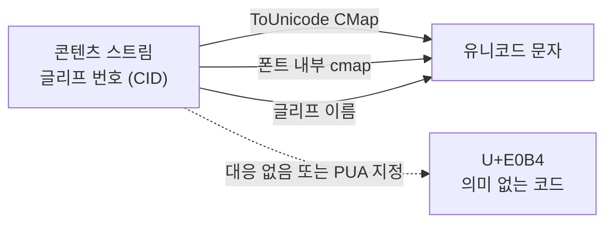
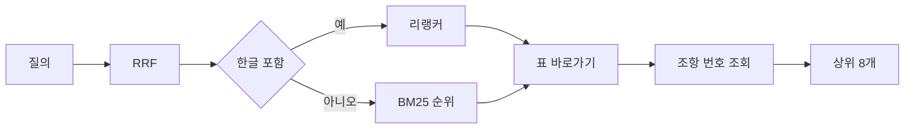

::: abstract
한글(HWP)로 만든 설계기준 PDF는 수식 글자를 HyhwpEQ 폰트의 PUA 코드로 내보내, 조항 49.9%와 표 63%의 기호가 검색되지 않았다. PUA 코드가 블록 단위 알파벳 순서라는 규칙으로 대응표를 만들어 95.6%를 복원하고, 캡션과 가로 규선으로 표 168개를 추출했다. 자동 생성한 질의 752개로 가설 9개를 하나씩 측정해, 운영 조건 Hit@3을 기호 질의 0.033 → 0.833, 표 제목 0.767 → 1.000, 표 값 0.533 → 0.967로 올렸다. 기존 한글 질의(0.900)는 떨어지지 않았다.
:::

## 1. 배경

### 1.1 문제 상황

구조 계산서에 설계기준의 식과 표를 인용하려면 원문 PDF를 열어 해당 쪽을 찾아야 한다. 이 작업을 줄이려고 설계기준 PDF를 [[rag|RAG]] 검색에 색인하고 있다. 도로교 설계기준(한계상태설계법) 2016 일반교량편 PDF(811쪽)를 색인해 두고 「LL 판정하는 식이 뭐에요?」라고 물었다. 검색은 3.6.1 차량활하중 조항을 찾았지만 [[llm|LLM]]은 이렇게 답했다.

```text
조항 본문에서 식의 기호와 수식이 텍스트로 잡히지 않아, 식 자체는 옮겨 적을 수 없습니다.
원문 페이지(p51, 3.6.1.1) 확인이 필요합니다.
```

같은 조항에 딸린 표 3.6.2 「표준차로하중」을 색인에서 꺼내면 이렇게 나왔다.

| 지간 | 표준차로하중 (색인에 저장된 글자) |
| --- | --- |
| □ ≤ 60 m | □□□□□□ (kN/m) |
| □ > 60 m | □□□ (kN/m) · □□□□□□×□□ |

, ω = 12.7 × (60/L)^0.10 이 보인다. 출처: 도로교 설계기준(한계상태설계법) 2016 일반교량편, 표 3.6.2")

원문에는 `L ≤ 60 m`, `ω = 12.7 (kN/m)`, `ω = 12.7 × (60/L)^0.10`이 적혀 있다. □는 추출 결과를 표시할 때 넣은 기호이고, 실제로 색인에 들어간 값은 U+E000~U+F8FF 범위의 코드였다. [[unicode|유니코드]]는 이 범위를 [[pua|개인용 영역]](PUA, Private Use Area)으로 비워 두고 어떤 글자도 배정하지 않는다<a href="https://www.unicode.org/faq/private_use.html" target="_blank"><sup>[1]</sup></a>. 코드만으로는 원래 글자를 알 수 없다.

| 항목 | 값 |
| --- | --- |
| 수식 글자가 섞인 조항 | 481개 중 240개 (49.9%) |
| 읽지 못한 칸이 있는 표 | 168개 중 106개 (63%) |
| 수식 폰트가 사용한 서로 다른 PUA 코드 | 135종 |

검색 쪽 결과도 같았다. 조항에 정의된 기호(`fyt`, `ADTTSL`, `φs` 등) 150개로 [[bm25|BM25]] 검색을 하면 [[hitk|Hit@3]]이 0.013이었다. 이 글은 PDF 추출, 표 추출, PUA 복원, 토큰화, 라우팅을 차례로 고치면서 각 단계의 효과를 같은 평가셋으로 잰 기록이다. 검색 파이프라인(dense, BM25, RRF, 리랭커) 자체는 [설계기준 RAG의 하이브리드 검색 구현](/post/rag-hybrid-search)에서 다뤘다.


### 1.2 PDF에서 글자가 추출되는 과정

PDF 페이지의 [[contentStream|콘텐츠 스트림]]에는 문자가 아니라 「폰트 F의 글리프 번호 N을 좌표 (x, y)에 그린다」는 명령이 들어 있다. 텍스트 추출기가 글자를 돌려주려면 [[glyph|글리프]] 번호([[cid|CID]])를 유니코드로 바꾸는 대응표가 필요하다. PDF 표준에서는 폰트 사전의 [[toUnicode|ToUnicode CMap]]이 이 역할을 한다<a href="https://opensource.adobe.com/dc-acrobat-sdk-docs/pdfstandards/PDF32000_2008.pdf" target="_blank"><sup>[2]</sup></a>. ToUnicode가 없으면 추출기는 폰트 파일 내부의 [[cmapTable|cmap 테이블]]이나 글리프 이름(`uni03C9`, `omega`)으로 추정한다.



문제의 PDF에는 폰트가 네 개 있었다. 본문용 세 개(Haansoft Batang, YDIYGO320, YDIYMjO320)는 정상이었고, 한글 수식 편집기가 쓰는 [[hyhwpeq|HyhwpEQ]]만 PUA를 냈다. 이 폰트는 문서에 쓰인 글리프만 담은 [[subset|서브셋]]으로 들어가 있다.

| 확인 항목 | 결과 |
| --- | --- |
| 폰트 형식 | `Type0`, 인코딩 `Identity-H`, 서브셋 임베드 (`THDNKW+HyhwpEQ`) |
| ToUnicode | 글리프를 PUA 코드로 매핑한다 (ω → U+E0B4) |
| 폰트 파일 내부 대응표 | 임베드된 폰트를 꺼내 fontTools로 열면 `cmap` 테이블이 없다<a href="https://fonttools.readthedocs.io/en/latest/" target="_blank"><sup>[3]</sup></a> |
| 같은 PDF의 `≤ ≥ × ⋅` | 정상 유니코드. 수식 폰트 안에서도 일부 글리프만 PUA다 |

ToUnicode가 PUA를 가리키고 폰트 내부 `cmap`도 없으므로, PDF 파일 안에는 원래 글자를 알아낼 정보가 없다. 같은 기관의 2000년, 2008년 판 PDF는 수식 폰트를 쓰지 않아 PUA가 0개였다. KDS 웹 원문은 식을 [[base64|base64]] 이미지로 싣고 `` 속성에 한글 수식 스크립트를 같이 넣어 두어, 스크립트를 [[latex|LaTeX]]로 변환해 식 541개를 렌더링할 수 있었다. 같은 설계기준이라도 만든 도구에 따라 추출 결과가 다르다.

---

## 2. 방법

### 2.1 표 추출

[[pymupdf|PyMuPDF]]의 `Page.find_tables()`를 먼저 썼다<a href="https://pymupdf.readthedocs.io/en/latest/page.html#Page.find_tables" target="_blank"><sup>[4]</sup></a>. 선 기준 전략(`lines`)은 표를 0개 찾았고, 글자 기준 전략(`text`)은 쪽 전체를 43행 × 5열 표 하나로 잡았다. 설계기준 표는 세로선 없이 [[ruleLine|가로 규선]]만 긋기 때문에 선 기준 전략이 셀 경계를 만들지 못한다.

대신 설계기준 표의 조판 관행을 규칙으로 썼다. 표 위에는 항상 「표 N.N.N 제목」 캡션이 있고, 캡션 바로 아래부터 가로 규선이 이어진다.

1. 쪽의 글줄 중 [[regex|정규식]] `^\s*표\s*(\d+(?:[.\-]\d+)+)\s*(.*)$`에 맞는 줄을 캡션으로 찾는다.
2. `page.get_drawings()`에서 가로선과 높이 2pt 미만의 얇은 사각형을 가로 규선으로 모은다.
3. 캡션 아래 40pt 안에서 시작하는 규선 묶음을 표 영역으로 본다. 규선 간격이 80pt를 넘으면 표가 끝난 것으로 보되, 첫 규선과 폭이 같은 선은 400pt까지 같은 표의 끝선으로 인정한다. 그 사이에 다른 캡션이나 조항 제목이 있으면 끊는다.
4. 행은 규선 사이의 띠로 나눈다. 규선이 머리행에만 있어 띠가 2개 이하면 글줄 단위로 나눈다.
5. 열은 표 안 단어들의 x 구간을 겹쳐 본 빈틈으로 나눈다. 빈틈이 글자 높이 중앙값 × 1.2(최소 6pt) 이하면 띄어쓰기로 보고 같은 칸에 둔다.

```python
# pdf_tables.py (열 나누기)
hs_ = sorted(w[3] - w[1] for w in inside)
gap = max(_COLGAP, 1.2 * hs_[len(hs_) // 2])
cols: list[list[float]] = []
for a, b in sorted((w[0], w[2]) for w in inside):
    if cols and a <= cols[-1][1] + gap:
        cols[-1][1] = max(cols[-1][1], b)
    else:
        cols.append([a, b])
```

811쪽에서 표 168개를 3.3초에 추출했다. 각 표는 `{no, title, page, bbox, rows, pua}`로 저장하고, 캡션 「표 N」을 본문에 언급한 조항 중 표가 있는 쪽 이전에서 가장 가까이 시작한 조항에 붙인다. 표가 붙은 조항은 70개였다. [[bbox|bbox]]는 쪽 크기로 나눈 0~1 좌표라, 화면은 복원하지 못한 칸이 있는 표 옆에 원문 영역을 이미지로 렌더링해 같이 보여 준다.

표 구조는 이것으로 잡혔지만 168개 중 106개에 □ 칸이 남았다. 표 추출 문제가 아니라 글자 문제였다.


### 2.2 PUA 대응표

#### 2.2.1 글리프 모양 비교

처음에는 PUA 글리프 135종을 [[dpi|600dpi]]로 잘라내고, Times와 Cambria Math로 그린 후보 글자(영문 정체와 이탤릭, 숫자, 그리스 문자, 연산자)와 모양 유사도로 비교했다. `ω`, `=`, `2`, `0`, 괄호는 맞았지만 신뢰도 0.8 미만이 102종이었다. `L`을 `H`로, `7`과 `1`을 `I`로 판정했다. 이탤릭 세리프체의 가는 획은 32 × 32 픽셀로 줄이면 서로 비슷해진다.

#### 2.2.2 코드 순서 규칙

모양 비교가 확실히 맞힌 글자만 코드 순서로 늘어놓자 간격이 일정했다. U+E00B가 `L`, U+E00F가 `P`, U+E016이 `W`다. U+E000을 `A`로 두고 세면 정확히 맞는다. HyhwpEQ는 글자를 블록 단위로 알파벳 순서대로 PUA에 배치한다.

| 블록 | 코드 범위 | 확인한 글자 |
| --- | --- | --- |
| 대문자 A–Z | E000 – E019 | L = E00B, P = E00F, W = E016 |
| 숫자 1–9, 0 | E034 – E03D | 12.7 = E034 E035 E053 E03A |
| 그리스 대문자 Α–Ω | E085 – E09C | Δ = E088, Σ = E096, Φ = E099 |
| 그리스 소문자 α–ω | E09D – E0B4 | ω = E0B4 (표 3.6.2) |
| 소문자 a–z | E0E5 – E0FE | m = E0F1 (표 3.6.1 머리행) |
| 연산자와 기호 | E042 – E05C 외 | 글리프 이미지를 보고 26개를 직접 지정 |

. 첫 칸 E06D(939회)는 분수 가로줄이라 주변 글자까지 같이 잘렸다. 연산자 26개는 이 시트를 보고 지정했다. 출처: 도로교 설계기준(한계상태설계법) 2016 일반교량편에서 추출")

```python
# hweq.py
def _build() -> dict[int, str]:
    m: dict[int, str] = {}
    for i, ch in enumerate("ABCDEFGHIJKLMNOPQRSTUVWXYZ"):
        m[0xE000 + i] = ch
    for i, ch in enumerate("1234567890"):
        m[0xE034 + i] = ch
    for i, ch in enumerate("ΑΒΓΔΕΖΗΘΙΚΛΜΝΞΟΠΡΣΤΥΦΧΨΩ"):
        m[0xE085 + i] = ch
    for i, ch in enumerate("αβγδεζηθικλμνξοπρστυφχψω"):
        m[0xE09D + i] = ch
    for i, ch in enumerate("abcdefghijklmnopqrstuvwxyz"):
        m[0xE0E5 + i] = ch
    m.update({0xE046: "−", 0xE047: "=", 0xE048: "+", 0xE053: ".", 0xE05C: "√", ...})
    return m

def decode(text: str) -> str:
    """PUA 코드를 글자로. 대응표에 없는 코드는 □."""
    return _PUA.sub(lambda mt: HWPEQ.get(ord(mt.group()), UNKNOWN), text)
```

`_PUA`는 `[-]` 범위의 정규식이다.

#### 2.2.3 다른 문서로 검증

| PDF | PUA 글자 수 | 복원 비율 | 복원 예 |
| --- | --- | --- | --- |
| 도로교 설계기준(한계상태설계법) 2016 일반교량편, 811쪽 | 29,718 | 95.6% | `5 ≤ Nb ≤ 20`, `L ≤ 60 m` |
| 도로교 설계기준(한계상태설계법), 777쪽 (다른 문서) | 29,830 | 95.7% | `ρtfst = fnt + vtan θ ≤ φsρtfyt` |
| 도로교 설계기준 2000, 2008 해설 | 0 | 해당 없음 | 수식 폰트를 쓰지 않음 |

다른 문서에서도 같은 코드가 같은 글자였다. 대응표는 개별 PDF가 아니라 HyhwpEQ 폰트에 딸린 규칙이므로, 한글에서 만든 다른 설계기준 PDF에도 그대로 쓸 수 있다. 남은 4.4%는 분수 가로줄(U+E06D, 939회)과 큰 괄호 조각이다. 글자가 아니라 배치 정보여서 코드 대응으로는 복원할 수 없다. 이 코드들은 추측한 글자로 채우지 않고 □로 둔다. 설계기준의 수치가 틀리게 복원되면 계산서가 틀리기 때문이다.

복원은 `pdf_adapter._clean()`과 표 칸 추출에서 색인 전에 한다. 이미 만들어진 색인은 `lexical._tokenize()`와 검색 결과 출력에서 한 번 더 `decode()`를 거친다. 사용자가 PDF를 다시 색인하지 않아도 BM25와 화면에 반영된다.


### 2.3 기호 토큰

복원한 글을 BM25 [[tokenizer|토크나이저]](kiwipiepy [[morpheme|형태소]] 분석<a href="https://github.com/bab2min/kiwipiepy" target="_blank"><sup>[5]</sup></a> + 「2글자 이상이거나 ASCII」 필터)에 넣어 보니 기호가 다시 사라졌다.

| 입력 | 토큰 | 결과 |
| --- | --- | --- |
| `ω=12.7` | `=` `12.7` | `ω`는 한 글자 비ASCII라 필터에서 삭제 |
| `φ_s ρ_t f_yt` | `_` `s` `_` `t` `f` `_` `yt` | 그리스 문자 삭제, 첨자 분해 |
| `f_ck` / `fck` | `f` `_` `ck` / `fck` | 같은 기호가 다른 토큰 |
| `A_{v,min}` | `A` `_` `{` `v` `,` `min` `}` | 기호가 조각남 |
| `표 3.6.1` | `3.6.1` | 번호는 유지 |

형태소 분석기는 수식 기호를 품사로 분류하지 못하고, 조사를 없애려고 넣은 한 글자 필터가 그리스 문자를 지웠다. 그래서 형태소 토큰과 별도로 기호 토큰을 만들어 덧붙인다.

```python
# symbols.py
_SYM = re.compile(rf"[A-Za-z{_GREEK}ℓ](?:[A-Za-z0-9{_GREEK}ℓ′']|_\{{[^}}\s]{{1,8}}\}}|_[A-Za-z0-9{_GREEK}]+)*")

def normalize(sym: str) -> str:
    """f_ck · f_{ck} · fck → fck. A_{v,min} → avmin."""
    s = sym.replace("_", "").replace("{", "").replace("}", "").replace(",", "")
    return s.lower()

def symbol_tokens(text: str) -> list[str]:
    out: list[str] = []
    for m in _SYM.finditer(text or ""):
        tok = normalize(m.group())
        if not tok or _PLAIN_WORD.match(tok):  # 5자 이상 순수 영문 낱말은 기호가 아니다
            continue
        out.append(tok)
        if _HAS_GREEK.search(tok):
            out.append("".join(GREEK_NAME.get(c, c) for c in tok))  # φs → phis
    return out
```

```python
# lexical.py
def _tokenize(text: str) -> list[str]:
    text = hweq.decode(text)
    return _morphs(text) + symbol_tokens(text)
```

[[subscript|첨자]] 표기를 지우고 소문자로 통일하므로 `f_ck`, `f_{ck}`, `fck`가 모두 `fck`가 된다. 그리스 문자가 있으면 로마자 이름(`phis`)도 같이 넣어서, 키보드로 `φ`를 입력하지 못하는 사용자도 찾을 수 있다. 색인과 질의에 같은 함수를 쓴다.


### 2.4 평가셋 자동 생성

사람이 질의를 만들면 만든 사람이 쓰는 표현에 치우친다. 설계기준 PDF에는 「여기서, X : 설명」 형식의 기호 정의 줄과 캡션이 붙은 표가 있어서, [[evalSet|평가셋]]의 질의와 정답 조항을 문서에서 직접 뽑을 수 있다(`exp_symbol.build_evalset`, [[seed|난수 시드]] 7, 유형당 최대 150개).

| 유형 | 생성 규칙 | 개수 | 정답 |
| --- | --- | --- | --- |
| A 기호 | 정의 줄 `X : 설명`의 `X` (2글자 이상, 설명에 한글 포함) | 150 | 그 기호를 정의한 조항 |
| A_ 첨자 표기 | A의 기호를 `f_ctm`처럼 첫 글자 뒤에 `_`를 넣은 형태 | 133 | 같음 |
| B 기호 + 설명어 | `X` + 설명에서 가장 긴 한글 낱말 | 149 | 같음 |
| C 표 제목 | 표 캡션의 제목 (4글자 이상) | 150 | 표가 붙은 조항 |
| D 표 값 | 표 행에서 한글 칸 하나 + 숫자가 있는 칸 하나 | 150 | 표가 붙은 조항 |
| E 기존 질의 | 앞 글의 KDS 질의 20개 | 20 | 기존 정답 |

실제로 생성된 질의 앞부분이다.

::: tabs
== A 기호
`ρ′` · `fpu` · `qu` · `ti` · `Fyf` · `VP` · `γg` · `Dc`
== A_ 첨자
`ρ_′` · `f_pu` · `q_u` · `t_i` · `F_yf` · `γ_g` · `D_c` · `u_i`
== B 기호+설명어
`ρ′ 캔틸레버의` · `fpu 프리스트레싱` · `qu 일축압축강도` · `ti 결정하는` · `Fyf 플랜지의` · `VP 소성전단력`
== C 표 제목
`일정단면 상부구조의 통상적 최소 높이` · `하중조합과 하중계수` · `에 관한 하중계수` · `재료의 단위질량` · `다차로재하계수` · `표준차로하중`
== D 표 값
`등급 C 표면상태 0.33` · `극단상황하중조합-I, -II 1.0` · `50만회 이상 190` · `강봉 또는 강소선 3` · `보통 -10o 50oC 에서`
:::

자동 생성이라 어색한 질의도 섞인다. `ti 결정하는`은 설명에서 가장 긴 낱말이 동사였던 경우다. `에 관한 하중계수`는 제목 앞의 수식 기호가 □로 남아 생성 단계에서 빠진 경우다. 걸러내지 않고 그대로 쟀다.

검색 대상은 이 PDF의 조항 481개에 KDS 웹 조항 806개를 방해 문서로 섞은 1,287개다. 사용자 색인은 읽기만 하고, 실험용 색인은 메모리에 따로 만든다.


### 2.5 지표와 채택 규칙

검색 전에 색인만 보고 재는 지표와, 검색을 돌려 재는 지표를 나눴다.

| 지표 | 정의 | 목적 |
| --- | --- | --- |
| matched | 질의 토큰 중 하나 이상이 정답 조항 토큰에 있는 질의 비율 | BM25가 원리상 찾을 수 있는지 |
| empty | 토큰화 후 토큰이 하나도 남지 않은 질의 비율 | 토크나이저가 질의를 지웠는지 |
| pool recall | 리랭커에 넘기는 후보 20개 안에 정답이 있는 비율 | 합산 단계의 손실 |
| Hit@1, 3, 5, MRR | 앞 글과 같음 | 최종 순위 |

Hit@k는 유형별, 그리고 BM25 단독, dense 단독, RRF, RRF + 리랭커로 따로 잰다. 전체를 합쳐 한 숫자로 보면 기호 질의의 변화가 다른 유형에 묻힌다.

리랭커는 CPU에서 질의당 약 9초가 걸린다. 처음에 752개 전체로 돌렸다가 33분이 지나도 첫 단계도 끝나지 않아 중단했다. 이후 [[reranker|리랭커]]가 들어가는 측정은 유형마다 30개(E는 20개 전부) [[sample|표본]]을 `random.Random(7)`로 뽑아 잰다. 30개 표본에서 1문항은 3.3%p다.

::: important
채택 규칙: 가설을 한 번에 하나씩 누적해 켠다([[ablation|절제 실험]]). 목표 유형의 Hit@3이 오르고, 다른 유형은 2%p 넘게 떨어지지 않을 때만 남긴다. 후보 수(20), RRF $k$(60), 리랭커 모델은 고정한다.
:::

| 가설 | 바꾸는 것 | 목표 유형 |
| --- | --- | --- |
| H1 | PUA 복원 (`hweq.decode`) | A, B |
| H2 | 기호 토큰 (`symbol_tokens`) | A_, A |
| H3 | 코퍼스에서 3회 이상 나온 4글자 이상 한글 덩어리(1,800개)를 통째 토큰으로 추가 | C |
| H4 | 표 행 선형화 줄 「표 제목 \| 머리: 값 · 머리: 값」을 색인 글에 추가 | C, D |
| H5 | 복원한 글로 재임베딩 | dense 전체 |
| H6 | 리랭커 후보를 RRF 상위 20 대신 BM25 상위 20 ∪ dense 상위 20으로 | A, C |
| H7 | 기호 질의의 리랭커 처리 변경 (a, b, c 세 방식) | A, A_ |
| H8 | 표 제목 바로가기 | C |
| H9 | 표 행 바로가기 | D |

---

## 3. 결과

### 3.1 색인 전 지표

| matched | A | A_ | B | C | D | E |
| --- | --- | --- | --- | --- | --- | --- |
| V0 (처음) | 0.233 | 0.286 | 0.940 | 0.987 | 0.940 | 1.000 |
| H1 PUA 복원 | 0.993 | 0.556 | 1.000 | 0.987 | 0.940 | 1.000 |
| H2 기호 토큰 | 1.000 | 1.000 | 1.000 | 0.987 | 0.940 | 1.000 |

처음 색인에서는 기호 질의 A의 77%가 정답 조항과 토큰이 하나도 겹치지 않았다. 이 상태에서는 BM25 점수 식의 모든 항이 0이라 순위가 나올 수 없다. H1만으로 A는 0.993이 됐고, 첨자 표기 A_는 H2에서 1.000이 됐다. 검색을 돌리기 전에 이미 H1, H2의 효과 범위가 보인다.


### 3.2 BM25 단독, 가설 누적

질의 752개 전체, BM25 Hit@3이다.

```chart
{
  "type": "multiples",
  "caption": "질의 유형별 BM25 Hit@3, 가설을 누적해 켤 때. 채운 막대는 채택, 빈 막대는 탈락(H3)·보류(H4). 질의 752개 전체.",
  "source": "/post-assets/work/rag/symbol-retrieval/exp_result4.json",
  "value": "variants.{step}.bm25.{panel}.Hit@3",
  "panels": [
    { "key": "A", "label": "A 기호" },
    { "key": "A_", "label": "A_ 첨자 표기" },
    { "key": "B", "label": "B 기호+설명어" },
    { "key": "C", "label": "C 표 제목" },
    { "key": "D", "label": "D 표 값" },
    { "key": "E", "label": "E 기존 질의" }
  ],
  "steps": [
    { "key": "V0", "label": "V0", "style": "base", "legend": "처음" },
    { "key": "H1", "label": "H1", "style": "on", "legend": "채택" },
    { "key": "H2", "label": "H2", "style": "on" },
    { "key": "H3", "label": "H3", "style": "off", "legend": "탈락·보류" },
    { "key": "H4", "label": "H4", "style": "off" }
  ]
}
```

| 단계 | A | A_ | B | C | D | E |
| --- | --- | --- | --- | --- | --- | --- |
| V0 | 0.013 | 0.008 | 0.221 | 0.760 | 0.633 | 0.600 |
| H1 PUA 복원 | 0.747 | 0.150 | 0.725 | 0.707 | 0.667 | 0.600 |
| H2 기호 토큰 | 0.833 | 0.624 | 0.852 | 0.667 | 0.673 | 0.600 |
| H3 복합명사 | 0.833 | 0.617 | 0.846 | 0.660 | 0.680 | 0.650 |
| H4 표 선형화 | 0.847 | 0.632 | 0.866 | 0.947 | 0.827 | 0.650 |

같은 데이터를 A 유형의 정답 순위 분포로 보면 다음과 같다. 「20위 밖」은 BM25 상위 20개에 정답이 없는 질의 수다.

| A 기호 (150개) | 1위 | 2~3위 | 4~20위 | 20위 밖 |
| --- | --- | --- | --- | --- |
| V0 | 1 | 1 | 6 | 142 |
| H1 | 89 | 23 | 27 | 11 |
| H2 | 102 | 23 | 23 | 2 |

H1 하나로 A가 0.013에서 0.747이 됐다. `fyt`, `ADTTSL` 같은 영문 기호는 복원만 하면 ASCII라 필터를 통과한다. H2는 복원만으로 부족했던 A_(`f_pu` 형태로 친 질의)를 0.150에서 0.624로 올렸다. H4는 표 제목 C를 0.667에서 0.947로 올렸다.

::: warning
H1과 H2는 C를 0.760에서 0.667로 떨어뜨렸다(−9.3%p). 채택 규칙을 그대로 적용하면 둘 다 탈락이다. 기호 토큰이 늘어 조항 길이 $|D|$가 커지면서 BM25 길이 보정 항($b$)이 표 조항 점수를 낮췄다고 추정하지만<a href="https://doi.org/10.1561/1500000019" target="_blank"><sup>[6]</sup></a>, 분리해서 확인하지는 않았다. 기호 질의 +70%p와 바꿔 규칙 위반으로 기록하고 채택했다. C는 뒤의 H8에서 복구했다.
:::


### 3.3 검색 방식별 비교

H2 색인에서 방식만 바꿔 잰 Hit@3이다. 리랭커는 표본 30개(E는 20개)다.

```chart
{
  "type": "bar",
  "caption": "H2 색인에서 검색 방식별 Hit@3. 기호(A)와 표 제목(C)은 BM25 단독이 가장 높고, 기존 한글 질의(E)는 리랭커가 가장 높다. 리랭커는 유형당 표본 30개(E는 20개).",
  "source": "/post-assets/work/rag/symbol-retrieval/exp_result4.json",
  "value": "variants.H2.{bar}.{panel}.Hit@3",
  "panels": [
    { "key": "A", "label": "A 기호" },
    { "key": "C", "label": "C 표 제목" },
    { "key": "E", "label": "E 기존 질의" }
  ],
  "bars": [
    { "key": "bm25", "label": "BM25" },
    { "key": "dense", "label": "dense" },
    { "key": "hybrid", "label": "RRF" },
    { "key": "hybrid+rerank", "label": "+리랭커" }
  ]
}
```

| Hit@3 | A | A_ | B | C | D | E |
| --- | --- | --- | --- | --- | --- | --- |
| dense | 0.027 | 0.000 | 0.034 | 0.053 | 0.040 | 0.300 |
| BM25 | 0.833 | 0.624 | 0.852 | 0.667 | 0.673 | 0.600 |
| RRF | 0.627 | 0.376 | 0.577 | 0.327 | 0.307 | 0.650 |
| RRF + 리랭커 | 0.533 | 0.500 | 0.867 | 0.700 | 0.500 | 0.900 |

dense는 PDF 유래 질의(A~D)에서 0.053을 넘지 못했다. [[embedding|임베딩]] 모델은 `fyt`나 `φs`가 무엇을 뜻하는지 학습한 적이 없다. 학습 도메인 밖 문서에서 dense 검색이 BM25보다 약하다는 보고와 같은 방향이다<a href="https://arxiv.org/abs/2104.08663" target="_blank"><sup>[8]</sup></a>. RRF는 BM25보다 A~D 전부에서 낮았다. [앞 글](/post/rag-hybrid-search)에서 정리한 대로 $k = 60$, 후보 20개의 [[rrf|RRF]]<a href="https://doi.org/10.1145/1571941.1572114" target="_blank"><sup>[7]</sup></a>는 두 목록에 모두 든 문서를 먼저 세운다. dense가 PDF 질의의 정답을 거의 목록에 넣지 못하므로, BM25에만 있는 정답은 두 목록에 모두 걸린 오답들 뒤로 밀린다. 리랭커는 B, C, E를 올렸지만 A는 더 떨어뜨렸다.


### 3.4 병목 위치 확인

A의 BM25 0.833과 최종 0.533 사이의 손실을 처음에는 RRF 합산에서 정답이 후보 20개 밖으로 밀린 것으로 봤다. 그래서 리랭커 후보를 「BM25 상위 20 ∪ dense 상위 20」으로 넓히는 H6을 약 50분 동안 측정했는데, 결과는 표본 30개에서 ±1문항으로 변화가 없었다.

그다음에 후보 안에 정답이 있는지([[poolRecall|pool recall]])를 쟀다. 리랭커 없이 수 초면 나오는 값이다.

| H2 색인 | A | A_ | B | C | D | E |
| --- | --- | --- | --- | --- | --- | --- |
| 정답이 RRF 상위 20 안에 있는 비율 | 0.967 | 0.729 | 0.973 | 0.853 | 0.760 | 0.950 |
| 합집합 후보(H6)일 때 | 0.993 | 0.857 | 1.000 | 0.880 | 0.780 | 0.950 |
| 리랭커 뒤 Hit@3 | 0.533 | 0.500 | 0.867 | 0.700 | 0.500 | 0.900 |

A의 정답은 96.7%가 이미 리랭커 후보 안에 있었다. 손실은 합산이 아니라 리랭커에서 생겼다. 리랭커는 한국어 문장 쌍으로 학습된 [[crossEncoder|교차 인코더]]라서, `fyt` 한 단어로 된 질의와 조항의 관련도를 판단할 입력 정보가 부족하다. H6은 탈락했다. 단계별 손실을 싼 지표로 먼저 나눠 봤다면 50분 측정 없이 바로 리랭커를 의심할 수 있었다.


### 3.5 H7 기호 질의의 리랭커 처리

한글이 한 글자도 없는 질의를 기호 질의로 판정한다. 리랭커 점수는 한 번만 계산하고 뒤처리만 바꿔 세 방식을 비교했다.

| Hit@3 (표본 30) | A | A_ | B | C | D | E |
| --- | --- | --- | --- | --- | --- | --- |
| H2 리랭커 그대로 | 0.533 | 0.500 | 0.867 | 0.700 | 0.500 | 0.900 |
| H7a 기호 질의는 BM25 순위 사용 | 0.767 | 0.667 | 0.867 | 0.700 | 0.500 | 0.900 |
| H7b 기호 질의는 리랭커 순위와 BM25 순위를 RRF | 0.700 | 0.600 | 0.867 | 0.700 | 0.500 | 0.900 |
| H7c 모든 질의에 리랭커 순위와 BM25 순위를 RRF | 0.700 | 0.600 | 0.900 | 0.833 | 0.533 | 0.800 |

H7a를 채택했다. 한글 질의는 이 분기를 타지 않아 B~E가 그대로다. H7c는 C를 올렸지만 E를 10%p(20개 중 2개) 떨어뜨려 탈락했다. 운영 코드는 [앞 글의 3.4절](/post/rag-hybrid-search)에 있다.


### 3.6 H8 표 제목 바로가기

C는 긴 조항 본문에 묻혀 RRF에서 0.327이었다. 표 제목과 머리행만 모은 작은 BM25 색인을 따로 두고(`table_route.TableIndex`), 1위 표가 질의 토큰을 충분히 덮으면 그 표가 붙은 조항을 결과 맨 앞에 넣는다.

$$
\text{cov} = \frac{|\,\text{질의 토큰} \cap \text{1위 표 토큰}\,|}{|\,\text{질의 토큰}\,|}
$$

BM25 점수 자체는 문서 집합마다 크기가 달라 문턱으로 쓰지 않았다. [[cov|덮기(cov)]] 문턱과, 1위와 2위의 점수비(margin) 조건을 격자로 쟀다. 질의 전체, RRF 순위 기준이다. C_part는 표 제목 속 가장 긴 낱말 하나만 친 질의 150개를 추가로 만든 것이다.

| cov | margin | 켜짐 C | 켜짐 B | 켜짐 D | 켜짐 E | 정답 비율 D | Hit@3 C | Hit@3 C_part |
| --- | --- | --- | --- | --- | --- | --- | --- | --- |
| 바로가기 없음 | | | | | | | 0.327 | 0.151 |
| 0.5 | 1.0 | 1.000 | 0.215 | 0.347 | 0 | 0.308 | 0.993 | 0.655 |
| 0.67 | 1.0 | 0.987 | 0.040 | 0.087 | 0 | 0.615 | 0.987 | 0.640 |
| 0.67 | 1.2 | 0.813 | 0.034 | 0.067 | 0 | 0.700 | 0.840 | 0.446 |
| 0.67 | 1.5 | 0.687 | 0.034 | 0.033 | 0 | 1.000 | 0.760 | 0.367 |
| 0.67 | 2.0 | 0.507 | 0.034 | 0.027 | 0 | 1.000 | 0.653 | 0.331 |
| 0.8 | 1.0 | 0.987 | 0.020 | 0.040 | 0 | 0.667 | 0.987 | 0.640 |
| 1.0 | 1.0 | 0.887 | 0.020 | 0.033 | 0 | 0.600 | 0.920 | 0.640 |

- margin 조건은 잘못 켜지는 비율을 조금 줄이는 대신 C를 크게 깎았다. 조건에서 뺐다.
- cov 0.5는 B 질의의 21.5%, D 질의의 34.7%에서 켜졌고, 켜진 D 중 30.8%만 정답이었다.
- cov 0.67과 0.8에서 C는 0.987이고 B, D에서 켜지는 비율이 10% 미만으로 줄었다. 1.0에서는 C가 0.920으로 내려간다. C_part까지 같이 보고 `COV_MIN = 2/3`으로 정했다.
- 모든 설정에서 E(한글 문장 질의)는 한 번도 켜지지 않았다.

「표 3.6.1」처럼 표 번호를 친 질의는 번호로 바로 찾는다. 운영에 옮기면서, 같은 함수의 조항 번호 조회가 「3.6.1」을 조항 번호로 읽어 표 바로가기 결과를 덮어쓰는 것을 발견했다. 표 번호는 조항 번호 조회의 입력에서 빼고 테스트를 추가했다.

```python
# hybrid.py
labels = set(_CLAUSE_NO.findall(table_route._TABLE_NO.sub(" ", query)))
```


### 3.7 H9 표 행 바로가기

H4(표 [[linearize|선형화]] 줄을 색인 글에 추가)는 BM25에서 D를 0.673에서 0.827로 올렸지만 리랭커 뒤에서는 효과가 없었다. 실험의 리랭커 입력이 조항 앞 2,000자라 뒤에 붙인 선형화 줄이 잘렸을 수 있어서, 선형화 줄을 본문 앞에 두는 H4r을 쟀다. D는 0.500에서 0.767로 올랐지만 E가 20개 중 1개, B가 30개 중 1개 떨어져 규칙상 보류했다.

그래서 표 행을 조항 글에 섞지 않고 H8처럼 별도 색인으로 뒀다. H8이 켜지지 않은 질의를 표의 행 한 줄 「표 제목 | 머리: 값 · 머리: 값」과 비교한다.

| 행 cov | 켜짐 D | 켜진 D 중 정답 | 켜짐 A_ | 켜짐 E | 운영 조건 Hit@3 A_ | 운영 조건 Hit@3 D |
| --- | --- | --- | --- | --- | --- | --- |
| 바로가기 없음 | | | | | 0.667 | 0.567 |
| 0.67 | 0.840 | 0.95 | 0.053 | 0 | 0.633 | 0.967 |
| 0.8 | 0.807 | 0.97 | 0 | 0 | 0.667 | 0.967 |
| 1.0 | 0.733 | 0.96 | 0 | 0 | 0.667 | 0.967 |

0.67은 A_를 30개 중 1개 떨어뜨렸다. 0.8과 1.0은 운영 조건 결과가 같고, 질의 전체의 RRF 기준 D Hit@3이 0.893과 0.833이라 0.8로 정했다(`ROW_COV_MIN = 0.8`).


### 3.8 최종 결과

운영 모듈(`hybrid.search`, `table_route.TableIndex`)로 잰 값이다. 리랭커가 들어가므로 표본 30개(E는 20개)다.

| 운영 조건 Hit@3 | A | A_ | B | C | D | E |
| --- | --- | --- | --- | --- | --- | --- |
| V0 처음 | 0.033 | 0.000 | 0.333 | 0.767 | 0.533 | 0.900 |
| H1 + H2 | 0.533 | 0.500 | 0.867 | 0.700 | 0.500 | 0.900 |
| + H7a | 0.767 | 0.667 | 0.867 | 0.700 | 0.500 | 0.900 |
| + H8 | 0.833 | 0.667 | 0.867 | 1.000 | 0.567 | 0.900 |
| + H9 (최종) | 0.833 | 0.667 | 0.867 | 1.000 | 0.967 | 0.900 |

```chart
{
  "type": "dumbbell",
  "caption": "운영 조건 Hit@3, 처음(V0)에서 최종(H1+H2+H7a+H8+H9)까지. 리랭커가 들어가므로 유형당 표본 30개(E는 20개).",
  "from": {
    "label": "처음 V0",
    "source": "/post-assets/work/rag/symbol-retrieval/exp_result2.json",
    "path": "variants.V0.hybrid+rerank.{row}.Hit@3"
  },
  "to": {
    "label": "최종",
    "source": "/post-assets/work/rag/symbol-retrieval/exp_h9.json",
    "path": "grid.1.prod9.{row}"
  },
  "rows": [
    { "key": "A", "label": "A 기호" },
    { "key": "A_", "label": "A_ 첨자 표기" },
    { "key": "B", "label": "B 기호+설명어" },
    { "key": "C", "label": "C 표 제목" },
    { "key": "D", "label": "D 표 값" },
    { "key": "E", "label": "E 기존 질의" }
  ]
}
```

처음보다 떨어진 유형은 없다. E 0.900은 앞 글의 하이브리드 검색 측정값과 같다. 실험 장치가 운영 파이프라인과 같은 결과를 낸다는 확인이기도 하다.

::: note
H8 행의 D가 0.567인 것은 운영 `TableIndex`로 잰 값이다. 처음에는 실험 러너 안에서 표 바로가기를 흉내 낸 함수로 재서 0.533이 나왔고, 두 구현의 토크나이저와 대상 표 집합이 조금 달랐다. 30개 중 1문항 차이다. 최종표는 운영 모듈 값으로 통일했다.
:::

`hybrid.search()`는 질의 하나를 세 단계로 처리한다.



1. 기본 검색: dense와 BM25를 RRF로 합친 뒤, 한글이 있으면 리랭커, 없으면 BM25 순위로 상위 8개를 만든다.
2. 표 바로가기: 「표 N.N.N」 번호가 일치하거나, 표 제목 cov ≥ 2/3이거나, 표 행 cov ≥ 0.8이면 그 표가 붙은 조항을 맨 앞에 넣는다. 세 조건을 이 순서로 검사한다.
3. 조항 번호 조회: 질의에 `4.1.1` 형태의 번호가 있으면(표 번호는 제외) 번호가 일치하는 조항을 맨 앞에 넣는다.

바로가기와 조항 번호 조회는 기본 결과를 대체하지 않고 맨 앞에 조항을 끼워 넣는다. 바로가기가 틀려도 기본 결과는 한 칸씩 밀릴 뿐 사라지지 않는다. 3.6절에서 A 질의의 9%에서 표 바로가기가 켜지고 그중 29%만 정답이었는데도 A의 Hit@3이 떨어지지 않은 이유다.

---

## 4. 논의

### 4.1 판정 요약

| 가설 | 판정 | 근거 |
| --- | --- | --- |
| H1 PUA 복원 | 채택 (규칙 위반 기록) | BM25 A 0.013 → 0.747. C −9.3%p |
| H2 기호 토큰 | 채택 (규칙 위반 기록) | A_ 0.150 → 0.624 |
| H3 복합명사 | 탈락 | 목표 C 0.667 → 0.660 |
| H4 표 선형화 | 보류 → H9로 대체 | BM25 C 0.947이지만 리랭커 뒤 효과 없음 |
| H5 재임베딩 | 탈락 | dense PDF 질의 0.05 이하 그대로, RRF E 0.65 → 0.60 |
| H6 후보 합집합 | 탈락 | 정답이 이미 후보 안 96.7% |
| H7a 기호 질의 BM25 순위 | 채택 | A 0.533 → 0.767, 다른 유형 변화 없음 |
| H8 표 제목 바로가기 | 채택 | RRF C 0.327 → 0.987, E 켜짐 0% |
| H9 표 행 바로가기 | 채택 | 운영 D 0.567 → 0.967, E 켜짐 0% |


### 4.2 실험 과정의 오류

- 그리스 문자 예시 세 개(`φs`, `ρt`, `ω`)의 토큰화 결과만 보고 「복원만으로는 검색이 좋아지지 않는다」고 예상했다. 평가셋 기호의 대부분은 영문이라 H1만으로 0.747이 나왔다. 예시 몇 개로 본 것은 예상으로만 적고, 결론은 평가셋 수치가 나온 뒤에 쓴다.
- 운영 조건 C가 0.767에서 0.700으로 떨어진 것을 처음에는 「30개 중 1문항, 표본 잡음」이라고 판단했다. 실제로는 2문항이었고, 질의 150개 전체의 BM25에서도 0.760에서 0.667로 같은 방향이었다. 표본 수치의 하락은 같은 유형의 전체 질의 지표와 먼저 대조한다.
- 병목을 합산 단계로 짚고 H6을 50분 측정했다. pool recall을 먼저 쟀으면 몇 초 만에 리랭커가 병목이라는 것을 알 수 있었다.
- 리랭커 측정을 752개 전체로 걸었다가 33분 만에 중단했다. 질의 수 × 후보 20쌍 × 쌍당 시간을 미리 계산하지 않았다.
- 결과 JSON과 로그, 합성 스크립트를 세션 임시 폴더에만 두고 코드를 머지했다. 문서의 수치를 저장소만으로 재현할 수 없는 상태였고, 나중에 원시 데이터 폴더를 따로 커밋했다.


### 4.3 한계

- C와 D 질의는 표 제목과 표 행을 그대로 뽑은 것이라 색인 글자와 잘 맞는다. 사람이 「차로 수에 따라 줄이는 계수」처럼 풀어 쓴 질의에서는 이보다 낮을 것이다. 바꿔 말한 질의 평가셋이 필요하다.
- 리랭커가 들어간 수치는 유형당 30개 표본이다. 1문항이 3.3%p라 0.03 수준의 차이는 판단 근거로 약하다.
- 분수선과 큰 괄호 조각(4.4%)은 복원하지 못했다. 글자 좌표로 분수와 첨자 배치를 재구성해 LaTeX로 만드는 작업이 남았다.
- H1, H2가 C를 떨어뜨린 원인(BM25 길이 보정)은 추정이다. $b$ 값을 바꿔 재 보지 않았다.
- 대응표는 도로교 설계기준 두 권에서 확인했다. 콘크리트, 강구조 등 다른 한글 수식 PDF에서는 아직 확인하지 않았다.

---

## 5. 결론

- 한글에서 만든 PDF는 수식 글자를 HyhwpEQ 폰트의 PUA 코드로 내보낸다. PDF 안에 복원 정보가 없어도 코드가 블록 단위 알파벳 순서라 대응표로 95.6%를 복원했다.
- 설계기준 표는 세로선이 없어 `find_tables()`가 찾지 못한다. 캡션과 가로 규선 규칙으로 168개를 추출했다.
- 글자를 복원해도 토크나이저가 한 글자 그리스 문자와 첨자를 버린다. 기호 토큰을 따로 만들어 BM25 기호 질의 Hit@3을 0.013에서 0.833으로 올렸다.
- 운영 조건에서는 리랭커가 기호 질의를 떨어뜨렸다. 질의 유형별로 경로를 나눠 모든 유형이 처음보다 같거나 높아졌다.
- 단계별 손실은 pool recall 같은 싼 지표로 먼저 나눠 본 뒤 비싼 측정을 건다.

---

## 부록 A. 원시 데이터

본문의 모든 수치는 아래 파일에서 나왔다. 원본 PDF는 저작물이라 포함하지 않았고, 임베딩 캐시(약 10MB)는 다시 계산할 수 있어 제외했다. 질의 문자열은 PDF의 기호 정의 줄, 표 제목, 표 행에서 뽑은 짧은 조각이다.

<ul>
<li><a href="/post-assets/work/rag/symbol-retrieval/queries_752_ranks.csv" target="_blank">queries_752_ranks.csv</a>: 질의 752개의 유형, 문자열, 단계별 BM25 정답 순위(V0~H4), H2 색인의 dense와 RRF 순위. 0은 상위 20개 밖</li>
<li><a href="/post-assets/work/rag/symbol-retrieval/exp_result.json" target="_blank">exp_result.json</a>: 실행 1, V0~H5 (리랭커 없음)</li>
<li><a href="/post-assets/work/rag/symbol-retrieval/exp_result2.json" target="_blank">exp_result2.json</a>: 실행 2, 리랭커 표본 추가 (V0, H2, H4b)</li>
<li><a href="/post-assets/work/rag/symbol-retrieval/exp_result3.json" target="_blank">exp_result3.json</a>: 실행 3, H6 후보 합집합, pool recall</li>
<li><a href="/post-assets/work/rag/symbol-retrieval/exp_result4.json" target="_blank">exp_result4.json</a>: 실행 4, H7a/b/c, H4r</li>
<li><a href="/post-assets/work/rag/symbol-retrieval/exp_router.json" target="_blank">exp_router.json</a>: H8 문턱 격자 16칸과 질의별 켜짐, 정답 여부</li>
<li><a href="/post-assets/work/rag/symbol-retrieval/exp_h9.json" target="_blank">exp_h9.json</a>: H9 문턱 격자와 운영 조건 합성값</li>
<li><a href="/post-assets/work/rag/symbol-retrieval/final_table.json" target="_blank">final_table.json</a>: H2/H4r × 리랭커/H7a × H8 유무 운영 조건 Hit@3</li>
<li><a href="/post-assets/work/rag/symbol-retrieval/exp_log.txt" target="_blank">exp_log.txt</a> · <a href="/post-assets/work/rag/symbol-retrieval/exp_log2.txt" target="_blank">exp_log2.txt</a> · <a href="/post-assets/work/rag/symbol-retrieval/exp_log3.txt" target="_blank">exp_log3.txt</a> · <a href="/post-assets/work/rag/symbol-retrieval/exp_log4.txt" target="_blank">exp_log4.txt</a>: 실행 로그</li>
</ul>

`exp_result*.json`의 구조는 다음과 같다.

```text
variants[변형][방식][유형] = {n, Hit@1, Hit@3, Hit@5, MRR}
    방식: bm25 · dense · hybrid · hybrid@sub · hybrid+rerank · H7a/H7b/H7c (실행 4)
per_query[변형][방식][유형] = [질의마다 정답 첫 순위, 0 = 상위 20 밖]
    리랭커 방식은 표본 질의만, 질의 번호 순
pre[변형][유형] = {empty, matched, pool_rrf20, pool_union}
queries = [{type, query}] × 752
```

측정 조건은 코퍼스 1,287개(PDF 481 + KDS 웹 806), 임베딩 `paraphrase-multilingual-mpnet-base-v2`, 리랭커 `jina-reranker-v2-base-multilingual`, 후보 20개, RRF $k = 60$, 난수 시드 7이다.

## 참고

<ol>
<li><a href="https://www.unicode.org/faq/private_use.html" target="_blank">[1] Private-Use Characters, Noncharacters &amp; Sentinels FAQ — Unicode</a></li>
<li><a href="https://opensource.adobe.com/dc-acrobat-sdk-docs/pdfstandards/PDF32000_2008.pdf" target="_blank">[2] ISO 32000-1:2008 Document management, Portable document format, 9.10 Extraction of Text Content — Adobe</a></li>
<li><a href="https://fonttools.readthedocs.io/en/latest/" target="_blank">[3] fontTools Documentation</a></li>
<li><a href="https://pymupdf.readthedocs.io/en/latest/page.html#Page.find_tables" target="_blank">[4] Page.find_tables — PyMuPDF Documentation</a></li>
<li><a href="https://github.com/bab2min/kiwipiepy" target="_blank">[5] kiwipiepy — GitHub</a></li>
<li><a href="https://doi.org/10.1561/1500000019" target="_blank">[6] Robertson, Zaragoza — The Probabilistic Relevance Framework: BM25 and Beyond, Foundations and Trends in IR 2009</a></li>
<li><a href="https://doi.org/10.1145/1571941.1572114" target="_blank">[7] Cormack, Clarke, Büttcher — Reciprocal Rank Fusion Outperforms Condorcet and Individual Rank Learning Methods, SIGIR 2009</a></li>
<li><a href="https://arxiv.org/abs/2104.08663" target="_blank">[8] Thakur et al. — BEIR: A Heterogeneous Benchmark for Zero-shot Evaluation of Information Retrieval Models, NeurIPS 2021</a></li>
</ol>

---

## 관련 글

- [설계기준 RAG의 하이브리드 검색 구현 →](/post/rag-hybrid-search) (dense, BM25, RRF, 리랭커 구조와 20문항 측정)
- [Electron 앱에 Python 사이드카 번들링 →](/post/electron-python-sidecar-bundling) (검색 엔진이 도는 사이드카 구조)
