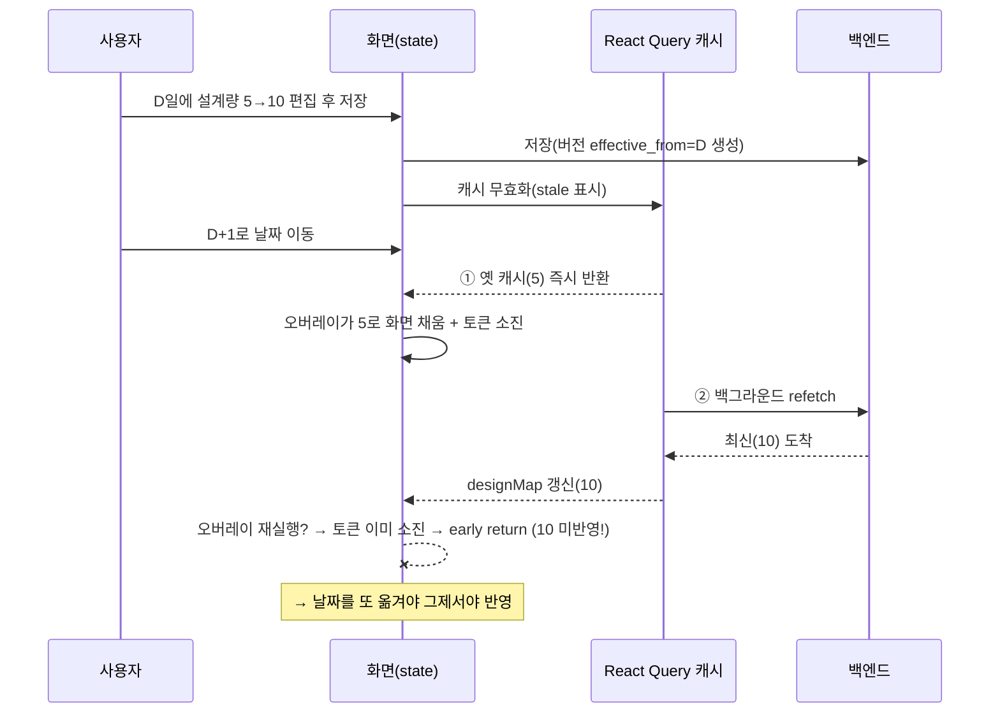
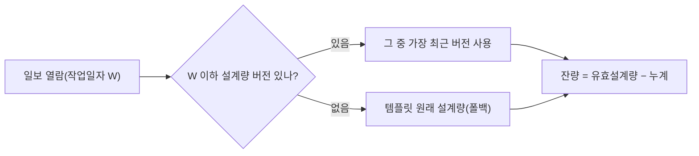

## 30초 요약

::: abstract
**한 줄 진단** — 도메인 로직([[effective-dated]])은 정확히 맞았고, 이 버그는 **프론트엔드의 캐시 ↔ 백엔드 데이터 동기화 한 겹**의 타이밍 레이스였다.

- **문제**: 설계량을 고쳐 저장하고 다른 날짜로 가면 새 값이 **한 박자 늦게** 뜬다(날짜를 몇 번 옮겨야 반영). 당일은 즉시 반영.
- **근본원인**: [[stale-while-revalidate]]가 **옛 캐시를 먼저, 새 값을 백그라운드로 나중에** 주는데, 화면 채우는 로직이 **"(현장,날짜)당 1회"** 토큰으로 잠겨 있어 **옛값으로 토큰을 소진** → 뒤늦게 온 새 값을 무시.
- **해결**: 토큰 제거 → **데이터가 바뀔 때마다 멱등 재적용**(+ 사용자 편집 행 보존, 무변경 시 스킵).

**여기서 가져갈 것 3가지:**

1. **비동기 캐시 데이터에 "딱 한 번만 반영" 로직을 쓰면 위험하다.** 캐시는 옛값을 먼저 주고 새값을 잠깐 뒤에 준다 — 하필 그 "한 번"이 **옛값일 때 일어나면** 그 자리에서 문이 닫혀, 뒤늦게 온 새값이 영영 화면에 못 들어간다(= **옛값에 잠김**). → "이 키는 한 번 처리했다"가 아니라 **"데이터가 바뀔 때마다 그때그때 다시 반영"** 으로 짜야 한다.
2. **정적 게이트(tsc·lint·유닛) 전부 green ≠ 완료** — 남은 버그는 **런타임 타이밍**에 몰린다. 사람 주의를 거기에.
3. **AI는 "구조(로직·타입·모델)"엔 강하고 "시간(캐시·경쟁상태·이벤트 순서)"엔 약하다** — 그래서 사람은 **타임라인을 소유**하라.

**바로 본론만**: §1(증상) → §7(근본원인) → §8(해결) · AI 협업 인사이트만 §12 · 도메인이 낯설면 §3 카드부터. (건설 도메인 배경은 흐름을 끊지 않게 **파란 버튼 카드**로 빼 뒀다.)
:::

---

## 1. 증상부터 — 실제로 뭐가 깨졌나

말보다 영상이 빠르다. 아래는 실제 증상을 녹화한 화면이다.

<figure class="post-video">
<video controls preload="metadata" playsinline src="/post-assets/work/analysis/cache-overlay-timing-rca/symptom.mp4">
이 브라우저는 video 태그를 지원하지 않습니다. <a href="/post-assets/work/analysis/cache-overlay-timing-rca/symptom.mp4" target="_blank" rel="noopener">영상 새 창에서 열기</a>
</video>
<figcaption>증상 재현 — 설계량을 수정한 뒤 다음 날로 이동하면 옛 값이 그대로 보이고, 날짜를 몇 번 옮겨야 새 값이 반영된다.</figcaption>
</figure>

정리하면:

- **증상**: 설계량 편집·저장 후 다음 날로 가면 **옛 값**이 보인다. 날짜를 앞뒤로 몇 번 옮기면 그제서야 새 값.
- **재현 조건**: **전에 한 번 방문했던 날짜**(캐시가 있는 날)로 이동할 때.
- **대조군**: 편집한 **당일**은 즉시 반영. → 로컬 상태가 아니라 **날짜 이동 시 데이터를 다시 읽는 경로**의 문제라는 힌트.

`설계량`·`잔량` 같은 용어가 낯설면 아래 §3의 파란 카드를 먼저 열어봐도 된다. 여기선 "숫자를 고쳐 저장했는데, 다음 날 화면엔 옛 숫자가 남아 있다" 정도만 잡고 가면 충분하다.

---

## 2. 이 버그의 본질 — 도메인은 맞았고, 프론트 한 겹이 틀렸다

증상을 봤으니, 이 버그가 **어디의 문제가 아닌지**부터 못 박고 시작한다. 그래야 엉뚱한 곳을 파지 않는다.

| 축 | 상태 |
| --- | --- |
| **무엇을 보여줄지** (도메인: 어느 날짜에 어떤 설계량이 유효한가) | ✅ **맞았다** — 백엔드 `resolve_effective_design`, 시나리오 테스트 S1~S8 통과 |
| **언제·어떻게 최신값으로 갱신할지** (프론트: 캐시·패치 타이밍·실시간 반영) | ❌ **틀렸다** — 옛 캐시로 화면 잠금, 새 값 무시 |

::: important
도메인 로직(설계량을 "과거 불변 + 편집일부터 앞으로" [[effective-dated]]로)은 정확히 이해됐고 정확히 구현됐다. **이 버그는 도메인 오해가 아니다.** 문제는 전부 프론트엔드의 한 겹 — **"캐시 ↔ 백엔드 데이터 동기화 / 데이터 패치 / 실시간 반영"** 에 있었다.
:::

그래서 이 글의 초점은 "도메인을 어떻게 모델링하나"가 아니라 **"프론트 캐시와 백엔드 데이터를 어떻게 동기화해 항상 최신을 보장하나"** 다. **왜 처음에 못 알아챘나**는 §11, **프론트에서 AI를 어떻게 써야 하나**는 §12, **이런 부류를 없애는 법**은 §9에 있다.

---

## 3. 무엇을 요청받았나

두 단계로 왔다. (용어가 낯설면 아래 카드를 먼저 — 여기선 한 줄 요약만 곁들인다.)

- [[domain:jakeopilbo|작업일보]] = 건설 현장에서 하루 단위로 그날 한 일을 적는 문서.
- [[domain:gongjeong|설계량]] = 어떤 공정(작업 종류)을 **총 얼마나 해야 하는가**(계획된 전체 물량). `잔량 = 설계량 − 누계`의 기준점.

1. **기능 요구**: 공정 "설계량"을 [[effective-dated]]로. — "오늘(D) 설계량을 5→10으로 바꾸면 **과거 일보는 5 기준 그대로**, D 이상 일보만 10 기준. 그 시점 이후로 계속 10." ([[domain:why-design|왜 이렇게까지 해야 했는지]]는 카드 참고.)
2. **버그 리포트(이 글의 주제)**:
   > "설계량을 수정하고 **바로 다음 날로 넘어갔는데 반영이 늦다.** 날짜를 몇 번 옮겨야 그제서야 반영된다. **당일 수정한 날은 바로 반영**된다. 프론트 문제 같은데 왜 그런지 파악해줘."

---

## 4. 어떻게 만들어져 있었나 (결과물)

- **백엔드**: 설계량을 "일자별 버전" 테이블(`process_design_versions`)로 저장. 어떤 일보(작업일자 W)를 열면 서버가 `W 이하 중 가장 최근 버전`을 골라 그날 유효 설계량을 준다. 잔량 계산식은 그대로, **설계값의 출처만** 바꿨다.
- **프론트**:
  - 그날 유효 설계량을 가져오는 훅 `useProcessDesign(project, date)` — **React Query로 캐싱**(같은 (현장,날짜)면 다시 안 부름, `staleTime 30초`).
  - 저장된 일보는 서버 상세로 화면을 채우고(hydrate), **신규·빈 날짜**는 화면 표의 설계량을 그날 유효값으로 채우는 **오버레이(overlay) 로직**으로 처리.

문제의 코드(수정 전):

```ts
useEffect(() => {
  // ... 가드들 ...
  const token = `${project}:${date}`;
  if (designOverlaidRef.current === token) return; // ← (현장,날짜)당 딱 1번만 실행
  designOverlaidRef.current = token;
  setProcessRows((prev) => applyProcessDesignOverlay(prev, getEffectiveDesign));
}, [project, date, designMap /* ... */]);
```

---

## 5. 설계 ↔ 구현의 괴리 — 그리고 왜 이 순서대로 어긋나나

이번 기능은 **AI 에이전트 파이프라인**(설계 → 백엔드 → 프론트 → 리뷰)으로 만들었다. 설계 문서는 "날짜별 유효 설계량을 화면에 채운다"까지만 정의했고, **"어떻게 1회만/여러 번 채울지"의 구체 전략은 프론트 구현 에이전트에게 맡겨졌다.** 바로 그 빈틈에서 괴리가 생겼다.

| 항목 | 설계의 의도 | 실제 구현 | 괴리 |
| --- | --- | --- | --- |
| 오버레이 적용 시점 | "그날 유효 설계량을 화면에 반영" (횟수는 미규정) | **(현장,날짜)당 1회 토큰**으로 잠금 | 설계는 "반영"을, 구현은 "1회 반영"을 선택 — **데이터가 나중에 바뀔 수 있다는 전제**를 놓침 |
| 편집 보호 | "사용자 편집 행은 덮지 않는다" | 토큰이 "1회 실행"으로 **간접적으로** 편집도 보호 | 편집 보호와 "1회 실행"이 **한 장치에 뭉쳐짐** → 하나 풀면 하나 깨짐 |
| 데이터 최신성 | "그날 유효값" (항상 최신) | 첫 데이터로 잠금 → 갱신 무시 | 캐시가 **stale→fresh**로 갱신되는 특성과 충돌 |

**AI가 왜 이렇게 했나(핵심):** 프론트 에이전트는 같은 화면의 검증된 기존 패턴인 **"금일 진도 오버레이"의 (현장,날짜) 토큰**을 **그대로 미러링**했다. 금일 진도는 로컬 입력 위주라 "1회면 충분"했지만, 설계량은 **저장 후 값이 바뀌어 다시 받아오는** 데이터라 전제가 달랐다. → **"검증된 패턴 재사용"이 오히려 전제 불일치를 가렸다.**

아래 시퀀스가 그 어긋남을 시간순으로 보여준다.



**↑ 이 다이어그램을 한 줄씩 읽으면:**

1. 사용자가 D일에 설계량을 5→10으로 고치고 저장 → 백엔드에 "D부터 10" 버전이 생긴다.
2. 저장 후 프론트는 캐시를 **"낡음(stale)"으로 표시**한다(= "다음에 쓸 때 새로 받아와").
3. 사용자가 D+1로 날짜를 옮긴다.
4. **① React Query가 캐시에 있던 옛 값(5)을 즉시 돌려준다** — 빠른 화면을 주려고. 아직 새 값을 안 받았다.
5. 오버레이가 그 **옛 값(5)으로 화면을 채우고, "이 날짜는 처리 끝" 토큰을 써버린다.**
6. **② React Query가 백그라운드에서 백엔드에 다시 물어본다.**
7. 최신 값(10)이 도착해 캐시(`designMap`)가 10으로 갱신된다.
8. 데이터가 바뀌었으니 오버레이가 다시 돌려 하지만 — **토큰이 이미 소진돼 그냥 return.** → 10이 화면에 안 들어간다.
9. 그래서 **날짜를 또 옮겨야(= 새 토큰)** 그제서야 반영된다. 이게 "몇 번 옮겨야 반영"의 정체다.

즉 핵심은 **4·5(옛 값으로 토큰 소진)와 7·8(새 값이 왔지만 토큰 때문에 무시)** 의 어긋남이다.

---

## 6. 문제 정의 (Problem definition)

데이터 흐름을 3개 축으로 분리해 추적했다.

1. **로컬 편집값**: 당일 편집값은 화면 state에 그대로 → 당일 즉시 반영(정상).
2. **서버 유효값 조회**: 다른 날짜로 가면 `useProcessDesign`이 React Query로 그날 값 조회.
3. **오버레이 적용**: `designMap`이 로드되면 화면 표에 채움 — **단 (현장,날짜) 토큰으로 1회만.**

후보 검증:

- (a) 저장 후 캐시 무효화 키가 틀렸나? → 프리픽스 매칭이라 모든 날짜 쿼리가 stale 처리됨. **키는 정상.**
- (b) 그럼 왜 안 바뀌나? → **오버레이 토큰이 옛 값으로 이미 소진돼서.** (진짜 원인)

::: warning
**문제 정의**: "다른 날짜로 가면 최신 서버값이 아니라 옛 값에 머무른다. 오버레이가 최신값으로 **다시 실행되지 않는다.**"
:::

---

## 7. 근본 원인 (Root cause)

**[[stale-while-revalidate]] 동작**과 **once-per-key 토큰**의 충돌이다.

React Query는 stale 표시된 데이터를 다시 구독하면 **① 캐시의 옛 값을 즉시 주고 → ② 백그라운드로 새 값을 받아 갱신**한다. 그래서:

| 시점 | designMap | 오버레이 동작 |
| --- | --- | --- |
| ① 이동 직후 | **옛 값(캐시)** | 토큰 미소진 → **옛 값으로 채우고 토큰 소진** |
| ② refetch 완료 | **최신 값** | designMap 변해 재실행 시도 → **토큰 이미 소진 → early return → 최신값 미반영** |

::: danger
**근본 원인**: "1회만 적용"이라는 게이트를, **값이 나중에 갱신될 수 있는(stale→fresh) 비동기 캐시 데이터**에 얹은 설계 미스매치. 토큰은 "키(현장,날짜)"만 보고 "데이터 버전"을 안 봐서, 첫(옛) 데이터로 잠기면 이후 최신 데이터를 무시한다.
:::

**부수 위험**: 토큰을 그냥 지우면 refetch마다 오버레이가 재실행되며 **사용자가 방금 편집한 행까지 서버값으로 덮어쓸** 수 있다. 즉 토큰은 "지연"의 원인이자 동시에 "편집 보호"도 겸했다 — 이 **이중 역할**을 분리해야 했다.

---

## 8. 해결과 예방

### 8.1 해결 — 토큰 제거 + 역할 분리

"1회 게이트"를 없애고, 데이터가 바뀔 때마다 재적용하되, 토큰이 겸하던 "편집 보호"는 명시적 가드로 분리했다.

1. **토큰 제거** → `designMap`(서버 데이터)이 stale→fresh로 바뀌면 재실행되어 **최신값을 반드시 반영**.
2. **편집 행 보존(`isEdited`)** → refetch 재적용이 사용자가 방금 입력한 값을 덮지 않음.
3. **무변경 시 원본 반환** → 불필요 렌더 방지.

```ts
const next = applyProcessDesignOverlay(prev, getEffectiveDesign, isEdited); // ← 편집 행 스킵
if (next === prev) return prev; // 변경 없으면 아무것도 안 함
// 값이 바뀐 "미편집" 행만 새 유효값으로 재-baseline
```

검증: `tsc`·`eslint` green, 관련 테스트 145개 통과(회귀 2건 추가 — "편집 행 보존", "무변경 시 원본 반환").

### 8.2 예방 대책 (재발 방지)

- **once-per-key(1회) 최적화는 "동기·불변 데이터"에만.** [[stale-while-revalidate]]처럼 값이 나중에 바뀔 수 있는 데이터에는 "키 1회"가 아니라 **데이터 변경마다 멱등 재적용**하고, 보호가 필요하면 **데이터 버전 인지** 또는 **명시적 편집 가드**로 분리한다.
- **한 장치가 두 역할을 겸하면 분리하라.** (여기선 토큰 = 지연방지 실패 + 편집보호)
- **오버레이·머지 함수는 멱등 + "무변경 시 원본 반환"** 으로 만들어 반복 적용을 안전하게.

---

## 9. 이 부류(캐시 ↔ 백엔드 데이터 동기화)를 아예 없애려면 — 관점부터 바꾼다

이 버그의 진짜 교훈은 특정 토큰이 아니라 **"프론트 캐시와 백엔드 데이터의 관계를 어떻게 볼 것인가"** 다.

1. **캐시는 "서버 진실의 사본(projection)"** 이고, stale-while-revalidate에선 "결국 일치(eventually consistent)"할 뿐 순간엔 옛값일 수 있다. → 화면 파생 로직은 항상 이 전제로 짠다.
2. **화면 갱신은 "데이터 주도(data-driven)"로.** "몇 번 했나(키·횟수)"가 아니라 **"지금 데이터가 뭐냐"에 반응**하게. (새 데이터가 오면 자동으로 다시 반영 — 이번 해결이 바로 이것.)
3. **서버 값은 화면의 단일 소스, 로컬 편집은 "덧칠(overlay)"로 명확히 분리.** 둘을 섞지 말 것.
4. **저장 직후 stale 창을 줄이려면**, 무효화만 하지 말고 응답값으로 **캐시를 직접 갱신(`setQueryData`)** 하는 것도 방법. (편집 병합이 복잡하면 "무효화 + 멱등 재적용"이 더 안전.)
5. **"1회 게이트"가 꼭 필요하면 키에 데이터 버전·`updatedAt`을 포함**해 새 데이터엔 새 키가 되게 한다.

::: tip
핵심 — **도메인(무엇을)은 백엔드가 맞췄으니, 프론트는 "언제·어떻게 최신을 보장하나"만 규율하면 된다.** 그걸 "키 1회"가 아니라 "데이터가 바뀌면 다시"로 두는 순간 이 부류 버그는 사라진다.
:::

---

## 10. 왜 굳이 effective-dated로 구현했나

가장 쉬운 구현은 "설계량 = 값 하나(현장 상수)"다. 하지만 그러면 **오늘 5→10으로 바꾸는 순간 과거 모든 일보의 잔량이 10 기준으로 재계산**돼 버린다. 작업일보는 정산·감사의 근거라 **"그때 그 문서가 보여주던 숫자"가 보존돼야** 한다(과거 왜곡 = 데이터 신뢰 붕괴).

그래서 **설계량을 "값 하나"가 아니라 "일자별 버전(구간)"으로** 저장한다.



**↑ 이 다이어그램이 말하는 것:** 어떤 일보를 열 때(작업일자 W) 서버는 —

1. 그 공정에 **W 이하로 시작하는 설계량 버전이 있는지** 본다.
2. **있으면 그 중 가장 최근 버전**을 그날 유효 설계량으로 쓴다(예: 3/5부터 10 버전이 있으면 3/7 일보는 10).
3. **없으면 템플릿의 원래 설계량으로 폴백**한다 — 아무도 안 바꾼 공정은 항상 원래 값. 그래서 **버전이 하나도 없으면 예전과 100% 동일**(데이터 무손상).
4. 어느 쪽이든 그 유효 설계량으로 **잔량 = 유효설계량 − 누계** 를 계산한다.

핵심은 **"각 일보가 자기 값을 저장"하는 게 아니라 "읽는 순간 자기 날짜에 맞는 버전을 고른다"** 는 것 — 그래서 옛 날짜를 고치면 그 뒤의 이미 저장된 일보도 다시 열 때 새 값이 나온다.

이 "일자별 버전 + 조회 시 유효값 해석" 구조 덕분에 **미래 일보도 저장을 다시 안 해도 읽는 순간 새 값**이 반영된다 — 그래서 프론트가 그 값을 캐시로 받아오고, 바로 그 지점에서 이 글의 버그가 났다.

---

## 11. 왜 AI가 이 버그를 놓쳤나 — 회고와 리뷰 체크리스트

이 기능은 AI 에이전트로 만들었고, 이 버그는 **2차 코드 리뷰(AI 리뷰어)에서도 안 걸렸다.** 왜?

- **패턴 미러링의 함정**: 같은 화면의 검증된 "금일 오버레이" 토큰 패턴을 그대로 복제했다. 두 데이터의 갱신 특성(로컬 입력 vs 서버-refetch)이 다른데, "재사용"이 그 차이를 가렸다.
- **정적 검증만 통과**: 타입체크·린트·단위테스트 전부 green. 이 버그는 **런타임 캐시 타이밍(옛값 먼저 → 새값 나중)** 에서만 드러나 정적 도구가 못 잡았다.
- **리뷰도 "1회 적용"을 합리적으로 읽음**: 토큰이 편집 보호까지 겸하니 리뷰어 눈에 정당해 보였다.

### AI에게 요청·검토할 때 체크리스트

1. **비동기 캐시 데이터에 "1회만" 로직이 보이면 의심하라.** _"이 게이트는 stale-while-revalidate(옛값 먼저→새값 나중)에서 새 값이 반드시 반영되는가?"_ 를 명시 질문으로.
2. **"기존 패턴 재사용" 지시엔 전제 차이를 물어라.** _"미러하려는 원본과 이 데이터의 갱신 특성(로컬 vs 서버-refetch)이 같은가?"_
3. **한 장치가 2개 역할이면 분리를 요구하라.**
4. **런타임 타이밍 시나리오를 테스트로 강제하라.** ("저장→다른 날짜→옛 캐시 먼저→refetch 후 최신 반영")
5. **사용자 관찰을 1급 단서로.** "당일 즉시 / 다음날 지연 / 몇 번 옮겨야"가 이미 "캐시-타이밍"을 가리켰다.

::: tip
**한 줄 교훈** — "1회만 적용" 최적화는 데이터가 나중에 안 바뀔 때만 안전하다. 캐시([[stale-while-revalidate]]) 위에서는 "키 1회"가 아니라 **"데이터 변경마다 멱등 재적용 + 편집 보호 분리"** 가 정답이다.
:::

---

## 12. 진짜 인사이트 — 프론트엔드에서 AI를 어떻게 써야 하나

### 12.1 한 문장 통찰

::: important
**AI는 "구조적으로 증명 가능한 정확성"(타입·순수함수·데이터모델·로직 테스트)엔 압도적이지만, "시간에 따라 드러나는 정확성"(비동기·캐시·경쟁상태·이벤트 순서·시간에 걸친 UX)엔 약하다.**
:::

이번 버그가 정확히 그 **경계선**에서 났다 — 백엔드 도메인 로직(구조)은 완벽했고, 프론트 캐시 타이밍(시간)만 틀렸다. → **그래서 사람의 레버리지는 "코드 작성"이 아니라 "타임라인을 소유하는 것"으로 옮겨간다.**

### 12.2 역할 분담 — 누가 뭘 잘하나

| AI에게 맡겨라 (강점) | 사람이 쥐어라 (AI의 사각지대) |
| --- | --- |
| 데이터모델·스키마·순수함수·타입 | **전제 검증** ("이 미러링, 전제가 같나?") |
| 보일러플레이트·패턴 적용·리팩터 | **런타임 시나리오** ("stale 캐시가 먼저 오면?") |
| 로직 단위테스트 | **동시성·이벤트 순서·시간에 걸친 흐름** |
| 보안 체크리스트(자기결재·인젝션) | **시스템 경계** (프론트 캐시 ↔ 백엔드 진실) |
| 검증된 패턴 재사용 | **"요청 자체가 맞나"** (도메인 타당성) |

### 12.3 실전 인사이트 5개

1. **"패턴 미러해"라고 시키면 반드시 "전제도 같냐"를 함께 물어라.** AI는 스스로 전제를 의심하지 않는다 — 그게 사람 몫. (금일 오버레이 = 로컬 입력 ≠ 설계량 = 서버-refetch)
2. **정적 게이트(tsc·lint·유닛) 전부 green = "다 됐다"는 착각.** 남은 리스크는 전부 런타임·타이밍·통합에 몰린다. 사람 주의를 **거기에만** 집중하라.
3. **좋은 "관찰"이 좋은 "코드리뷰"보다 강하다.** "당일 즉시 / 다음날 지연 / 몇 번 옮겨야" 같은 대조 관찰이 AI를 정확한 런타임 경로로 데려간다. 사람은 현실(관찰)을, AI는 구조·가설을 댄다.
4. **AI에게 "지루하고 단일목적으로" 짜라고 하라.** 한 장치가 두 역할(지연방지 + 편집보호)을 겸하면 AI도 리뷰어도 못 잡는다 — 영리한 결합 코드가 사각지대다.
5. **코딩 전에 AI가 "곧 조용히 내릴 가정"(예: 키당 1회 적용)을 말하게 하라.** 가정을 명시화시키는 게 리뷰보다 앞선다.

### 12.4 프론트 특유의 한 줄 규율

::: tip
**"서버 값 = 단일 진실, 로컬 편집 = 덧칠, 캐시 = 결국 일치하는 사본."** AI는 fetch한 데이터를 "지금 최신"으로 취급하는 게 기본값이라, 이 **비동기·캐시 현실을 사람이 명시적으로 이름 붙여줘야** 한다. 그러면 이 부류 버그는 애초에 안 생긴다.
:::

---

## 부록: 타임라인 요약

| 단계 | 내용 |
| --- | --- |
| 요청 | 설계량 effective-dated + "다음날 지연" 버그 원인 규명 |
| 결과물 | `useProcessDesign`(RQ 캐시) + 오버레이(토큰 1회) |
| 에러 | 다음날 이동 시 옛 설계량, 날짜 몇 번 옮겨야 반영 |
| 문제 정의 | 오버레이가 최신값으로 재실행되지 않음 |
| 근본 원인 | stale-while-revalidate + once-per-key 토큰 미스매치(옛값으로 소진) |
| 해결 | 토큰 제거 + 데이터 변경마다 재적용 + 편집 보존(`isEdited`) + 무변경 스킵 |
| 예방 | 비동기 캐시엔 "1회 게이트" 금지, 역할 분리, 런타임 타이밍 테스트 |

---

## 참고

<ol>
<li><a href="https://tanstack.com/query/latest/docs/framework/react/guides/caching" target="_blank">[1] Caching Examples — TanStack Query</a></li>
<li><a href="https://tanstack.com/query/latest/docs/framework/react/guides/important-defaults" target="_blank">[2] Important Defaults(staleTime·refetch) — TanStack Query</a></li>
</ol>

---

## 관련 글

- [React Query 캐시 동작 정리 →](/post/react-query-cache) — stale-while-revalidate의 기본기
- [React Query 고급 패턴 →](/post/react-query-advanced) — 무효화·refetch 제어
- [AI 에이전트 QA 자동화 — 토큰 경제 분석 →](/post/ai-agent-qa-automation-token-economics) — 같은 work/분석 시리즈

<!-- ── 도메인 배경 카드 (본문에는 안 보이고, 위의 파란 버튼을 누르면 모달로 열림) ── -->

::: domain id="jakeopilbo" title="작업일보란?"
건설 현장에서 **하루 단위로 그날 한 일을 기록하는 문서**다. 종이로 치면 현장소장이 매일 저녁 쓰는 일지. 이 시스템은 그걸 웹으로 옮겼다. 한 장(하루치)에는 대략 이런 게 들어간다.

- **결재란**: 담당 → 현장소장 → 부서장 (도장 찍는 칸)
- **공사명 / 작업일자 / 날씨**
- **금일작업 / 명일작업**: 오늘 한 일, 내일 할 일(글로 서술)
- **특이사항**: 안전·민원·기상 등
- **① 공정 진도** (이 글의 주인공)
- **② 인원 · ③ 장비 · ④ 자재 투입현황**: 오늘 몇 명·몇 대·몇 개가 들어왔나

작업일보는 **"그 시점의 기록"** 이라, 정산·감사의 근거가 된다. 그래서 "과거 문서가 보여주던 숫자"가 나중에 바뀌면 안 된다 — 이 성질이 이 글 버그의 배경이다.
:::

::: domain id="gongjeong" title="공정 진도 표와 '설계량'"
공정(工程)은 "말뚝박기", "두부정리" 같은 **작업 종류**다. 각 공정이 얼마나 진행됐는지를 표로 관리한다.

| 용어 | 뜻 | 예시 |
| --- | --- | --- |
| **설계량** | 그 공정을 **총 얼마나 해야 하는가**(계획된 전체 물량) | 강관말뚝 **639본** |
| **전일** | 어제까지 누적한 양 | 200본 |
| **금일** | 오늘 한 양 | 30본 |
| **누계** | 전일 + 금일 (지금까지 총합) | 230본 |
| **잔량** | 설계량 − 누계 (앞으로 남은 양) | 409본 |

즉 **잔량 = 설계량 − 누계** 라는 단순한 계산이 핵심이고, 여기서 **설계량이 이 계산의 기준점(baseline)** 이다. 그래서 설계량이 언제 어떤 값이었는지가 중요해진다.
:::

::: domain id="why-design" title="왜 '설계량'이 이 이야기의 주인공인가"
현장은 살아있다. **설계량은 현장 여건에 따라 바뀔 수 있다** — 설계 변경, 실측 결과, 공법 변경 등으로 "원래 5본이던 게 10본으로" 늘기도 한다.

그런데 작업일보는 **"그 시점의 기록"**(감사·정산의 근거)이다. 그래서 요구가 이렇게 나온다.

> "오늘 설계량을 5→10으로 바꿨다면, **과거 일보의 잔량은 예전 값(5) 기준 그대로**, 오늘·미래 일보만 새 값(10) 기준으로 계산돼야 한다."

= **과거는 기억하고, 그 시점 이후로만 바뀐다.** 이걸 소프트웨어 용어로 **effective-dated(적용일 기준 버전)** 라고 부른다. 이 요구가 이번 기능이었고, 구현하다 이 글의 버그가 났다.

(구체적으로 "어떻게" 일자별 버전으로 저장하고 읽는지는 본문 §10에서 다이어그램과 함께 다룬다.)
:::
