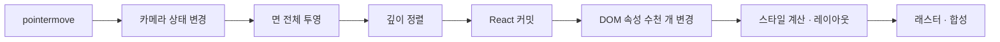

::: abstract
SVG로 그리는 구조 모델 3D 캔버스를 마우스로 돌리면 그림이 초당 7.8번만 바뀌었다(60 Hz 모니터). 최적화 후보 8개를 실행 시 스위치로 넣고, 같은 프로덕션 빌드에서 18가지 조합을 최대화 창으로 3회씩 쟀다. 그리는 면 수를 줄이는 세 가지(뒷면 제거, 강관 분할 축소, 이음 마구리 제거)만으로 초당 20.8번, 움직이는 동안 부가 정보를 숨기는 lod를 더하면 41.8번, 8개를 전부 켜면 47.5번이 됐다. 화면 이동은 15.8번에서 57.0번이 됐다. 입력 합치기와 형상 캐시는 측정 흔들림(±12%) 안이라 효과가 없었다. 처음에는 FPS로 비교하다가 효과가 있는 스위치를 해롭다고 판정할 뻔했다.
:::

## 1. 배경

### 1.1 문제 상황

구조 계산 앱의 노코드 모델러는 박스 구조물의 해석 모델(절점, 요소, 하중, 경계)과 실제 단면 형상을 한 캔버스에 그린다. 3D로 돌려 볼 수 있게 강관 벽체를 원형 관으로, 박스를 두께가 있는 판으로 그리는데, 빈 곳을 끌어 돌리면 모델이 손을 따라오지 못하고 끊겼다. 아래 영상의 왼쪽이 최적화 전, 오른쪽이 이 글에서 찾은 최적화를 모두 켠 것이다. 두 쪽은 같은 스크립트가 같은 경로로 마우스를 움직였다.

<figure class="post-video">
<video controls preload="metadata" playsinline src="/post-assets/work/performance/modeler-render/orbit-base-vs-all.mp4">
이 브라우저는 video 태그를 지원하지 않습니다. <a href="/post-assets/work/performance/modeler-render/orbit-base-vs-all.mp4" target="_blank" rel="noopener">영상 새 창에서 열기</a>
</video>
<figcaption>3D 회전(orbit), 왼쪽 최적화 전 · 오른쪽 최적화 8개 전부. 같은 시각인데 왼쪽 모델은 손(주황 점)의 위치보다 한참 늦은 자세에 머문다. 오른쪽 위 검은 상자는 측정 중 1초 창 수치. 최대화 창 1920×1032, 프로덕션 빌드.</figcaption>
</figure>

3D 기본 자세에서 캔버스 [[svg|SVG]]에는 요소가 5,237개 있었다.

| SVG 요소 | 개수 | 주로 그리는 것 |
| --- | --- | --- |
| polygon | 4,086 | 강관 둘레 면, 박스 면, 하중 화살표 머리 |
| g | 505 | 묶음 |
| line | 410 | 요소선, 하중 화살표 |
| circle | 116 | 절점 |
| text | 98 | 절점·요소 번호, 하중 수치 |

강관 요소 하나는 둘레를 24조각으로 나누고 바깥 면 24개, 안쪽 면 24개, 양 끝 마구리 48개로 96개의 다각형을 만든다. 강관 요소가 40개 남짓이라 다각형 대부분이 강관에서 나온다.

### 1.2 SVG 3D 캔버스가 한 프레임을 그리는 과정

캔버스는 React 상태로 카메라(yaw, pitch, 이동, 배율)를 들고 있다. 마우스가 움직이면 카메라 상태가 바뀌고, 컴포넌트가 다시 실행되면서 모든 면의 꼭짓점을 새 카메라로 투영하고 깊이 순으로 정렬해 SVG 요소로 돌려준다. React는 바뀐 좌표를 [[dom|DOM]] 속성에 하나하나 다시 쓴다. SVG에는 깊이 버퍼가 없어서 [[painter|먼 것부터 칠하는 방식]]으로 가림을 흉내 낸다.



이 파이프라인은 [[mainThread|메인스레드]] 하나에서 JavaScript 실행부터 스타일 계산, 레이아웃, 그리기 명령 생성까지 차례로 돈다<a href="https://web.dev/articles/rendering-performance" target="_blank"><sup>[1]</sup></a>. 한 단계라도 16.7 ms를 넘기면 그 프레임에는 그림이 바뀌지 않는다.

### 1.3 목표와 제약

- 목표: 3D 회전, 화면 이동, 뷰 버튼 전환 애니메이션에서 그림이 바뀌는 횟수를 60 Hz에 가깝게.
- 정지 화면의 모양은 유지한다. 선택, 상자 선택, 절점 끌기, 우클릭 같은 기존 상호작용을 바꾸지 않는다.
- 최적화마다 효과를 따로 알아야 한다. 한 번에 넣으면 무엇이 얼마나 먹혔는지, 무엇이 필요 없는지 모른다.

---

## 2. 방법

### 2.1 측정 장치

앱 코드를 고치지 않고 재려고 [[electron|Electron]] 앱을 원격 디버깅 포트로 띄우고 [[cdp|CDP]]로 붙었다. Node 22에 내장된 WebSocket만 쓰고 추가 의존성은 없다. 기록하는 것은 React [[commit|커밋]]이 일어난 시각과 [[raf|rAF]] 콜백이 불린 시각<a href="https://developer.mozilla.org/en-US/docs/Web/API/Window/requestAnimationFrame" target="_blank"><sup>[2]</sup></a>을 중심으로 아래와 같다.

| 무엇을 | 어떻게 |
| --- | --- |
| React 커밋 수와 시각 | 문서 생성 전에 `__REACT_DEVTOOLS_GLOBAL_HOOK__`를 심는다. React는 이 훅이 있으면 커밋마다 `onCommitFiberRoot`를 부른다 |
| 컴포넌트별 렌더 횟수 | 커밋마다 파이버 트리를 돌며 이번에 실행된 컴포넌트를 센다(건너뛴 하위 트리는 내려가지 않는다) |
| 프레임 | rAF 콜백이 불린 시각 |
| DOM 변경량 | `MutationObserver`가 받은 변경 기록 수 |
| 메인스레드 시간 | `Performance.getMetrics`의 스크립트, 스타일, 레이아웃, 태스크 시간 차 |
| 마우스 입력 | `Input.dispatchMouseEvent`로 125 Hz 주입, 벽시계 기준 8자 경로(한 바퀴 3초)<a href="https://chromedevtools.github.io/devtools-protocol/tot/Input/#method-dispatchMouseEvent" target="_blank"><sup>[3]</sup></a> |
| 영상 | `Page.startScreencast` 프레임을 도착 간격 그대로 이어 붙인 mp4<a href="https://chromedevtools.github.io/devtools-protocol/tot/Page/#method-startScreencast" target="_blank"><sup>[4]</sup></a> |

```javascript
// probe.js (문서 생성 전에 주입)
window.__REACT_DEVTOOLS_GLOBAL_HOOK__ = {
  renderers, supportsFiber: true, isDisabled: false,
  inject(internals) { renderers.set(++rid, internals); return rid },
  onCommitFiberRoot(_id, root) {
    if (!P.on) return
    P.commits.push({ t: performance.now(), ms: root.current.actualDuration ?? null })
    walk(root.current.child)   // 이번 커밋에 실행된 컴포넌트를 센다
  },
  checkDCE() {}, onCommitFiberUnmount() {}, onPostCommitFiberRoot() {}
}
```

마우스 경로를 벽시계 기준으로 둔 이유는, 앱이 느려도 손은 같은 속도로 움직이기 때문이다. 앱이 이벤트를 처리하는 속도에 맞춰 입력을 늦추면 느린 버전이 덜 움직인 것으로 재진다.

시나리오는 네 개다. 핵심은 빈 곳을 끌어 모델을 돌리는 [[orbit|3D 회전]]과 화면을 옮기는 [[pan|화면 이동]]이다. 시나리오마다 3D 뷰 버튼과 「화면 맞춤」을 눌러 카메라를 같은 자리로 되돌린 뒤 시작한다.

| 시나리오 | 조작 | 길이 |
| --- | --- | --- |
| idle | 3D 뷰에서 가만히 (기준선, 창 가려짐 확인) | 2초 |
| orbit | 빈 곳을 좌클릭으로 끌어 회전 | 6초 |
| pan | 가운데 버튼으로 끌어 이동 | 4초 |
| viewTween | 뷰 버튼 5번(측면, 평면, 3D, 정면, 3D). 각 전환은 0.42초 애니메이션 | 4초 |

측정 패스와 녹화 패스를 나눴다. 녹화는 프레임마다 JPEG 인코딩을 하고 화면 위에 수치 상자를 띄워 성능을 깎으므로, 본문의 수치는 전부 녹화 없는 측정 패스에서 나왔다.

### 2.2 지표: FPS가 아니라 화면 갱신/초

처음에는 rAF 횟수를 [[fps|FPS]]로 보고 비교했다. rAF는 그림이 바뀌지 않아도 모니터 주기마다 불린다. 한 버전에서 FPS는 46.1인데 커밋은 초당 24번이었다. 프레임 절반은 같은 그림을 다시 보여 준 것이다. 그래서 주 지표를 그림이 실제로 바뀐 프레임 수로 바꿨다.

$$
\text{화면 갱신/초} = \frac{\left|\{\, i : \exists\ \text{커밋 시각 } t \in (f_{i-1}, f_i] \,\}\right|}{\text{측정 시간}}
$$

$f_i$는 $i$번째 rAF 시각이다. 직전 프레임과 이번 프레임 사이에 커밋이 하나라도 있으면 그 프레임에서 그림이 바뀐 것으로 센다. 60 Hz에서 최댓값은 60이다. 보조 지표로 갱신 간격 p95, 커밋당 DOM 변경 수, 메인스레드 사용 ms/초를 같이 적는다.

```javascript
// modeler-orbit.mjs (summarize)
for (let i = 1, ci = 0; i < raw.frames.length; i++) {
  let hit = false
  while (ci < cts.length && cts[ci] <= raw.frames[i]) {
    if (cts[ci] > raw.frames[i - 1]) hit = true
    ci++
  }
  if (hit) upd.push(raw.frames[i])
}
```

### 2.3 최적화 후보 8개

8개 모두 `perfFlags.ts`의 스위치 뒤에 넣었다. 측정 장치가 문서 생성 전에 `window.__PERF_OPTS__`를 심고, 아무것도 심지 않으면 전부 꺼져 기존과 같은 그림과 동작이 된다. 스위치마다 커밋을 하나씩 만들어 코드 수정량을 `git show --numstat`으로 셌다. 후보는 세 부류다. 그리는 요소 수를 줄이는 것([[backface|뒷면 제거]], 분할 축소, 마구리 제거, 움직이는 동안 상세도를 낮추는 [[lod|LOD]]), 다시 계산하는 양을 줄이는 것(이동 transform, 형상 캐시), 다시 실행하는 컴포넌트와 횟수를 줄이는 것(카메라 격리, 입력 합치기)이다.

| 스위치 | 하는 일 | 겨누는 병목 | 코드(+/−) |
| --- | --- | --- | --- |
| `cull` | 법선이 카메라를 등진 강관 면을 그리지 않는다 | 면 수 | +36 / −5 |
| `pipeSeg` | 강관 둘레 분할 24 → 12 | 면 수 | +5 / −2 |
| `capJoin` | 같은 단면 강관이 일직선으로 이어지는 절점의 마구리를 그리지 않는다 | 면 수 | +30 / −1 |
| `lod` | 끄는 동안과 뷰 전환 중에 강관 안쪽 면, 마구리, 하중, 글자, 경계 육각형을 숨긴다 | 면 수 · 글자 | +17 / −3 |
| `panXform` | 이동을 좌표에 굽지 않고 `<g transform="translate">` 하나로. 면 JSX를 메모 | 재투영 | +61 / −35 |
| `camLocal` | 끄는 동안 카메라를 부모 화면(모델러 전체)으로 올리지 않고 놓을 때 한 번 | 패널 재렌더 | +5 / −1 |
| `rafMove` | 카메라 갱신을 프레임당 한 번으로 합친다 | 입력 폭주 | +39 / −7 |
| `geomCache` | 카메라와 무관한 면 형상을 월드 좌표로 캐시하고 매 프레임 투영만 한다 | 투영 계산 | +28 / −2 |

`panXform`의 줄 수에는 면 JSX 블록 28줄을 메모 안으로 옮긴 것이 들어 있다.

::: tabs
== cull
```typescript
// Canvas.tsx — d 가 커지는 방향(화면 안쪽)이 V. 법선·V > 0 이면 등진 면
const V = { x: sy * cp, y: cy * cp, z: -sp }
all = all.filter((f) => !f.n || f.n.x * V.x + f.n.y * V.y + f.n.z * V.z < 0)
```
강관 바깥 면의 법선은 관 축 가운데에서 면 가운데로 향하는 벡터, 안쪽 면은 그 반대, 마구리는 축 방향이다. 뒷면 제거는 3D 그래픽스에서 오래 쓰인 기법이다<a href="https://registry.khronos.org/OpenGL-Refpages/gl4/html/glCullFace.xhtml" target="_blank"><sup>[5]</sup></a>. 이 캔버스는 면을 반투명(불투명도 0.55~0.85)으로 칠해 지금은 뒷면이 비쳐 보이므로, 켜면 모양이 조금 달라진다.
== capJoin
```typescript
// Canvas.tsx — 같은 단면 강관이 이 절점에서 일직선으로 이어지면 마구리는 관 속에 묻힌다
const straight = (byNode.get(n) ?? []).some((o) => {
  if (o === e || o.sect !== e.sect) return false
  const v = dir(o)
  return v && Math.abs(u.x * v.z - u.z * v.x) / (Math.hypot(u.x, u.z) * Math.hypot(v.x, v.z) || 1) < 0.02
})
if (straight) joined.add(`${e.id}:${tag}`)
```
== lod
```typescript
// Canvas.tsx — 움직이는 동안만 가볍게
const lite = opt('lod') && (moving || tweening)
if (lite) all = all.filter((f) => !/^tb\d+-[iab]/.test(f.key))   // 강관 안쪽 면 · 마구리
{show.load && !lite && shownLoads.map(/* 하중 화살표 */)}
```
== panXform
```typescript
// Canvas.tsx — 그리는 좌표는 이동 0, 이동은 g 하나로
const ptx = panX ? 0 : cam.tx
const P = useCallback((x, z, y = 0) => { /* … */ }, [prj, fit, cam.k, ptx, pty, pc.x, pc.y])
<g transform={panX ? `translate(${cam.tx} ${cam.ty})` : undefined}>{/* 그림 전체 */}</g>
```
:::

### 2.4 실험 설계

스위치를 하나씩 켜고 조합해 각각의 영향을 따로 재는 [[ablation|절제 실험]]이다.

- 빌드 하나, 스위치만 바꿔 실행한다. 버전 사이의 코드 차이는 스위치 값뿐이다.
- 버전 18개: 기준선(base), 스위치 하나씩 8개, 조합 8개, 끝에 기준선 한 번 더(baseEnd).
- 앱 창을 최대화(1920×1032)하고 60 Hz 모니터에서 쟀다. 창이 다른 창에 가려지면 Chromium과 Electron이 rAF를 늦추므로 측정 모드에서만 그 절전을 끈다<a href="https://www.electronjs.org/docs/latest/api/web-contents#contentssetbackgroundthrottlingallowed" target="_blank"><sup>[6]</sup></a>.
- 버전마다 측정 패스를 3회 돌리고 중앙값을 쓴다.
- 18개를 한 묶음으로 잰다. 처음과 끝의 기준선 차이가 이 묶음 안의 [[drift|드리프트]]다.

::: important
버전 하나가 끝날 때마다 자동 검증을 통과해야 다음 버전으로 넘어갔다. 검증 항목: 결과 파일 8개, 최대화 창, 켜진 스위치가 기대값과 같은지, 3회 측정과 원자료가 모두 있는지, idle FPS ≥ 55(창 가려짐 없음), 드래그 시나리오마다 커밋 ≥ 1/초(실제로 움직였는지), **원자료 타임스탬프로 다시 센 화면 갱신/초가 요약값과 같은지**, 스위치가 실제로 먹었는지(SVG 수, pan 중 DOM 변경), 영상 4개. 그 뒤 영상 프레임과 정지 화면을 눈으로 봤다.
:::

---

## 3. 결과

### 3.1 기준선: 무엇이 1초를 쓰는가

최적화 전 버전(base)에서 3D 회전 6초 동안의 값이다.

| 항목 | orbit | pan | viewTween |
| --- | --- | --- | --- |
| 화면 갱신/초 | 7.8 | 15.8 | 8.7 |
| FPS (rAF) | 20.7 | 17.1 | 20.4 |
| 입력 처리/초 (주입 125) | 19.9 | 16.1 | - |
| 커밋당 DOM 변경 | 12,355 | 6,074 | 9,972 |
| 메인스레드 ms/초 | 996.6 | 997.5 | 852.7 |
| 스크립트 ms/초 | 439.0 | 557.6 | 391.2 |
| 스타일 계산 ms/초 | 296.5 | 57.5 | 248.0 |
| 레이아웃 ms/초 | 40.6 | 84.7 | 39.6 |

- 메인스레드가 1초에 996.6 ms를 써 포화 상태다. 마우스 이벤트는 초당 125번 들어가지만 19.9번만 처리된다.
- 커밋 한 번에 DOM 변경이 12,355건이다. 카메라가 바뀌면 다각형 4,086개의 `points` 속성이 전부 다시 써지고, 깊이 순서가 바뀐 노드는 자리를 옮긴다.
- 개발 빌드(1차 기준선, 창 1280×820)에서 컴포넌트별로 보면 캔버스 컴포넌트(`ModelCanvas`)가 한 번 실행에 약 41 ms(27회, 1,111.6 ms)를 썼다. 프로덕션 빌드는 React가 렌더 시간을 기록하지 않아 이 값이 없다. 카메라 변경이 부모 화면까지 올라가 왼쪽 패널과 표도 매번 같이 실행됐다.

[[styleRecalc|스타일 계산]]과 레이아웃만으로 orbit에서 337 ms/초다. JavaScript를 0으로 만들어도 DOM 변경량이 그대로면 이 비용은 남는다.

### 3.2 스위치 하나씩

스위치 하나만 켠 8개 버전의 화면 갱신/초다. 막대는 60 Hz 대비 비율이라 1.000이 초당 60번이다.

```chart
{
  "type": "bar",
  "caption": "스위치 하나만 켰을 때 화면 갱신 비율(화면 갱신/초 ÷ 60). 주황이 기준선. 3회 중앙값, 최대화 창 1920×1032, 프로덕션 빌드.",
  "source": "/post-assets/work/performance/modeler-render/ablation_results.json",
  "value": "variants.{bar}.updateRatio.{panel}",
  "panels": [
    { "key": "orbit", "label": "3D 회전" },
    { "key": "pan", "label": "화면 이동" },
    { "key": "viewTween", "label": "뷰 전환" }
  ],
  "bars": [
    { "key": "base", "label": "기준선", "style": "base" },
    { "key": "lod", "label": "lod" },
    { "key": "capJoin", "label": "capJoin" },
    { "key": "pipeSeg", "label": "pipeSeg" },
    { "key": "cull", "label": "cull" },
    { "key": "panXform", "label": "panXform" },
    { "key": "camLocal", "label": "camLocal" },
    { "key": "geomCache", "label": "geomCache" },
    { "key": "rafMove", "label": "rafMove" }
  ]
}
```

| 화면 갱신/초 | orbit | pan | viewTween | 3D SVG 요소 | 커밋당 DOM 변경(orbit) |
| --- | --- | --- | --- | --- | --- |
| 기준선 | 7.8 | 15.8 | 8.7 | 5,237 | 12,355 |
| lod | 23.1 | 31.9 | 17.7 | 5,237 (끄는 동안 1,424) | 3,458 |
| capJoin | 13.7 | 19.0 | 13.1 | 3,509 | 7,628 |
| pipeSeg | 13.2 | 20.6 | 13.8 | 3,413 | 7,443 |
| cull | 12.1 | 20.8 | 12.1 | 3,413 | 7,376 |
| panXform | 8.1 | 19.7 | 9.0 | 5,237 | 12,276 |
| camLocal | 8.2 | 15.1 | 8.7 | 5,237 | 12,217 |
| geomCache | 7.4 | 14.7 | 8.2 | 5,237 | 12,326 |
| rafMove | 6.8 | 14.3 | 7.8 | 5,237 | 12,321 |
| 기준선 (끝에 다시) | 6.9 | 14.4 | 8.1 | 5,237 | 12,294 |

- 단독으로 효과가 난 것은 그리는 요소 수를 줄이는 네 개(lod, capJoin, pipeSeg, cull)뿐이다. lod가 가장 커서 orbit을 3배로 올렸다.
- panXform은 pan에서만 19.7로 올랐다. camLocal, geomCache, rafMove는 기준선의 처음과 끝 사이(orbit 6.9~7.8) 범위에 들어간다.
- 반복 3회의 [[cv|변동계수]]는 대부분 5% 미만이었다. 처음과 끝 기준선의 차이는 orbit −12%, pan −9%, viewTween −7%였다. 이 폭 안의 차이는 효과로 보지 않는다.

### 3.3 조합

면 수를 줄이는 세 개(cull, pipeSeg, capJoin)를 묶어 `faces`라 부르고, 그 위에 나머지를 하나씩 얹었다.

```chart
{
  "type": "bar",
  "caption": "조합별 화면 갱신 비율. faces = cull + pipeSeg + capJoin, stage1 = faces + panXform + camLocal + rafMove, all = 8개 전부. 3회 중앙값.",
  "source": "/post-assets/work/performance/modeler-render/ablation_results.json",
  "value": "variants.{bar}.updateRatio.{panel}",
  "panels": [
    { "key": "orbit", "label": "3D 회전" },
    { "key": "pan", "label": "화면 이동" },
    { "key": "viewTween", "label": "뷰 전환" }
  ],
  "bars": [
    { "key": "base", "label": "기준선", "style": "base" },
    { "key": "faces", "label": "faces" },
    { "key": "facesCam", "label": "+camLocal" },
    { "key": "facesPan", "label": "+panXform" },
    { "key": "facesRaf", "label": "+rafMove" },
    { "key": "facesLod", "label": "+lod" },
    { "key": "facesLodPan", "label": "+lod+pan" },
    { "key": "stage1", "label": "stage1" },
    { "key": "all", "label": "all" }
  ]
}
```

| 화면 갱신/초 | orbit | pan | viewTween | 갱신 간격 p95 (orbit / pan) | 코드(+/−) |
| --- | --- | --- | --- | --- | --- |
| faces | 20.8 | 26.9 | 17.8 | 67 / 50 ms | +71 / −8 |
| faces + camLocal | 27.5 | 27.8 | 17.7 | 50 / 50 ms | +76 / −9 |
| faces + panXform | 23.2 | 38.2 | 17.6 | 67 / 50 ms | +132 / −43 |
| faces + rafMove | 22.4 | 27.2 | 17.9 | 67 / 50 ms | +110 / −15 |
| faces + lod | 41.8 | 55.2 | 28.6 | 33 / 22 ms | +88 / −11 |
| faces + lod + panXform | 40.4 | 57.0 | 28.3 | 33 / 17 ms | +149 / −46 |
| stage1 | 25.5 | 34.8 | 18.1 | 67 / 50 ms | +176 / −51 |
| all | 47.5 | 56.4 | 27.7 | 33 / 17 ms | +221 / −56 |

- faces만으로 orbit이 7.8에서 20.8이 됐다. 정지 화면의 [[ssim|SSIM]](캔버스 영역, 기준선 대비)은 0.9991이다.
- faces 위에 lod를 얹으면 orbit 41.8, pan 55.2다. 조합 중 한 번에 가장 크게 오른다.
- panXform은 faces 위에서 pan을 26.9에서 38.2로 올렸다(+42%). orbit과 viewTween은 그대로다.
- camLocal은 faces 위에서 orbit을 20.8에서 27.5로 올렸다(+32%). pan과 viewTween은 그대로다.
- rafMove는 faces 위에서도 흔들림 범위 안이다.
- viewTween은 0.8초 간격으로 버튼을 누르고 애니메이션은 0.42초라, 초당 값의 약 절반이 버튼 사이 대기 시간이다. all의 27.7은 애니메이션 구간만 보면 초당 약 53번이다.

```chart
{
  "type": "dumbbell",
  "caption": "화면 갱신 비율, 최적화 전(base)에서 8개 전부(all)까지. 1.000 = 초당 60번.",
  "from": { "label": "최적화 전", "source": "/post-assets/work/performance/modeler-render/ablation_results.json", "path": "variants.base.updateRatio.{row}" },
  "to": { "label": "8개 전부", "source": "/post-assets/work/performance/modeler-render/ablation_results.json", "path": "variants.all.updateRatio.{row}" },
  "rows": [
    { "key": "orbit", "label": "3D 회전" },
    { "key": "pan", "label": "화면 이동" },
    { "key": "viewTween", "label": "뷰 전환" }
  ]
}
```

### 3.4 영상으로 본 차이

영상은 녹화 패스에서 [[screencast|스크린캐스트]] 프레임이 도착한 간격 그대로 이어 붙였다. 새 프레임이 안 만들어진 동안은 화면이 멈춘 채로 보인다. 좌우는 같은 스크립트가 같은 시각에 같은 경로로 조작했다. 주황 점이 마우스 위치, 빨간 점은 누르고 있는 상태다.

::: tabs
== 화면 이동
<figure class="post-video">
<video controls preload="metadata" playsinline src="/post-assets/work/performance/modeler-render/pan-base-vs-faceslodpan.mp4">
이 브라우저는 video 태그를 지원하지 않습니다. <a href="/post-assets/work/performance/modeler-render/pan-base-vs-faceslodpan.mp4" target="_blank" rel="noopener">영상 새 창에서 열기</a>
</video>
<figcaption>화면 이동(pan), 왼쪽 최적화 전(초당 15.8번) · 오른쪽 faces + lod + panXform(57.0번). 왼쪽은 모델이 한 박자씩 늦게 순간 이동한다.</figcaption>
</figure>
== 뷰 전환
<figure class="post-video">
<video controls preload="metadata" playsinline src="/post-assets/work/performance/modeler-render/viewtween-base-vs-all.mp4">
이 브라우저는 video 태그를 지원하지 않습니다. <a href="/post-assets/work/performance/modeler-render/viewtween-base-vs-all.mp4" target="_blank" rel="noopener">영상 새 창에서 열기</a>
</video>
<figcaption>뷰 버튼 전환, 왼쪽 최적화 전 · 오른쪽 8개 전부. 0.42초 회전 애니메이션이 왼쪽에서는 몇 장면으로 끊기고, 같은 시각에 왼쪽은 아직 측면인데 오른쪽은 평면 뷰에 도착해 있다.</figcaption>
</figure>
== lod의 대가
<figure class="post-video">
<video controls preload="metadata" playsinline src="/post-assets/work/performance/modeler-render/orbit-faces-vs-faceslod.mp4">
이 브라우저는 video 태그를 지원하지 않습니다. <a href="/post-assets/work/performance/modeler-render/orbit-faces-vs-faceslod.mp4" target="_blank" rel="noopener">영상 새 창에서 열기</a>
</video>
<figcaption>3D 회전, 왼쪽 faces(20.8번) · 오른쪽 faces + lod(41.8번). 오른쪽은 끄는 동안 하중 화살표, 수치, 절점·요소 번호, 경계 육각형이 사라지고 놓으면 돌아온다. 이 차이는 숫자가 아니라 영상에서만 보인다.</figcaption>
</figure>
:::

### 3.5 FPS로 판정하면 camLocal이 해롭게 보인다

faces와 faces + camLocal을 두 지표로 나란히 놓으면 방향이 반대다.

| orbit | faces | faces + camLocal | 변화 |
| --- | --- | --- | --- |
| FPS (rAF) | 46.1 | 32.9 | −29% |
| 화면 갱신/초 | 20.8 | 27.5 | +32% |
| pan 화면 갱신/초 | 26.9 | 27.8 | 변화 없음 |
| viewTween 화면 갱신/초 | 17.8 | 17.7 | 변화 없음 |

camLocal은 끄는 동안 부모 화면을 다시 그리지 않게 한다. 기준선 위에서 camLocal 하나만 켰을 때 orbit 중 컴포넌트 실행 수(상위 15개 합)가 18,283회에서 4,408회로 줄었다. 커밋 하나가 가벼워져 커밋이 더 자주 일어나고, 커밋이 든 프레임마다 스타일 계산과 그리기가 붙어 빈 프레임은 줄어든다. 그래서 rAF 횟수는 떨어지는데 그림이 바뀐 횟수는 늘었다. camLocal은 회전에만 관여하는 스위치라 pan과 viewTween이 그대로인 것이 대조군 역할을 한다.

### 3.6 panXform 단독으로는 왜 안 올랐나

panXform은 이동 중 좌표 재계산을 없애 커밋당 DOM 변경을 6,074건에서 1건으로, 메인스레드를 997.5 ms/초에서 248.1 ms/초로 줄였다. 그런데 화면 갱신은 15.8에서 19.7로만 올랐고 입력 처리도 초당 20번에 머물렀다. 메인스레드가 75% 쉬는데도 느린 것은 병목이 JavaScript가 아니라 반투명 다각형 5천 개를 다시 칠하는 [[raster|래스터]] 단계에 있기 때문이라고 본다. Chromium은 입력 이벤트를 프레임에 맞춰 배달하므로<a href="https://developer.chrome.com/blog/aligning-input-events" target="_blank"><sup>[7]</sup></a>, 프레임이 안 나오면 입력 처리도 같이 묶인다.

| pan | 화면 갱신/초 | 메인스레드 ms/초 | 커밋당 DOM 변경 |
| --- | --- | --- | --- |
| 기준선 | 15.8 | 997.5 | 6,074 |
| panXform | 19.7 | 248.1 | 1 |
| faces | 26.9 | 979.2 | 2,976 |
| faces + panXform | 38.2 | 393.4 | 1 |
| faces + lod | 55.2 | 814.5 | 1,194 |
| faces + lod + panXform | 57.0 | 351.6 | 4.5 |

면을 줄인 뒤에야 panXform이 +42%를 냈다. faces + lod 위에서는 화면 갱신이 이미 55.2라 더 오를 여지가 적지만, 메인스레드를 814.5에서 351.6 ms/초로 줄여 갱신 간격 p95를 22 ms에서 17 ms(한 프레임)로 맞췄다.

---

## 4. 논의

### 4.1 판정 요약

| 스위치 | 판정 | 근거 |
| --- | --- | --- |
| faces (cull + pipeSeg + capJoin) | 채택 | orbit 7.8 → 20.8, SSIM 0.9991, +71줄 |
| lod | 채택 (UX 확인 필요) | faces 위 orbit 20.8 → 41.8. 끄는 동안 하중·글자가 사라진다 |
| camLocal | 채택 | faces 위 orbit +32%, +5줄. 뷰 버튼의 「자유」 표시가 놓을 때 바뀐다 |
| panXform | 채택 | faces 위 pan +42%, faces + lod 위 pan 갱신 간격 p95 17 ms |
| rafMove | 탈락 | 단독, faces 위 모두 흔들림 범위 안 |
| geomCache | 탈락 | 단독 흔들림 범위 안. 스크립트 시간 439 → 428 ms/초 |

rafMove가 효과 없는 것은 Chromium이 이미 이동 입력을 프레임에 맞춰 합쳐 배달하기 때문으로 보인다<a href="https://developer.chrome.com/blog/aligning-input-events" target="_blank"><sup>[7]</sup></a>. geomCache는 프로덕션 빌드에서 면 좌표 계산이 원래 싼 부분이었다. 비용은 계산이 아니라 DOM 반영과 그리기에 있었다.

권장 조합은 faces + lod + camLocal + panXform이다. **이 조합 자체는 아직 재지 않았다.** 가장 가까운 all(여기에 rafMove, geomCache 추가)이 orbit 47.5, pan 56.4, viewTween 27.7이다.

### 4.2 실험 과정의 오류

- FPS(rAF 횟수)를 부드러움 지표로 썼다. 1차 묶음에서 camLocal을 faces 위에서 FPS 52 → 31로 보고 해롭다고 판정할 뻔했다. 커밋 수는 반대 방향이었다. 두 지표가 반대로 갈리면 결론 전에 원자료부터 본다.
- 조합을 필요할 때마다 따로 돌리며 앞 묶음 결과와 한 표에 섞었다. 같은 faces 설정이 묶음에 따라 59.4와 52.6(FPS)으로, 묶음 간 차이가 스위치 효과보다 컸다. 18개를 한 묶음으로 다시 쟀다.
- 원자료를 저장하지 않고 요약만 남겨, 지표를 새로 정의하자 전부 다시 재야 했다. 이후 원자료에서도 측정 시간을 0.1초, 타임스탬프를 0.1 ms로 반올림한 결함을 버전별 검증이 잡아 두 번 더 고쳤다. 원자료는 표시용 반올림을 쓰지 않는다.
- 첫 측정은 창이 다른 창에 가려져 rAF가 멈춘 상태로 FPS 0을 받았다. 지금은 idle FPS가 55 미만이면 측정을 거부한다.
- 드래그 시작점을 한 번만 잡아, 앞 시나리오의 이동이 모델을 옮겨 둔 뒤에는 도형 위를 눌러 회전 대신 선택이 걸렸다. 숫자만 보면 몰랐고 영상 프레임에서 발견했다. 시나리오마다 카메라를 되돌리고 빈 곳을 다시 찾는다.

### 4.3 한계

- 입력은 CDP로 주입한 합성 마우스 이벤트다. 브라우저 입력 파이프라인은 같지만 실제 마우스의 폴링 편차는 없다.
- 모델 하나(2련 박스, 강관 벽)만 쟀다. 면 수가 더 많은 모델에서는 기준선이 더 나쁘고 면 줄이기의 효과가 더 클 것으로 보이지만 확인하지 않았다.
- SSIM은 3D 기본 자세 정지 화면의 캔버스 영역으로 쟀다. 이 모델은 강관이 화면에서 가늘어 뒷면 제거와 분할 축소의 차이가 잘 드러나지 않는다. 확대한 화면에서는 차이가 커질 수 있다.
- 3.6절의 래스터 병목은 메인스레드가 비어 있는데 프레임이 안 나온다는 관찰에서 추정한 것이다. GPU 프로세스의 래스터 시간은 따로 재지 않았다.
- 한 묶음 안의 드리프트가 −12%까지 있었다. rafMove 단독의 −13%는 이 폭과 거의 같아 해롭다는 근거로 쓰지 않고 「효과 없음」으로 판정했다.
- 권장 조합(faces + lod + camLocal + panXform)은 직접 재지 않았다.

---

## 5. 결론

- SVG 3D 캔버스의 병목은 계산이 아니라 그리는 양이었다. 커밋 한 번에 DOM 변경이 12,355건, 메인스레드는 1초에 996.6 ms로 포화였다.
- 면 수를 줄이는 세 가지(뒷면 제거, 강관 분할 24 → 12, 이음 마구리 제거)가 모양 변화 없이(SSIM 0.9991) 3D 회전을 초당 7.8번에서 20.8번으로 올렸다. 코드는 71줄이다.
- 움직이는 동안 부가 정보를 숨기는 lod를 더하면 41.8번, 8개를 전부 켜면 47.5번이다. 화면 이동은 57.0번까지 올라 60 Hz에 가깝다.
- 입력 합치기(rafMove)와 형상 캐시(geomCache)는 효과가 없었다. 이동을 transform 하나로 바꾸는 것(panXform)은 면을 줄인 뒤에야 효과가 났다.
- 렌더 성능은 rAF 횟수가 아니라 그림이 바뀐 횟수로 재야 한다. FPS로 재면 효과가 있는 변경을 해롭다고 판정할 수 있다.

---

## 부록 A. 원시 데이터

본문의 모든 수치는 아래 파일에서 나왔다. 버전마다 원래 영상 4개가 있지만(156개, 53 MB) 용량 때문에 본문의 비교 영상 4개만 올렸다.

<ul>
<li><a href="/post-assets/work/performance/modeler-render/ablation_results.json" target="_blank">ablation_results.json</a>: 18 버전의 시나리오별 3회 중앙값(화면 갱신/초, 갱신 간격 p95, FPS, 입력 처리/초, 커밋당 DOM 변경, 메인스레드·스타일·레이아웃 ms/초, 끄는 동안 SVG 요소 수), 회차별 값, SSIM, 코드 수정 줄 수, 차트용 60 Hz 대비 비율</li>
<li><a href="/post-assets/work/performance/modeler-render/ablation_summary.csv" target="_blank">ablation_summary.csv</a>: 같은 값의 표</li>
<li>버전별 원자료(회차별 rAF 시각, 커밋 시각과 렌더 ms, pointermove 시각, 입력 → 다음 프레임 지연, long task, DOM 변경 수, 컴포넌트별 렌더 수, 메인스레드 시간. 타임스탬프 0.001 ms): <a href="/post-assets/work/performance/modeler-render/raw/base.json" target="_blank">base</a> · <a href="/post-assets/work/performance/modeler-render/raw/cull.json" target="_blank">cull</a> · <a href="/post-assets/work/performance/modeler-render/raw/pipeSeg.json" target="_blank">pipeSeg</a> · <a href="/post-assets/work/performance/modeler-render/raw/capJoin.json" target="_blank">capJoin</a> · <a href="/post-assets/work/performance/modeler-render/raw/panXform.json" target="_blank">panXform</a> · <a href="/post-assets/work/performance/modeler-render/raw/camLocal.json" target="_blank">camLocal</a> · <a href="/post-assets/work/performance/modeler-render/raw/rafMove.json" target="_blank">rafMove</a> · <a href="/post-assets/work/performance/modeler-render/raw/lod.json" target="_blank">lod</a> · <a href="/post-assets/work/performance/modeler-render/raw/geomCache.json" target="_blank">geomCache</a> · <a href="/post-assets/work/performance/modeler-render/raw/faces.json" target="_blank">faces</a> · <a href="/post-assets/work/performance/modeler-render/raw/facesCam.json" target="_blank">facesCam</a> · <a href="/post-assets/work/performance/modeler-render/raw/facesPan.json" target="_blank">facesPan</a> · <a href="/post-assets/work/performance/modeler-render/raw/facesRaf.json" target="_blank">facesRaf</a> · <a href="/post-assets/work/performance/modeler-render/raw/facesLod.json" target="_blank">facesLod</a> · <a href="/post-assets/work/performance/modeler-render/raw/facesLodPan.json" target="_blank">facesLodPan</a> · <a href="/post-assets/work/performance/modeler-render/raw/stage1.json" target="_blank">stage1</a> · <a href="/post-assets/work/performance/modeler-render/raw/all.json" target="_blank">all</a> · <a href="/post-assets/work/performance/modeler-render/raw/baseEnd.json" target="_blank">baseEnd</a></li>
<li><a href="/post-assets/work/performance/modeler-render/baseline_prod_report.json" target="_blank">baseline_prod_report.json</a> · <a href="/post-assets/work/performance/modeler-render/baseline_dev_report.json" target="_blank">baseline_dev_report.json</a>: 1차 기준선 진단(창 1280×820). 개발 빌드는 컴포넌트별 렌더 시간을 담는다</li>
<li>비교 영상: <a href="/post-assets/work/performance/modeler-render/orbit-base-vs-all.mp4" target="_blank">orbit-base-vs-all.mp4</a> · <a href="/post-assets/work/performance/modeler-render/pan-base-vs-faceslodpan.mp4" target="_blank">pan-base-vs-faceslodpan.mp4</a> · <a href="/post-assets/work/performance/modeler-render/viewtween-base-vs-all.mp4" target="_blank">viewtween-base-vs-all.mp4</a> · <a href="/post-assets/work/performance/modeler-render/orbit-faces-vs-faceslod.mp4" target="_blank">orbit-faces-vs-faceslod.mp4</a></li>
</ul>

`raw/*.json`의 구조는 다음과 같다.

```text
runs[시나리오] = [회차마다 {
  rep, secs,                      측정 창 길이(초, ms 정밀도)
  frames: [rAF 시각],             ms, performance.now
  commits: [[시각, 렌더 ms]],     프로덕션 빌드는 렌더 ms 가 null
  moves: [pointermove 시각],
  inputToFrame: [입력 → 다음 rAF 지연 ms],
  longtasks: [[시작, 길이 ms]],
  domMutations, renders{컴포넌트: {n, ms}}, perf{script, layout, style, task}
}]
```

측정 조건은 Electron 33, React 18, 프로덕션 빌드, 창 1920×1032(최대화), 60 Hz, 125 Hz 합성 입력, 버전마다 3회다.

## 참고

<ol>
<li><a href="https://web.dev/articles/rendering-performance" target="_blank">[1] Rendering performance — web.dev</a></li>
<li><a href="https://developer.mozilla.org/en-US/docs/Web/API/Window/requestAnimationFrame" target="_blank">[2] Window: requestAnimationFrame() method — MDN Web Docs</a></li>
<li><a href="https://chromedevtools.github.io/devtools-protocol/tot/Input/#method-dispatchMouseEvent" target="_blank">[3] Input.dispatchMouseEvent — Chrome DevTools Protocol</a></li>
<li><a href="https://chromedevtools.github.io/devtools-protocol/tot/Page/#method-startScreencast" target="_blank">[4] Page.startScreencast — Chrome DevTools Protocol</a></li>
<li><a href="https://registry.khronos.org/OpenGL-Refpages/gl4/html/glCullFace.xhtml" target="_blank">[5] glCullFace — OpenGL 4 Reference Pages, Khronos</a></li>
<li><a href="https://www.electronjs.org/docs/latest/api/web-contents#contentssetbackgroundthrottlingallowed" target="_blank">[6] webContents.setBackgroundThrottling — Electron Documentation</a></li>
<li><a href="https://developer.chrome.com/blog/aligning-input-events" target="_blank">[7] Aligning input events — Chrome for Developers</a></li>
</ol>

---

## 관련 글

- [설계기준 PDF 색인과 수식 기호 검색 실험 →](/post/rag-pdf-symbol-retrieval) (같은 앱, 가설을 하나씩 켜서 잰 절제 실험)
- [저장은 됐는데 화면이 한 박자 늦는 이유 →](/post/cache-overlay-timing-rca) (화면 반영 타이밍 문제의 원인 분석)
